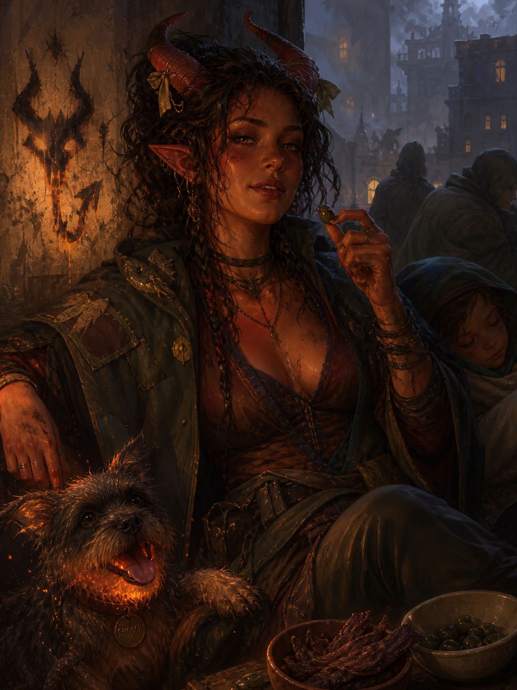

# Agnes Avernus

{ width="300" }

> *"Another run? I just came back, and everything I own smells! How many, ten? Ah, fuck, fine then. This once. Any kids?"*

**A religiously scarred Wildfire Druid who does smuggling runs through hidden roads. Warm, urban, sober, and trying not to think about the night she may have ignited the very fire that still brings refugees to her doorstep.**

---

## Basic Information
**Species:** Tiefling (Fiendish Legacy)  
**Class:** Druid 5 (Circle of Wildfire)  
**Age:** 28  
**Background:** Criminal  
**Alignment:** Chaotic Good

??? info "Quick Intro"

    **At the Table**

    * Big-sister warmth and a body that runs literally hot: she'll warm up four kids under her cloak, fry a man's pants off, and somehow find a way to make everybody see the fun in it all.
    * Snacks constantly, drinks never: fire and alcohol mix poorly. She doesn't *know* she might self-combust, but it's her paranoid fantasy, and she doesn't want to risk it.
    * Treats cities as ecosystems and gutter pigeons as colleagues. Uses directed fire as spraypaint, making crude, smoking tags of soot when she wants to piss the authorities off.
    * Knows religion, neither respects nor fears it. Shouting zealots are cute, but her tolerance has an edge to it.

    **Backstory (Short Form)**

    Raised on the road by an itinerant preacher who took in tiefling children to prove a theological point, Agnes learned the hidden ways of moving people before she could read. When a town garrison killed her foster father over those same people, she burned the barracks down and ran for the druid circle that had once tried to recruit her. Years later, refugees keep arriving at her door, and she keeps moving them. She keeps telling herself she's not involved, not political.

    **Playing Agnes**

    * **Combat:** Prefers to never be seen at all, but if seen, she prefers to be remembered. Flips between stealth and overwhelming force in a heartbeat.
    * **Roleplay:** Easy physical warmth, blunt mouth, soft eye for the weak, enjoys poking holes in theology or making preachers uncomfortable. Flirts and talks dirty the way other people make small talk. Will eat anything anyone offers her, and most things they don't. 
    * **Party Synergy:** Stealth machine and fiery Striker. With Stealth Expertise, Survival Proficiency, Thieves' Tools, Pass without Trace, Darkness and Fog Cloud, she's here to get the party from A to B in every scenario imaginable.

---

??? info "Deep Dive"

    **The Road and Tollander**

    Agnes's earliest memories are the road, Halek Tollander, and Trevor.

    Tollander was an itinerant preacher of the old school: stern, spartan, possessed of a faith that drove him to walk the roads between towns with a shifting retinue of the marginal and the penitent, preaching grace through unlikely vessels. Tiefling children were his particular calling. He saw in them proof of his theology, that the divine worked most clearly through those least deserving of grace. When he found Agnes, he took the toddler in to prove a point. She was never neglected, and treated with patience and care, but never with love.

    Trevor came a year later. Swept up from a different town, different story, same logic. They decided to be siblings, in the way children decide things.

    Tollander's ministry was the roads and the outcasts. His retinue sheltered people the authorities had reason to want located: deserters, apostates, the inconvenient poor, the criminals. He visited prisons, negotiated with rough men, struck arrangements that his faith allowed by narrow interpretation and his parishioners preferred not to examine too closely. He was not corrupt, though rumors still claim he had his weak moments in the brothels, but his pragmatic approach to underhanded methods meant Agnes's childhood was crowded with the strange and the unwanted.

    She learned the hidden roads. To read guard rotations in the behavior of pigeons. The way a large group becomes invisible when it knows how to move through a crowd.

    Her infernal legacy announced itself early. Tollander managed it like just another inconvenience, making clear her fiery cantrips were not of divine origin and as such not a thing of pride or honor. When he showed his two well-behaved tiefling children on the village square, Agnes wore bowties on her horns and sweated buckets under layers of thick, prudish frieze cloth. Not a single time did she fail to vividly imagine setting the stage on fire. Her body was a furnace. She snacked constantly without gaining weight; it all radiated as body heat. Tollander disapproved, called it lack of temperance. His attempts to control her food intake ended poorly.

    The year she turned fifteen, a delegation from the Circle of Wildfire found them on the road and asked that she be given over for proper training. Tollander refused. Their pagan methods would corrupt more than they cultivated. Agnes was never asked for her opinion. The delegation left, and she watched them go, and felt something shift inside her.

    **The Inciting Fire**

    Not long after, a local enforcer was making trouble for Trevor — the quiet, smart one — manhandling him by his horns and shouting at the "accursed critter." Agnes stepped in with the determination of every big sister everywhere. Just a surgical application of fire to pants, she thought. Trevor slipped away in the smoke. She did not.

    Tollander came to the garrison house that same night and secured her release, taking full responsibility for the incident. Then the questioning began. About the people in his retinue, the deserters the garrison had been hunting through two county lines. His faith was clear on lying, and equally clear on his duty as a pastor to his congregation. He was offered every available exit and he did not take any of them, because taking any would have required him to be someone other than Halek Tollander. So he said nothing, and continued to say nothing, until the morning they put him to the axe.

    Agnes was already out, waiting with the congregation for his return, when the news arrived.

    That night she and Trevor snuck into the city, stole the body of their father, and built him a pyre. They knew it was not his tradition, not what he would have wanted. He'd probably have called it pagan. To them it was equal parts respect and defiance. The congregation watched the cinders rise through the night, then dispersed in ones and twos through the dark. In the hour before dawn, Agnes and Trevor were left. He told her he knew what she was planning, and that he didn't support it, and that he wished her the best of luck. They embraced, and he went his way.

    At sunrise, she burned the barracks to the ground and ran for the woods, for the Circle of Wildfire.

    Halek would have hated it, not only for the violence but for the statement of it, the declaration of a logic he had specifically refused. But for all his preaching, he had left his child with fire and grief and no other vocabulary.

    **The Circle, and the Wrong Reasons for Joining**

    Agnes joined the Wildfire Circle for all the wrong reasons. She had spent years inside Tollander's moral architecture, and the Circle seemed like the opposite of all that. No sermons, no confessions, just earth, fire, weather, and people who didn't side-eye you for taking seconds.

    The Circle had no scripture, but turned out to be no less orthodox. Soon she learned she was not the sort of initiate they usually sought. Too urban, too entangled. Treated cities as their own ecosystems, saw no meaningful moral distinction between a fox den and a tenement of dockhands. The Circle spoke of destruction and renewal in grand spiritual rhythms. Agnes kept using wildfire magic to heat soup, burn her initials on all surfaces and summon her favorite wildfire spirit pooch.

    They corrected and warned her constantly, but they also fed her, taught her, sat beside her at the fire late into the night, and explained old druidic practices with immense patience. She never became fully one of them. Over time an uneasy understanding emerged: they stopped expecting her to become properly monastic, and she stopped pretending she wanted to. She still visits when she can. Arguments resume almost immediately, but always over tea, and never with voices raised.

    **The Flames of War**

    Some members of Tollander's old congregation are still out there. Jasper Voss used to be a peripheral figure in Tollander's retinue: stringy, quiet, intense, subtly magnetic. Agnes barely registered him at the time, but he's become the harder to ignore today. After Tollander died, Jasper took up the wandering ministry and built something Tollander never would have: a military wing of zealots named the **Silver Salamanders**. 

    The faith that once prohibited lying to protect deserters has found, under his guidance, that it also prohibits retreating from those who would harm the faithful. His conclusion — that non-resistance costs too much — has put his movement at the center of a brutal civil war marked by explosive attacks against the military and establishment.

    It all gives Agnes chills. She knows what a martyr is worth to a movement in search of a founding story, and she knows intimately how hard the fires of war can be to put out, once ignited. She has been careful not to mentally trace the full line from that incident on the town square to this war. 

    The refugees arrive anyway. She is known among people who move carefully through contested country, and she cannot stand in front of someone who needs moving and explain she is trying to limit her involvement. So she runs the routes, doesn't ask questions and tells herself she really is non-political.

    **Agnes Today**

    Agnes's frame of reference is decidedly un-druidic. She knows how nature finds its way in the heart of urbanity — through gutters and windowsills, in the pigeons that know the guard rotations, in the rats that know which cellars connect to which alleys. She feeds strays constantly: pigeons, cats, mongrels, whatever is nearby. Partly strategic, partly she can't help herself. Strays should look after each other.

    Her usual approach is stealth. Pass without Trace on her charges, hidden paths, Darkness placed strategically around the watchtower as they hurry past, bluffing guards only if the alternative is worse. If they're discovered, she throws subtlety overboard and owns her nickname fully.

    Notably, Agnes doesn't drink. Fire and alcohol mix poorly, she reasons, but she's not entirely sure the danger is only physical — Tollander had a word for appetites that consumed their host, and alcohol was at the top of that list. She happily stays sober and still manages to have twice as much fun as the rest of the party.

    She snacks constantly. Olives mostly; it's the salt. None of it accumulates, because her body temperature runs high enough most of it just goes. She remembers the food shaming of her childhood, and snacking now is a way of being kind to her body.

    She runs hot enough that people lean toward her in cold rooms without realizing it. She's unbothered. On the contrary, she's gone from touch-starved childhood to a relaxed, tactile presence as an adult. She'll wrap an arm around a stranger's shoulder while explaining the lifecycle of pigeons, or lean in heavy on a party member when sleepy. That warmth could read as maternal, sisterly, oblivious or flirtatious depending on the evening, and she seldom bothers clarifying.

    At some point during her many runs, she earned herself the nickname "Avernus" from the authorities as an attempt to sow fear in people's minds and dissuade them from contacting her. The very next morning she had burned a crude image of a set of horns and a tail across the front wall of the magistrate's office, as if to claim official ownership of her new title. She won't admit openly the name flatters her, but often enough it does evoke a small, satisfied smirk.

    Agnes has seen a lot for her age and doesn't snap easily. But she still remembers the continual allure of her childhood, of setting the stage and everyone on it ablaze. Once her patience is up, she's not above more primal approaches to problem solving.

    **Smooch the Pooch**
    
    Agnes's Wildfire Spirit manifests as a terrier mutt. Small, scrappy, slightly singed around the ears, with a tongue that lolls out of a mouth that glows faintly orange when it pants. It begs. It rolls over. It tries to curl up on people's laps and leaves scorch marks on their trousers. Agnes calls it Smooch, and treats it exactly the way she treats every other stray that follows her home. The Circle has opinions about this. The Wildfire Spirit is supposed to embody a primal cycle of destruction and renewal so the forest can breathe. It is emphatically *not* supposed to do tricks for jerky. 

    In a fight, when stealth fails and the people she's protecting are exposed, Smooch... changes, much like his owner. The terrier frame stretches, the fur darkens, the jaw extends, and what stands beside her is a pit hound of rage and flame, built to chase, catch and conflagrate.

    ---

    **Sample Quotes**

    *"You seriously want to try frying an egg... on my belly button? That's the most unhinged flirt I ever heard, and I have to try it right now. You provide the egg, and don't get weird about it. We can share the egg if it works! No? Where are you going?"*

    *"You stay here, heads low. I'm going to go chat up that guard. I'm sure he has really interesting opinions on the topic of spontaneous self-combustion."*

    *"Can I eat your goodberry? I already had mine and I'm having the munchies. Or rather... the munchies have me. Yes, it's that bad."*

    *"Nah, You'll need that money once you're safe, and starting a new life. Just find a jackdaw and be kind to it for me. That's plenty payment."*

    *"You're surprised the daughter of a holy man is called 'Avernus'? He wouldn't be thrilled, that's for sure. But it is striking, yeah?! Trev teases me about it, but I called him Trev the Thiefling first, so that's fair."*

    *"Since you're curious, yes, I did notice my body change a lot at the Circle once I got to eat on a free schedule. For instance, I learned to transform into a goddamn bear."*

    *"The winter run night camps are the worst. The children I pull close — I've got heat to spare. Then some bloke decided to test his luck. Had to enforce the difference between smuggling and snuggling real explicit-like. But he's fine, good sport too. Just a lot less hairy these days."*

    *"Nah, don't bother with that crazy zealot, he's just flapping lips and stirring air. Half the street preachers who rant about burning tieflings would rather fuck one, I've learned. But maybe it's holy when *they* do it?"*

    *"Is it rude to say 'I could eat a horse' if you're smuggling a centaur? I'd read it as a compliment."*

    *"I'm not picking sides, okay? Don't know even the basics about war, but it's funny how it keeps showing up at my door with kids' faces and no coats. So I help. Is that 'politics' to you? To me, fire is fire. It spreads, it consumes, anybody thinks they control it, they're lying to themselves. No matter who set it, the burns need treating all the same."*

---

??? info "Key Relationships"

    **Trevor:** Little brother by decision, not blood. Today he's guild-connected, careful, and almost certainly smarter than she is, though she keeps noticing he doesn't seem happier for it. He always was the quiet, observant one who killed a room with a well-delivered one-liner. These days he doesn't even drop those. She only notices them as glints in his eyes. Agnes considers him her last and most faithful fallback. After all, she'd do anything for him, so it must go both ways. 

    It does, mostly. Trevor will warn her, advise her, help when the cost is manageable. But he has never once put himself at real risk on her behalf. He has also never refused her outright, so Agnes has never had reason to start keeping count.

    **Brenn of the Wildfire Circle:** She fed Agnes at the fire her very first, vulnerable night in the woods, and has been telling her she's getting it all wrong ever since: "You can't fix the world!" Brenn is older, broad-shouldered, slow-spoken, and profoundly clear-eyed about what happens when a single druid activist, no matter how gifted, goes up against the world. She doesn't moralize when she watches Agnes come back from another run, smelling of smoke and somebody else's perfume, hands still shaking from whatever happened in the last alley. Brenn knows some fires just need to be allowed to burn all the way out for something new to grow. Their argument never resolves. Agnes goes back to the city. Brenn keeps the tea kettle on.

---

??? danger "Notes for the DM"

    **Trevor's actual loyalties:** Agnes believes Trevor is her unconditional fallback. That may not be the whole truth. He won't mobilize his guild network for her smuggling runs or burn valuable contacts on her behalf. If she ever calls in what she thinks is a standing debt, the gap between her assumption and his reality is a moment worth playing out. Trevor suffered under Tollander's ministry, especially the constant obligation to override his own self-interest in the name of altruism. A small part of him feels he's letting himself down every time he doesn't act on his own needs first, even when it's his sister calling in the favor. Trev doesn't believe in her silly little smuggling runs, even though he respects her skill. He thinks bigger, building networks and setting himself up for long-term success. His one big weakness is other children who are mistreated by religious authorities. As a DM, this could be the leverage that finally lets the party recruit the services of him and his network. 

    **Voss and the barracks fire:** If you run a politically complex campaign, putting Agnes in a room and confronting her with the consequences of her actions as a child might actually be the least dramatic way to use Jasper Voss and the civil war. She's already been paying that price a long time, and the actions of a grief-stricken child don't hold that moral accountability. 

    More interestingly, Agnes has the understanding of fire as an element that she knows the Silver Salamanders are igniting an inferno they cannot control. Let her come into her own not as a traumatized survivor but as an expert confronting her past and trying to make them see sense.

---

??? info "Mechanics, lv5 build and PDF download"

    | STR | DEX | CON | INT | WIS | CHA |
    |:---:|:---:|:---:|:---:|:---:|:---:|
    | 8 (-1) | 14 (+2) | 14 (+2) | 10 (+0) | 18 (+4) | 12 (+1) |

    ## Combat Stats

    | AC | HP | Hit Dice | Speed | Initiative | Prof. Bonus |
    |:---:|:---:|:---:|:---:|:---:|:---:|
    | 16 | 38 | 5d8 | 30 ft. | +5 | +3 |

    **Saving Throws: Wisdom +7, Intelligence +3**  
    **Resistances: Fire**

    ## Proficiencies
    **Skills**: Deception +4, Perception +7, Religion +3, Stealth +8 (Expertise), Survival +7

    **Armor**: Light Armor, Medium Armor, Shield | **Weapons**: Simple Weapons, Martial Weapons

    **Tools**: Herbalism Kit, Thieves' Tools | **Languages**: Common, [+3 common languages]

    ## Feats
    - **Alert**: Add proficiency bonus to Initiative rolls; swap initiative with a party member before combat.
    - **Skill Expert**: Proficient in Deception, Expertise in Stealth, +1 WIS.

    ## Equipment
    Studded Leather (for better sneaking; consider a Breastplate if your DM will allow it to properly use her Medium Armor Proficiency; otherwise, consider switching Primal Order from Warden to Magician), Staff, Shield, Thieves' Tools, Herbalism Kit.

    **Suggested Magic Items**

    - *Sentinel Shield* (Uncommon): Advantage on Initiative rolls and Wisdom (Perception) checks.
    - *Mithral Half Plate* (Uncommon): AC 15, no disadvantage on Stealth.
    - *Boots of Elvenkind* (Uncommon): Makes no sound while moving; advantage on Dexterity (Stealth) checks.
    - *Nature's Mantle* (Uncommon, Attunement): Functions as a druid focus; while Lightly Obscured, can Hide as a Bonus Action even while directly observed.

    ## Spells
    - **Cantrips:** Fire Bolt, Guidance, Produce Flame, Thaumaturgy, Thorn Whip  
    - **Level 1:** Absorb Elements, Burning Hands, Cure Wounds, Detect Magic, Find Familiar, Fog Cloud, Hellish Rebuke, Speak with Animals  
    - **Level 2:** Darkness, Flaming Sphere, Locate Object, Moonbeam, Pass without Trace, Scorching Ray, Spike growth
    - **Level 3:** Aura of Vitality, Erupting Earth, Plant Growth, Revivify

    ---

    📄 [Download Level 5 Character Sheet (PDF)](assets/agnes-avernus-lv5.pdf)

---

??? danger "**Session Zero Considerations**"

    **Content Notes:** Agnes's story involves childhood religious trauma, institutional violence against minorities, complicity in the origins of a political conflict, and a grief she has never fully addressed. She's depicted as having legitimate trouble saying 'no' to people in need. Tables sensitive to themes of inherited guilt, political violence, or the costs of compulsive self-sacrifice should discuss this before play.

    **Representation Notes:** Agnes is imagined as bisexual and unapologetic about it, without camp or prurience. Her tiefling heritage is a source of external prejudice and personal pride.

---
