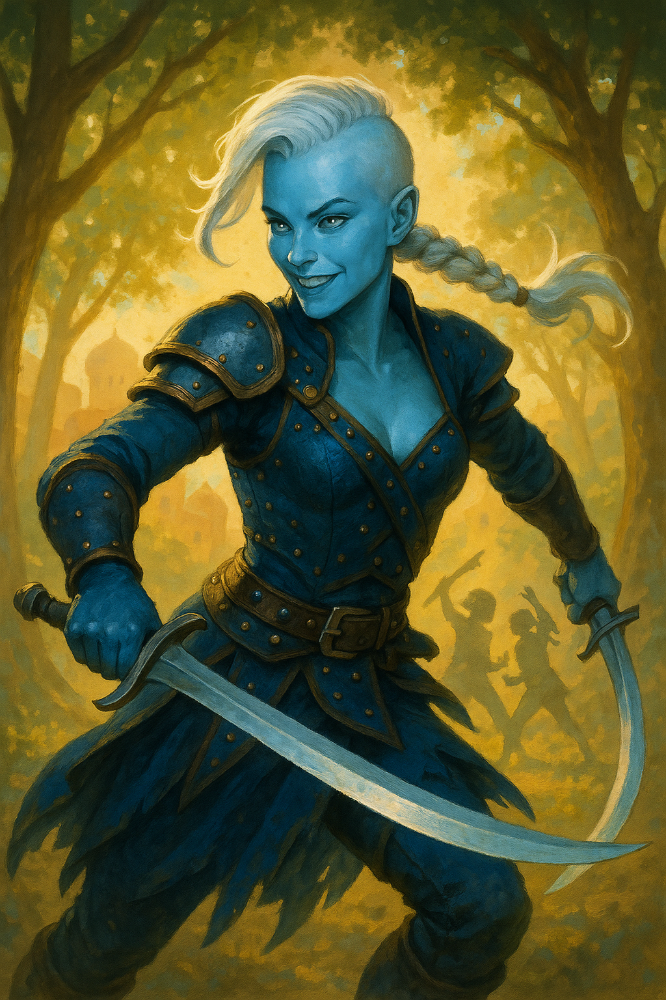
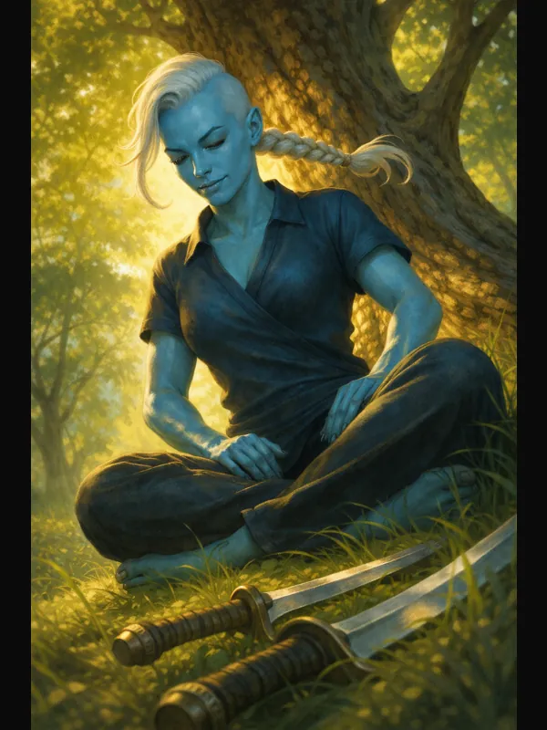
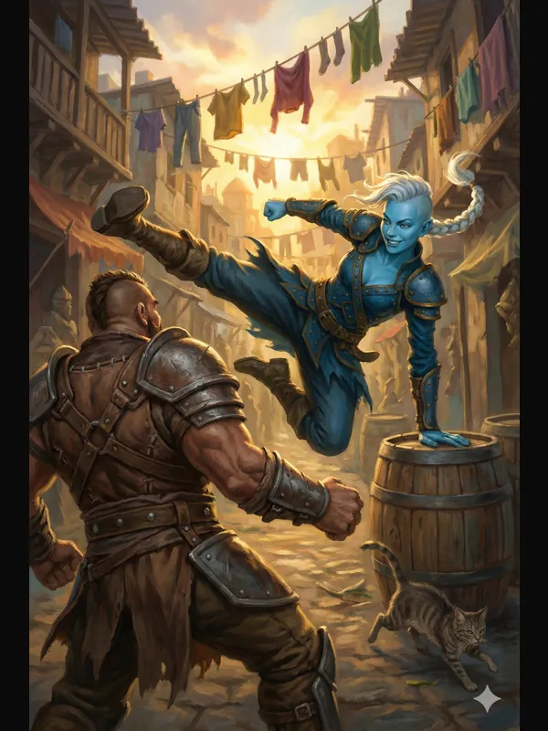

# Alveta "Velvet"

{ width="300" }

> *"Duel ya for the dishes? No? For glory then? Come on, I'm basically complimenting you by asking for a fight!"*

**A kid's fake fighting style got a boy killed. Now she's sworn an oath to make it real. Winning duels, teaching it right, proving that a dream born from a scam can still come true. Meanwhile, someone's franchising the dangerous version, and she's pretty sure it's the childhood friend she lost.**

---

## Character Overview
- **Species:** Air Genasi
- **Class:** Paladin 5 (Oath of Glory)  
- **Background:** Charlatan  
- **Age:** 22
- **Alignment:** Chaotic Good

??? info "Quick Intro"
    
    **At the Table**
    
    * Masks doubt with nonchalant bravado while fighting to redeem a dream everyone calls a scam
    * Thrives on being underestimated and beating the odds
    * Fears being revealed as a permanent fraud whose style will never matter
    * Stands up fiercely for underdogs and anyone mocked for trying
    
    **Backstory (Short Form)**
    
    Velvet and her childhood friend Reed invented a fighting style and in their youthful enthusiasm turned it into a traveling con, teaching fake "secret techniques" until a student died attempting a dangerous move. Captured and separated, Velvet was sent to a monastery where she eventually swore an Oath to make her style real and worthy. Now she discovers someone has been teaching bastardized, dangerous versions of their moves—likely Reed himself—and she must restore the honor of their dream through heroic deeds while seeking the personal courage to one day confront her lost friend.
    
    **Playing Velvet**
    
    * **Combat:** Dex-based dual-wielding skirmisher who uses every dirty trick, terrain advantage, and flashy flourish to pull off impossible wins. Smite-heavy with mobility and infiltration capabilities.
    * **Roleplay:** Quick with puns and bravado, obsessively collects daggers, flirts spontaneously, and pranks assholes. Falters visibly when someone she respects dismisses her style. Shows real anxiety if she sees her moves done carelessly by novices.
    * **Party Synergy:** Natural face and support healer who champions underdogs and refuses to let allies believe they're failures. Not above foul play and trickery for the greater good.

---

??? info "Deep Dive"
    
    ## Full Backstory
    
    Alveta ("Velvet" among her peers) was born to two wood elf parents, Ryllan and Willow. Her Air Genasi nature remains a mystery. As Velvet grew up, her flighty nature soon became apparent. Her speed was unmatched to the point where the other village kids didn't even try to catch or compete with her. But while running was fun, it was swordplay that mesmerized her. She grew up sparring with sticks in the woods, dreaming of glory with her closest friend in the whole world, Reed. He was a simple village kid, but quick, smart and strong. Soon it became apparent he was the only kid around who could match her. Together they invented the "Two Winds One Will" style of fighting, although it should be said, Velvet was the engine and Reed the tag-along.
    
    As they grew older, villagers would tease them for always sneaking off into the woods together. One time they even tried to prove the rumors true, fumbling, giggling, and ultimately breaking apart in embarrassed laughter. And still they went back to the sticks, to the sound of wood colliding, because that was what mattered to them. Their dream of creating something bigger than themselves.
    
    Later still, when they were old enough to go earn a living and their techniques had grown sophisticated, Velvet's gaze turned to the roads. The forest provided, but chances to test her mettle were few. Her parents weren't happy, but they knew better than to try to contain her. Convincing Reed to tag along proved easy enough.
    
    Somehow, they ended up turning their swordplay into a con. It was never their intention, but precarity soon taught them that spectacle outpaced earnesty. Traveling with peddlers and outcasts, they sold their "secret Air Genasi style" to gullible townsfolk. They got to practice their dream and get paid! They lived as tricksters, cheap but on their own terms, performing rehearsed "clashes" in the day, training the curious village kids in the evening, then sneaking off in the night. 
	
	Then, something went horribly wrong.
    
    None of them was a trained instructor. They improvised and feigned competence as they went along. They were so sure their dream could carry them. So when the mayor's son begged to try the acrobatic *Falling Leaf spin*, Velvet just shouted 'You can do it!' That was their mantra. The snap still wakes her some nights.
    
    They fled in terror. For another week, they trained no one, keeping a low profile and taking simple jobs on the road. But the pay was bad, and the itch to follow their dream was strong. Vowing to never teach dangerous acrobatics again, they re-branded their itinerant secret style show, barely dodging the Wanted signs. Until a wandering, grizzled fighter by the name of Garrick Pike saw through their ruse, swiftly defeated them both in a humiliating public 2v1 duel and handed them to the magistrate as charlatans and delinquents, for a pretty penny. Their paths split. Velvet was sent to a monastery, Reed to a wealthy philantropist merchant's tutelage. 
	
	Velvet was not built for a life behind walls. She was an absolute menace, taking every opportunity to sneak out to practice. She slept through her lectures on morality or spent them theorizing parries and flourishes, taking notes on everything but the tenets of the faith. 
	
	With time, she did come to terms with her irresponsible past, however. The turning point came shortly before she turned 18, in the form of a letter from the dead boy's mother, forgiving her. 
	
	The very next day, following upon a long, sleepless night, Velvet swore an Oath, but not to any god. Instead she directed it to her dream, that her life project *Two Winds One Will* would become something worthy of that forgiveness, to become a tool for people wanting to perfect themselves, defend their loved ones and uphold justice. The style would become something real and responsible.
    
    But once out of the monastery, to her surprise, many already knew of her "Two winds, one will" style. And they sneered in her face. Even worse, the ones who did not sneer or laugh, claimed to have trained the style and showed horrible swordsmanship. Soon she learned that someone introduced a "Twin Winds Academy" in several cities well over a year ago, and made big money training noble kids in the flashy and eye catching techniques. As it became the hobby of the young and privileged, it also quickly spread to the villages. But within a few months it was abandoned or prohibited in most villages, due to the dangerous acrobatics and brutal moves that turned sparring sessions into morbid gambles.
    
    Their style always had an edge: moves they invented as teenagers that worked a little too well. The Reaping Wind. The Twin Sirocco. Velvet abandoned them after the mayor's boy died. Now she saw the village kids aspiring to be adventurers or town guards do bastardized versions of these same moves, with no restraint, no care for anything but the sense of "looking cool". Their minds were trapped in ego and spectacle, not in achieving actual results, or growing as people.
    
    Velvet didn't want to believe Reed would do something like that, but she could think of no other explanation. Nobody else could even know those moves. Now her mission was double: by ways of heroic deeds restore the honor of the dream that had carried her throughout her life, and eventually find the emotional courage to seek out and confront her childhood friend.
	
	{ width="300" }

    
    ## Personality & Psychology
    
    Though mocked as a fraud, Velvet duels to inspire others and redeem the dream she and Reed once shared. Velvet truly believes her "Two Winds" style is glorious (or at least will be "once she's finished developing it"). In her duels, she sometimes flashes back to the sounds of sticks in the forest. Her mission is to prove the dream was real and not just a scam. To her, the Oath of Glory means proving that a dream mocked today can inspire others tomorrow, that something cobbled together by two kids with sticks can become a legacy worth dying for.
    
    Others sneer at her style, but she responds with bravado, whether she truly feels it inside or not. Velvet masks her doubts with nonchalant bravado, but beneath the performance she is haunted by the fear that she's still just a fraud, that her style will never amount to anything. Even so, she thrives on being underestimated. Beating the odds is pure catnip to her soul. Every duel she wins feels like she's clawing back legitimacy.
    
    Velvet knows what it's like to be mocked, to try and "fake it till you make it". She's travelled with peddlers, harlots and outcast, and heard so many stories of how people break. When an ally falters, an outcast is harassed, when someone is mocked for daring to try, she stands up, and somehow, in those moments, all her internal fears of being a fraud go away. She's pulled more than one kid aside at a training yard to tell them: 'Ignore that asshole. You're doing fine.' She remembers what it felt like when no one said that to her.
    
    Velvet *has* learned responsibility from her past mistakes. But at her core she's a free spirit, whether it's about creative haggling, spontaneous flirting, or pranking some asshole, and no Paladin Oath will change that. When facing overwhelming opposition, she leans into her resourcefulness. She always commits just a bit too much for comfort. She's not above foul play, pickpocketing or manipulation in service of the greater good. On the contrary, she much enjoys it, even in bittersweet reminiscing of her old days with Reed on the road. Righteous intentions don't pay for meals, and dead heroes don't inspire anyone. If lying to a guard, fake-seducing some informant, or rigging a fight gets her closer to stopping actual evil, she's downright enthusiastic about it.
    
    Velvet collects daggers with borderline obsessive fervor—beautiful ones, ugly ones, practical ones, purely decorative ones. They're all blades so she loves them instinctively, but they're travel-sized and carry history! Reed used to tease her about it. She still buys them anyway. Maybe especially because he's not around to tease her anymore.
    
    Mockery from strangers bounces off her. But when someone she actually respects dismisses her style as 'just a scam,' you'll see her falter mid-sentence, the bravado flickering before she forces it back. She'll still retort, but her heart's not in it. If someone else uses her moves carelessly, she may show real anxiety, drop whatever she was doing and start instructing them until they do it right.
    
    ## Two Winds, One Will - Combat Philosophy
    
    Velvet'll use every trick she knows—deception, terrain, surprise—to win the fights that matter. The 'Two Winds' style was never about honor dueling. It was about two scrappy kids learning to beat people who were stronger, richer, and better trained. That's still the heart of it. "Glory" to Velvet was never about fighting fair, but about utilizing every trick at her disposal to pull off impossible wins, in the name of what she believes in.
    
    **Velvet's version of "heroic fighting"**:
    - Boldly uses charm and Deception to infiltrate a trafficking ring masquerading as an exotic dancer, then Smites her way out with the captives
    - Challenges a corrupt guard captain to single combat (Compelled Duel), but absolutely will use terrain, tricks, psychology (including infuriatingly bad puns) and every other dirty flourish she knows
    - Pocket sand. Yes, really.
    
    If your table and DM allow it, Velvet's Paladin spells can be flavored as flourishes that have been inundated with Magical power due to her Oath. Her Smite could thus be called the *Twin Sirocco*. Divine Favor can be the *Falling Leaf Stance*. Blinding Smite? Yup, that's magic pocket sand! The Air Genasi Levitation spell? Wire Fu!
    
    ## Sample Quotes
    
    "Duel ya for the dishes? No? ... for the glory then? Why not! Are you gonna make me beg? I'm never gonna make it if I don't get to practice! I'm basically complimenting you by asking for a fight!"
    
    "Contrary to popular belief, my one big goal in life is not vindication... It's windication. Get it? Win? Wind? It's a rare triple pun!"
    
    "You know what that guard just said to me? 'Two Winds? That's just hot air.' And now I *hate* myself for not thinking of that one first."
    
    "Merchant! What do you want for that ancient dagger? ... Right... fuck me running, that's a lot of money. How about all I have on me, *and* I teach you how to do a cartwheel?"

---

??? info "Key relationships"
	
	**Garrick Pike**: Garrick is the high level Human Fighter who recognized Velvet and Reed as the charlatan instructors who got a kid killed. Since then, he's ran into Velvet a few times, the first time notably when seeking shelter at the monastery after a tough fight. Velvet, still salty about their last encounter, immediately challenged him to a rematch. Even while hurt, Garrick agreed. But this time he didn't just subdue her, but actively mentored her. For the first time in her life, Velvet received something akin to a lesson. He was gruff, clearly in pain, but he treated her as a fellow martial artist, and that meant something. With time, he became Velvet's recurring rival and mentor, offering begrudging lessons and measuring her progress. But he's never stayed long, as he's needed elsewhere, to battle some *real* menaces, not just a kid with delusions of grandeur. He's promised to retire the day Velvet beats him, while also stating that will never happen.
	
	**Alphonse Collier**: A weathered career grifter in his fifties who taught Velvet and Reed the practical curriculum of the crooked life—lockpicks, cold reading, sleeping rough and slipping away. Transactional but reliable, operating by "honor among thieves" rules he's never once romanticized. Wears an ostentatiously fine (and large) hat he's transparently extremely proud of. Peppers his speech with elaborate vocabulary he may or may not be using ironically anymore. Alphonse remembers Reed as the more promising student, and while he likes Velvet he never thought she was gonna be the one of them to make it. Views Velvet's paladin oath as a fascinating new angle rather than a transformation. When Velvet introduces the party to him, it's a good idea to remind them to compliment his hat.
	
	**Sister Falese**: The young, gifted and slightly too passionate about God (and frankly about everything) acolyte who served in the monastery during Velvet's imprisonment/education. Their friendship turned physical after a month or so, and while she eventually transferred to a different monastery they've stayed in contact. To Velvet, Falese was the one small happy memory from life in the monastery. To Falese, Velvet is more like the happy little accident she's not quite willing to paint over. Trying to justify their relationship, she continues to prod Velvet towards a "cleaner life" in her letters.
	
---

??? danger "Notes for the DM"
    
	## Dramatic questions
	
	- *How bad does Velvet have to lose a fight before that small crack in her self-confidence starts hurting for real?*
	- *If forced to choose between aiding her friends and chasing her dream, what would Velvet pick?*
	- *What would happen if she squared up against a strong practitioner of Reed's 'fake' style, and actually lost? And contrarily, how would she feel if she accidentally killed them?*
	- *If she ever came in Garrick Pike's position, seeing a pair of young charlatans on their way to ruining their own or someone else's life, how would she react?*
	
    ## Reed's Descent
    
    The merchant who took Reed in after the magistrate's sentence was a Fiend Warlock who immediately recognized an opportunity. He forced Reed to franchise their "Twin Winds" style across multiple cities, gradually breaking down Reed's resistance through isolation, debt, and psychological manipulation. Now, the school has become famous among the populace for its stylish twirls and mysterious origin story, but is treated as a dangerous joke by people who actually know fighting.
    
    As Velvet's reputation slowly shifts from "laughing stock" to "inspiring duelist," Reed grows desperate. His school begins to slip as challengers expose his limits. Pressured by the merchant he enters a Hexblade pact: an easy way to real power, true martial prowess. His fighting style turns into a grotesque parody of the "Two Winds" school, every flourish now powered by infernal hunger. A child's dream turned nightmarish. When Velvet eventually confronts Reed, she finds him bitter and defensive, convinced he's the true heir of their "style." To his students, Velvet looks like the fraud.
    
    **Climax:** Velvet confronts Reed the Hexblade Warlock, whose desperation to no longer be second-fiddle drove him all the way to the dark side. The fight is as much about reclaiming their childhood dream as it is about stopping a monster. Her two-sword style, once mocked, finally finds vindication.
    
    They were childhood sweethearts, like two peas in a pod. Reed was the only other who shared Velvet's dream. He can finish her sentences, knows her puns, calls her "Alveta". Every flourish he makes evokes core memories in her. She sees the dark armor and remembers the wayfarer, the blushing boy, their laughter and tears. This could ultimately be a tragic story in the vein of Netflix's Cobra Kai meets Anakin Skywalker.
    
    ### Alternative Plot: Reed's Hidden Redemption
    
    The cruelest detail: The dead boy's mother wrote letters to both Velvet and Reed, forgiving them. Velvet received hers at the monastery, which catalyzed her transformation. Reed's letter never reached him. The merchant intercepted it, recognizing that forgiveness would make Reed useless as an asset. Reed spent years believing he was unforgivable, which made him desperate enough to accept the cursed blade.
    
    **The Letter as Quest Object:**
    Velvet might discover Reed's letter while investigating the merchant's operations, or learn about it from another victim. The letter becomes crucial to Reed's redemption: proof that he had a choice, that someone forgave him, that the path Velvet took was available to him all along. When confronted with this knowledge, Reed must choose: continue serving the blade's hunger, or break the pact and face his pain honestly.
    
    **The Final Choice:**
    In their climactic duel, after Velvet has beaten Reed down to near-defeat, she presents him with the letter. This is the moment that determines everything. Does Reed drop the cursed greatsword and accept that he deserves forgiveness? Or does he decide it's too late, that he's gone too far, and force Velvet to kill him?
    
    If redeemed, Reed and Velvet together can take down the merchant and discover he's done this to dozens of others—building his fortune by intercepting redemption and harvesting despair.
    
    If Reed refuses redemption, Velvet must live with the knowledge that she found the key to saving him, but not soon enough. The letter becomes a permanent weight she carries. Proof that Reed could have been saved, if only she'd searched harder, moved faster, or found him before the corruption took root.

	## Key relationships and sidequests
	
	**Sister Falese**: Suggestion: Avoid classic tropes of endangering a love interest (past or present) as leverage against the PC, unless you've actually roleplayed Velvet's and Falese's relationship at the table and it feels like the character is actually important to Velvet. More useful: Her monastery may have information on the merchant and the being that has entered a pact with Reed. Velvet can go there to learn more, but not without having a serious and potentially very awkward talk with Falese. 
	
	**Optional Sidequest: Immaculate deception**
	Falese has spent their correspondence urging Velvet toward a cleaner life. Now she's in a compromised situation: She tried to save a family of refugees from being handed over to a cruel magistrate by the church authorities. To do it, she had to lie, creating false baptismal records to grant them sanctuary. But she’s a terrible liar. The High Inquisitor has flagged the records as suspicious and is coming to audit the archives in the morning. If caught, Falese loses everything. Velvet's the only one she knows who may be able to save this, and she has to ask for help. When she does, Velvet can get a chance to demand an honest position from Falese: Either accept her for who she is, with her whole toolkit and outlook on life, or they go their separate ways. 
	
	**Garrick Pike**: Having him come and go through the story, performing short duels with Velvet, can build a strong relationship. He can also be a questgiver ("When I was in Waterdeep I heard talk of a fighting competition with some big names coming. Go check it out if you want to be properly humbled, whelp") or relayer of news and rumors pertaining to your main plot. He may have battled a lieutenant of the BBEG and survived, bringing news of their movements or plans. 
	
	**Optional Sidequest: The big reversal** 
	Garrick has actually been on the run for a long time from debt collectors. Turns out, Velvet's "straight mentor" was never a stranger to the crooked lifestyle himself once. Word reaches the party that Garrick has been taken by strange enforcers from a foreign land ("Ah yes, that gruff guy you used to spar? He passed through the village not a week ago... in irons. Herded by an unsavory bunch with ill intentions I reckon.") 
	
	What's his reaction when she finds him in irons? Shame? Bluster? Does he try to talk her out of helping? That conversation is just as important as any combat encounter. Make it tough, possibly morally fraught. Eventually, Velvet may get to save her "mentor" right back, making them narratively even. When his own unsavory past comes out, they're also spiritually even.
	
	**Alphonse Collier**: Alphonse asks Velvet for a favor. Nothing sinister, nothing that crosses her oath—just something morally grey enough that she has to decide whether "honor among thieves" still binds her. He won't guilt her if she refuses. He'll just nod, adjust his estimation of her, and the old warmth will cool by exactly one degree for their future interactions. 
	
	He responds very well to flattery about the haberdashery of a hat he has no business owning, but wears like a crown. Velvet knows this and may warn the party in advance. If they play along convincingly, he'll warm to them faster than his transactional nature would normally allow. If they mock it, he won't retaliate, but he'll never fully trust their judgment again. 
	
	This is a chance to *show* rather than just *tell* the party about Velvet's sketchy past as a con. They watch her become someone who knows things they don't, someone with a history that operates by rules she's never had to articulate before. And then Alphonse walks in wearing something genuinely absurd and they have to keep straight faces while complimenting it (maybe ask them to roll Deception checks if their initial reactions call for it). Meanwhile, she falls into a completely different register—reading his body language, matching his cadence, like it's muscle memory.

	Alphonse's the version of her that never got caught, never went to the monastery, never received the letter. And frankly, he's doing fine. He'll share a meal with them, offer genuinely useful information, maybe even do them a favor if the price is right. The party paladin's friends will hopefully find themselves almost liking him, and then catching Velvet pocketing something without thinking about it, or lying smoothly to a merchant about provenance, and realizing: oh, this guy is where that came from.
	
	**Optional sidequest: Back to the Couture** 
	If the party likes Alphonse, and you have time for a more lighthearted "bottle episode" in your campaign, Read a pitch for a fun, character-driven, low-stakes time heist [here](../adventures/back-to-the-couture.md)! 
	
---

??? info "Mechanical build (lv 5) and PDF download"

    | STR | DEX | CON | INT | WIS | CHA |
    |:---:|:---:|:---:|:---:|:---:|:---:|
    | 8 (-1) | 18 (+4) | 14 (+2) | 8 (-1) | 10 (+0) | 16 (+3) |
    
    ## Combat Stats
    
    | AC | HP | Hit Dice | Speed | Initiative | Prof. Bonus |
    |:---:|:---:|:---:|:---:|:---:|:---:|
    | 17 | 44 | 5d8 | 35 ft. | +4 | +3 |
    
    **Saving Throws: Wisdom: +4, Charisma: +7**
    **Resistances: Lightning**
    
    ## Proficiencies
    **Skills**: Acrobatics +7, Deception +6, Medicine +3, Persuasion +6, Sleight of hand +7, Stealth +7
    
    **Armor**: Heavy Armor, Light Armor, Medium Armor, Shield | **Weapons**: Simple Weapons, Martial Weapons
    
    **Tools**: Forgery Kit, Thieves' tools | **Languages**: Common, [+2 common languages]
    
    ## Feats
    - **Dual Wielder**: Ignore Light property on one weapon when two-weapon fighting, get an extra attack as a Bonus Action
    - **Skilled**: 3 additional skill/tool proficiencies
    
    ## Fighting Style
    Two-weapon fighting
    
    ## Weapon Masteries
    - Scimitar (Nick)
    - Short Sword (Vex)
    
    ## Equipment
    Studded Leather, Scimitar, Short Sword, 5x Daggers (flavor after taste), Forgery Kit, Thieves' Tools
	
	**Suggested magic items:**
	
	- Ring of Protection (+1 AC and Saving Throws, never a bad pick for Dexadins with middling AC)
	- Gloves of Thievery (+5 to Sleight of Hand and lockpicking checks, aids in Velvet's patchy past flavor)
	- Dazzling Scimitar (Eberron: Forge of the Artificer. Rare +1 weapon, shed Bright Light 30 ft as BA. As a Reaction after being hit by an attck you can expend a charge to force DC 15 CON save, or opponent has Blinded condition until end of its next turn. 4 charges, restore 1d4 every dawn)

	📄 [Download Level 5 Character Sheet (PDF)](assets/alveta-velvet-lv5.pdf)
	
	{ width="300" }

---

??? danger "**Session Zero Considerations**"
    
    **Content Notes:** Contains themes of childhood trauma (accidental death of a student), survivor's guilt, betrayal of close friendship, potential for tragic character death. The Reed arc involves psychological manipulation and corruption. Suitable for mature players comfortable with morally complex narratives.
    
    **Representation Notes:** None requiring special discussion.

---