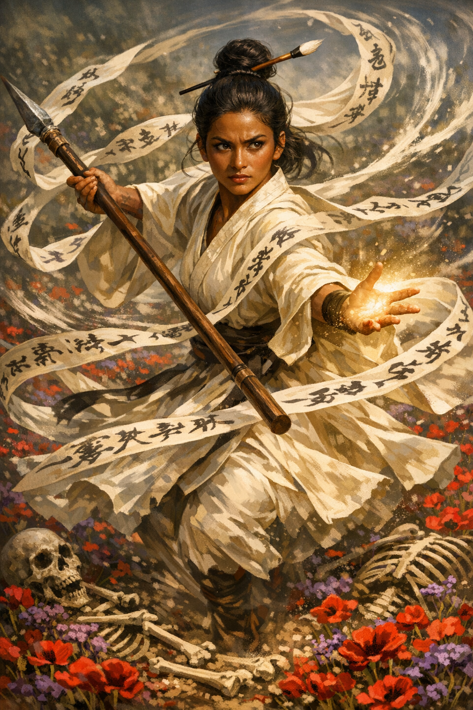

# Anwar the Radiant

{ width="300" }

> *"I don't need divine assistance to heal the sick or smack the evil. What will you do the day you can't piggyback off your glorious God? Do you expect them to just spoonfeed you with power forever?"*

**A travelling warrior-mystic who officiates ceremonies, delivers hard truths about responsibility, and moves with dancing steps through a world she had to decide to love despite it all.**

---

## Basic Information
**Species:** Variant Human
**Class:** Monk 5 (Warrior of Mercy)
**Age:** Late twenties
**Background:** Acolyte
**Alignment:** Neutral Good

??? info "Quick Intro"

    **At the Table**

    * Travels the countryside, performing ceremonies for the populace at modest fees. Her closing line is always some version of *"I've performed the rites, now you must fill them with meaning."*
    * Wary of strings attached. She'll share a meal, accept a favour, carry her weight in a team, but the moment something starts to feel like obligation or comes with expectations, she gets prickly. She gives freely, or not at all.
    * Challenges others to not take anything for granted, genuinely unimpressed with Clerics, who depend on a God for everything.

    **Backstory (Short Form)**

    Anwar grew up in the wreckage of a war her kingdom lost. The victors forced her hometown to grow flowers to dye the clothes of the aristocracy. They lit up the fields in brilliant crimson and purple for a season, fed no one, and left death and depleted soil in their wake. She survived as a street performer, dancing for breadcrumbs. At the brink of starvation, a travelling monk gave her a way out, and she grabbed it with both hands. Now she walks the same roads, performing the same rites, trying to be for others what that monk was for her.

    **Playing Anwar**

    * **Combat:** A flowing, evasive striker whose combat style is heavily influenced by both her monk training and her childhood of dancing. Long silk bands with her own calligraphy prayers are attached to her flowing sleeves, moving with her acrobatics like a gymnast's streamers.
    * **Roleplay:** Anwar doesn't have a personal stake in how you live your life, but she *will* call you out. Loves the beauty of the world; pauses when the light hits the hills just right, lingers on the softness of fine fabrics or the melody of running water. But she will never forget the pain and death associated with her earliest memories of beauty.
    * **Party Synergy:** Anwar doesn't squander an opportunity to help others. But if they start relying on her she will withdraw that aid just as quickly. If you come to her for aid, you'd better bring a detailed account for how you plan to make sure not to need her aid again in the future.

---

??? info "Deep Dive"

    ## Back story

    Anwar's hometown of Beitnabin was an ordinary market town in a lush green valley, the kind of place where nothing much happened. Then, their kingdom was attacked by a coalition of opportunistic neighbours.

    The royal family borrowed heavily from the town's coffers, conscripted its young people, and purchased its livestock — horses, cattle, anything that could move supplies or feed an army. The mayor was a patriot and signed the bonds willingly. He thought he was making a reasonable calculation. Those royal bonds became the currency that kept the town fed while its fields went unworked.

    The kingdom lost, and the bonds defaulted overnight.

    The victorious powers arrived with their own arithmetic. The debt the town had accumulated buying food from neighboring provinces was now owed to new creditors, and payment came in the form of labor. The lush valley fields were to grow extremely demanding luxury dye crops — madder and woad and weld, splendid in crimson, purple and gold — destined for the noble houses of the victors. The town grew beauty it couldn't eat. Within two seasons, the soil gave out entirely, and the victors left it to face the catastrophe alone.

    Anwar was a small child during the flowering. In her mind, she vividly remembers the breathtaking colors. But her body remembers the hunger that came after.

    Both her parents had been conscripted early and never returned. Once the famine hit, her foster family kicked her out to fend for their own children. She and a loose troupe of orphaned children survived as street performers, doing acrobatics, juggling, drumming, anything that might shake a few coins or breadcrumbs loose from people who had almost none. She was good at it, she loved the movements and the energy, but she hated the begging, the performance of need, learning to watch faces to see whether today she'd get to eat. For a full season, a kind shepherdess would give her a cup of goat milk once per day, until there was nothing left to graze and she had to move on. Anwar has never forgotten the taste.

    Then, an itinerant monk passed through, a stern but gentle older man. He healed a fellow orphan's fever as if through magic, then stood in the square and said *"You don't have to live like this. Discipline is dignity, and no one can take it from you"*. Anwar followed him all the way to the monastery gates and waited there, unmoving, until they finally let her in. She knew about the discipline, but still longed for the dignity.

    ### Becoming a Monk

    The order expressed their worship through dancing movement, drumming, and precise physical discipline. She was a gifted student, worked hard and found something resembling peace.

    She stayed for ten long years. When the monk she met in Beitnabin died, she performed the funerary rites. The next morning she declared to her elders that she was ready for the roads.

    The order sends its monastics out into the world as a matter of course, to walk through despair and remind people that dignity is in their own hands. Anwar had always been built for motion, and the temple walls were starting to feel claustrophobic. It was time to give back of what she had received. 

    ## Personality

    ### The Debt Problem

    Anwar gives freely or not at all. She will neither become a creditor nor a debtor. She understands the logic of debt. She could argue its civilizational necessity with some sophistication: Without credit there is no long-term project, no education, no deferred investment in anything that takes time to bear fruit. She knows this, and has thought about it at some length. But she cannot feel it.

    What she feels, instead, is the memory of bonds that were worth their weight in gold until they were worth nothing, and a valley full of flowers that fed the egos of people who had never been hungry, and soil that gave everything it had until it had nothing left to give.

    A debt is a promise, and deep inside her, she feels promises are fundamentally empty. So why does she feel so good performing her rituals for the village folk, marrying young couples, taking vows of atonement and lifting them to the heavens in swirling rhythms? She genuinely does not know, and some days that tension is harrowing.

    ### How She Moves Through the World

    Anwar believes in providing a living example for others, and tries hard to get the message across. At times, when her patience wears thin, she simply casts Thaumaturgy for booming voice (advantage on intimidation checks), then scolds villagers for slacking off or living dishonestly. She doesn't *like* this side of herself, but she also knows she'd stop acting like a shepherd the very moment people stopped acting like sheep. Healing and kindness alone won't work: Change needs to be their own accomplishment, or it is worth nothing.

    She officiates ceremonies wherever she goes — marriages, funerals, naming rites, coming-of-age blessings — carrying her monastic seal as proof of ordination. For the poor who can't pay the component costs, she only charges a few silvers and performs a non-magic version of the rite. For those who can pay, she takes the full cost of the Ceremony components, and performs it properly. She also fashions holy water for a modest markup, advising villages to come together and buy from her to protect themselves from forces of evil. She is economically functional without being a mercenary of the soul.

    Most smallfolk Anwar serves prefer their ceremonies to be in the honor of some particular deity. Anwar doesn't work like that. She'll perform the rituals and she'll do it cheap, but she doesn't subscribe to the belief that a vow becomes more sacred because it's been addressed at some greater external force. Many ask her to make an exception just for them. That hasn't happened yet.

    Anwar's version of these rites is distinctly her own. A marriage ceremony involves dervish dances, Thaumaturgy and rather stern messages about the lifelong nature of binding vows. More than one bride or groom has felt their feet grow cold and fled before the ceremony concluded. To Anwar, this is not some scandalous failure on her part, rather a case of preemptive vetting of the quality of their vows.

    The fields of her childhood were genuinely beautiful. Crimson and purple as far as she could see, and then the death that came after. Beauty and devastation arrived together. She has learned to cherish the first without flinching too hard at the second. Her funeral rites are spare and honest, but she takes care to always include a flower. She does not believe in softening death, but she believes in the dignity of the dead.

    ### All That Energy Must Go Somewhere

    Anwar's hands are like the end of the tail of a cat, never fully still. She adjusts the prayer streamers on her sleeves, traces calligraphy in the air, rolls small objects across her knuckles, taps rhythms on surfaces, feels textures, rearranges objects at random. She has accidentally pickpocketed people, and had to return the items with a composure she did not entirely feel. She constantly misplaces her calligraphy brush, more often than not placing it behind her ear or improvising it into a hair bun without even realising it.

    She is acutely aware of this nervous habit, and she does not enjoy it. It embarrasses her: evidence she hasn't yet found discipline and self-mastery. But in combat, the same quality becomes something else entirely: her hand moves to block at angles that seem impossible, her kicks describe arcs that arrive from unexpected directions. 

    ## The Prayer Streamers

    Eight long scripture-inscribed streamers of silk and linen are fastened to her sleeves, four on each arm, maintained by her own hand with the calligraphy tools she carries everywhere. In combat, they move and whirl as if by their own volition. When she enters Patient Defense, they dance in confusing patterns around her, or form a protective circle like a mandala on the ground. When she uses Step of the Wind, they flow like speed stripes behind her. They wrap around wounds like bandages when she casts Hand of Healing.

    When she begins the adventure, the verses are imperatives: discipline, endurance, self-sufficiency. As she travels, the player may choose to rewrite them as her insights grow.

    ## Theology

    Anwar's order worships through discipline and motion, not intercession. Their highest expression, the Hand of Ultimate Mercy (lv 17), is the ability to literally return the dead to life, without resorting to the power of the Gods. It is available only after decades of earned mastery. This, to Anwar, is the entire point. She does not often disparage clerics loudly, although it does happen. She simply cannot work up much enthusiasm for people who derive their sense of meaning from power that was never theirs to begin with.

    ## Sample Quotes

    *"So you're tired today. Rest then. But what will you do the next time you aren't tired? Yes, you have a hard lot in life, I can tell. If your employer made even small changes it would make your life so much easier. To me, that sounds like you have your challenge set out for you. Go talk to him. And if he rejects you, try again. Next time I'm in town I'll check on you and see how it goes. I'll bring more healing herbs too. Just show me progress. Show me you tried."*

    *"Blood and fire! Where's my brush* this *time? My ink is drying! Why are you snickering? This is serious!"*

    *"Today we're gathered to say farewell to Dernan, who they called the village drunk. He never made anything of himself, but then, he didn't really bother others either. Except when he was drunk. I asked around, and nobody wanted to say a kind word about him for this ceremony, so I guess that's on me. Dernan, somehow you still managed to get five people to show up to your funeral. So at least you left a mark. Please accept this carnation."*

    *"Barkeep? This is going to sound funny, but do you have goat's milk? Yes, I'm serious!"*

    ## Mechanical Adjustments

    Anwar's Acolyte background has the following skill proficiency adjustments to better suit her character: Religion and Insight have been replaced with Intimidation and Sleight of Hand. The order does practice religion, but this is more of a self-improvement tradition, so she hasn't received traditional tutelage on the Gods. Anwar gains Insight from her subclass, so that slot was swapped with Sleight of Hand to reflect her fidgeting, octopus-handed relationship with the world.

---

??? info "Key Relationships"

    **Ossian Velt**: A self-taught Artificer and painter who grew up on the same ruined streets Anwar did, in the wake of the same war, and drew opposite conclusions. He sells powerful trinkets assembled from defunct war machinery and paints furious, gorgeous canvases that he prices out of reach of anyone who might find them comforting. His persona is contemptuous and glacially aloof. He also genuinely respects Anwar, in his own withholding way. She represents the innocent belief that people can be better, a belief he discarded and misses more than he'll admit. They clash every time she's in town. She always comes back, because there's something in his paintings that always pulls her in. A defiant fury that veers on the sublime. His manners would never betray it, but she can see in his brush strokes that the wound in his soul is still open. He yet has time to become a better version of himself. But he isn't accepting her help right now, so she's not pushing.

    **The village of Sorn**: A small farming settlement two days off the main road that Anwar has visited so many times she has a room at the inn that the innkeeper just calls hers. Over years of visits she has midwifed births, buried the old, settled disputes, healed the sick, talked the despairing back from the edge. Sorn has become her proof of concept, a community that took what she offered and *built something*. They don't need her anymore, not really. But they still want her. They keep her room warm. They save a seat at the harvest table. They have named a calf after her, which she finds mortifying. 

    **Priya**: An elderly woman in a village a week's travel from Beitnabin whom Anwar has been helping for going on three years. Priya is not lazy, hopeless, or broken, she is simply dealt a hand that keeps getting worse. A bad harvest, a sick husband, a landlord who raises rents because he can. Anwar has healed her, advised her, challenged her, given her the speech about agency and self-determination more times than either of them can count. Priya listens, nods, tries, fails, and greets Anwar warmly the next time she comes through, always with a fresh new problem that needs solving. Anwar cannot abandon her. She also cannot fix her.

---

??? danger "Notes for the DM"

    **Ossian Velt**: Don't play him as a villain in waiting. His cynicism is genuine and earned, but if he is ever cruel it is a crime of indifference, not malice. He can be made interesting by being right about something Anwar refuses to see: The baron that hired them truly is an incorrigible swine (Ossian claims he can tell it by the smell), and the party is going to get into trouble trying to make him see reason. His paintings are a window into what he actually feels. If the party ever sees one up close, it should be more vulnerable than his manner suggests. He can be a powerful ally to the party if their interests ever converge.

    **Sorn**: The village works best as a recurring location rather than a one-time set piece. Let it grow between visits. Let the party see what Anwar has built there. People who live by her philosophy of self-improvement and mutual aid. A crisis that threatens Sorn is a direct attack on Anwar's deepest conviction.

    **Priya**: She should never become a plot device or a lesson. She is a person with a full life who happens to be in a bad situation that simply won't resolve cleanly. Sometimes life is like that, and she's just not gifted with the right set of tools to deal with her challenges. The most powerful thing she can do is thank Anwar with complete sincerity.

    **The debt and Beitnabin**: The war debt backstory is available as a campaign hook. The victorious powers are still active, perhaps plotting a new war against another neighboring state. The extractive economy is still running. Anwar would know better than the other players how bad it can get, and could lend proper emotional weight to the threat of a war arc. Also, let her notice when an aristocrat they come in contact with has clothes dyed in the colors that blighted her childhood.

    **Dramatic Questions**
    - What happens when Anwar meets someone who keeps needing her help to survive, yet refuses to change?
    - What happens if Anwar needs to make a promise she knows she can't keep?
    - When does she finally let herself stay in Sorn?

---

??? info "Mechanics, lv5 build and PDF download"

    | STR | DEX | CON | INT | WIS | CHA |
    |:---:|:---:|:---:|:---:|:---:|:---:|
    | 8 (-1) | 18 (+4) | 14 (+2) | 8 (-1) | 16 (+3) | 12 (+1) |

    ## Combat Stats

    | AC | HP | Hit Dice | Speed | Initiative | Prof. Bonus |
    |:---:|:---:|:---:|:---:|:---:|:---:|
    | 17 | 48 | 5d8 | 40 ft. | +4 | +3 |

    **Saving Throws: STR: +2, DEX: +7**
    **Resistances:** None

    ## Proficiencies
    **Skills**: Acrobatics +7, Insight +6, Medicine +6, Performance +4, Sleight of Hand +7, Stealth +7, Survival +6

    **Armor**: None (Unarmored Defense: 10 + DEX + WIS = 17) | **Weapons**: Simple Weapons, Shortswords, Scimitar, Crossbow, Unarmed

    **Tools**: Calligrapher's Supplies, Drum, Herbalism Kit | **Languages**: Common + one (Acolyte background)

    ## Feats
    - **Tough**: +10 max HP
    - **ASI (lv 4)**: +2 DEX

    ## Equipment
    Monk robes with wide sleeves, Calligrapher's Supplies, Herbalism Kit, Drum, Holy Symbol (Monastic Seal, proof of ordination), Spear, 5× Daggers

    **Suggested Magic Items**
    - **Bracers of Defense** (rare, requires attunement; +2 AC while unarmored. Great fit for any monk character)
    - **Periapt of Wound Closure** (uncommon, requires attunement; stabilizes automatically, doubles HD healing. Reinforces Anwar's resilience)
    - **Spear +1** (uncommon; sometimes the simplest ideas are the best)

    ## Warrior of Mercy Features
    - **Hand of Harm** (1 ki): On unarmed hit, add WIS modifier in necrotic damage + impose Poisoned condition until end of your next turn
    - **Hand of Healing** (1 ki): Heal a creature you touch for 1d6 + WIS modifier; or spend as part of Flurry of Blows
    - **Implements of Mercy**: Proficiency in Medicine and Insight; Herbalism Kit proficiency

    ## Spellcasting (Acolyte Background)
    **Cantrips**: Guidance, Thaumaturgy
    **Ritual**: Ceremony (1/day without spell slot; officiates rites as part of her role as itinerant monk. Important part of her flavor, but if you run a more optimized table, consider swapping out for a more combat-centric Cleric spell)

    ---

    📄 [Download Level 5 Character Sheet (PDF)](assets/anwar-the-radiant-lv5.pdf)

---

??? danger "**Session Zero Considerations**"

    **Content Notes:** Anwar's backstory involves famine, economic collapse, and occupation. None of this is graphically depicted. Her philosophy of self-reliance may create friction with players who find that worldview uncomfortable.

    **Representation Notes:** Anwar is designed as a brown-skinned woman from a region with dervish and warrior-mystic traditions. If your table is engaging with real-world cultural parallels in your world-building, it's worth a brief conversation about how her background maps to your setting.

---
