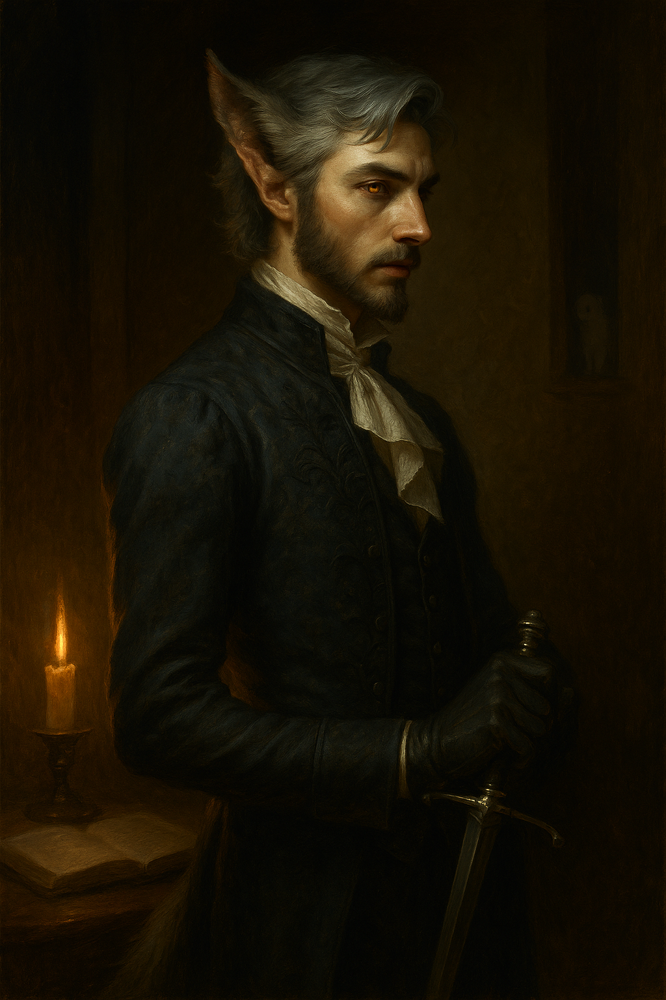

# Basil Tenebrian

{ width="300" }

> *"Are the Witch Hunters right? Am I really a monster waiting to happen? What if I'm just... a boy with fangs?"*

**A fugitive noble shifter who mastered bladesinging under an elven sage, now hunted by the very brother he refused to believe would betray him.**

*Keywords: Bladesinger, Shifter, Fugitive Noble, Scholar, Tragic Betrayal, Identity Crisis*

---

## Basic Information
**Species:** Shifter (Beasthide)

**Class:** Wizard 5 (Bladesinger)  

**Background:** Noble  

**Age:** 20

**Alignment:** Neutral Good

??? info "Quick Intro"
    
    **At the Table**
    
    * Fuzzes about little things, but if you're in need he will give you his last food scrap and not even mention it
    * Exceptionally well-spoken but self-conscious; his tail wags outside his control, mortifying him constantly
    * Fears he's a monster waiting to happen; haunted by his mother's imprisonment and mentor's sacrifice
    * The scholarly wallflower who transforms into something feral when cornered, bridging melee and magic
    
    **Backstory (Short Form)**
    
    Born with fur and fangs to noble House Tenebrian, Basil was tutored in secret by the elven sage Cilantro ("because I'm not to the taste of everyone"), who taught him bladesinging. When his brother inherited a new title and hired Witch Hunters to execute Basil, Cilantro sacrificed herself so he could escape. Now he sails far from home, hunted, while his mother remains imprisoned for aiding Cilantro in her rescue attempt.
    
    **Playing Basil**
    
    * **Combat:** Lead with Bladesong for massive AC boost and concentration bonuses. Pop Beasthide when combat allows for extra durability. With both active, you hit AC 20 with temp HP.
    * **Roleplay:** Bookish, overly polite, refined tastes, but his nose twitches at blood and he growls when cornered. Self-conscious about his tail wagging. Experiences magic through smell—illusions smell of camphor and sage. Uses perfume to cover his musk, which makes him sniffle. Lexley the ermine familiar is his fluffy menace of a shadow-self.
    * **Party Synergy:** Versatile gish who can control battlefields while threatening in melee. Brings scholarly expertise (Arcana +10) for tough Magic checks, noble connections, and surprising durability for a wizard.

---

??? info "Deep Dive"
    
	## The Backstory
    
    The noble house of Tenebrian received a proper shock when Basil was born, resembling a cub more than a human child, with pointed ears, rough fur and a short tail. The estate exploded in accusations of everything from adultery to witchcraft.
    
    The mystery of his progeny was never resolved, but his father Cecil eventually decided, and wisely, not to press the issue further. Basil was recognized as a member of the house and given a fine education, but was ultimately not involved in the politics of the estate. Yet the boy had a sharp mind, timid temper and a kind heart, and was eager to please his parents, so they hired a tutor.
    
    The sly old elven sage simply called herself Cilantro ("I'm not to the taste of everyone", she'd say with a smile) and her resume was extensive. Where most saw a deformed, quiet human child, she saw vast potential. They formed a deep bond over the years. Her lessons in history soon swerved into the arcane, and went from theory to practice. When Basil was twelve, he called his familiar for the very first time: an ermine he named Lexley, and has held dear ever since.
    
    In the summers, Basil would sail with his mother Nevarra to her family's archipelago. They weren't keen on the boy, but he soon forgot their misgivings as he learned to navigate by starlight and practiced bladesinging on quiet island shores.
    
    ## The Betrayal
    
    But tragedy struck when Lord Cecil died quelling a border uprising. His elder son Brendall inherited the title as well as the vast lands of the rebelling estate, granted by the King as a token of gratitude for the brave sacrifice his father had made.
    
    Suddenly holding a new, powerful title, Brendall grew protective of his image. His brother Basil suddenly seemed like a liability. Meanwhile, Cilantro grew wary of the rapid developments. Basil found her in her small room, packing her bags. She advised that he do the same. If only he had listened...
    
    Brendall had always been distant, focused on duty where Basil preferred books, but the crown's reward transformed him into someone Basil no longer recognized. Still, he could not fathom his brother would wish harm upon him, so he failed to see the danger until it knocked on his door. Three Witch Hunters of the Order of the Silver Sun charged into his quarters, hired by his brother. He fought well, surprising them all with his secret knowledge of the arcane, but they were seasoned hunters. They quickly took him into custody and branded him a danger to the realms, scheduled for execution the next morning.
    
    But in the hour before sunrise, Cilantro came, under the pretense of bringing a message from his mother. She broke him free, literally slapping the young man into action. But ultimately, the Witch Hunter guards were too strong, equipped to counter spells and beasts alike. She tricked Basil into running ahead, then lowered the portcullis behind him. He couldn't return to help her, but across the moat, he heard her bladesong coming to an abrupt end just as the sun rose. Out of options, he ran to honor her sacrifice.
    
    Brendall was furious. Nevarra's involvement in the plot to free Basil with a false letter was discovered, and she was imprisoned before Basil could find her. With Witch Hunters patrolling the roads, he had no other choice but flee. Stealing a sailing boat, he set off to far shores, vowing to return one day.
    
	---
	
    ## The Wolf in Silk
    
    Basil Tenebrian has refined tastes, and would never stoop to eating raw meat, but the smell of blood still makes his nose twitch. His bookish manners give way for something more feral when he's feeling cornered, growling as he reaches for his rapier or weaves a cantrip.
    
    He is exceptionally well spoken, but his family hid him away, meaning he never got the chance to hone his people skills. So while he carries himself elegantly, he is self conscious, especially about his little whippy tail.
    
    Cilantro always called him "a wolf in silk". At first he thought it a jest in poor taste, but with time he understood it was her way of honoring who he was, to take pride in his body instead of hiding it away. She never settled for just giving him a scholarly education. She wanted to prepare him for life as an odd one.
    
    ## Identity and Doubt
    
    Basil doesn't exactly envision himself as a noble of house Tenebrian, and ousting his brother. He is more set in his family's view of himself as "less than" other nobles, unfit for the job.
    
    Whether his mother Nevarra still lives, and what price her loyalty cost, haunts Basil's dreams. Some nights he imagines daring rescues. Others he fears he'll return to find nothing but a grave. Basil has paid a heavy price for the time he hesitated, failed to see the danger in time. While in his heart of hearts he will always be the kind, oblivious scholar, the experience left an indelible mark.
    
    ## Lexley the Shadow-Self
    
    Lexley the ermine fits Basil well: a fierce but graceful little predator with regal connotations. He embodies Basil's Jungian shadow, and is an absolute fluffy little menace, part comic relief, part serial killer of all that is cute and small, from the merchant's prize canary to the kittens behind the inn, which is a never ending source of headaches and embarrassments for Basil.
    
    ## Sensory Experience
    
    Basil experiences the world through smell. When casting Detect Magic, it is an olfactory experience as much as a magic one. Illusion spells smell of camphor and sage, conjuration spells of sulphur and ozone.
    
    Despite his sensitive nose, he still uses perfume to cover some of the beastly musk he exudes (or thinks he exudes). It makes him sniffle, and makes it harder for him to use Perception with smell.
    
    Basil's tail is a constant source of concern. Does he hide his tail in his trousers, or does he have them tailor made with a hole in the back? He's still struggling to find the best solution.
    
    (Does he secretly enjoy being called a 'good boy'?)
    
    ## Mechanical Analysis
    
    With both Bladesong and Beasthide active, Basil reaches 20 AC, with a decent pool of temp HP on top, strengthening the gish-ness of the build. He also gets a strong bonus to Concentration saves on top of Warcaster advantage, meaning CON 14 should be perfectly serviceable for this build.
    
    Basil's background is a slightly adjusted Noble background: The STR ability score increase was changed to DEX, the proficiency in Persuasion was changed to Perception, to better reflect Basil's wallflower upbringing.
    
    **Combat flow:** Bladesinger and Beasthide compete for Bonus Action activations. Generally, you'll want to lead with Bladesong as it provides the biggest buffs. Beasthide is great to throw in there to bolster your defenses whenever the combat flow allows it. It also fits well with Basil's persona that he falls back on his more feral self as the battle continues and he gets more desperate.
    
    ## Sample Quotes
    
    "The barmaid called me a 'good boy', and I couldn't even project proper outrage because... I hate to admit it, but of course my stupid tail started wagging. 'Mortified' doesn't begin to cover my emotional state right now. So I'm afraid we need to find another tavern. I'm never coming back."
    
    "My lady, I believe I can surmise where this conversation is going, and while genuinely flattered, I'm convinced your notion of the allure of the 'exotic noble' is inflated. I'm a scholar. My 'edge' is that of the papercut."
    
    "Lexley! That's a priceless canary. I'm aware it looks like dessert, but they're not for consumption!"
    
    "Never understood why Cilantro insisted teaching me Three-dragon ante. Such a silly game. But now there's a memory of her ingrained in every card."
    
    "What do I care if my bladesong sounds like 'common howls and yiffs' to you? It's an interpretive artform! You wouldn't understand."
    
    "Sea-breeze smells to me of something even more beautiful than freedom: to be by myself, for myself."
    
    ## Personality Framework
    
    **Personality Traits:** Fuzzes about little things like propriety, fragrance notes and hem lengths, but if you're in need he will give you his last food scrap and never even bring it up again.
    
    **Ideals:** Knowledge without kindness is just a sail without wind.
    
    **Bonds:** My mother still needs me. She's the only one I have left.
    
    **Flaws:** I doubt there is truly a place for me in this world. I fear the truth of who I am.

---

??? danger "Notes for the DM"
	
	## Session Considerations
	
	It's a good idea to decide with your DM whether you prefer to play Basil keeping his identity secret, if he's still being pursued or if he's sailed so far away he thinks he's safe from pursuers.
	
	## Plot Hooks
	
	**The Order of the Silver Sun** are skilled "problem solvers" fighting witchcraft, lycanthropes and the Undead. They may have branches looking for Basil outside the reach of the kingdom. Imagine them like Witchers, intent on capturing what they consider a simple, dangerous beast dressing up in fine clothes to mask its bloodlust. They could press Basil into his more bestial nature, hunting him with nets, traps and pikes, like a boar, even calling him "it", feeding his own worst fears and thoughts about what he is.
	
	**Brendall's Motivations:** Brendall's sudden swerve can have many reasons. Historically, nobles turned on their siblings left and right, but if you want to add some more drama, here are some options for your consideration:
	
	* **Ivrayne Feldergand**, advisor assigned to the Tenebrian estate by the king to "assist" the young Marquess Brendall in his first years. She immediately set out to isolate him from his allies with words like honeyed daggers. This effectively weakens the estate and makes it less of a threat to the king. You could play her as the classic deceitful "Grima Wormtongue" advisor, or something much more nefarious. What's to say she doesn't have plans of her own? Is she even who or what she claims to be?
	
	* **Dirty family secret:** Basil is the one true heir to the house, while Brendall is actually a bastard. His imprisonment of Nevarra was also a cover-up to make sure she'd never tell anyone. What would Basil's reaction be if he found out?
	
	**Mentor Figure:** Suggestion: add an older Shifter at some point, one who is comfortable in their own skin and can be a mentor on another level than Cilantro could be.

---

??? info "Mechanical build (lv 5) and PDF download"

	| STR | DEX | CON | INT | WIS | CHA |
	|:---:|:---:|:---:|:---:|:---:|:---:|
	| 8 (-1) | 16 (+3) | 14 (+2) | 18 (+4) | 10 (+0) | 8 (-1) |
	
	## Combat Stats
	
	| AC | HP | Hit Dice | Speed | Initiative | Prof. Bonus |
	|:---:|:---:|:---:|:---:|:---:|:---:|
	| 15 | 32 | 5d6 | 30 ft. | +3 | +3 |
	
	**Saving Throws:** INT +7, WIS +3 (Advantage on CON saves to maintain Concentration)
	
	**Resistances:** None
	
	**Senses:** Darkvision 60 ft., Passive Perception 10, Passive Insight 10, Passive Investigation 17
	
	## Proficiencies
	**Skills:** Acrobatics +6, Arcana +10 (Expertise), History +7, Investigation +7, Performance +2, Persuasion +2, Religion +7, Stealth +6
	
	**Armor:** Light Armor | **Weapons:** Rapier, Simple Weapons
	
	**Tools:** Three-Dragon Ante Set, Vehicles (Water) | **Languages:** Common, Elvish
	
	## Key Features
	
	**Bladesong** (PB/Long Rest, Bonus Action): For 1 minute gain +4 AC, +10 ft. speed, advantage on Acrobatics checks, and +4 to CON saves for concentration. Ends if incapacitated, wearing medium/heavy armor or shield, or using two-handed weapons.
	
	**Shift - Beasthide** (PB/Long Rest, Bonus Action): Gain 1d6+6 temporary hit points and +1 AC for 1 minute.
	
	**Arcane Recovery** (1/Long Rest): During a short rest, recover spell slots totaling up to level 3 (no slot can be 6th level or higher).
	
	**War Caster**: Advantage on CON saves to maintain concentration; can cast spells as opportunity attacks; can perform somatic components with weapons/shield in hand.
	
	## Feats
	- **War Caster**: Advantage on CON saves to maintain concentration; can cast spells as opportunity attacks; can perform somatic components with weapons/shield in hand
	- **Skilled**: Gained proficiency in three additional skills or tools
		
	## Equipment
	Studded Leather, Rapier, Orb (arcane focus), Component Pouch, Enduring Spellbook, Fine Clothes, Perfume, Three-Dragon Ante Set, Backpack, Oil (×10), Parchment (×10), Tinderbox, Book, Lamp, Ink Pen, Ink
	
	## Spellcasting
	**Spell Save DC:** 15 | **Spell Attack Bonus:** +7 | **Spellcasting Ability:** Intelligence
	
	**Cantrips:** Fire Bolt, Booming Blade, Mage Hand, Minor Illusion
    **Level 1:** Shield, Find Familiar [R], Absorb Elements, Ray of Sickness, Disguise Self, Comprehend Languages [R], Unseen Servant [R]
	**Level 2:** Misty Step, Scorching Ray, Phantasmal Force, Blur, Detect Thoughts
	**Level 3:** Haste, Hypnotic Pattern, Fireball, Counterspell

	📄 [Download Level 5 Character Sheet (PDF)](assets/basil-tenebrian-lv5.pdf)

---

??? danger "**Session Zero Considerations**"
    
    **Content Notes:** Themes of family betrayal, imprisonment, execution, character death (mentor sacrifice), and being hunted. Explores internalized fear of being monstrous.
    
    **Representation Notes:** Character features shifter heritage (lycanthrope-adjacent transformation). Elements of body dysmorphia, identity struggle, and not fitting societal norms that may resonate with queer and disability experiences. The character's tail wagging involuntarily could be read as coded neurodivergent traits.

---
