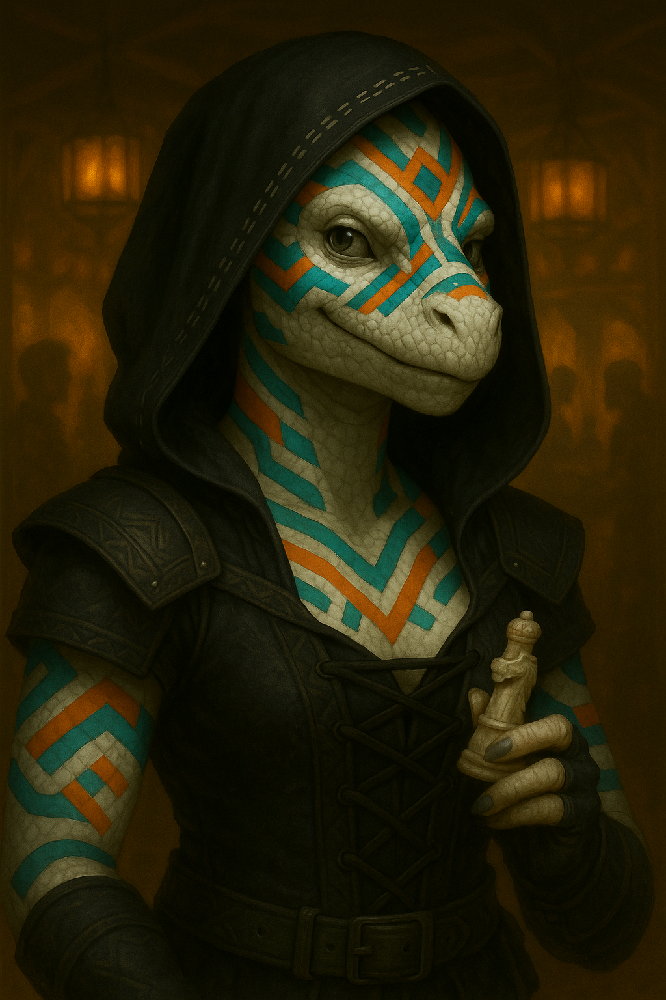

# Beitian "Betty" Winter's Heart

{ width="300" }

	> *"Wait wait wait—the blacksmith's son and the mayor's daughter?! No, sit down, you're not going anywhere until I have the complete timeline. Pretzel?"*

	**White Dragonborn Soulknife from a clan born without earbones, where sign language and psionic gifts are the only speech. A Dragonchess prodigy who got hustled and can't go home until she's won back what she lost *and* interest that'll impress. So she fills her days with fast quips and other people's drama, because examining her own life would mean admitting maybe even a prodigy has her limits.**

---

## Character Overview
- **Species:** White Dragonborn (Clan Bellokan)
- **Class:** Rogue 5 (Soulknife)  
- **Background:** Gambler  
- **Age:** 26
- **Alignment:** Chaotic Good

??? info "Quick Intro"
    
	**At the Table**

	* Communicates via sign language, lip-reading, and Psychic Whispers, delights in cracking jokes directly into allies' minds at the worst possible moments
	* Paints her white scales in clan tradition: teal for genius, orange for adventure, purple and green when she's homesick and won't admit it
	* Believes mustard is a universal condiment, treats other people's love lives as spectator sport, and will absolutely derail a mission to hear the end of good gossip
	
	**Backstory (Short Form)**
	
	Betty was born into an isolated White Dragonborn clan with no earbones, communicating only through sign language and rare psionic gifts. A Dragonchess prodigy who beat the clan champion at ten, she got hustled by a traveling card sharp and lost catastrophically. Her clan paid her debts, but shame drove her to swear she'd repay every coin. Years later, she's still chasing that one perfect hand while her psionic blades keep her alive in the lowlands—and her debt to the clan remains unpaid because she can't stop trying to double her way to redemption.

	**Playing Betty**

	* **Combat:** Psionic Blades make for flashy, mobile Rogue combat; as Finesse weapons they pair with Defensive Duelist for decent durability when cornered.
	* **Roleplay:** She *will* hang on every word of the BBEG's monologue like it's a telenovela finale. Sulks briefly after losses, bounces back fast. Her fatal flaw is absolute certainty in her own cleverness.
	* **Party Synergy:** Covers friends' debts without hesitation (her own finances are already a disaster, what's a little more?). Excellent scout—reads lips at distance and is a lot braver than some would assume. 

---

??? info "Deep Dive"
    
	## Backstory (Full)
    
    Beitian "Betty" Winter's Heart grew up in the snowy isolation of the White Dragonborn of Clan Bellokan, one of several clans in the Frostspine mountains. By some twist of fate, this particular clan has no earbones, and only communicate through sign language. At some point in their history, they evolved psionic abilities. Some clan members would be born able to communicate from mind to mind. They would become important members of the clan, its foremost ambassadors with the outside world. Beitian was one such child. 
    
    Many followed her with interest. She had the gift, and was also terribly clever: A Dragonchess prodigy, she beat the clan champion at ten, and never let anyone forget it. Outthinking opponents and solving riddles became her favorite sports.
    
    When Desdemond Swigg, a traveling Three-Dragon Ante card sharp came through the ice market (the clan's annual event for trading and meeting with the outside world), 18 year old Betty was certain she could see right through him. Her inevitable string of losses left her in staggering debt. Her clan, with some reluctance, pooled their resources to pay off the worst of it, but shame drove her to swear she'd travel to repay every coin, and then some. 
    
    In the cities of the lowlands, her psionic blades and quick wit have kept her alive, but the lure of the gambling table keeps her purse light and her promise unfulfilled. She's certain she's only one perfect hand away from setting things right... and she's been certain of that for years.
	
	---
	
    ## Betty's Personality
    
    Betty is chipper, witty, cheerfully irreverent and too smart for her own good. She loves to use her abilities to play pranks. If she can crack a quip using Psychic Whispers that makes her buddy giggle in front of the Archdeacon of the God of Lemons and Dour Faces, it'll make her day. She *loves* when she manages to one-up street hustlers, but won't stand for one of her friends getting swindled... unless of course she's the one doing the swindling, and only if it's all in good fun.
    
    She always thinks she's figured out the system. Every time she accumulates enough gold to make real progress, she tries to double it and ends up back at zero. Cue a short period of sulking. But she's a phoenix, as quick to recover as she is to descend.
	
	Unsurprisingly, she's terrible with money. If a friend is in need, she'll likely grumble and pay up. After all, that's what others did for her. She's so deep in the red anyways, and so used to fortune swinging wildly, losing large sums of money doesn't really register to her.
    
    Gossip, drama, sappy love stories and court battles are distilled ambrosia to Betty. She *will* hang onto every word of the BBEG's pompous villain monologue as if it was a livestreamed telenovela.
	
	The third best thing in the world, next to drama and dragonchess, is *mustard*. Betty confidently claims it goes with everything.
    
    Betty can't admit to herself that her family probably still loves her, misses her and would forgive her in an instant if she only came back safely. She wants to return in style, with grand gifts for the whole clan. And with every year that passes, that pressure to not only come back but also compensate for lost time, keeps growing. She changes the subject if someone asks too much about her home and family, unless she's drunk or in life-threatening danger. Then, she might overshare.
    
    Clan Bellokan **loves color**. It is customary to paint their white scales. Colors mark moods and aspirations, patterns record relationships or important events. Betty often uses variations of teal, orange, and turquoise, representing genius, adventure, and pride. Other colors are purple and green, representing nostalgia and home sickness, or rust red and deep grey, symbolising commitment and loneliness.
    
    Beitian loves playing Dragonchess and will happily spend downtime reading up on lore, strategy, openings and end games. When visiting new cities, she'll immediately start looking up the parks or inns where the local players are. It's become a natural place for her to gossip, socialize, learn about current events, pick up quest rumors and maybe do some light hustling on the side.
    
	---
    
    ## Sample Quotes
    
    "You hear lies. I see them. We're not the same. I poke holes in them till they deflate like puffballs."
    
    "Luck is just math and time in a trenchcoat. I can see riiight through it!"
    
    "I don't cheat. I accelerate the inevitable."
	
	"What the heck kinda name is 'Desdemond Swigg' anyway?"
    
    "Saw that move coming, stupid thug. That one, too. You're not slow, just predictable, so don't hit on yourself for failing so miserably. I'll be glad to do that for you!"
	
	"Wait wait wait—the blacksmith's son and the mayor's daughter?! No, sit down, you're not going anywhere until I have the complete timeline. Pretzel?"
    
    "My clan didn't raise quitters. Fools, maybe. But not quitters. I'm paying it all back, one day."
    
    "If you're my friend, your debt's mine too. That's how friendship works, right? Well of course it goes both ways! Speaking of which..."
    
    "You're asking the wrong girl for romance advice, my man. I mean I *know* all the *moves*, I just don't play that game. But I *can* tell you that if you don't talk to her by the next full moon, the stablehand will. And his jawline is frankly unreasonable."
	        
    "Hey barkeep, yes this is the white dragonborn gal in the corner speaking directly into your mind. Couldn't be arsed to get up. Pretzels please! And mustard for dipping. Uh, did you just throw up... in your mind? Rude."
    
    "Lowlands are either soft and mushy or hard and flat. I so miss the crunch of snow underfoot."
	
	---
	
	## Table Guidance: Playing a Deaf Character
	
	Betty's deafness is a part of her identity, and should not become a constant penalty or "gotcha" mechanic. It's a roleplay hook, a reason for certain choices, not a punishment mechanic or a tragic flaw. It needs to be portrayed as a lived reality she adapts to with skill and grace. The bottom line needs to be: *Betty is fine*. At the table, focus on teamwork, memorable moments, fun, and creative problem-solving.
	
	**For the Player:** The rule should be that you decide when her deafness comes into play. e.g., in a crowded tavern she might miss verbal cues, but in a calm one-on-one conversation she can track fine. Lean into strengths. Use visual cues, lip reading, body language, and Psychic Whispers as primary tools. 
	
	Make a point of noticing details others overlook, but avoid the "disabled with superpowers" stereotype. But also don't self-nerf too much! It's perfectly fine to play Betty as very capable. Mechanically, she can speak several languages even though she doesn't hear them. Unless the scene benefits from it, don't bog yourself down with disadvantage rolls. The impairment is about flavor and resource choices, not punishment.
		
	**For the DM:** Spotlight without punishing. Bring it into play a couple of times per session, enough to make it meaningful, but not so often it slows things down or sidelines the character. Offer small narrative trade-offs. In chaotic conditions, her trained mind might pick up on vibrations or visual signs before anyone else! You might want to encourage party members to develop silent signals with her, learn to sign, and turn what could be a limitation into a tactical advantage.
	
	**Lip-reading (Clan Feature: Homebrew):** If you can see a creature's mouth while it is speaking a language you understand, you can interpret what it's saying by reading its lips (this is a small part of the old 2014 *Observant* feat repurposed for Betty).
	
	## Magic Item Considerations
	
	Betty can read lips, and as Dragonborn has access to Flight. Together with her suggested magic item *Eyes of the Eagle*, she could fly up in the air and use it to read the lips of people at great distances. It's intended as a flavorful character strength, but if it gets munchkin-y, the final call for usability rests with the DM. The goal is to use this ability to create memorable moments and clever tactics, not to short-circuit story beats.
	
??? info "Extended Scene: Betty vs. the Villain Monologue"
    
    *Don't take the following scene too seriously. It's a hastily scribbled dialogue to demonstrate my own vision of Betty's signature blend of genuine investment in drama, tactical coordination, and clever conflict resolution.*
	
	**Scene: Evil Lair, BBEG of the Week's Mandatory Monologue To Portray Them As An Actually Morally Grey Tragic Character**
	
    [BBEG]: "And then I was betrayed! By the very people I sought to protect!"  
	[Betty gasps]  
	[BBEG]: "They had no right to my loyalty anymore. I wanted to show them all, and that's why I poisoned the river!"  
	[Betty takes notes]  
	[BBEG]: "It began... when I found my secret lover in bed... with my other secret lover!"  
	[Betty's eyes widen]  
	[BBEG]:"And then, as I fled the scene, heartbroken, my dear old dog died. Run over by a carriage, belonging to the man who once claimed to be my closest ally, before he betrayed me and stole the position that would rightly have been *mine*!"  
	[Betty discreetly produces pop-tart, proceeds to eat]  
	[BBEG]:"I was just done burying Barkfolomew under his favorite oak, that poor tree... when news reached me that my both lovers had joined the foreign kingdom of Nefaria, the whoresons who killed my mother... And they're getting married!"  
	[Betty visibly chokes]  
	[Betty psychically whispers to the party]: *"DO NOT INTERRUPT THIS MAN. I swear on every scale I will PERSONALLY stab anyone who attacks before we find out what happened to Barkfolomew's oak tree"*  
	[The Fighter, increasingly concerned]: "Betty people are counting on us to—"  
	[Betty, out loud, genuinely invested]: "Wait wait BOTH lovers joined Nefaria? Like, together? Or separately? Because if they joined together that's a whole different level of—"  
	[BBEG, actually appreciating being asked]: "TOGETHER! Can you BELIEVE—"  
	[Betty, tail whipping]: "That's WILD! Okay okay, so your closest ally, the carriage guy—was he ALSO sleeping with your secret lovers? Because the timing here is—"  
	[BBEG pauses mid-monologue]: "...you know, I hadn't considered that, but now that you mention it, there WAS something strange about how quickly he offered them positions in his household after—"  
	[The Paladin (after calling Betty's attention) hisses]: "Betty what are you DOING?!"  
	[Betty, psychic whisper]: *"I'm INVESTIGATING. Also this is objectively fascinating. Also also, I think if we let him talk for like five more minutes he's going to reveal where he keeps the antidote. He's a monologuer, that's what they DO!"*  
	[BBEG continues]: "And so with Barkfolomew cold in the ground, my lovers in league with my enemies, that BASTARD rode in on his blood-soaked carriage one night... took an axe to Barkfolomew's tree. And that was the final injury. What choice did I have but to—"  
	[Betty, completely sincere]: "Poison the river. Yeah. I'm tracking with you so far. But like—and I'm not judging here, genuinely asking—why the *whole* river though? Because that seems like it would also poison, like, a bunch of people who had nothing to do with the lover situation? And also, what about the fish?"  
	[BBEG, actually having to think about this]: "I mean... I suppose... but my revenge demands compensation, recognition! My GRIEF—"  
	[Betty]: "Oh no, absolutely valid. Grief makes you do wild shit. I once bet my entire month's earnings on a hand I *knew* was bad because I was just feeling so—anyway. Not about me. Please continue. So you poisoned the river?"  
	[BBEG]: "Right! It fit my new vibe I decided. If you're gonna flip, do it in style!"  
	[Betty, eager:] "Oh absolutely! Trust me, they're horrified of you!"  
	[Wizard, quietly to the rest of the party]: "I think she's forgotten we're supposed to *stop* him..."  
	[BBEG, genuinely warming to Betty]: "You... understand? Everyone always interrupts at 'poisoned the river' and then we fight, but the FAMILIES part is where it gets really—"  
	[Betty, leaning forward]: "Morally complex? Because like, okay, your lovers betrayed you, absolutely unforgivable. But their families probably didn't even KNOW about—"  
	[BBEG]: "EXACTLY! I want my exes to feel what *I* felt! So... I was coming to that part of my plan next! See, I was going to activate the sludge golems and march on the capital of Nefaria, but honestly, now that I'm saying it out loud, it does seem like I'm displacing anger at like, three specific people onto an entire nation—"  
	[Betty]: "Right?! Like I GET IT, the rage is real, but shouldn't it be, like, surgical? Ice cold. There's the optics. Don't let them see you're upset, right? Don't give them the satisfaction. Also—and stay with me here—have you considered just, like, showing up to their wedding in Nefaria and making an absolute SCENE? All cards on the table. Hand out fliers of Barkfolomew. I know a painter! People will *eat this up*! I'm thinking a super controlled public call-out might actually be more satisfying than mass murder?"  
	[BBEG]: "...I hadn't really thought of that."  
	[Betty, triumphant]: "And here's the best part! You're just holding up a mirror for them. *They* brought this on themselves! They don't even get to claim their psycho ex was throwing a tantrum. It'll *destroy* them!"  
	[BBEG, wide-eyed]: Holy shit, that's actually truly evil! That's brilliant!  
	[Entire party stares at Betty]  
	[Betty, psychic whisper]: *"See? The truth always comes out in the drama. You're welcome. Also he definitely has the antidote in that weird locket he keeps touching when he talks about Barkfolomew."*  

---

??? info "Key Relationships"
	
	**Elmyra "The Smoking Rake" Dobber**: A Rock Gnome woman in her mid 40's, former card sharp who aged out of the grift when her hands started shaking from nerve damage after too many nights drinking the cheap stuff and talking, to get her marks to keep playing. Now she runs a back-room gambling den called The Crooked Pawn, where she takes a cut of every pot and offers credit to regulars at rates that would make a Devil blush. Elmyra recognized something of herself in Betty early on: the same certainty, that inability to cut a loss and walk away. She's been enabling Betty's addiction for years while telling herself she's really only providing a safe place to lose. Their relationship is uncomfortably maternal: Elmyra loans her money, feeds her when she's broke, and keeps her spirits up with small freebies at the tables.
	
	**Kazamir the Dockworker**: Kazamir is a Dragonborn dockworker who came down from the Frostspine clans for seasonal labor five years ago and never left. He didn't exactly fall in love with cities, but the work kept coming and the money was honest. Kazamir loads cargo, hauls stone, takes extra shifts when they're offered, and doesn't mind long, hard hours. His scales are permanently scuffed from crates and his claws are cracked from salt and rope. He met Betty in a park where laborers use to gather after shifts and watch the Dragonchess matches. Early on, he made an earnest if awkward romantic approach, and she explained that while she was genuinely flattered, she wasn't really about all that stuff. He accepted her explanation with a shrug and an offer to buy her dinner anyway. They've been good friends since.
	
	Kazamir is everything Betty isn't: methodical where she's impulsive, silent where she's sharp, content with a quiet night where she's starving for stimulation. He saves his wages in a lockbox under his bed and sends half home every season. He doesn't understand why Betty can't simply do that. The math isn't hard. You earn, you keep, you send. He's watched her win enough gold to clear her debt three times over, then watched her feed all of it back into the table the same night. He's tried to talk to her about it, haltingly because he lacks her facility with words. She runs conversational circles around him every time, deflects with jokes, changes the subject to his terrible taste in food or the southern clans' inferior pottery traditions. It's eating him alive. He's not stupid; he knows she's smarter than him. He just also knows that smart doesn't mean wise, and watching someone drown while they explain the fluid dynamics of water is its own kind of hell.
	
	**Skrit**: A filthy little urban Kobold fellow who works as a rat catcher at night and haunts the Dragonchess tables in the day. He plays for copper stakes against anyone foolish enough to sit down. Skrit is more than aware of the stereotypes about Kobolds, and that's exactly why there's nothing he loves more in the world than to humiliate Dragonborn at the board. He dismantles opponents with a style so passive and ugly it borders on contemptuous. No brilliance, no flair. He just doesn't make mistakes. He trades pieces until the board is empty enough that his endgame technique grinds you into paste, always winning with the least possible margin.
	
	Betty has played Skrit perhaps thirty times. Her record is approximately two wins (both on time, due to external circumstance), six draws, and the rest clean losses. This is unacceptable. She's a prodigy. She sees eight moves ahead, she finds combinations that make spectators gasp, she plays Dragonchess like it's supposed to be played! As art, as war, as a display of brilliance and grit. Skrit plays it like accounting. If he sees beauty on the board, he kills it. He only cares about that final moment when he removes her final long range piece off the board, and her inevitable resignation. That's the only time anyone has seen him smile.
	
---

??? danger "Notes for the DM"
	
	## Dramatic Questions
	
	- *Are Betty's constant quips and obsessions with mustard and drama merely distractions to keep her from reflecting on her life... or are they in fact her life?*
	- *Is Betty's constant insolvency merely bad impulse control, or is it an expression for an unconscious desire to actually not make the money, to not go home?*
	- *What does Betty do the day someone truly crosses her moral boundaries, and thus makes it clear for her that she has them, and that they matter?*
	
	## Relationship dynamics
	
	**Elmyra "The Smoking Rake" Dobber**: A returning customer is an usurer's best friend, and so she watches Betty spiral without intervening. But there's a deeper layer: intervention would require Elmyra admitting what she's become. Use her as the mirror Betty refuses to look into: this is your future, still shuffling cards in a dim room, telling yourself tomorrow's the day. 
	
	**Kazamir the Dock Worker**: Use Kazamir as Betty's straight guy, her conscience or a collateral, the friend Betty takes for granted until something happens to him. If you want to crack her open, put *him* in debt—have Elmyra's people come after him for something Betty owes. Force her to watch her mess land on the one person who tried to keep her clean.
	
	**Skrit**: If you want to truly insult Betty, at one point when she's being hunted by debt collectors, have Skrit show up from nowhere, smelling like freshly caught rat. He wordlessly hands a *large* down-payment to the pursuers. "This is the money I've won from the white-scaled girl. I invested it well. My life would be dull if it weren't for her. I guess you could call her my hobby, so I prefer to keep her on the streets."
	
	## Plot Hooks
	
	**Stubborn pride**: Beitian still hasn't forgotten or forgiven the way Desdemond Swigg outplayed her. If she learns he's around, she'll almost certainly go out of her way to try and find him and beat him at his own game.
	
	**The Dragonchess Tournament**: (Bottle episode idea) Betty gets an exclusive invitation to the bi-annual Dragonchess tournament, held in the Grand Estate of Arch Duke Tremolin Brindenbrook! All the big names are going to be there. The rest of the party may grumble, but if Betty gets them to come along, they all get their fill of intrigue, as unexpected events unfold. 
	
	Ideas: 
	- A character with known connections to the BBEG has unexpectedly arrived and demands to partake in the tournament.
	- The grandmaster is Alroxan, a literal Brass Dragon, undefeated for 400 years, infamous for destroying opponents’ concentration by delivering endless opening theory lectures from move two onward. He talks constantly, authoritatively, and without pause. Understandably, no one has ever dared to tell him to shut up. Betty is deaf.
	- A heist against the Estate is underway during the tournament. While Betty plays, the rest of the party is free to unveil the plot, disarm it or even join in.
	- An item of high value is up for grabs for the winner, offered from the Brass Dragon's hoard just to lure in contestants and increase the pzazz of the tournament. 	
	
	**Colonel Mustard, in the Basement, with the Vorpal Blade**: A Cluedo-inspired short adventure investigating a macabre assassination at a warehouse storing a full shipload of mustard seeds: Hundreds of bags! The city guard has closed off the area during investigation. Nothing can leave the crime scene. Hence, nobody can make mustard. This is Betty's time to shine.
	
---

??? info "Mechanical build (lv 5) and PDF download"

	| STR | DEX | CON | INT | WIS | CHA |
	|:---:|:---:|:---:|:---:|:---:|:---:|
	| 8 (-1) | 18 (+4) | 14 (+2) | 16 (+3) | 8 (-1) | 10 (+0) |
	
	## Combat Stats
	
	| AC | HP | Hit Dice | Speed | Initiative | Prof. Bonus |
	|:---:|:---:|:---:|:---:|:---:|:---:|
	| 16 | 38 | 5d8 | 30 ft. | +7 | +3 |
	
	**Saving Throws:** DEX +7, INT +6
	
	**Resistances:** Cold
	
	## Proficiencies
	**Skills:** Acrobatics +10, Deception +3, Investigation +9, Persuasion +3, Sleight of Hand +7, Stealth +7
	
	**Armor:** Light Armor | **Weapons:** Simple Weapons, Hand Crossbows, Longswords, Rapiers, Shortswords
	
	**Tools:** Thieves' tools, Dragonchess Set | **Languages:** Common, Draconic, Common Sign Language, Thieves' Cant
	
	## Feats
	- **Observant (Homebrew Clan Feature)**: If you can see a creature's mouth while it is speaking a language you understand, you can interpret what it's saying by reading its lips.  
	- **Defensive Duelist**: Betty has great reflexes, but she's also a queen of reading opponents. As a Reaction, add your PB to your AC (vs melee only) until the beginning of your next turn.
	
	## Equipment
	Studded leather armor, Thieves' tools, Dragonchess set, Rapier, Scimitars
	
	**Suggested Magic Items**
	
	- Eyes of the Eagle (Uncommon, Advantage on Wisdom (Perception) checks that rely on sight, even over very long distances)
	- Stone of Good Luck (Uncommon, Attunement, +1 to all skill checks and saving throws; because you *know* if Betty found a good luck charm she'd never let it go)
	- Slippers of Spider Climbing (Uncommon, Attunement, move on vertical/upside-down surfaces, no falling unless incapacitated; Fly where you want, then place yourself there as long as you want. Play cards in the ceiling. Literally hang right under the balcony where the starcrossed lovers confess their forbidden feelings)
	
	---
	
	📄 [Download Level 5 Character Sheet (PDF)](assets/beitian-winters-heart-lv5.pdf)

---

??? danger "**Session Zero Considerations**"
    
    **Content Notes:** Gambling addiction, self-destructive behavior patterns, usury, financial debt, family shame and exile. Treat these topics seriously as they are often deeply shameful and people who have negative experiences with them often have a hard time talking about it. Themes of disability are present but portrayed positively—Betty's deafness is an identity element, not a tragedy.
    
    **Representation Notes:** Betty is a deaf character designed for authentic representation. Feel free to discuss comfort levels with portraying disability, signing/communication mechanics, and ensuring the character feels good to play. The character might work best at tables that value collaborative storytelling and are willing to occasionally spotlight accessibility as a narrative element. Betty is also a self-defined asexual, aromantic character.

---