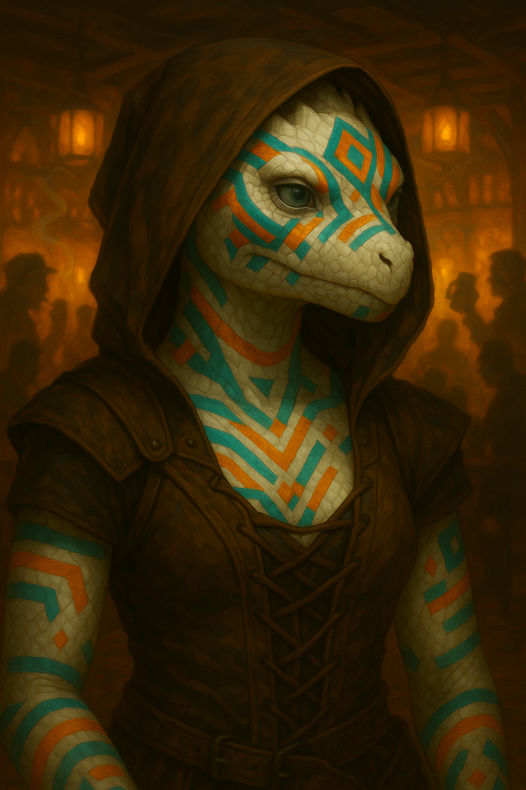

# Beitian "Betty" Winter’s Heart

{ width="300" }

> *“Life’s a game of Dragonchess. Sometimes you sacrifice a rook, sometimes you bluff with nothing in hand. Either way, I’m still playing.”*

---

## Character Overview

|                   |                                      |
| ----------------- | ------------------------------------ |
| **Class & Level** | Rogue (Soulknife) 4                  |
| **Background**    | Gambler                              |
| **Race**          | Dragonborn (White ancestry)          |
| **Alignment**     | Chaotic Good                         |
| **Role**          | Skill monkey, trickster, psychic striker |

A sharp-tongued dragonborn rogue who grew up in a clan of deaf dragonborn sign-speakers, Betty blends psionic trickery with a hustler’s instinct. She is too clever for her own good and proud of it, and perpetually one perfect hand away from fortune.

---

## Personality

* Chipper and sardonic; loves pranks and sly humor, using her psionic whispers to get a rise out of her companions
* Defends friends from swindlers like a real boss mom, though she herself can’t resist a gamble
* Paints her scales to signify her mood
* Prodigy Dragonchess player, and will always seek out the local playing spots to socialize, listen to gossip and win some coin off the local champions
* Torn between her homesickness and her stubborn pride: she can’t go back to her clan until she’s “earned it,” even if they’d forgive her debts in an instant  
* Most likely party member to use her breath weapon to make the street slippery for her debt collectors out of sheer spite.

---

## PDF Character Sheet

📄 [Download full character sheet](assets/beitian-winters-heart.pdf)

---

## Gameplay Notes

??? info "Playing Betty effectively"
	- **Lean into psionics + roguish flair**: Betty’s Psychic Blades let her fight without weapons drawn, perfect for a hustler who “just happens” to be dangerous.  
	- **Skill monkey**: With expertise, Observant lip-reading, and Eyes of the Eagle, she can gather intel in ways few PCs can. Use this to create memorable scenes of clever surveillance or sudden insight.  
	- **Deafness at the table**: Play Beitian's deafness with purpose, avoid spectacle. Feel free to read the guidance section in the character sheet PDF.
	- **Table banter**: Betty shines in social play. Use her sardonic humor, gambling habits, and pranks to keep RP lively and unpredictable. Think of her as the party’s chaos element—but always with a heart for her friends.  

??? danger "DM Guidance"
	- **Gambling addiction**: Build tension by tempting her with wagers and schemes. A “can’t-miss opportunity” can become a narrative hook or moral trap.  
	- **Clan ties**: Betty’s clan debt and shame offer long-term story fuel. Encounters with dragonborn messengers, gamblers, or even her old rival Desdemond Swigg can drive arcs of pride, growth, or reconciliation.  
	- **Deafness at the table**: Keep it flavorful, not punitive. Highlight moments where visual cues or psychic whispers matter, and occasionally let a missed cue spark drama without sidelining her.  
	- **Flight + eagle eyes**: Treat her long-range lip-reading as a cinematic flourish rather than an “auto-succeed” button. Use distance, lighting, and obstacles to keep it balanced while rewarding creativity.  

---

## Stat Snapshot

```text
STR 8 (-1)   DEX 18 (+4)   CON 14 (+2)
INT 16 (+3)  WIS 10 (+0)   CHA 8 (-1)

HP 31   AC 17   Speed 30 ft
Proficiency Bonus +2
Spell Save DC 12   Spell Attack +4
```