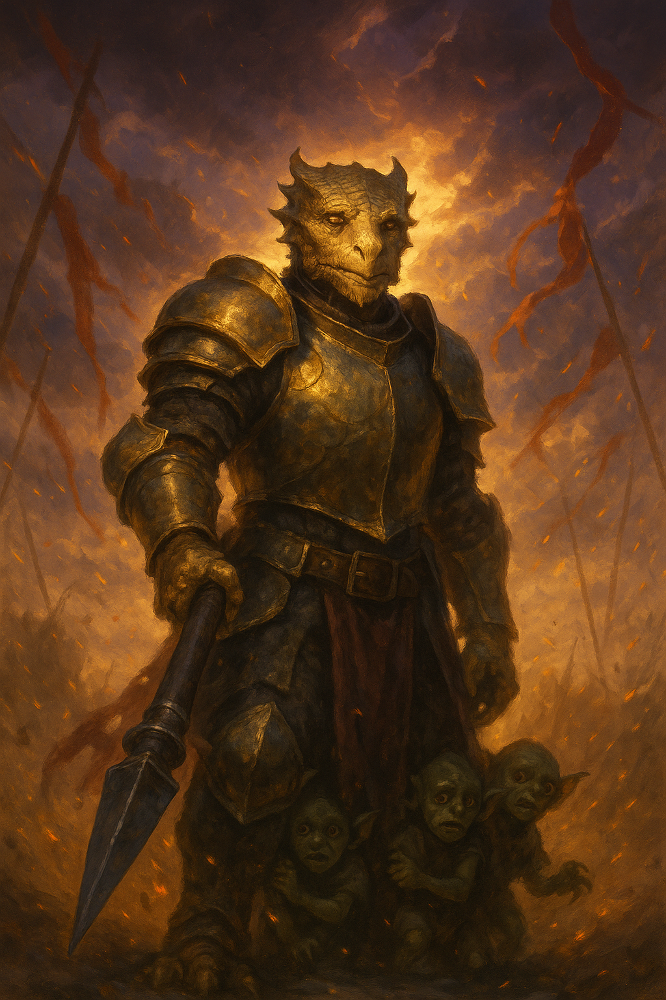

# Belvarax "Gobsmack" Allimander

{ width="300" }

> *"I live not to be honored, but to avoid staining my soul. Let them call me coward. I’ve made peace with being misunderstood."*

---

## Character Overview

|                   |                              |
| ----------------- | ---------------------------- |
| **Class & Level** | Paladin (Oath of Devotion) 4 |
| **Background**    | Farmer         |
| **Race**          | Dragonborn (Gold Ancestry)   |
| **Alignment**     | Neutral Good                 |
| **Role**          | Tank, Support, Moral Compass |

Belvarax, once a gallant farmer-turned-paladin, has become a conflicted yet steadfast guardian. Scorned for his compassion toward former enemies, he seeks redemption through restraint, not righteousness.

---

## Stat Snapshot

```text
STR 14 (+2)   DEX 10 (+0)   CON 14 (+2)
INT 14 (+2)   WIS 8  (-1)   CHA 18 (+4)
HP 36   AC 19 (Mithral Plate + Shield)   Speed 30 ft
Proficiency Bonus +2
Spell Save DC 14   Spell Attack +6
```

---

## Personality

* Haunted by past disillusionment, now tries to honor his Paladin vows through radical doubt and intellectual discipline
* Upholds a morally complex code that reads as rules-bending to more simplistic Paladins
* Often ridiculed for "goblin love" because he won't just smite the little buggers
* Always faithfully comes through in the end, pike in hand, when the situation calls for it
* Most likely to end up being the party daddy

---

## PDF Character Sheet

[Download full character sheet](assets/belvarax-gobsmack-allimander.pdf)

---

## Gameplay Notes

??? info "Playing Belvarax effectively"

	- **The intellectually mature Paladin** Belvarax believes reflection is the beginning of all decisive action. Lean into a gentle and patient personality.
	- **Patience of a saint** Make a thing of not taking any mockery personally. Belvarax knows his philosophy is impopular. That doesn't make it less true.
	- **The shepherd in the back** Avoid taking initiative, lean into being the party's careful, slightly scarred protector who walks after and picks them up. 
	- **Clarity, not paralysis** His hesitations are roleplay tools. Have him interrupt fights with protective acts or questions, but do not allow him to paralyse your party.

??? danger "DM Guidance"

	- **Get gritty** Force immediate moral action: child in danger, innocents accused, villains offering twisted logic.
	- **Dirty him with politics** Give him personal moral crises—e.g., legitimate freedom fighters mistaken for raiders due to their undisciplined methods.
	- ***I can do this all day*** Make sure that Belvarax gets a time to shine. He's built to come after and quietly save the day when the others rushed ahead and went down.
	- **Have other Paladins feel threatened by Belvarax's passivity** His Paladin powers remain despite him seemingly breaking his code. An implicit divine validation of his evolving creed.	

---

## Belvarax in combat 

**Belvarax fights like a wall with a mind.**
His weapon of choice is the pike, historically used in the fairy tales when heroes defeated dragons, now deliciously reversed. He’s not looking for glory though. He’s holding the line, creating space. His reach means he’s not in the thick of the melee, instead, he braces against charges, jabbing to keep enemies at bay, and knocking them off balance or back into kill-zones. It’s the weapon of a disciplined soldier, not a showman.

When he switches to sword-and-board, he becomes the archetypal paladin: shield high, blade steady, every move drilled until it’s part of his bones. AC 21 and Sap mastery means enemies find every strike turned aside or sapped of force. It’s not meant to be exciting, just economical and safe. This is the stance for when there’s no room to push or pull, when the only goal is to make sure everyone walks away alive.

---
