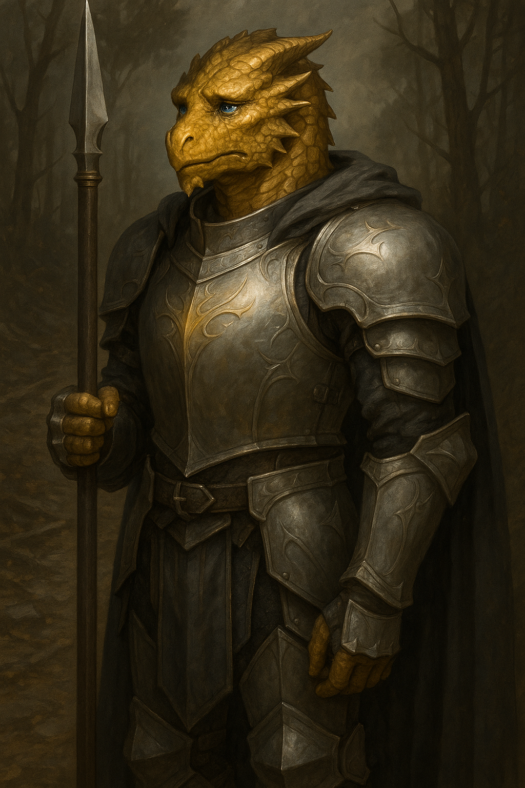

# Belvarax "Gobsmack" Allimander



> *"I live not to be honored, but to avoid staining my soul. Let them call me coward. I’ve made peace with being misunderstood."*

---

## Character Overview

|                   |                              |
| ----------------- | ---------------------------- |
| **Class & Level** | Paladin (Oath of Devotion) 4 |
| **Background**    | Merchant (Milestone)         |
| **Race**          | Dragonborn (Gold Ancestry)   |
| **Alignment**     | Neutral Good                 |
| **Role**          | Tank, Support, Moral Compass |

Belvarax, once a gallant merchant-turned-paladin, has become a conflicted yet steadfast guardian. Scorned for his compassion toward former enemies, he seeks redemption through restraint, not righteousness.

---

## Personality

* Haunted by doubt; hesitates at key moments due to past disillusionment
* Upholds a morally complex code—acts only when he's certain harm won’t follow
* Often ridiculed for "goblin love"; secretly sustained by a deep bond to a goblin matriarch
* Yearns to do good but believes true righteousness is rarely clear-cut

---

## PDF Character Sheet

[Download full character sheet](assets/belvarax_gobsmack_allimander.pdf)

---

## Gameplay Notes

??? info "Playing Belvarax effectively"

	- Belvarax believes reflection is the beginning of all decisive action. Lean into a gentle and patient personality.
	- Make a thing of not taking any mockery personally. Belvarax knows his philosophy is impopular. That doesn't make it less true.
	- Avoid taking initiative, lean into being the party's careful, slightly scarred protector who walks after and picks them up. 
	- His hesitations are roleplay tools—have him interrupt fights with protective acts or questions, but do not allow him to paralyse your party.

??? danger "DM Guidance"

	- Force immediate moral action: child in danger, innocents accused, villains offering twisted logic.
	- Give him personal moral crises—e.g., goblin rebels mistaken for raiders.
	- Make sure that Belvarax gets a time to shine. He will not seek it himself. 
	- Paladin powers remain despite his doubt—an implicit divine validation of his evolving creed.

---

Belvarax in battle fights like a wall with a mind.
With the pike in hand, he’s not looking for glory — he’s holding the line, creating space, and making sure the people behind him get to finish what they’re doing without a blade in their back. His reach means he’s not in the thick of the melee; instead, he’s bracing against charges, jabbing to keep enemies at bay, and knocking them off balance or back into kill-zones. It’s the weapon of a disciplined soldier, not a showman. The heroism is in the work itself — the unromantic, low-spotlight job of not letting the enemy past. If someone gets through, it’s because they earned it.

When he switches to sword-and-board, he becomes the archetype — the paladin your grandmother imagined when she heard the word: shield high, blade steady, every move drilled until it’s part of his bones. AC 21 and Sap mastery mean enemies find every strike turned aside or sapped of force. It’s not exciting; it’s deliberate, economical, and above all, safe. This is the stance he takes when there’s no room to push or pull — when the only goal is to stand, block, and make sure everyone walks away alive.

The key is knowing when to be which Belvarax: the rangy, crowd-controlling pike wielder buying space, or the immovable, by-the-book defender whose calm efficiency holds the day. Neither wins battles by looking good — they win because everyone else gets to see tomorrow.

## Stat Snapshot

```text
STR 14 (+2)   DEX 10 (+0)   CON 14 (+2)
INT 14 (+2)   WIS 8  (-1)   CHA 18 (+4)
HP 36   AC 19 (Mithral Plate + Shield)   Speed 30 ft
Proficiency Bonus +2
Spell Save DC 14   Spell Attack +6
```
