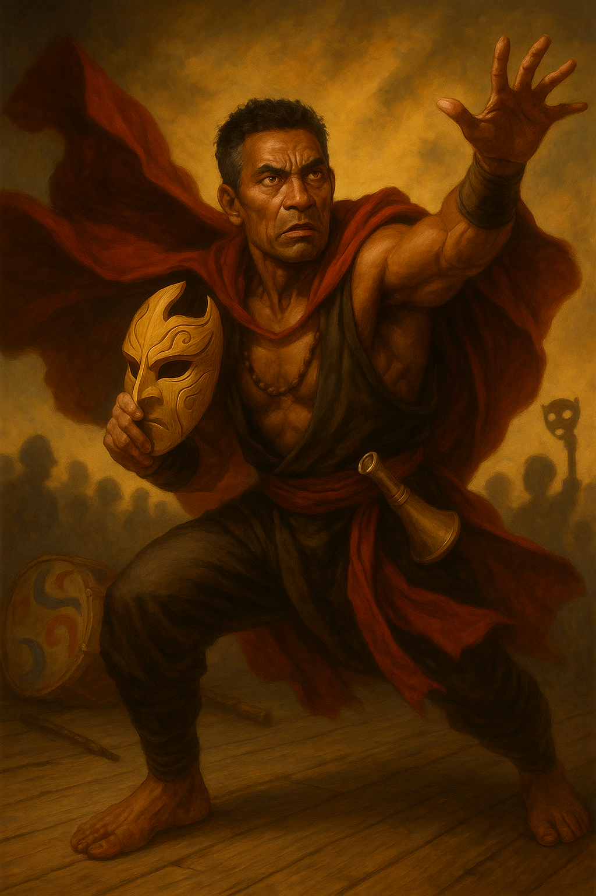

# Calypso "So-So" Sonder

{ width="300" }

> *"Witness the Apocalypso! A thousand suns blaze, and you stand in their shadow!"*

** Aging kabuki luchador so devoted to performing nobility he'd rather die than going 'vulgar' for the crowd. Can't bring himself to tell the truth about why he was fired from the circus, chasing one last hurrah.**

---

## Character Overview
- **Species**: Human
- **Class**: Monk 5 (Open Hand)  
- **Background**: Acrobatic Artist (Homebrew)  
- **Age**: 49
- **Alignment**: Lawful Good

??? info "Quick Intro"
    
    **At the Table**
    
    * Theatrical combatant who narrates special attacks like a shounen anime protagonist ("LARIAT!", "SO-SO! SUPLEX!!")
    * Dons kabuki mask as silent signal that conversation is over; unironically uses Cloak of Billowing in every fight
    * Desperately chases one last hurrah, one last glorious roar from the crowd
    * The party's inspiring exemplar of discipline and righteousness, but occasionally hogs extra protein
    
    **Backstory (Short Form)**
    
    So-So Sonder peaked at the Festival of Masks twenty-five years ago when the crowd chanted his name—"So-So! So-So!"—in a duel that crowned him a legend. Since then, every performance has been haunted by that echo. He claims health issues forced him to stop performing with his carnival troupe, but the bitter truth is he was laid off after profits declined. The crowd stopped responding to his traditional style, and that truth hurts too much to admit.
    
    **Playing So-So**
    
    * **Combat:** Treats battlefield as dramatized struggle between good and evil; every flurry, shove, or topple is choreography perfected since childhood. Shouts attack names, poses dramatically, mobilises allies as fellow performers.
    * **Roleplay:** Oscillates between bombastic theatrical flourishes and weary melancholy. Between battles, he's the aging showman with sore knees and wistful stories. Only cries when it's tears of joy or sublime beauty, faces real despair or tragedy like a stoic, not moving a muscle.
    * **Party Synergy:** Generous with spotlight—points to allies mid-fight to frame their strikes as dramatic crescendos. His whole artform is teamwork.

---

??? info "Deep Dive"
    
    ## The Night That Defined Him
    
    Twenty-five years ago, at the annual Festival of Masks, young Calypso Sonder's troupe was challenged by a rival company. They knew the troupe was lacking their main star due to injury, and were bold bordering on vulgar in their defamation, much like a rival gang of martial artists visiting the dojo of another style. But Calypso's father quieted the roaring crowds, and pointed to his son. That was the moment. Calypso had spent so many years striving to make his stern father proud, and now, wordlessly, a heavy duty was placed on his shoulders. He fought with such fire that the crowd roared his name in a chant that echoed across not just the arena, but the city: "So-So! So-So!" From that night on, the name was no longer his alone. It belonged to the people, and for the next decade of his life he would give them everything.
	
    Yet sometimes, in the quiet after the crowd, he wondered if that night was both his greatest triumph and his cage. He peaked so young, and every performance since has been haunted by the echo of the chant that first crowned him.
    
	## The Opera of the Open Hand
    
    This highly aesthetic, dramatized fighting show incorporates semi-improvised bouts between performers to the skilled drone, song and drums of artists trained to heighten the narrative tension of the battle: Timing the crash of a gong to a particularly vicious strike, or improvising dramatic wailing when the combattants circle each other.
	
    The performers begin their brutal training regimen at an early age. Combat is theatre, an art form woven from Kabuki's thunderous poses, the ritual challenge of the Maori Haka, the dazzling acrobatics of Chinese opera (think Jackie Chan), and the bombast of lucha libre. Fights are half-scripted but still dangerous morality plays, where masks signal archetypes, cloaks billow like stage curtains, and victory is as much about presence as it is about power. Heroes and villains embody timeless virtues and vices, or play out their own troupe's renditions of folk tales. To fight is to perform, and to perform is to live a life larger than the ordinary beneath the eyes of the crowd. 
	
    Some used to do it for the glory and fame. They quit long ago, as the art declined. But others did it for deeper purposes. Calypso was trained by his father that the Opera of the Open Hand was a destillation of life itself, and being a performer was to embody the very best, noblest and aspirational qualities of humanity. Quitting would be akin to death.
    
    ## The Lie So-So Tells Himself
    
    Now, So-So is an aging showman with few wishes left in the world, except for one: to just once more relive the wild cheer of the crowd. One last hurrah. He often claims that unfortunately, due to health issues, he had to stop performing with the traveling carnival troupe he was a part of. But the bitter truth is, he was laid off from the carnival after a few too many years of weak profits. The crowd just wasn't responding to his old traditional style anymore. But that hurt his pride so much, sometimes he can't help himself but lie about it, despite his aspirations to be the best he can be.
    
    ## Beyond the Stage
    
    So-So mustn't become a one-note character of noble suffering. Give the man hobbies! He comes with proficiency in Painter's supplies. Use them! Maybe he tags the places where he has been, like a street artist? Maybe he keeps searching for that one motif that brings him peace? Is he struggling with drawing hands or dogs, occasionally losing his calm and littering the floor with crumpled papers like an angry child? Or is he actually a real, skilled artist, capturing the drama and the strain of combat in breathtaking images of majestic dragons, wrestlers or menacing demons in dynamic, thick black ink lines?
	
    So-So can play the horn. Consider having him go full Boromir, sounding the horn to intimidate opponents or inspire his friends in some small way (with a performance check if DM allows). Be mindful to not step on the toes of any bards in the party. A good performer shares the spotlight!
    
    ## Performance as Faith
    
    So-So has toured and performed his whole life. It is the only thing he ever knew, and also the only thing he ever wanted to do. Some might say his devotion to a play of masks and scripts must have come at some personal cost, but he is a performer to the bone. He believes with all his heart that the most powerful force in the world is faith and aspiration. Posing and melodrama are highly ritualized components of his art, but the *higher purpose* is to instill a psychological state in others, to weave a heroic narrative of *why* they are fighting, and why they must continue and win.
		
    So-So lives to inspire, to be a shining exemplar of discipline and righteousness. Of course he performs villainous roles if the play demands it, but at heart he will always be the one who shows others that they can be a better version of themselves.
	
    As an actor, he also embraces comedy, which of course also is a staple of every good show. He will perform slapstick numbers to cheer up the kids outside the tavern, complete with wild somersaults and silly pratfalls. If even one of them goes to bed smiling that night, So-So feels he did not let the day go to waste.
	
    ## Character Traits
    
    **Personality traits**
    Only ever cries when it's tears of joy or sublime beauty. Despair he faces like a stoic, morose and silent.
	
    **Ideals**
    In all life there is fire. Opera is the kindling where we all gather.
	
    **Bonds**
	"Somewhere, a child I once made laugh is now grown. I hope they still smile when they think of me."
	"Sylvina Castorian believes she is saving what I love. I fear she may be right."
	
    **Flaws**
    Takes losses very hard. Sometimes hogs extra protein, but always confesses.
    
	---
	
    ## Sample Quotes
    
    "Cur! Wail and tremble! For the sands of time for you, are running low!"
    
    "That kind farmer gave me an extra carrot for our performance. It is only partially blackened. Do you want it?"
    
    "Worry not, sweet friend. It only hurts when I'm not smiling. I'll be fine."
      
    "The mask is not disguise, but the truth! Revealed in colors bolder than flesh can bear!"
    
    "You laugh at my antics. I weep for the shallowness of your understanding."
    
    "I used to hear a thousand voices cheering. Now I hear my knees. They are less kind."
    
    "Once, I could leap a wall in two strides. Now I look for the gate. Gates are fine. Gates are good."
	
	---
	
	## Player Guidance
	
	**Lean into drama**: So-So has a kabuki style mask he dons as a silent signal that the conversation is over. He also does unironically use his Cloak of Billowing in every single fight. These aren't just props, they're *essential* to the melodrama. Occasionally, narrate So-So's attacks mid-combat like a shounen anime protagonist. He shouts "LARIAT!" and "SO-SO... SUPLEX!!" or makes dramatic flourishes when he feels the dramatic tension is right: finishers, reversals, or when the tension peaks.
	
    **Balance camp with gravitas:** Yes, he billows his cloak and suplexes ogres, but he also feels the weight of time and tradition. Between battles, play the aging showman: sore knees, wistful stories, remembering the roar of crowds. Let weary melancholy tint the spectacle. Aspire to be the noblest soul at the table. So-So's theatrics are devotion to the best a man can be. He knows he's the last of a fading tradition, and he carries it with pride and sorrow. Play that undertone so he'll feel mythic, not cartoonish. Or, why not both!
	
    **Treat combat as theatre:** Mechanically you're a Monk, but narratively every flurry, shove, or topple is choreography you've been grinding since childhood. Think of the battlefield as a stage. So-So is a good sportsman and doesn't hog the spotlight. His whole artform is about teamwork. Point to an ally mid-fight and frame their strike as the dramatic crescendo of your "scene." Let the Opera of the Open Hand lift the whole party.
	
    **On a deeper level:** Ask how you want to play So-So. Is this a man who would rather die in character than live as himself? Does So-So even *have* a self outside the Opera of the Open Hand, or is he just a 49-year-old muscle memory in a human suit? Is his final goal to rekindle the noble flame of the dying art, or is it coming to terms with the fact that the world changes, and accepting he doesn't need to compete anymore? Is he chasing spotlight like an addict, or just trying to live life the only way he knows?
	
---

??? info "Key Relationships"
	
	**Master Barendt**: Ancient Tortle master musician who used to accompany the plays with pitch perfect sense for drama. He still believes the Opera is sacred exactly as it was. He praises So-So endlessly, retells the Festival of Masks every time they meet, and quietly discourages innovation. He himself never performed, only accompanied, and the performers' glory was the only light he ever stood near. But to the performers, themselves, nothing beats the sense of connection you get between opponent and audience, and the musician is the bridge where the magic happens. So-So constantly bows his head in deference to the old Master, and believes they're on the same page about the Opera and what it needs to be, but he always leaves their tea sessions somewhat drained.
	
	**Sylvina Castorian**: Fifteen years younger than So-So, she used to look up to him as a hero. She was once a lowly clown-acrobat in another Opera troupe, merely entertainment to keep the crowd warm between the *real* scenes. Once it fell out of fashion for good, she stripped the Opera down, dropped the ritual, leaned into speed, spectacle, and vulgar crowd appeal—and now her troupe headlines arenas. She "fights" blindfolded while the crowd throws objects into the ring. Other times, she lets the audience vote on which limb she'll favor. Some late-night fight concepts at her venue are even beneath contempt in So-So's book. But her crowds are massive, and there are sure to be people in those venues who remember So-So. She respects him in private, but treats him as obsolete in public. In an invitation that is equal parts respect and challenge, she has invited him to perform *her* way instead. So far, he has respectfully declined, even if the money is good, and the siren song of the crowd beckons...
	
	**Staffo**: A young street urchin who has seen So-So perform and is now following the party around, mimicking his stances badly, begging to learn. The child is annoyingly talented, which makes it worse in So-So's mind. If he trained the boy, would he be responsible for creating another version of himself, trapped in the same beautiful cage? Staffo insists that he loves the art concept, not just "punching bad guys". But the few times So-So has indulged the kid, it's been clear that he (like most boys his age) is clearly most interested in the "punching bad guys" aspects. Whenever So-So is in town, somehow Staffo finds out. He always brings him small gifts, introduces him to his friends and his pet rat, and then stays outside their lodgings, hoping to get a lesson from So-So in the morning.
	
---

??? danger "Notes for the DM"
	
	## Dramatic Questions
	
	- *If So-So was put into a wildly different type of arena venue, such as a forced "Mortal Kombat" style bloodsport event, how would he deal with it?*
	- *Can So-So fall in love? Or is he married to the Opera?*
	- *Is there any distinguishable difference between Calypso the man, and So-So the myth?*
	- *If the perfect final performance required moral compromise, would he call it ‘part of the show’?*
	- *Can So-So justify taking a student, given that his style is almost dead?*
	
	## Key Relationship Dynamics
	
	**Sylvina Castorian**: If you want one extra half-turn of the screw, let Sylvina genuinely believe she is saving the art. She shouldn’t be "wrong" in an obvious way. She should be plausibly right in a way So-So hates. If you want to add her to the plot, make it so the party needs something she's got. It could be unsavory contacts, a safehouse or an underground railroad situation in connection to the arena. She'll agree, and not even ask money for it, on one condition: That So-So performs for one night.
	
	**Staffo**: If So-So actually starts teaching the kid, you have a delicious opportunity to describe the style from the eyes of someone without history: "Why do we have to grunt when punching? It sounds stupid.", "So the play is about some guy who's just evil? Why is he like that? Did someone hurt him as a child?"
	
	## Plot Hooks
	
	**The Festival of Masks Revived**
	A mysterious group is reviving the Festival of Masks, but it is weirdly wrong. Instead of noble battles between good and evil, it is spectacle and vulgarity. As So-So tries to get to the bottom of it all, he finds himself face to face with *Clemens Frego*, the very man he defeated on the Festival of Masks, 25 years ago! 
	Complications:
		• The revived festival is wildly popular. Children love it. Merch sells. People are happy. That’s the problem.
		• Clemens Frego isn’t a villain. He’s evolved. He argues the Opera must become spectacle to survive. He's found a way to keep the art alive by allowing it to change. When So-So accuses him of corruption, Clemens can ask the unbearable question: "Which of us actually saved it, and which of us just wanted to be remembered? You want to educate the audience about what the 'right' performance is, and only then will you accept it to cheer for you. You're making *them* part of *your* fantasy, not the other way around."
		• The crowd chants So-So’s name again… but only after he does something he despises.
	
	**The Challenger**: Cedric Goldenhorn, a young, arrogant nobleman from a different tradition (a brutal and efficient Monk fighting style, stripped of all poetry and virtue) is publicly mocking the Opera as "fake fighting for sissies and musicians too weak for real combat." They want to fight So-So for real. Not performance. Blood. Does So-So prove the art's martial validity and betray its theatrical soul, or refuse and confirm every accusation? 
	
	The next layer to the plot is the story of countless martial arts dramas: What happens if So-So wins elegantly? Cedric Goldenhorn gets publicly humiliated by a forty-nine-year-old performing artist—and then his noble family decides this insult cannot stand. Suddenly So-So has made enemies with resources.
	
	---
	
	## Mechanics and Homebrew Suggestions
	
	So-So is not a classic Monk. He plays more like a Monk/Bard or Monk/Paladin. If you're comfortable with light homebrew at your table, you can let your player weaponize So-So's Charisma (normally a dump stat for Monks, and an investment that hurts his staying power mechanically, compared with more optimized monk builds). This balances his stat spread and reinforces his role as a performer and exemplar, and allows him to feel competitive with more traditional, optimized builds without overshadowing them.
	
	**Opera Flourishes (Homebrew Feature)**: Beginning at level 5, Calypso Sonder can channel the spirit of the Opera of the Open Hand to enhance his performance in combat. He has a number of uses equal to his proficiency bonus, which refresh on a long rest.
	
    *Once per turn he can choose to use a flourish. He chooses one of the following effects:*
    
    **Frightening Performance** • Once per short rest, when you hit a creature with an unarmed strike, you can force it to make a Wisdom saving throw (DC=8 + proficiency bonus + Charisma modifier, so 13 at lv 5). On a failed save, it is Frightened of you until the end of your next turn. On a success, it cannot be affected by this ability again until you finish a short or long rest.
    
    **Noble Duel** • (PB times/LR) As a bonus action, you can call upon the tradition of your art and call out a single creature within 30 feet to engage in single combat. Force it to make a Wisdom saving throw (DC=8 + proficiency bonus + Charisma modifier, so 13 at lv 5). On a failed save, the creature has disadvantage on attacks against creatures other than So-So for one minute. At the end of the creature's next turn, it can attempt to make a new saving throw. On a success, it cannot be affected by this ability again until you finish a short or long rest.
    
    **Encore of the Crowd** • When So-So reduces a hostile creature to 0 hit points, as a free action, he can choose one creature he can see within 60 feet (including himself). That creature gains Heroic Inspiration and temporary HP up to So-So's proficiency bonus + Charisma modifier, as the memory of So-So's triumph sparks belief and courage.
	
	**Finding the Flow**: You connect with the faith of the crowd. Beginning at 14th level, you add your Charisma modifier to the damage rolls of your unarmed strikes and monk weapons.
	
	**Other options:** Allow CHA to add to the role that WIS does in regular Monk builds, or change So-So's expertise from Acrobatics to Performance, and allow him to use this skill for a wider variety of ability checks, such as intimidation, acrobatics, etc.
	
---

??? info "Level 5 Build"

	| STR | DEX | CON | INT | WIS | CHA |
	|:---:|:---:|:---:|:---:|:---:|:---:|
	| 10 (+0) | 18 (+4) | 12 (+1) | 8 (-1) | 14 (+2) | 14 (+2) |
	
	## Combat Stats
	
	| AC | HP | Hit Dice | Speed | Initiative | Prof. Bonus |
	|:---:|:---:|:---:|:---:|:---:|:---:|
	| 16 | 43 | 5d8 | 40 ft. | +4 | +3 |
	
	**Saving Throws: Strength: +3, Dexterity: +7**
	**Resistances:** None
	
	## Proficiencies

	**Skills**: Acrobatics +7, Athletics +3, Insight +5, Performance +5, Stealth +7
	
	**Armor**: None | **Weapons**: Crossbow, Hand, Scimitar, Shortsword, Simple Weapons
	
	**Tools**: Horn, Painter's Supplies | **Languages**: Common, [+2 common languages]
	
	## Feats
	- **Lucky**: You gain PB (3) Luckpoints per Long Rest. You can use them to give yourself advantage or another disadvantage on one roll.
	- **Tough**: +2 HP/level
	- **Grappler**: Can hit and grapple in one attack, no movement penalty for carrying grappled creature, advantage on attacks vs grappled.
		
	## Equipment
	Painter's Supplies, Horn.
	
	**Suggested Magic Items**
	
	- Cloak of Billowing (Common, as a Free Action, billows dramatically; practically *required* to play So-So)
	- Ring of Jumping (Uncommon, casts Jump spell; enhanced acrobatics for *super* dramatic entrances)
	- Horn of Blasting (Rare, 30-foot cone DC 15 CON save or 5d8 damage+deafened; Sometimes you gotta Make some noise)
	- Bracers of Defense (Rare, Attunement, +2 AC if not wearing armor; Because So-So is a little squishy and deserves protection)

	📄 [Download Level 5 Character Sheet (PDF)](assets/calypso-so-so-sonder-lv5.pdf)

---

??? danger "**Session Zero Considerations**"
    
    **Content Notes:** No special considerations—suitable for most tables.
	
---