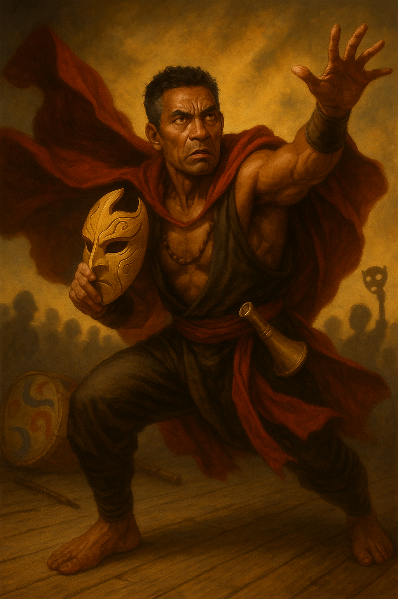

# Calypso "So-So" Sonder

{ width="300" }

> *"Witness the Apocalypso! A thousand suns blaze, and you stand in their shadow!"*

**The last noble D&D style kabuki luchador, aging artist of a dying tradition.**

*Keywords: Performer, Melodrama, Noble Suffering, Theatrical Combat, Fading Glory*

---

## Basic Information
**Species:** Human
**Class:** Monk 5 (Open Hand)  
**Background:**  
**Age:** 49
**Alignment:** Lawful Good

## Quick Intro

??? info "Quick Intro"
    
    **At the Table**
    
    * Theatrical combatant who narrates special attacks like a shounen anime protagonist ("LARIAT!", "SO-SO! SUPLEX!!")
    * Dons kabuki mask as silent signal that conversation is over; unironically uses Cloak of Billowing in every fight
    * Desperately chases one last hurrah, one last roar from the crowd
    * Party's inspiring exemplar of discipline and righteousness, though occasionally hogs extra protein
    
    **Backstory (Short Form)**
    
    Calypso Sonder peaked at the Festival of Masks twenty-five years ago when the crowd chanted his name—"So-So! So-So!"—in a duel that crowned him a legend. Since then, every performance has been haunted by that echo. He claims health issues forced him to stop performing with his carnival troupe, but the bitter truth is he was laid off after profits declined. The crowd stopped responding to his traditional style, and that truth hurts too much to admit.
    
    **Playing So-So**
    
    * **Combat:** Treats battlefield as stage; every flurry, shove, or topple is choreography perfected since childhood. Shouts attack names, poses dramatically, uses allies as "fellow performers" in the scene.
    * **Roleplay:** Oscillates between bombastic theatrical flourishes and weary melancholy. Between battles, play the aging showman with sore knees and wistful stories. Only cries tears of joy or sublime beauty; faces despair or tragedy like a stoic, not moving a muscle.
    * **Party Synergy:** Generous with spotlight—points to allies mid-fight to frame their strikes as dramatic crescendos. His whole artform is teamwork; he lifts the whole party.

---

## Deep Dive

??? info "Deep Dive"
    
    ## The Opera of the Open Hand
    
    This highly aesthetic, dramatized fighting show incorporates semi-improvised bouts between performers embodying classic archetypes of good and evil, to the skilled drone, song and drums of artists trained to see when punches will land and to improvise scores that heighten the narrative tension of the battle.
	
    Combat is theatre, an art form woven from Kabuki's thunderous poses, the ritual challenge of the Maori haka, the dazzling acrobatics of Chinese opera (think Jackie Chan), and the bombast of lucha libre. Fights are half-scripted morality plays, where heroes and villains embody timeless virtues and vices, every strike punctuated by drums, horns, and choral chants. Masks signal archetypes, cloaks billow like stage curtains, and victory is as much about presence as it is about power. To fight is to perform, and to perform is to live larger than life beneath the eyes of the crowd. The performers begin their brutal training regimen at an early age.
	
    Some used to do it for the glory and fame. They quit long ago, as the art declined. But others did it for deeper purposes. Calypso was trained by his father that the Opera of the Open Hand was like a destillation of life itself, and being a performer was to embody the very best, noblest and aspirational qualities of humanity. 
	
	He will never quit.
    
    ## The Night That Defined Him
    
    At the Festival of Masks twenty-five years ago, Calypso Sonder stepped forward when his troupe was challenged by a rival company. In a duel meant for another, he fought with such fire that the crowd roared his name in a chant that echoed across the city: "So-So! So-So!" From that night on, the name was no longer his alone. It belonged to the people.
	
    Yet sometimes, in the quiet after the crowd, he wonders if that night was both his greatest triumph and his cage. He peaked so young, and every performance since has been haunted by the echo of the chant that first crowned him.
    
    ## The Lie He Tells Himself
    
    "So-So" is an aging showman who wishes to just once relive the wild cheer of the crowd. One last hurrah. He fights like a Luchador and works himself up during combat, finding his old flow.
	
    He often claims that unfortunately, due to health issues, he had to stop performing with the traveling carnival troupe he was a part of. But the bitter truth is, he was laid off from the carnival after a few too many years of weak profits. The crowd just wasn't responding to his old traditional style anymore. But that hurt his pride so much, sometimes he can't help himself but lie about it, despite his aspirations to be the best he can be.
    
    ## Beyond the Stage
    
    So-So mustn't become a one-note character of noble suffering. Give the man hobbies! He comes with proficiency in Painter's supplies. Use them! Maybe he tags the places where he has been, like a street artist? Maybe he keeps searching for that one motif that brings him peace? Is he struggling with drawing hands or dogs, occasionally losing his calm and littering the floor with crumpled papers like an angry child? Or is he actually a real, skilled artist, capturing the drama and the strain of combat in breathtaking images of majestic dragons, wrestlers or menacing demons in dynamic, thick black ink lines?
	
    So-So can play the horn. Consider having him go full Boromir, sounding the horn to intimidate opponents or inspire his friends in some small way (with a performance check if DM allows). Be mindful to not step on the toes of any bards in the party. A good performer shares the spotlight!
    
    ## Performance as Faith
    
    So-So has toured and performed his whole life. It is the only thing he ever knew and ever wanted to do. So-So occasionally narrates his special attacks (like "the Apo-calypso Strike") mid-combat like a shounen anime protagonist, shouting "LARIAT!" and "SO-SO! SUPLEX!!" while executing his moves. He has a kabuki style mask that he dons as a silent signal that the conversation is over. He also does unironically use his Cloak of Billowing, in every single fight. Because he is a performer at heart, and he was taught that the most powerful force in the world is faith and aspiration. Posing and melodrama are highly ritualized components of his art, but the purpose is to instill a psychological state in others, to weave a heroic narrative of *why* they are fighting, and why they must continue and win.
	
    So-So lives to inspire, to be a shining exemplar of discipline and righteousness. Of course he performs villainous roles if the play demands it, but at heart he will always be the one who shows others that they can be a better version of themselves.
	
    As an actor, he also embraces comedy, as a staple of every show. He will perform slapstick numbers to cheer up the kids outside the tavern, complete with wild somersaults and silly pratfalls. If even one of them goes to bed smiling that night, So-So feels he did not let the day go to waste.
	
    ## Character Traits
    
    **Personality traits**
    Only ever cries when it's tears of joy or sublime beauty. Despair he faces like a stoic, morose and silent.
	
    **Ideals**
    In all life there is fire. Opera is the kindling where we all gather.
	
    **Bonds**
    [To be determined by player/DM]
	
    **Flaws**
    Takes losses very hard. Sometimes hogs extra protein, but always confesses.
    
    ## Sample Quotes
    
    "Cur! Wail and tremble! For the sands of time for you, are running low!"
    
    "That kind farmer gave me an extra carrot for our performance. It is only partially blackened. Do you want it?"
    
    "Worry not, sweet friend. It only hurts when I'm not smiling. I'll be fine."
    
    "Witness the Apocalypso! A thousand suns blaze, and you stand in their shadow!"
    
    "The mask is not disguise, but the truth! Revealed in colors bolder than flesh can bear!"
    
    "You laugh at my antics. I weep for the shallowness of your understanding."
    
    "I used to hear a thousand voices cheering. Now I hear my knees. They are less kind."
    
    "Once, I could leap a wall in two strides. Now I look for the gate. Gates are fine. Gates are good."
	
---

## Notes for the DM

??? danger "Notes for the DM"
	
	## Player Guidance
	
	**Pick your moments:** Not every punch needs a catch-phrase. Save the big poses, chants, and cloak-flourishes for finishers, reversals, or when the tension peaks. That way, when you shout "APO-CALYPSO STRIKE!" the audience is hopefully still invested.
	
    **Balance camp with gravitas:** Yes, he billows his cloak and suplexes ogres, but he also feels the weight of time and tradition. Between battles, play the aging showman: sore knees, wistful stories, remembering the roar of crowds. Let weary melancholy tint the spectacle. Aspire to be the noblest soul at the table.
	
    **Treat combat as theatre:** Mechanically you're a Monk, but narratively every flurry, shove, or topple is choreography you've been grinding since childhood. Think of the battlefield as a stage, or a movie set. Allies: fellow performers, enemies: villains or foils. There's a teaching opportunity in every encounter. Be generous with the spotlight! So-So doesn't hog the stage. His whole artform is about teamwork. Point to an ally mid-fight and frame their strike as the dramatic crescendo of your "scene." Let the Opera of the Open Hand lift the whole party.
	
    **Play with pathos:** He's Lawful Good. His theatrics are devotion to the best a man can be. He knows he's the last of a fading tradition, and he carries it with pride and sorrow. Play that undertone so he'll feel mythic, not cartoonish. Or, why not both!
	
    **On a deeper level:** Ask how you want to play So-So. Is this a man who would rather die in character than live as himself? Does So-So have a self outside the Opera of the Open Hand, or is he just a 49-year-old muscle memory in a human suit? Is his final goal to rekindle the noble flame of the dying art, or is it coming to terms with the fact that the world changes, and accepting he doesn't need to compete anymore? Is he chasing spotlight like an addict, or just trying to live life the only way he knows?
	
	## Mechanics and Homebrew Suggestions
	
	So-So is not a classic Monk. He plays more like a Monk/Bard or Monk/Paladin. If you're comfortable with light homebrew at your table, you can let your player weaponize So-So's Charisma (normally a dump stat for Monks, and an investment that hurts his staying power mechanically, compared to more optimized monks). This balances his stat spread and reinforces his role as a performer and exemplar, and allows him to feel competitive with more traditional, optimized builds without overshadowing them.
	
	**Opera Flourishes (Homebrew Feature):** Beginning at level 4, Calypso Sonder can channel the spirit of the Opera of the Open Hand to enhance his performance in combat. He has a number of uses equal to his proficiency bonus, which refresh on a long rest.
	
    Once per turn he can choose to use a flourish. He chooses one of the following effects:
    
    **Frightening Performance** • Once per short rest, when you hit a creature with an unarmed strike, you can force it to make a Wisdom saving throw (DC=8 + proficiency bonus + Charisma modifier, so 12 at lv 4). On a failed save, it is Frightened of you until the end of your next turn. On a success, it cannot be affected by this ability again until you finish a short or long rest.
    
    **Noble Duel** • As a bonus action, you can call upon the tradition of your art and call out a single creature within 30 feet to engage in single combat. Force it to make a Wisdom saving throw (DC=8 + proficiency bonus + Charisma modifier, so 12 at lv 4). On a failed save, the creature has disadvantage on all attacks against other creatures than So-So for one minute. At the end of the creature's next turn, it can attempt to make a new saving throw. On a success, it cannot be affected by this ability again until you finish a short or long rest.
    
    **Encore of the Crowd** • When So-So reduces a hostile creature to 0 hit points, as a free action, he can choose one creature he can see within 60 feet (including himself). That creature gains Heroic Inspiration and temporary HP up to So-So's proficiency bonus + Charisma modifier, as the memory of So-So's triumph sparks belief and courage.
	
	**Finding the Flow (Homebrew Feature):** You connect with the faith of the crowd. Beginning at 14th level, you add your Charisma modifier to the damage rolls of your unarmed strikes and monk weapons.
	
	**Other options:** Allow CHA to fill the role that WIS does in regular Monk builds, or change So-So's expertise from Acrobatics to Performance, and allow him to use this skill for a wider variety of ability checks, such as intimidation, acrobatics, etc, at the DM's discretion.
		
---

## Mechanical build and PDF download

??? info "Level 5 Build"

	| STR | DEX | CON | INT | WIS | CHA |
	|:---:|:---:|:---:|:---:|:---:|:---:|
	| 10 (+0) | 18 (+4) | 12 (+1) | 8 (-1) | 14 (+2) | 14 (+2) |
	
	## Combat Stats
	
	| AC | HP | Hit Dice | Speed | Initiative | Prof. Bonus |
	|:---:|:---:|:---:|:---:|:---:|:---:|
	| 16 | 43 | 5d8 | 40 ft. | +4 | +3 |
	
	**Saving Throws: Strength: +3, Dexterity: +7**
	**Resistances:** None
	
	## Proficiencies

	**Skills**: Acrobatics +7, Athletics +3, Insight +5, Performance +5, Stealth +7
	
	**Armor**: None | **Weapons**: Crossbow, Hand, Scimitar, Shortsword, Simple Weapons
	
	**Tools**: Horn, Painter's Supplies | **Languages**: Common, [+2 common languages]
	
	## Feats
	- **Lucky**: You gain PB (3) Luckpoints per Long Rest. You can use them to give yourself advantage or another disadvantage on one roll.
	- **Tough**: +2 HP/level
	- **Grappler**: Can hit and grapple in one attack, no movement penalty for carrying grappled creature, advantage on attacks vs grappled.
		
	## Equipment
	Painter's Supplies, Horn.

	📄 [Download Level 5 Character Sheet (PDF)](assets/calypso-so-so-sonder-lv5.pdf)

---

## **Session Zero**

??? danger "**Session Zero Considerations**"
    
    **Content Notes:** No special considerations—suitable for most tables.

---