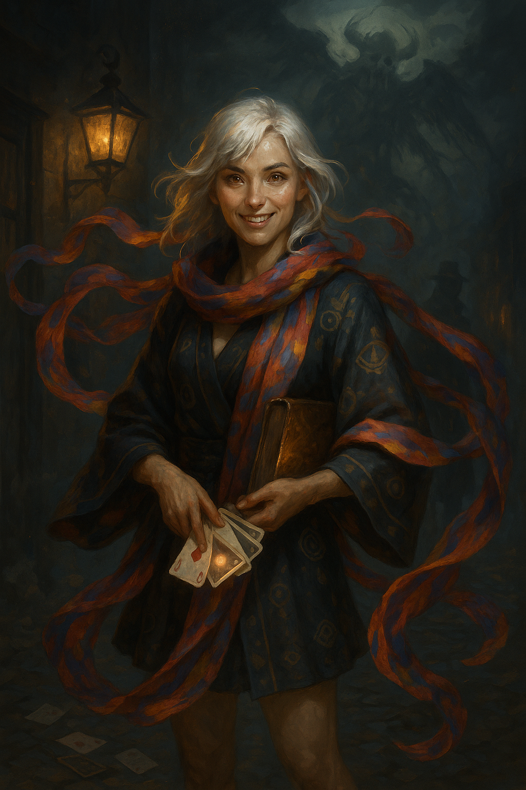

# Cephala Fortina

{ width="300" }

> *“An entire people got lost? Guess I'll have to charge double rate for this one. How much is a people even worth, strictly speaking?”*

---

## Character Overview

|                   |                                          |
| ----------------- | ---------------------------------------- |
| **Class & Level** | Warlock (Genie) 4                     |
| **Background**    | Charlatan                     |
| **Race**          | Aasimar                                  |
| **Alignment**     | Chaotic Neutral                          |
| **Role**          | Celestial con‑artist, blaster and party face |

Cephala was once a drifting card‑sharp who relied on her charm, sleight‑of‑hand, and changing aliases to stay a half skip ahead of the law. But one night when she was assailed by a mysterious inquisitor, her dormant celestial blood ignited, unleashing wings of light and a bond to the **Tattered Seraph**. She became something stranger: half radiant avatar, half street‑wise trickster, on a quest to find her own vanished people that only the Seraph remembers.

---

## Personality

* **Impulsive optimism** masking deep confusion about her destiny.
* Loves the thrill of a clever con, but feels a pull toward higher purpose.
* Balances radiant heritage with shady instincts, and doesn't feel the tension. It's all the same to her.
* Reads prophetic patterns in a marked deck of cards she always shuffles.
* The most likely party member to somehow end up as queen of Latveria

---

## PDF Character Sheet

📄 [Download full character sheet](assets/cephala-fortina.pdf)

---

## Gameplay Notes

??? info "Playing Cephala effectively"
	- **Pact of the Tome** is Cephala's notebook for storing clues about her people. 
	- **Celestial Revelation** grants flight, light aura, or fear burst once per long rest.
	- **Eldritch Invocations** add utility (*Find Familiar*, *Thorn Whip*, *Minor Illusion*, etc.).
	- Use *Suggestion* and *Invisibility* to pull social heists; fallback to *Armor of Agathys* for durability.

??? danger "DM Guidance"
	- The **Tattered Seraph** should feel dreamlike, cryptic, even unreliable. A deeper revelation may show that the people it is searching for is tragically much more close than either of them realize. The Tattered Seraph is immensely powerful, but utterly insane and confused. Meanwhile, Cephala may be too impulsive to follow leads consistently. Plan accordingly.
	- The inquisitor **Morben**, witness to her awakening, makes a potent recurring antagonist. But is he truly a villain or a Les Mis "Jauvert" type antagonist?
	- Lean into omens via her treasured deck: each draw foreshadows or complicates scenes. The world is your oyster. Go wild.

---

## Stat Snapshot

```text
STR 8 (-1)   DEX 14 (+2)   CON 14 (+2)
INT 12 (+1)   WIS 10 (+0)   CHA 18 (+4)
HP 31          AC 15   Speed 30 ft
Proficiency Bonus +2
Spell Save DC 14   Spell Attack +6
Damage Resistances: Radiant, Necrotic
```

**Invocations**: Lessons of the First Ones (extra feat), Pact of the Tome, Agonizing Blash •  **Luck Points**: 2  •  **Healing Hands**: 2d4 HP once/long rest

---

## Spellcasting Highlights (Pact Slots 2)

### Cantrips

Eldritch Blast • Minor Illusion • Prestidigitation • Light • Mage Hand • Message • 

### 1st‑Level

Armor of Agathys • Hex • *Identify* (feat) • *Find Familiar* (R) • *Comprehend Languages* (R)

### 2nd‑Level

Suggestion • Invisibility • Mirror Image • Misty Step (feat)

---

## Equipment & Magic Items

* **Glamoured Studded Leather**
* **Pearl of Power**
* Forgery kit, marked playing cards, disguise wardrobe

---

## Backstory (Short Form)

On the night Cephala tried to swindle the inquisitor **Morben**, divine fire erupted within her: spectral wings, radiant eyes, and a voice—fractured and choral—of the **Tattered Seraph**. Now certain she is the last ember of an erased bloodline, Cephala hunts for lost truths, guided by dream‑visions and fate‑laden cards, all while Morben’s agents close in.

---

## Hooks & Complications

* A **cryptic tarot spread** predicts doom for someone the party cares about.
* Morben’s **witch‑catchers** start interrogating people the party cares about.
* Cephala has the mind of a Rogue in the body of a Warlock. There will be marks looking to settle grievances.

## The Truth of the Tattered Seraph

Cephala eventually learns the truth: the Tattered Seraph *is* her people — the result of a magical catastrophe that fused their minds and bodies into one fractured celestial entity. The countless eyes are the scattered perspectives of every soul trapped inside, half-aware and yearning for identity. The Seraph knows *something* happened, but its memory is clouded and unstable; full awareness could shatter it.  

The Inquisition guards this secret, claiming it’s to prevent the disaster from ever happening again — but whether their motives are pure, political, or both is unclear.

---

### Possible Endgames

#### 1. **The Gentle Lie** (Benevolent)
Cephala chooses to protect the Seraph from the truth, keeping it ignorant to preserve its fragile unity.  
- The Seraph remains a living, if incomplete, remnant of her people.  
- Cephala bears the guilt and burden of knowing.  
- The Inquisition, seeing her cooperation, may offer a wary alliance — or keep her under close watch.  
- **Tone:** Quiet heroism, sacrifice without recognition.

#### 2. **The Restoration Gambit** (Bittersweet)
Cephala seeks a way to reintegrate the Seraph’s mind and restore her people.  
- Success means her people return — but Cephala’s identity is erased, becoming part of the whole.  
- Partial success might restore only fragments: some live again, others are lost forever.  
- Failure risks the Seraph collapsing into madness, scattering its essence across the planes.  
- **Tone:** Epic tragedy, self-sacrifice, the cost of hope.

#### 3. **The Fracture of Truth** (Tragic)
Cephala tells the Seraph everything, against all warnings.  
- The Seraph’s mind splinters, voices pulling in different directions.  
- The Inquisition moves to destroy or contain the unstable entity.  
- Cephala must choose: defend it against all odds, aid in putting it down, or flee with what fragments she can save.  
- **Tone:** Raw moral weight, no clean victories, lasting consequences.

---

### Ongoing Hooks
- **Echo Memories:** At times, a voice from within the Seraph speaks directly to Cephala — someone she may have known in life.  
- **Shifting Personas:** The Seraph’s demeanor changes as different personalities surface.  
- **Inquisition’s Stance:** Their agents range from ruthless zealots to conflicted idealists; any could become ally or enemy.  
- **Moral Pressure:** Every truth Cephala uncovers increases the risk to the Seraph’s stability.


---

*Last updated: {{ date }}*
