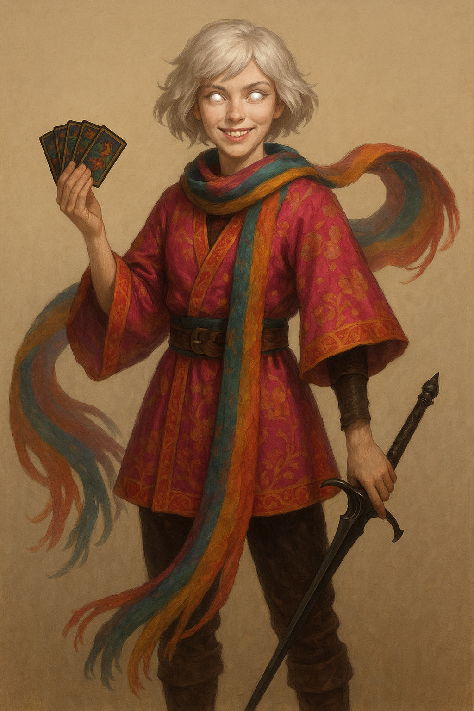

# Cephala Fortina



> *“An entire people got lost? Guess I'll have to charge double rate for this one. How much is a people even worth, strictly speaking?”*

---

## Character Overview

|                   |                                          |
| ----------------- | ---------------------------------------- |
| **Class & Level** | Warlock (Hexblade) 4                     |
| **Background**    | Charlatan (Milestone)                    |
| **Race**          | Aasimar                                  |
| **Alignment**     | Chaotic Neutral                          |
| **Role**          | Celestial con‑artist, pact‑blade duelist |

Cephala was once a drifting card‑sharp who relied on her charm, sleight‑of‑hand, and changing aliases to stay a half skip ahead of the law. But one night when she was assailed by a mysterious inquisitor, her dormant celestial blood ignited, unleashing wings of light and a bond to the **Tattered Seraph**. She became something stranger: half radiant avatar, half street‑wise trickster, on a quest to find her own vanished people that only the Seraph remembers.

---

## Personality

* **Impulsive optimism** masking deep confusion about her destiny.
* Loves the thrill of a clever con, but feels a pull toward higher purpose.
* Balances radiant heritage with shady instincts, and doesn't feel the tension. It's all the same to her.
* Reads prophetic patterns in a marked deck of cards she always shuffles.

---

## PDF Character Sheet

📄 [Download full character sheet](assets/Cephala-Fortina.pdf)

---

## Gameplay Notes

??? info "Playing Cephala effectively"
\- **Pact of the Blade** lets you use a CHA‑based weapon (Rapier +1) for stylish melee.
\- **Celestial Revelation** grants flight, light aura, or fear burst once per long rest.
\- **Eldritch Invocations** add utility (*Find Familiar*, *Thorn Whip*, *Minor Illusion*, etc.).
\- Use *Suggestion* and *Invisibility* to pull social heists; fallback to *Armor of Agathys* for durability.

??? danger "DM Guidance"
\- The **Tattered Seraph** should feel dreamlike, cryptic, even unreliable. A deeper revelation may show that the people it is searching for is tragically much more close than either of them realize. The Tattered Seraph is immensely powerful, but utterly insane and confused. Meanwhile, Cephala may be too impulsive to follow leads consistently. Plan accordingly.
\- The inquisitor **Morben**, witness to her awakening, makes a potent recurring antagonist. But is he truly a villain or a Les Mis "Jauvert" type antagonist?
\- Lean into omens via her treasured deck: each draw foreshadows or complicates scenes. The world is your oyster. Go wild.

---

## Stat Snapshot

```text
STR 11 (+0)   DEX 14 (+2)   CON 14 (+2)
INT 12 (+1)   WIS 10 (+0)   CHA 18 (+4)
HP 31          AC 18 (Breastplate + Shield)   Speed 30 ft
Proficiency Bonus +2
Spell Save DC 14   Spell Attack +6
Damage Resistances: Radiant, Necrotic
```

**Invocations**: Lessons of the First Ones (extra feat), Pact of the Blade, Pact of the Tome  •  **Luck Points**: 2  •  **Healing Hands**: 2d4 HP once/long rest

---

## Spellcasting Highlights (Pact Slots 2)

### Cantrips

Booming Blade • Minor Illusion • Prestidigitation • Light • Mage Hand • Message • Thorn Whip

### 1st‑Level

Armor of Agathys • Hex • *Identify* (feat) • *Find Familiar* (R) • *Comprehend Languages* (R)

### 2nd‑Level

Suggestion • Invisibility • Mirror Image • Misty Step (feat)

---

## Equipment & Magic Items

* **Rapier +1** (hexblade focus)
* **Sentinel Shield** (advantage on initiative & Perception)
* **Breastplate** + light cloak
* **Stone of Good Luck (Luckstone)**
* Forgery kit, marked playing cards, disguise wardrobe

---

## Backstory (Short Form)

On the night Cephala tried to swindle the inquisitor **Morben**, divine fire erupted within her: spectral wings, radiant eyes, and a voice—fractured and choral—of the **Tattered Seraph**. Now certain she is the last ember of an erased bloodline, Cephala hunts for lost truths, guided by dream‑visions and fate‑laden cards, all while Morben’s agents close in.

---

## Hooks & Complications

* A **cryptic tarot spread** predicts doom for someone the party cares about.
* Morben’s **witch‑catchers** start interrogating people the party cares about.
* Cephala has the mind of a Rogue in the body of a Warlock. There will be marks looking to settle grievances.

---

*Last updated: {{ date }}*
