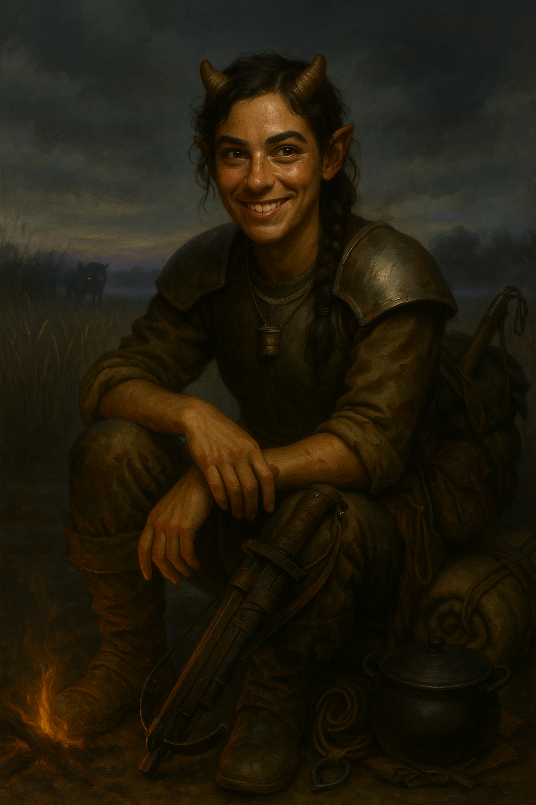

# Clover Medley

{ width="300" }

> *"For sure been called names, none of them pretty. But my mama calls me Clover and that's the only name that matters."*

**Charming Tiefling farmgirl from a blighted valley where the farm pigs grunt in Abyssal. The locals think her birth another sign of the curse. Her family knows better. Her grandpa swore on his deathbed he saw a "cursed Kirin" poisoning the land, and it has become her White Whale.**

---

## Character Overview
- **Species:** Tiefling
- **Class:** Ranger 5 (Monster Slayer)  
- **Background:** Farmer
- **Age:** 22
- **Alignment:** Neutral Good

??? info "Quick Intro"
    
    **At the Table**
    
    * Unflappable, warm, macabre and tenacious down-to-earth farm girl with easy charm and a stubborn streak
    * Obsessed with finding the cursed Kirin she believes poisoned her homeland and everybody else believes is a hallucination or a joke
    * Party's family-oriented voice of rural hospitality and macabre humor
	* Likes to be prim-and-proper, but that's luxury; doesn't mind filth and uses it as a tool
	* No one knows what goes in her mystery stew, only that Clover is liberal about what's edible
    
    **Backstory (Short Form)**
    
    Clover grew up on the Medley farm in a blighted valley where the wheat grows chalk-white and the pigs grunt curses in Abyssal. Her grandfather Cad swore he'd seen a corrupted Kirin poison the mountain stream, claiming it with his dying breath and pressing a horn fragment into her hands. Now she carries his notes and the purported horn, determined to prove him right, heal her land, and clear his name—whether through science, faith, or sheer stubbornness.
    
    **Playing Clover**
    
    * **Combat:** Dual-wielding Crossbow Ranger. Can switch to shield to bump AC to 18 if needed. Works as ambush predator using her Necklace of Adaptation to hide in bogs or water.
    * **Roleplay:** Salt-of-the-earth charm with macabre anecdotes. Speaks in simpler terms but is deeply competent. The Cursed Kirin is her Moby Dick. Occasional prankster, confidently wrong about many things, as she mostly goes off vibes. Struggles to decipher grandpa Cad's illegible notes about the Blight.

---

??? info "Deep Dive"
    
	## Backstory
    
    30 years ago, before Clover was born, a terrible blight struck the lands around the village of Willow Grove. Streams turned into poison, farmland into swamps. Many moved, others stayed, tried and failed to heal the land. Clover, like several children born among the villagers who remained, was born as a Tiefling. She grew up on the Medley farm.
    
    Life was hard, but the love of her family held them up. Her mother raised her with tenderness, calling her a gift, not a curse, even when neighbors whispered about her tiefling looks. Clover's days were full of mundane chores, pig pens, stolen barnyard kisses with the neighbor boys, and wrangling younger siblings, ending with family meals where laughter kept the gloom at bay.
    
    Her grandfather Cad, an eccentric but kind man who loved to wander the land, became the anchor of her childhood after a hunting accident with a blighted boar claimed her father's life. He kept notebooks on the soil and livestock, searching for patterns in the land's decline. To his dying day he swore he had seen the cause: a corrupted Kirin dipping its horn in the mountain stream, poisoning everything below. None believed him, of course, given his many small eccentricities, except for Clover. On his deathbed, claimed by the wasting disease that infected the land and its people, he pressed into her hands a chipped fragment of horn he claimed to have struck loose with an arrow.
    
    His death to the curse that both claimed the land and ultimately shaped her own body into its tiefling shape, became the moment when Clover decided to heal the land. At any cost. Now she carries his notes and the purported horn fragment from a blighted Kirin, determined to prove him right, heal her land, and clear his name. Whether through science, faith, or obsession, she has convinced herself that if she can find the corrupted Kirin (an impossibility according to the scholars), she can end the blight once and for all.
	
	---
	
    ## Clover's Personality
    
    Clover is a down-to-earth, passionate farm girl who balances her immensely stubborn streak with easy charm. She is *obsessed* with finding the cursed Kirin she is convinced poisoned her land. This is her White Whale, and should define her arc.
    
    Even though she took inspiration from her grandfather's scientific mindset and tries to emulate it, asking critical questions and searching for counter-evidence, her own ability to stay focused on highly cerebral tasks is limited. His research notes, full of variables on soil acidity and migratory patterns, are still cryptic to her. She ultimately goes off vibes more than facts, and is confidently wrong half the time.
    
    At times she feels the pull of her chthonic blood, which comes across in a delight to charm and trick others. She isn't malicious, but a prankster. While harmless, it doesn't exactly help her credibility when telling people about "grandpa and the corrupted dragonhorse".
    
    Clover can be vain in downtime, filing her horns (also for practical purposes, so they don't catch in bedsheets or the toolshed ceiling), and dabbing makeup over chthonian rough spots, even trying on pretty dresses when she has a chance. Maybe it's her one, small attempt at normalcy in a fucked up world? Or just indulgence?
    
    She was raised in the spirit of rural hospitality. Even if you're quarreling, she will share her cornbread and infamous mystery meat stews, and help mend your clothes. She will even crack a macabre joke to ease the tension. Community and connection is what keeps her whole village alive, and she's proud that she was raised right.
    
    Clover may not have gone to school, and may speak in simpler terms, but competence takes many forms. She's unflapped by gore, rot and pus, and has many macabre anecdotes and salt-of-the-earth humor, grossing out the cityfolk with merry stories about culling mutated piglets in the creek as they drop blood-curdling curses on her.
    
    Something about Clover's birth makes her naturally know Abyssal, and she could grunt back at the pigs of her farm from a young age, occasionally translating their short, nonsensical sentences to the rest of the household.
    
    Clover's family is her bedrock, and the source of her passion and faith. She's not an edgy tiefling outcast. She's a weird, unsettling, kind of gross and yet incredibly warm and wholesome farmgirl on a mission.
    
    Clover's obsession can make her waste Spell slots casting Detect Magic on every lake they pass and squint endlessly at grandpa Cad's notes by the campfire. She practices obsessively with her crossbow at all times, thinking about when she finds the Kirin.
    
    **Personality traits:** Unflappable, warm, macabre and tenacious
    
    **Ideals:** Family, faithfulness, stewardship of the land
    
    **Bonds:** Family, Willow Grove
    
    **Flaws:** Bullheaded, occasional trickster
	
	---
	
	## Sample Quotes
    
    *"For sure been called names, none of them pretty. But my mama calls me Clover and that's the only name that matters."*
    
    *"You city folks ever try to milk a blighted goat? It's why I carry a shield. For the splashback."*
    
    *"Sure, I enjoy a good laugh... but not about grandpa and the dragonhorse. Those are like different registers, no?"*
    
    *"Hands to yourself! Just 'cus I file off the edges ain't make those horns into handles. Unless we're getting real friendly."*
    
    *"Sick pigs get the cullin'."*
    
    *"Betcha didn't know all owls're female? It's why they're so wise."*
    
    *"Don't blame the pig for wanderin'. Fix the fence."*
        
    *"Didn't come this far only to back down, mister scholar-man. So unless you're helping, best step aside, or you're goin' in the mystery stew."*
    
    ---
	
    ## Build notes

	**Combat**
	
    Clover leans into the dual-wielding Crossbow Ranger archetype with Hunter's mark, hitting as many times as she can per round. The Vex and Nick properties ideally give her Advantage on some attacks and keep her Bonus Action free for Hunter's Mark or Hail of Thorns. She also does come with a shield for those few occasions when bumping up her AC to 18 is more important than doing damage, but feel free to drop it if needed.
    
    **Note on Magic Item**
    
    The clergy of the nearby village of Willow Grove never put much stock into the ideas of grandpa Cad, and instead focused on easing the suffering for people here and now. As Clover decided to go on her quest to fix the land, she "borrowed" one of their precious enchanted necklaces they manufactured to shield themselves from the blight. So she is likely wanted by the clergy, or at the very least going to get into trouble farther down the line.
    
    The necklace allows Clover to breathe freely in all environments (including water or deep mud) and have advantage on saving throws vs the poisoned condition. It fits well with her resilient, slightly icky vibe.
    
    Together with respectable 16 CON, this can set Clover up as a fun ambush predator style player, which leans into both her species and background as a no-nonsense farmgirl in a blighted land. She dons a pretty dress in the day, then at night hides out in a bog or harbor sewage to do stealth takedowns like an adorable tiefling Kraken, using her grappling hook and Athletics proficiency to pull the opposition to a watery grave.
    
    **Note on Proficiencies**
    
    One Language option from the Ranger list has been removed, in exchange for proficiency with Cooking Utensils, to better suit her background. Check this with your DM.

---

??? info "Key Relationships"

	## Medley Farm
    
    The Medley farm sits in the middle of a blighted valley, where the wheat grows chalk-white and brittle, the water runs with an oily, purple sheen, and the pigs occasionally grunt "feed me, mortal" in what Clover swears is Abyssal. Yet somehow, it's still a home full of warmth: a place of stew simmering on the hearth, muddy boots by the door, and siblings chasing each other through crooked rows of ghostly grain. The Medleys have stubbornly refused to leave, insisting that love and laughter survives all.
    
    **Cordan Medley (Mother):** A woman of steady hands and a steady heart. Cordan has worked the farm since she was a girl, and though the blight has worn down the land, it hasn't worn her spirit. While villagers of Willow Grove eye Clover with suspicion, Cordan calls her *the greatest gift of her life* and would sooner let the valley rot than trade away her precious daughter, horns or not. Cordan's voice is practical, soothing, and rarely rises... except when one of her boys tracks muck into her kitchen.
    
    **Desther Medley (Brother, 3 years younger):** The dreamer of the family, quick to ask questions and slow to finish chores. Likes carving weird figurines out of blighted wood, or lying on the roof watching clouds pass over the poisoned hills. Desther looks up to Clover with wide-eyed loyalty, even when he teases her about "fancing herself a monster hunter".
    
    **Archie Medley (Brother, 5 years younger):** The rascal, full of noise, mischief, and mud. Archie lives to climb things he shouldn't, wrestle pigs and pester Clover until she chases him with a broom. He insists he'll be a warrior one day, though his current battles are mostly fought against his brother over who gets the last dumpling at dinner.

---

??? danger "Notes for the DM"
	
	## Dramatic Qustions
	
	- *If someone gave Clover definitive proof that her "Kirin Horn" is fake, would she believe them or hold onto her crusade?*
	- *Does Clover really know what she's going to do once she finds the Kirin? Is killing the true solution or just her assumption?*
	- *How would Clover react to seeing other people be consumed by their obsession?*
	
	## Plot levers
	
	These are the main levers for Clover. Push or pull in whichever direction fits your campaign best:
	
	**Conflict with the Clergy**: Push tension around the stolen necklace (if you allow it in your campaign). Do they hold Clover's family responsible for her actions? What did they really think of grandpa Cad? Do they know something about the blight that others don't?
	
	**Truth of the Horn**: Decide if the horn is genuine, cursed, or placebo. Each outcome reframes Clover's obsession. If genuine, decide what kind of aura it will radiate, for instance when targeted with Divination spells. Note, this pregen does not come with a stat block for a Blighted Kirin, but this would be a high level encounter.
	
	**Family in Peril**: The farm and siblings can be endangered or tempted at key moments to pull Clover back into the story. Cheap but efficient.
	
	**Carrot and Stick**: If Clover meets a scholar who can clearly help her translate Cad's notes, or give a solid lead on the Kirin, how far is she willing to go to get that aid? How long could a ruthless person wave that carrot in front of her before she started to realize she's being taken advantage of?
	
	**The Blight as Character**: Let the environment act almost like an antagonist if Clover and the party visit her homelands: strange weather, poisoned streams, warped beasts, glowing soil. Go wild! Anchor it with Clover's player first so they can play it off as "just the usual life in Willow Grove" as the PC's get caught in whispering quicksand, choke on whiffs of poisonous bog air, or face a blighted tentacle bear.
	
	**Clover's True Nature**: What if the Blighted Children of Willow Grove are actually not a symptom of the Blight but of the land trying to heal itself, creating champions with powers to speak with the Blight and maybe even tame it?
	
---

??? info "Mechanical build (lv 5) and PDF download"

	| STR | DEX | CON | INT | WIS | CHA |
	|:---:|:---:|:---:|:---:|:---:|:---:|
	| 12 (+1) | 16 (+3) | 16 (+3) | 8 (-1) | 14 (+2) | 10 (+0) |
	
	## Combat Stats
	
	| AC | HP | Hit Dice | Speed | Initiative | Prof. Bonus |
	|:---:|:---:|:---:|:---:|:---:|:---:|
	| 18 | 59 | 5d10 | 30 ft. | +3 | +3 |
	
	**Saving Throws: Strength: +4, Dexterity: +6**
	**Resistances: Necrotic, Poison**
	
	## Proficiencies
	**Skills**: Animal Handling +5, Athletics +4, Nature +2, Perception +5, Stealth +9
	
	**Armor**: Light Armor, Medium Armor | **Weapons**: Simple Weapons, Martial Weapons
	
	**Tools**: Carpenter's Tools, Cook's Utensils | **Languages**: Common, Abyssal, Halfling, Sylvan
	
	## Feats
	- **Tough**: +2 HP/level
	- **Crossbow Expert**: Ignore the Loading property of crossbows, can fire in melee, when you make an extra attack of a weapon with the Light property, you can add your ability modifier to the damage of the extra attack. 
		
	## Equipment
	Breastplate, Scimitar, Hand crossbow, Druidic focus, Kirin(?) Horn, Cook's Utensils, Carpenter's Tools, Shield, Whip
	
	**Suggested Magic Items**
	
	- Necklace of Adaptation (Uncommon, attunement, can breathe anywhere, Advantage on saves vs Poison)
	- Ring of Swimming (Uncommon, gives 40 ft Swim Speed, only suggested till Ranger skill comes online)
	- Lantern of Revealing (Uncommon, see Invisibility within 30 ft.)
	- Nature's Mantle (Uncommon, attunement, Ranger spellcasting focus, can Hide as Bonus Action in Lightly Obscured terrain even if directly observed)
	
	## Spellcasting
	**Cantrips**: Chill Touch, Thaumaturgy
    **Level 1**: Absorb Elements, Cure Wounds, Animal Friendship, Detect Magic, Hail of Thorns, False Life, Protection from Evil and Good, Hunter's Mark
	**Level 2**: Silence, Ray of Enfeeblement, Zone of Truth
	
	---
	
	📄 [Download Level 5 Character Sheet (PDF)](assets/clover-medley-lv5.pdf)
	
---

??? danger "**Session Zero Considerations**"
    
    **Content Notes:** Body horror elements (blighted environment, mutated animals), disease/wasting illness (grandfather's death), mild gore (farm culling stories). Suitable for most tables but may want to discuss comfort levels with environmental horror.
    
    **Representation Notes:** Character deals with being othered/marked as different due to tiefling appearance, though framed positively through unconditional family love.

---
