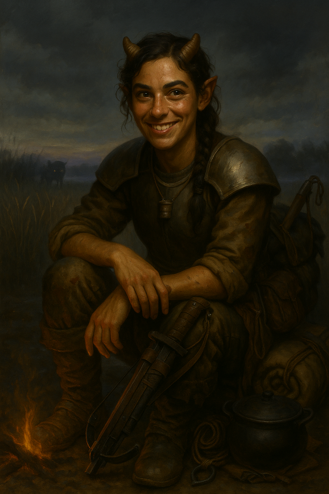

# Clover Medley

{ width="300" }

> *“For sure been called names, none of them pretty. But my mama calls me Clover and that's the only name that matters.”*

---

## Character Overview

|                   |                                      |
| ----------------- | ------------------------------------ |
| **Class & Level** | Ranger (Fey Wanderer) 4              |
| **Background**    | Farmer                               |
| **Race**          | Tiefling (Chthonic Legacy)           |
| **Alignment**     | Chaotic Good                         |
| **Role**          | Ranged striker, wilderness guide, hopeful healer of a cursed land |

A farm-born tiefling from the blighted valley of Willow Grove, Clover carries her family's unconditional love, her disgraced grandfather’s notes and a chipped horn fragment she believes came from an incredible *corrupted Kirin*. She hunts obsessively for truth and healing, with the stubbornness of a farmgirl who's wrangled cursed pigs and ignored villagers' sneers all her life.

---

## Personality

* Down-to-earth and stubborn, equally wholesome and macabre.
* Helps others with practical farm wisdom, but lies and pranks her way through social tension.  
* Obsessed with proving her grandpa’s Kirin theory true, even when it costs her credibility.  
* Tries to be scientific like Grandpa Cad, but mostly goes on “vibes” and gut feeling.  
* Most likely party member to accidentally poison the judges of the cooking contest with blighted goat milk.  

---

## PDF Character Sheet

📄 [Download full character sheet](assets/clover-medley.pdf)

---

## Gameplay Notes

??? info "Playing Clover effectively"
	- **Voice & Vibe**: Give Clover a hearty rural tone, part wholesome, part prankster, part deeply unsettling blightspawn. She’s quick with a farm metaphor (“Don’t blame the pig for wanderin’. Fix the fence.”).  
	- **Tactics**: Lean on dual-wielding, with the shield as backup. With the DM's blessing, make use of her Necklace of Adaptation to thrive in poison, gas, or even underwater ambushes.    
	- **"Captain Ahab" moments**: Clover comes from a deeply loving family. No "edgy tiefling" stereotypes here. Redeeming her grandpa's theories and healing the land is her top priority. Have her seek high and low for any sign of this extremely weird theory of the "corrupted Kirin", brushing off any who mock or dismiss her.

??? danger "DM Guidance"
	- **The Blight**: Treat her homeland as a living antagonist. Poisoned rivers, whispering soil, pigs that grunt in Abyssal. These anchor Clover’s story and keep her obsession credible.  
	- **The Horn Fragment**: Decide if it’s genuine, cursed, or placebo. Each choice reframes Clover’s quest and creates moral tension. What could even have corrupted a higher Celestial? No stat block for a cursed Kirin is provided unfortunately, but this could be a main plot point in the late campaign, and a mystery that can unravel slowly.
	- **Family Hooks**: Use the Medley family as levers: her brothers and mother can be endangered, tempted, or used to pull Clover into hard choices.
	- **Religious Tension**: The clergy of Willow Grove can fuel ongoing suspicion or conflict, if you decide to go with the suggested stolen Necklace of Adaptation for Clover's character.  
	- **Clover as a living cure**: In the longer perspective, there may be a deeper reason why cthonian tieflings started being born when the land was blighted. Maybe they are not a sign of the blight, but of the land adapting to it? Maybe Clover's cthonian heritage actually allows her to understand and handle the Blight in ways humans can't? This is a chance to create a story evoking of Princess Mononoke or Nausicaa of the Valley of the Wind.

---

## Stat Snapshot

```text
STR 8 (-1)   DEX 16 (+3)   CON 16 (+3)
INT 10 (+0)  WIS 14 (+2)   CHA 12 (+1)

HP 48   AC 16 (18 with shield)   Speed 30 ft
Proficiency Bonus +2
Spell Save DC 12   Spell Attack +4
```