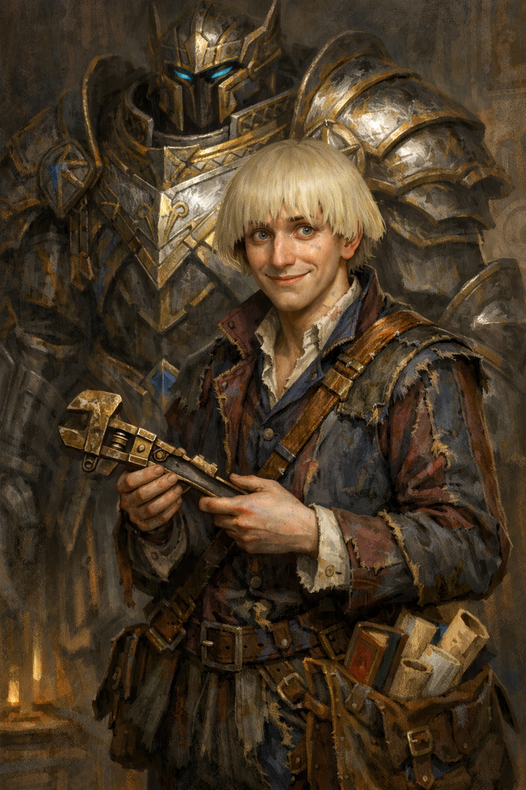

# Coltan the Magnificent

{ width="300" }

> *"Fret not, pathetic underling! Your life may end here today, but you shall live on as a cautionary tale of cowardice in my next best-seller! Uh, so what was your name again? Hold on... I stepped on my cape."*

**A struggling writer turned armor-clad "hero" who self-narrates during combat and yells at books during downtime. Camp, competent, grandiose, deeply insecure. Insists he's destined for greatness, but folds immediately if anyone pushes back.**

---

## Character Overview
**Species:** Aasimar
**Class:** Artificer 5 (Armorer)
**Background:** Sage
**Age:** 28
**Alignment:** Chaotic Neutral

??? info "Quick Intro"

    **At the Table**

    Coltan is generous to the point of desperation, staying up late crafting gear for the party, and gets quietly devastated if they don't acknowledge it. Every creation gets named after an obscure literary reference nobody recognizes (often from his own unpublished stories). At camp, he reads voraciously and argues loudly with books about their failures in narrative, characterization and pacing. 

    **Backstory (Short Form)**

    Coltan spent years as a struggling writer with brilliant concepts, but poor execution, while his younger sister effortlessly excelled at everything. When his celestial guide tried to encourage him, telling him he as an Aasimar was chosen for greatness, he latched onto it so hard the guide got cold feet and withdrew. He threw himself into artificing, building an armor that became his proof he could *make* something that made an impression, even if he couldn't *write* anything that made it past the editor. Now he adventures, seeking that greatness as a grandiose comeback to all the professional publishers who doubted him.

    **Playing Coltan**

    **Combat:** Armorer, infiltrator and tank models, mutters constant self-narration to cope with the terror of actual live combat. He's heard half in his regular nasal voice, half in booming "hero mode" when he forgets to toggle the suit's voice modulator. He's legitimately brave, but starts giggling frantically when bloodied: pure, tinny stress dysregulation from somewhere inside his moderately safe metal cradle.

    **Roleplay:** Camp, theatrical energy masking deep insecurity. The mediocre scene kid at constant odds with the world. Monologues about destiny while watching for reactions. Expresses friendship through over-engineered gifts. Quietly prefers someone else in charge and invents all sorts of dumb excuses for why it'd be better if he didn't assume leadership, just today.

    **Party Synergy:** The party's wildly competent support character. Drives plot by taking dangerous quests to prove himself. The bluster is mostly the noise of a person who doesn't know what it's like to be truly seen by others. The armor works, the tactics are mostly sound, and he genuinely cares about his friends.

---

??? info "Deep Dive"

    ## Backstory

    Coltan was raised by Ma Sallie and Pa Gilmore, dwarven foster parents who ran a workshop. He started writing young. Camp fantasy stories that always interested the editors, because they had *something*, but the rejection letters piled up. "Your ideas are very strong, but..." Always almost good enough.

    Profoundly bad at actually connecting to his peers and making friends, he supported himself tinkering in the family workshop while authorship remained the big dream. But his aspirations kept running into a wall of professional rejection, and tinkering became what he was *actually* good at. He resented it, of course, because it wasn't what he *wanted* to be good at.

    To make matters worse, he was constantly overshadowed by his younger sister Copper, a true prodigy. Journeyman status early, guild recognition, clients who adored her, socially graceful. Copper genuinely loves him and doesn't understand the tension — things come easy for her, and so she just assumes he too will "find his way eventually." She never knew the quiet erosion of having to mumble about his "projects" to politely listening relatives at every family celebration of her triumphs.

    His foster parents loved him unconditionally, praised everything, meant well. But they couldn't give him what he needed: honest, critical feedback, perhaps even a kick out of the nest. They didn't read much themselves, couldn't tell him *why* his stories weren't working. So "It's wonderful, dear" quickly started to feel like "we don't actually believe you'll succeed." His childhood room is still a museum to his attempts — childhood drawings, invention prototypes, draft manuscripts. They keep everything in loving storage.

    ---

    ## The Inciting Moment: The Celestial Guide

    As an Aasimar, Coltan drew the interest of a celestial guide who sensed his plight and appeared after a particularly brutal literary rejection on the very same night Copper announced a new scholarship. It told him he was *destined for greatness*, attempting to instill hope in the young man. But for someone who'd spent years being "almost good enough", what his addled mind heard was divine mandate that "you are specifically chosen by the Gods, you are special among men".

    That night, he threw himself into this sudden, new calling with frantic energy, building increasingly elaborate "instruments of divine justice" that looked more like theatrical props than holy relics. The Divine Guide, flustered and confused, tried to course-correct: "This isn't what I meant. You're supposed to serve truth and goodness with humility, not put yourself before others."

    Of course, Coltan only heard "You're doing it wrong. Again." But this time, he was done accepting rejection. He rejected the guide right back, clawing at the imagined indignity he suffered until the angelic being fled.

    The armor he began creating that night became his new draft for a life of greatness. His eventual new adventuring party became his primary audience. The adventures became the story he'd failed to write but could still live.

    ---

    ## Personality

    The gap between critical understanding and creative execution defines Coltan. He critiques stories the way someone who knows what good looks like but could never produce it himself would. He's the connoisseur with no craft to match the taste. He can't bring himself to write anymore, so instead he names everything after book characters — weapons, replications, even consumables — still trying to live in stories even if he can't write them.

    The armor has a stiff, retractable cape (like a rolling curtain) that constantly gets caught on things, a semi-motorized book holder for long watches, a chronically shifty voice modulator for heroic booming voices, and unnecessary engravings absolutely everywhere. Any gear he gifts to the party may be branded merchandise for stories nobody read, but it *is* remarkably effective.

    ---

    ## Battle Behavior

    Coltan is emphatically not a fighter. Self-narrating his actions and the flow of combat in high prose is a coping mechanism, processing his terror in real time through the only framework he has. He's desperately trying to convince himself he's the protagonist who simply *couldn't* die in Act II. This ironically makes him legitimately brave, because backing down would betray the self-narrative, and the self-narrative is the one thing he clings to.

    When bloodied, the stress breaks through as compulsive giggling, the sound of someone whose sedentary nervous system and mythical self-image are in open warfare with the reality of a body that's hurting.

    His Aasimar transformation gets announced with the intensity of a JRPG boss with zero self distance: wings, divine radiance, tripping over his metaphors, hyperventilating through the pressure of living up to his own story.

    ---

    ## Sample Quotes

    *(Waking the party, yelling into a book)* "You absolutely *cannot* have the rogue sacrifice herself in Act II, you haven't established her bond with the mentor yet! This is *sloppy* writing! ...oh, did I wake you up? Sorry. Please don't mind me. *But also, this is important!*"

    "You think I'm overcompensating? Preposterous! I — wait, *am* I? No, surely not. Unless... do you think the cape is too much?"

    *(After getting hit, mumbling)* "The protagonist takes a biting wound from the cowardly dastard, but it only strengthens his... *cough* resolve..."

    "I stayed up all night infusing this cloak with arcane wards. I call it the 'Mantle of Korvan's Last Stand' — Korvan being the doomed general from Chronicles of the Brass Legion, a trilogy I... No? Nobody?"

    "A victory celebration? Aye, *would* be in order! I shall immediately commence to write a suitable epitaph to those lousy bandits and their cowardice. Drink? No thanks... I can't handle liquor. It upsets my stomach."

---

??? info "Key Relationships"

    **Bassilus Rex**: A closeted Necromancer with dreams of if not world domination, then at least a little plot of land to call his own. They met in a tavern where neither of them really belonged, Coltan nursing his juiced carrots, Bassilus working through a bottle of absinthe with the steady discipline of a professional. They talked for hours about everything Coltan never gets to talk about: the cruelty of institutions that refuse to recognise talent, the particular loneliness of knowing you're meant for more than the world will allow. Bassilus is bitter where Coltan is theatrical, quiet where Coltan is loud, but their grievances rhyme. Coltan considers him a kindred spirit, the only person outside the party who truly understands him. They meet occasionally, drink their respective poisons, and argue about whether the world deserves to be fixed or simply endured. Coltan recently learned about Bassilus' closeted activities, which has launched him into a minor crisis of identity. Sometimes he trains in front of a mirror, trying to figure out what to say the next time they meet.

    **Jolian Renard:** Runs the kind of operation Coltan only intuits that he doesn't fully understand, a network of contacts, favours, and supply lines that somehow always has what Coltan needs: rare components, specialist alloys, unusual reagents. He extends credit generously and never presses for payment. More remarkably, he actually listens. He asks about the literary references. He remembers which book Coltan was furious about last time. He treats Coltan's mind as something worth engaging with, and does so with an effortless social grace that makes Coltan feel, for once, like a peer rather than a spectacle. Coltan has a running tab he intends to settle eventually. He once lent him a manuscript — a smuggling story he was proud of — and was quietly thrilled when Jolian read it with real interest, and even asked for permission to have it copied.

    **Rosina Giraldo:** A woman in her mid-fifties Coltan met through the book trade, a dealer in rare volumes, or so he initially assumed. She's well-read in ways that make his own literary knowledge feel like a foundation rather than a party trick. Their conversations about narrative, character, and craft are the most intellectually honest exchanges Coltan has. She's even read some of his old drafts and given him feedback that didn't actually read as rejection. Coltan is drawn to her in ways he can't quite articulate and compensates by being more grandiose than ever in her presence: louder, more theatrical, more insistent on his destiny. She doesn't seem to mind. She pours him tea, listens to his monologues, and occasionally redirects him with a precise question.

---

??? danger "Notes for the DM"

    ## Dramatic Questions

    - **What happens when someone (except for Rosina) genuinely appreciates his work, or even him, without needing him to perform?** Can he accept the validation or assume they're lying?

    - **What happens if the party returns to his hometown?** Facing the loving family he thinks he's disappointing, watching him shrink back into the person who mumbles about "projects" while Copper shines.

    - **What happens when his literary criticism actually solves a problem?** His narrative instincts predict an enemy's tactics, or an obscure book contains crucial intelligence. Will it ignite his old writer's passion? And would that be a good, or a bad thing?

    - **How will he deal with someone who asks him why he stopped writing?**

    ---

    ## Key Relationship Dynamics

    **Jolian Renard** is a criminal mastermind, a fixer and broker who makes things happen and takes a percentage of everything that moves through his network. His kindness to Coltan is real in the sense that it costs him nothing and secures him a brilliant artificer on retainer without Coltan ever framing it that way. The running tab is leverage he may never need to use, which makes it more effective than any contract. He remembers the literary references simply because he remembers everything about everyone — that's his craft, the way artificing is Coltan's.

    Renard read Coltan's smuggling story and immediately recognised a silently brilliant plot that would actually work. He's now running a real life version of it. When Coltan eventually discovers this, there are two takeaways: his writing was good enough to work in the real world, and the one person who recognised that used it to build a criminal operation. This works best as a slow reveal. The party encounters the smuggling operation first, and Coltan recognises details from his own stories.

    **Rosina Giraldo:** She is actually an accomplished, published author who has written under a male pseudonym for years as a pragmatic adaptation to a market that sells more copies with a man's name on the spine. That's a reveal you can wait to drop when the time is right. She sees exactly what Coltan is doing when he performs for her, and she lets him. She's patient and knows forcing someone out of their defences never works. She has her own life, her own work and satisfactions. Either he comes around or he doesn't. Accepting what she offers would require Coltan to believe that his unadorned, non-performing self is worth someone's time, and as written on this sheet, he's simply not ready for that yet. Whether he gets there is a real character arc.

---

??? info "Level 5 Build and PDF download"

    | STR | DEX | CON | INT | WIS | CHA |
    |:---:|:---:|:---:|:---:|:---:|:---:|
    | 8 (-1) | 14 (+2) | 16 (+3) | 18 (+4) | 10 (+0) | 8 (-1) |

    ## Combat Stats

    | AC | HP | Hit Dice | Speed | Initiative | Prof. Bonus |
    |:---:|:---:|:---:|:---:|:---:|:---:|
    | 19 | 43 | 5d8 | 35 ft. | +2 | +3 |

    **Saving Throws:** INT +7, CON +6
    **Resistances:** Radiant, Necrotic

    ## Proficiencies
    **Skills:** Arcana +7, History +7, Investigation +10, Sleight of Hand +5

    **Armor:** Heavy Armor, Light Armor, Medium Armor, Shields | **Weapons:** Firearms, Simple Weapons

    **Tools:** Calligrapher's Supplies, Jeweler's Tools, Smith's Tools, Thieves' Tools, Tinker's Tools
    **Languages:** Common [+1 common language]

    ## Feats
    - **Keen Mind:** Expertise in Investigation, can take the Study Action as a Bonus Action
    - **Magic Initiate (Wizard):** Cantrips: Prestidigitation, True Strike. Level 1 Spell: Shield (1/Long Rest or using spell slots). Spellcasting ability: Intelligence.

    ---

    ## Equipment

    Splint armor of Billowing (Replicated), Cloak of Billowing (Replicated), Shield, Light Crossbow, Dagger, Thieves' Tools, Smith's Tools, Tinker's Tools, Calligrapher's Supplies, Painter's Supplies, 3 books

    **Arcane Armor: Guardian** (Can be changed to any other model with a Magic Action)

    - **Thunder Pulse:** Discharge concussive blasts. The pulse counts as a Simple Melee weapon and deals 1d8 Thunder damage on a hit. A creature hit has Disadvantage on attack rolls against targets other than you until the start of your next turn.

    - **Defensive Field:**. While Bloodied, you can take a Bonus Action to gain Temp HP equal to your Artificer level. You lose these Temp HP if you doff the armor.

    **Suggested magic items:**
    - Gloves of Thievery (Uncommon, gain +5 bonus to Dexterity (Sleight of Hand) checks and Dexterity checks to pick locks)
    - Bag of Holding (filled with manuscript, drafts, crumpled pages and other objects that caught Coltan's interest for some reason)

    ## Spellcasting

    **Spell Save DC:** 15 | **Spell Attack Bonus:** +7 | **Spellcasting Ability:** Intelligence

    **Prepared Spells (see character sheet for full list):**

    **Cantrips:** True Strike, Thorn Whip, Mending, Prestidigitation, Minor Illusion, Light (Aasimar)
    *1st level:* Magic Missile, Thunderwave, Absorb elements, Grease, Catapult, Shield (Magic Initiate, 1/LR)
    *2nd level:* Rope Trick, Invisibility, Heat Metal, Mirror Image, Shatter

    **Artificer Features:**
    - **Replicate Magic Item:** You have 4 Magic Item Plans. You can Replicate up to 2 items at a time (comes with Smoldering Armor and Cloak of Billowing, because that tracks)
    - **Tinker's Magic:** (Magic action while holding Tinker’s Tools) Create one common item (Usable INT modifier times(4)/LR).

    **Aasimar Features:**
    - **Healing Hands:** Touch a creature to restore 3d4 HP (1/Long Rest)
    - **Celestial Revelation:** Transform for 1 minute (1/Long Rest)

    ---

    📄 [Download Level 5 Character Sheet (PDF)](assets/coltan-ironforge-lv5.pdf)

---

??? danger "**Session Zero Considerations**"

    **Content Notes:** Themes of rejection, impostor syndrome, and family pressure. Generally suitable for most tables but may resonate painfully with players who've experienced chronic "almost good enough" feedback or comparison to more successful siblings (yes, sometimes the mundane wounds do in fact hurt the most).

    **Representation Notes:** None beyond emotional/psychological themes.

---

*This character is part of the [Steal These Ideas](https://oenig138.github.io/STI/) project, a free library of 20+ D&D characters, locations, and factions I'm releasing under CC BY-NC-SA 4.0. This is a labor of love and a creative outlet during my long recovery period from trauma/depression.*

You're free to use and remix this material exactly however you like, as long as you don't commercialise it or republish it without attribution. All characters were crafted with care and built in the official D&D Beyond character creator.