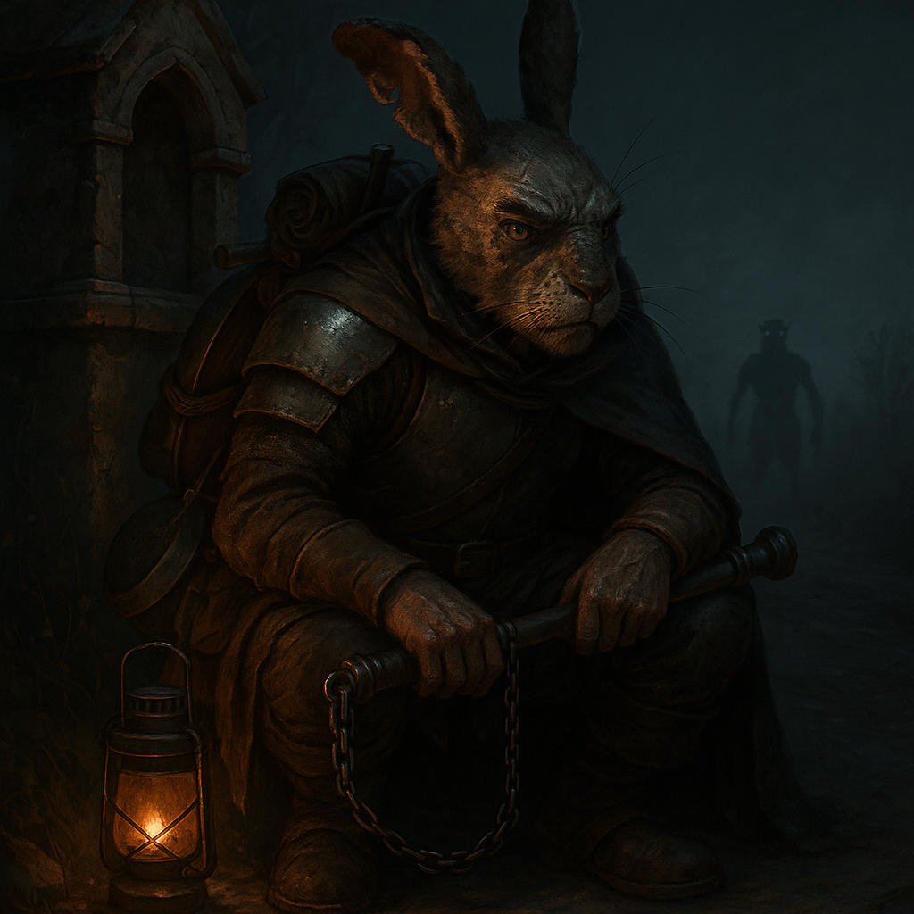

# Donner

⚠️ *Content Warning: Body horror, survivor's guilt, sacrifice of innocents. Session Zero this character.*

{ width="300" }

> *"You're still not too old for me to tell you to finish your kale like a good boy. I made plum tea for dessert. Clean your mug first, you filthy ape."*

**A camp cook who spent ten years watching heroes die for glory, then sacrificed his own apprentice to escape the thing that killed them. Now he keeps new companions alive with grim stories and good stew, and can't tell anymore if it's love or just making sure someone's around to throw behind him when the Revenant catches up.**

---

## Character Overview
- **Species:** Harengon
- **Class:** Fighter 5 (Battle Master)  
- **Background:** Farmer  
- **Age:** 40
- **Alignment:** Lawful Evil

??? info "Quick Intro"
    
    **At the Table**
    
    * Gruff and blunt, with an endless supply of war stories from his decade as a servant to doomed adventuring parties—most of which end with someone dying stupidly. 
    * Obsessively frugal; will mend a torn hem mid-conversation and gets genuinely angry when the party leaves usable salvage behind. 
    * Cooks hardy, nutritious meals and insists everyone eat properly, though whether this is care or something colder is an open question. 
    * Currently dodging two revenants: the ancient Lizardfolk spirit that wants his flesh, and a younger sister who wants her brother back. He can't decide which reunion frightens him more.
    
    **Backstory (Short Form)**
    
	Donner spent a decade serving Sir Gilliam's League of Magnificents to repay a life-debt Gilliam never asked for and probably never noticed. He watched the League die one by one to Gilliam's reckless heroism, then watched the survivors get eaten by an ancient Revenant. Donner escaped by sacrificing his own assistant to the beast. Now he keeps moving, keeps cooking, keeps saving money for a bounty to be posted on his death: payment to whoever finally destroys the thing and avenges the League he betrayed.
    
    **Playing Donner**
    
    * **Combat:** Tactical bruiser who controls the battlefield through positioning and preparation. Protects allies not out of sentiment but because dead companions slow you down.
    * **Roleplay:** Speaks in dark humor and grim practicality. Low Charisma means he's bad at lying about what he is—the cynicism is right on the surface. But he keeps doing kind things anyway, and refuses to explain why.
    * **Party Synergy:** The reluctant dad who feeds you, criticizes your footwork, and keeps you alive despite his worldview that everyone's ultimately on their own.

---

??? info "Deep Dive"
    
    ## Full Background
    
    Donner was born under a bad omen in a small Harengon warren. From his earliest days he felt the need to compensate, to prove he could manifest luck where fate had shortchanged him. It never came. By his late teens, restless and dissatisfied, he left home to make his own fortune, and prove their superstition wrong.
	
    He worked as a cook in mercenary supply lines and somehow always ended up on the losing side. Desperate, he took a scouting job with a group of monster hunters—unglamorous, dangerous work that almost killed him in the first week. A Gorgon surprised him and nearly gored him on the spot, when Sir Gilliam swooped in on his Royal Gryphon and ended the beast singlehandedly.

	Gilliam was a splendid paladin who led the League of Magnificents, and was at once the greatest stroke of luck and the worst misfortune of Donner's life. He didn't think twice about the rescue, never asked for anything in return. Donner resented that. You don't just save someone without collecting. So he decided to work off the debt himself: tending Gilliam's gryphon, guarding the camp, minding the horses, cooking the stews.
	
	For ten years, Donner served a debt that only he recognized. Gilliam barely noticed his presence. And Donner watched as the League's dazzling roster of bards, warriors, and wizards cycled through—recruited by Gilliam's bombastic charisma as fast as they were buried by his reckless heroics. Every adventure ended in tragedy, but Gilliam never even slowed down.
	
	This shaped Donner's creed: the world is inherently cruel. Survival comes from wits and preparation, not fortune or divine will. Every good thing must be hammered into being through labor and vigilance.
	
	The League came to an abrupt end when Gilliam's crusade unleashed a foe beyond them: an ancient, seemingly invincible Lizardfolk Revenant that cut them down and fed on them with reptilian patience. Only Donner and some of the servants escaped, retreating under his hasty command. But the Revenant didn't stop. It still hunts anyone who was near the temple that day.
	
    ## Character & Psychology
    
    Donner is Lawful Evil, but not in any way that involves cruelty or master plans. He simply believes the world is predatory and acts accordingly: keep your head down, think ahead, mind your own business, and don't sacrifice others unless you're desperate. That's what passes for decency in his world.
	
    What Donner doesn't recognize is how poorly his philosophy maps to his behavior. He spends hours each day cooking meals, mending gear, keeping watch for the party. He'd call this "basic upkeep". If you asked him why, he'd shrug: "Because someone's got to, and these dumb fucks would make a mess of it." To him, that upkeep doesn't register as generosity, that's just labor. The party may see him more clearly than he sees himself: a man who insists he's a selfish bastard while actively keeping everyone alive and fed. His self-image is a cursed Harengon who brings misfortune wherever he goes. 
	
	Spilling his stew or scraping leftovers in the bushes earns you a thwap with the ladle: Waste not, want not. He scrapes every pot clean, mends clothes mid-conversation, and gets genuinely angry when the party leaves usable salvage behind, because *someone made that*. Letting things spoil is obscene to him.
	
    Donner is no fan of religion. He's seen too many clerics get eaten to believe in any of their gods. Gilliam's grandstanding Paladin vows of righteous vindication started sounding hollow after the third funeral. Against the Revenant though, seeking hallowed ground is often the best option. He's ambivalent about it.
    
	There's one more layer to Donner's fatalism: he's saving for a bounty on the Revenant, but only to be posted after his death. Not before. A practical man would post it now, rally hunters, tip the odds. But Donner can't bring himself to do it, and if pressed, he'd struggle to explain why. The closest he gets to a reason is that the Revenant is the League's unfinished business, and he's the League's last member. When Gilliam led, people died for his glory. When Donner led, that one terrible moment when he as the chef was the highest-ranking survivor giving orders in the dark, someone died for his survival. He did exactly what Gilliam always did: sacrificed someone else to keep the League (even if just himself) limping forward. He doesn't think the Revenant is haunting him personally, but it's the League's judgment come due. All those unnecessary deaths calling for justice. Thirty years of rejecting Harengon superstition, and now he half-believes he's cursed after all. So he runs, but he won't fight it, not really. He knows it will take him, but he's going to *make it work for it*. Then, the whole sordid enterprise ends with his bones. Only then should the bounty be posted: The League must die, but it must also be avenged.
	
	---
	
	## Sample Quotes
	
    *"Don't thank me for saving your ass. Train harder."*
    
    *"Gryphon dung isn't so bad actually. Except that one time when it ate a Spore Druid. It was like... fucking... brown smoke."*
    
    *"So a kid fell down the well? Can she swim? Climb? Fucking splendid. What do they teach kids these days? We'll get in trouble unless we fish her up."*
    
    *"You're still not too old for me to tell you to finish your kale like a good boy. I made plum tea for dessert. Clean your mug first, you filthy ape."*
    
    *"Gilliam's squire puked his guts out in the middle of a charge 'cause he lived on dried meat and ale. Didn't end well for him. Pass the carrots."*
    
    *"Once saw Gilliam cave in the head of a Basilisk in one swing. With a statue. Of the cleric. It broke. He claimed it was 'what she would have wanted.'"*
    
	*"I'm the only one left. When I die, the League of Magnificients is officially over. Me, carrying the legacy of that gilded grifter? How's that for fucking irony. Once I'm dead and buried, I want you to put up a notice at the guilds. All of them in fact. I got coin set aside. 'Avenge the League', it should say. Someone ought to finish what that sodding fool started, and it can't be me. Let that sparkly fever dream die with me."*
	
    *"Patience! I know they're getting sooty, but that one fucker's still thrashing. Unless you grill the tentacles till they stop twitching, you're in for a fucking wild night on the privy."*
    
    *"You wanna feel lucky? Sure, grab my hare's foot. It's been in a boot all day. [Solemnly removes boot] Ah, that's the smell of some splendid fucking fortune."*
	
	---
	
    ## The Dirty Secret
    
    The Revenant is after all the smallfolk in Gilliam's expedition, including Donner. And at this point he suspects he's the only one left. But that's how he managed to escape before. By giving the Revenant someone it wanted, his own assistant who was learning to cook from him. A young man who trusted him. Donner has seen exactly how the Revenant kills, and what awaits him at the end of the line. If he ever confesses what he's done, it would be a heavy moment.
	
    *"You think you've seen death? You haven't. Not like this. The Revenant doesn't strike you down. It... takes you apart. Slow. Starts at the belly, keeps you alive for the worst of it. Pulls you open like a doll splitting at the seams, stuffing splatting on the ground. Tongue like a rope... sliding inside the chest cavity, pulling until it's slurping your insides like a bowl of goddamn noodles. And you don't die quick. In the end there's nothing left of you but a wet slab of meat, too raw to even scream. I watched it. I let it happen. Gave it my assistant, so it wouldn't take me. Judge me all you want, but that's how I got away. That's why I'm still breathing. One day, it'll be me. And I'll know exactly what's coming. Gods... Glein... He was just a boy."*
    
	This reframes every moment of gruff caretaking with the party. When Donner bullies someone into eating their vegetables, when he patches a wound with irritated competence, there's now a ghost of a question underneath: is this care, or is is just husbandry? Is he keeping the party healthy and alive because they mean something to him, or because surrounding himself with people might mean he gets another chance to survive, feeding the Revenant someone else? Donner probably doesn't know the answer himself anymore. The assistant certainly didn't know, right up until the moment he learned.
	
---

??? info "Key Relationships"

	**Hettie**: Donner's youngest sister never bought into the warren's superstitions about her favorite brother. When the elders clicked their tongues about bad omens, she'd follow him around anyway, mimicking his grip on a shovel, pestering him with questions about the world beyond the fields. She was the only one who cried when he left. Thirty years later, she's still looking—Donner knows because he's caught wind of her inquiries at taverns two towns back, three provinces over, always a season behind him. She's imagining the brother who left: young, restless, hungry for something better. What she'd find instead is a grey-muzzled wreck held together by scar tissue and spite, reeking of campfire smoke and old blood, hauling dented armor he refuses to replace because it still works. He can't let her see that. 
	
	Worse, he can't let her stay. The Revenant doesn't care about guilt or proximity to the crime—it came for him when he was outside peeling carrots, innocent of everything except surviving. If it would cross that line for Donner, it might as well cross any line. Hettie finds him, Hettie becomes someone the beast might notice. And Donner has already learned exactly what he's capable of when the Revenant gets close. He fed it a boy who trusted him. He won't risk learning whether he'd feed it a sister too.

	**Barclay the Bucker**: A Satyr bard who performs in the cheapest ale joints, singing filthy songs for sluggers and dockworkers. He's Donner's oldest surviving friend and largest ongoing irritation. Barclay composes spontaneous ballads commemorating Donner's kills—often mid-fight, always ribald, occasionally accurate—and seems constitutionally incapable of respecting a somber mood. Donner tolerates it all, because Barclay is the only person who meets his cursed reputation with gallows humor and a shrug, rather than something to tiptoe around. 
	
	Over bad ale in worse taverns, Donner can almost relax. Barclay doesn't ask why he looks like hell this time, or where he's running to next. He just hands him a drink, roasts him mercilessly, and starts composing a verse about that time Donner killed an owlbear with a soup ladle. The song is ninety percent fabrication. Donner has never corrected him.
	
	**Toghra Stolke**: An Orc woman in her late forties who runs the dockside tavern *The Sow's Ear*. Widowed young after her first man drank himself to death, she rebuilt the place from a debt-ridden wreck into something that technically turns a profit, where the furniture doesn't give out, the lights are on and the beer, well... it won't poison you. She has no patience left for self-pity and even less for excuses. When Donner's in town, he helps in the kitchen unbidden, doing what he always does: peeling, chopping, scrubbing pots. She tolerates him "because he knows his shit", which is the closest thing to intimacy either of them has in their lives. They don't talk about the future. Donner doesn't think he has one. But some nights, drying mugs behind her bar, he lets himself imagine a life where things were different. He hasn't told her about his haunting. He probably won't. But when he sets aside coin for the bounty, there's a second, smaller pouch he doesn't mention—enough to keep The Sow's Ear running for a while, if she ever needs it. He tells himself it's practical. Someone ought to look after the place.

---

??? danger "Notes for the DM"
	
	## Dramatic questions
	
	- *Can Donner forgive himself before the League's judgment catches up, or does he even want to?*
	- *Why does Donner shoulder the mantle as the "last of the League of Magnificients" if he hates them, and Gilliam, so much?*
	- *How would Donner react if someone started servicing him the exact same way he serves others?*
	
	## The Haunting Mechanic
	
	Each long rest, Donner makes a Charisma saving throw (DC 10). This represents Donner’s eroding self-image under the Revenant’s pressure.
	
	**Failure:** Donner suffers disadvantage on Wisdom saving throws until his next Long Rest. His mind frays.
 	
	**Success:** He sleeps fitfully but resists the haunting for now. 
	
	For every consecutive long rest spent in the same location, the DC increases by +2. Traveling at least one day's march resets it to DC 10. 
	
	Should the DC ever hit 20, at the stroke of midnight, the Revenant appears somewhere within 300 feet of Donner (see enclosed Revenant stat block). If it appears, the only options are escape or death.
	
	## Revenant Encounters
	
	If the Revenant appears, the party members can intervene, but not defeat it outright. It is only after Donner and will attempt to get around any obstacles or creatures in its way. It is treated as a skill challenge chase: Donner and allies need 5 successes before 3 failures to escape. 
	
	Checks can include:
	- **Athletics/Acrobatics:** vaulting obstacles, forcing distance
	- **Stealth/Deception:** breaking line of sight
	- **Spells:** illusions, barriers, distractions
	
	Spells that mimic daylight (Daylight, Sunbeam, Sunburst) force it to retreat in 1d4 turns. Reaching Hallowed ground gives safety for the night. After a haunting, the DC goes back to 10.

	Plan Revenant hauntings carefully: An undead ancient Lizardfolk driven by eternal hunger. Plan how it moves, the way it hisses about "flesh debt", and potential outs for Donner and the party. The Haunting will often cripple Donner's WIS saves. The narrative shouldn't punish the player. Consider giving him an extra Magic item. He could have taken it from the saddlebags as he escaped the League's demise.
	
	## Thematic Notes
	
	There's a bitter irony in the haunting. The ancient lizardman is in a way Donner's own eat-or-be-eaten worldview, haunting him. Having sacrificed his assistant is chilling. He can't justify it, and that's what drags him into 'evil', not because he delights in cruelty, but because he chose survival over decency. He's haunted both by the Revenant and the faces of those he threw behind him. 
	
	## Resolution Paths
	
	1. **Grim flavor:** Return to the scene of the crime, the remnants of the League, defeat the Revenant at the source
	2. **Reconciliation:** Pay a price, ask forgiveness, reckon with the ghost of the assistant
	3. **Outsmart?** Exorcise? Go wild.
	
	Working as Gryphon handler for Sir Gilliam, Donner has seen more action (albeit at a distance) than most lv 5 characters. You can lean into this by reminding him of scenarios where decisions have gone wrong in the past. 
	
	## The Ghost of the League of Magnificients
	
	Donner is fully convinced he's the last survivor of the League of Magnificients, and thinks he now carries the burden of their fate alone. But what if other smallfolk from the League are still alive? And what if one of them suspects what Donner did? They could have found the body of his assistant, Glein, and connected the dots.
	
	Donner remembers the League as an irredeemable waste of life. But what if he meets an NPC who remembers them very differently? Who claims the League saved their whole town, gave everyone hope, stood for something when no one else would?
	
---

??? info "Mechanical build (lv 5) and PDF download"

	| STR | DEX | CON | INT | WIS | CHA |
	|:---:|:---:|:---:|:---:|:---:|:---:|
	| 18 (+4) | 14 (+2) | 15 (+2) | 8 (-1) | 12 (+1) | 8 (-1) |
	
	## Combat Stats
	
	| AC | HP | Hit Dice | Speed | Initiative | Prof. Bonus |
	|:---:|:---:|:---:|:---:|:---:|:---:|
	| 17 | 54 | 5d10 | 30 ft. | +5 | +3 |
	
	**Saving Throws: Strength: +7, Constitution: +5**
	
	## Proficiencies
	**Skills**: Animal Handling +4, Athletics +7, Intimidation +2, Nature +2, Perception +4, Survival +4
	
	**Armor**: Heavy Armor, Light Armor, Medium Armor, Shield | **Weapons**: Simple Weapons, Martial Weapons
	
	**Tools**: Carpenter's Kit, Cook's Utensils | **Languages**: Common, Sylvan
	
	## Feats
	- **Tough**: +2 HP/Level
	- **Great Weapon Master**: + proficiency to every heavy weapon attack, Hew: bonus action attack after a critical hit or reducing a creature to 0 HP.
	
	## Fighting Style
	Defense (+1 AC)
	
	## Weapon Masteries
	- Pike (Push)
	- Maul (Topple)
	- Flail (Sap)
	- Heavy Crossbow (Push)
	
	## Battlemaster Maneuvers
	- Evasive Footwork (Disengage as Bonus action, add Superiority die to AC)
	- Menacing attack (Save vs WIS or Fear condition)
	- Riposte (Reaction attack on missed enemy attack)
	
	## Equipment
	Breastplate, Maul, Flail, Heavy Crossbow, Pike, Shield, Cook's Utensils, Carpenter's Tools
	
	**Suggested Magic Items**
	
	- Heward's Handy Spice Pouch (Common produces seasonings on command, never emptying)
	- Sentinel Shield (Uncommon, advantage on Initiative and Perception check rolls)
	- Periapt of Wound Closure (Uncommon, stabilizes you when dying and doubles hit dice healing)
		
	📄 [Download Level 5 Character Sheet (PDF)](assets/donner-lv5.pdf)

---

??? danger "**Session Zero Considerations**"
    
    **Content Notes:** Body horror, survivor's guilt, sacrifice of innocents, graphic violence. The Revenant's kills are described in visceral detail. Donner's alignment is Lawful Evil due to his past choice to sacrifice an innocent to survive. Session Zero this character.
    
    **Representation Notes:** None.

---