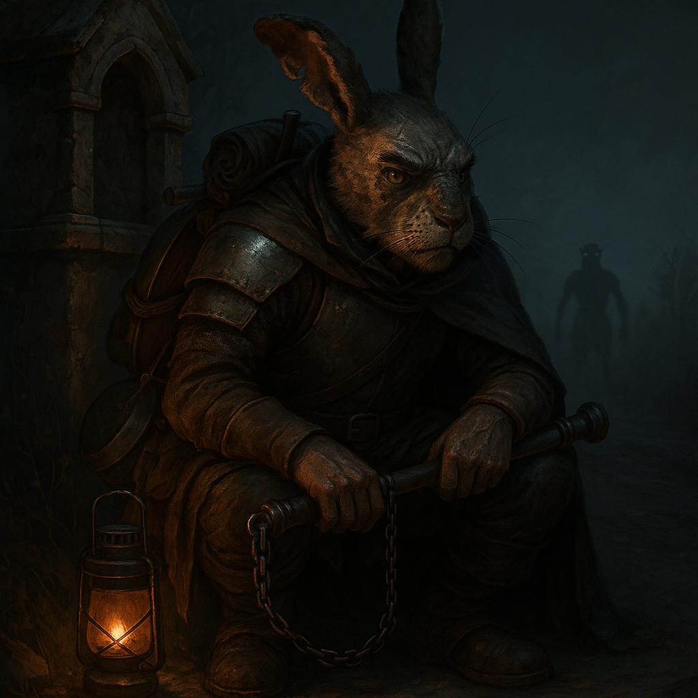

# Donner

{ width="300" }

> *“Don’t thank me for saving your ass. Train harder.”*

---

⚠️ **Content Warning**: Donner’s backstory and gameplay notes involve **horror themes**, including survivor’s guilt, graphic descriptions of death, and a haunting Revenant antagonist in the style of [It Follows](https://sv.wikipedia.org/wiki/It_Follows). Please ensure this is appropriate for your table. Tone down or reframe details as needed to keep play comfortable for everyone.

---

## Character Overview

|                   |                                      |
| ----------------- | ------------------------------------ |
| **Class & Level** | Fighter (Battle Master) 4            |
| **Background**    | Farmer                               |
| **Race**          | Harengon                             |
| **Alignment**     | Lawful Evil                          |
| **Role**          | Defensive tactician, grim survivor, party cook |

A gruff harengon who survived too many reckless charges under a Lawful Stupid so-called hero, Donner learned to value preparation, pragmatism, and kale stew over glory and fortune. He fights like a demon, thinks like a cynic, and lives with the guilt of the choices that kept him breathing.

---

## Personality

* Cynical survivor, convinced luck is a lie and only wits and planning matter.
* Holds others to tough-love pragmatism: eat right, fight smart, no excuses.  
* Haunted by what he sacrificed to escape the Revenant.  
* Wants to live, but expects fate to catch up eventually.  
* Most likely party member to force-feed someone carrot stew “because it’ll keep you alive, dammit.”  

---

## PDF Character Sheet

📄 [Download full character sheet](assets/donner.pdf)

---

## Gameplay Notes

??? info "Playing Donner effectively"
	- **Voice & Vibe**: Donner’s tone is blunt, sardonic, with a streak of gallows humor. He’s the “adult in the room,” skeptical of grand heroics, but still the one who’ll drag you back to safety. His harengon traits lean more into the constant vigilance of a prey animal and less into the whimsy of the Fey. Later on, consider whether Donner stays Lawful Evil or if his time with the party influences his worldview.
	- **Tactics**: He thrives on control. Use weapon masteries (Topple, Push, Sap, Slow) to disrupt enemies, while Riposte punishes missed attacks. Shield + flail raises his AC when defense matters most. He’s slippery for a Fighter, leaning into Harengon mobility. He won’t hesitate to retreat if it means survival: roleplay this as ruthless pragmatism, not cowardice.  
	- **Survivor and mechanics**: Check with the table how much you want to lean into the suggested Haunting mechanics. They can be very punishing and take up some time at the table. If you still want to play into them, agree with your DM on proper compensation, and with the table on how to make Donner's survival into a fun group effort.
	- **Flavor hook**: Donner cooks. Lean into food as his language of care: kale, stews, cheap rations that keep you going. It’s his way of showing gruff affection.

??? danger "DM Guidance"
	- **The Revenant**: Central to Donner’s arc. It’s not just another undead monster. As an ancient Lizardfolk stalker, it embodies his worldview of "eat or get eaten", and the haunting has symbolic dimensions for Donner as a character. Also try to make encounters memorable for the whole party, so it doesn't turn into a solo event.
	- **Horror balance**: Check in with the table before describing the Revenant’s kills. The sheet offers highly graphic text; use discretion and tone to match your group.  
	- **Survivor’s guilt**: Donner’s darkest secret is that he bought his survival by sacrificing another. Whether this truth emerges is a campaign-defining choice.
	- **Redemption or doom**: Build arcs around whether Donner accepts guilt, seeks forgiveness, or doubles down. Possible endpoints include defeating the Revenant, reconciliation with those he betrayed, or being dragged under by his own philosophy.

---

## Stat Snapshot

```text
STR 18 (+4)   DEX 14 (+2)   CON 14 (+2)
INT 10 (+0)  WIS 12 (+1)   CHA 8 (-1)

HP 44   AC 16 (shield bump as needed)   Speed 30 ft
Proficiency Bonus +2
Spell Save DC —   Spell Attack —
```
