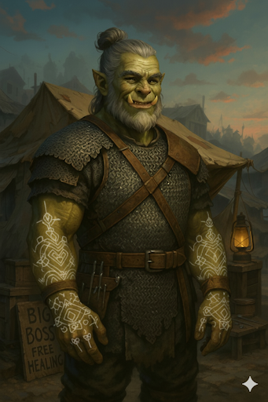

# Geldok Iron Tusk

{ width="300" }

> *"Ya telling me I was wrong ta smack dat boys fuckwad dad over'is head? Like clerics should stick ta healin' an preachy wurds? Fuck dat. I'm 'ere cuz the Big Boss told me. If all went along with them fine Gads' plans they wouldn't need guys like me in da first place. I'm not lookin' fer signs. I AM the sign."*

**Ex-raider turned unlikely cleric of the mysterious "Big Boss". Street-corner theologist who doesn't believe in preaching, instead opting to be a healer and problem solver for the little guy.**

---

## Character Overview
- **Species:** Orc
- **Class:** Cleric 5 (Life Domain)  
- **Background:** Reformed Raider
- **Age:** 52
- **Alignment:** Neutral Good

??? info "Quick Intro"
    
    **At the Table**
    
    * Undeniably 'Orcish' yet compassionate healer who treats the smallfolk for free 
    * Not institutional religion, and fears no mortal hierarchy as he answers only to the 'Big Boss'.
    * The party's tough-love medic and moral anchor who doesn't need scripture (and doesn't read too well anyhow) to know his God is with him.
    
    **Backstory (Short Form)**
    
    Geldok was mocked as weak by his raiding clan for decades because he lacked bloodlust. When a raid targeted plague refugees, he finally snapped—turning his weapon on his own kin to protect the innocent. Fleeing into the wilderness, he discovered a forgotten shrine and became a cleric of the mysterious "Big Boss," finding purpose in healing and liberating rather than raiding.
    
    **Playing Geldok**
    
    * **Combat:** Tanky old healer who refuses to go down easily, providing *big* healing and occasional mace to face.
    * **Roleplay:** A gruff Orc who is still pedantic about cleanliness, calls out bullshit without fear, and is an excellent judge of character. Distrusts any technology more advanced than a four-wheel wagon, and prefers street-level direct aid to saving kingdoms.
    * **Party Synergy:** The sane adult everyone wishes they had in their life as a kid—tough, fair, kind, and unafraid to do what's right.

---

??? info "Deep Dive"
    
    ### Full Backstory
    
    Geldok was never a good raider. Strong in the arms, but soft in the gut. That was the verdict of clan Iron Tusk when he came of age. Wherever he went, the sneers followed. The orc women passed him by, preferring the violent, assertive types.
    
    Worst was Kigra, ringleader of the clan women who took it upon themselves to constantly berate him, give him mocking gifts symbolizing his weakness and reminding him he'd be alone for all his days.
    
    For a time, he tried to prove them wrong. He led charges, bellowed louder than the rest, struck with all his might. But the bloodlust never came. When a defender begged for mercy, his strike faltered. He'd knock them aside with the flat of his weapon, press on. For all his attempts to prove himself, the clan only saw weakness. They mocked his efforts, turned his name into a running gag. For years he believed them. Tried harder. Failed harder. Cursed his "soft gut." It took him half a lifetime to understand the truth, that he was never meant to be a raider because he didn't thirst for power over anyone.
    
    The weird being only known as Big Boss (because that's what Geldok calls it) waited long for him to finally lean into his inner nature, at a raid gone wrong. A merchant's caravan turned out to be mostly women and children, refugees from a town visited by the plague. The raiders moved to cut the lot of them down, when Geldok finally made his decision, and turned his blade on his kin. In a snap, that ferocity he had never felt was his to wield. His mace caught divine fire, caving in the heads of two raiders before the rest backed off, letting the caravan escape. He fled into the night, knowing the Iron Tusks would hunt him for the rest of his days. In his despair, he found himself drawn to a nearby cave, thinking it may provide shelter for the night.
    
    Inside, he found a forgotten shrine to a nameless entity. It called for him, and so, with nothing else to hold onto in life, he held out his hands and grabbed it. Holy flames seared a mystical pattern onto his hands and forearms. He'd been accepted to live and die for whatever mysterious deity he had found. For lack of better words, he named it the Big Boss, and has never looked back since. What his clan called weakness eventually became his strength, when he found his personal faith. In the quiet of a healer's tent, binding wounds for folk who could never pay him, he finally learned what having a purpose feels like.
    
    ### Personality & Psychology
    
    Geldok is not institutional religion, he's street-corner religion. No robes of office, no sermons about waiting for signs, obedience or pie in the sky. He's the guy who'll reset your arm, give your kid a honey treat, and then stomp into your house and deal with the bastard landlord's goons or abusive husband who broke that arm in the first place. He's Friar Tuck, Uncle Iroh, the retired veteran who runs your local boxing gym, and knows whether it's time for tea or whisky.
    
    On downtime, his Orc manners give way to pedantic cleanliness as he sets up his tent and invites patients, faithfully in every town and village he visits. It's about setting up a small sacred space where you're seen as important no matter where you come from in society; the smallfolk deserve better than sitting in someone else's blood or pus. He also knows full well that many in the smallfolk don't trust him initially. Whether setting broken bones or treating coughs, he's gruff but compassionate, like that sane, assertive adult every abused kid wished they had in their life. Tough, fair, no time for verbal sparring, no respect for lofty titles. He only answers to the Big Boss. Mortal hierarchies are dust to him.
    
    Geldok is an excellent judge of character who will call others out without fear. He's been training his entire life at playing into a tough Orc facade. With his high Insight, he's not easily intimidated or unbalanced. He's no stranger to violence, even though it never held any appeal to him. 
    
    Does Geldok still remember the abuse he suffered at the hands of his clan, especially the women? Of course. Does he resent the path they ultimately set him on today? Not at all. He thinks of them as fundamentally misguided, and their cruelty may still haunt his dreams on some nights. But when he wakes up, Big Boss is there to greet him again. He does not fear his old clan. He pities them.
    
    In his heart, Geldok realizes he knows little of the deity he serves. The Big Boss could be a merciful broken God who heals pain, a breaker of chains, or just a divine union rep. But so far Big Boss has been faithfully by his side, and only showed up once he accepted the purpose he already felt was true in his heart. It all has to mean something, and so Geldok has developed a fatalistic streak. He's spent half a lifetime pretending to be something he didn't really want to be. Why not spend the rest pretending to be something he believes in? If he works hard enough, maybe it becomes true.
    
    ### Character Traits
    
    **Personality traits:** Working class wisdom, simple humor, magnanimous, utterly unafraid and unimpressed by hierarchies and physical threats.
    
    **Ideals:** Cleanliness is respect for your body and others. The Big Boss provides. 
    
    **Bonds:** Clan Iron Tusk hasn't forgotten... But there are so many others who matter more. 
    
    **Flaws:** Bit of a pedant, sticks to his guns, has a fatalistic streak. *Very bad* with machinery and needs help manipulating even simple contraptions. Has a deep distrust of Warforgeds.
    
    ### Sample Quotes
    
    "Ere's a bad rotted toof. Gotta pull it. Sum big hurt now, but none in the morrow. Gargle this. Orc rum like momma used to make it. Burns nice, don't it?"
    
    "Ya come limpin' in my tent, ya get patched. Don't care if yer a prince or a pig thief. Well... if yer princely ye pay."
    
    "Mercy don't mean soft. Mercy means stoppin' when ya coulda kept goin'."
	
	"Back when, I used ta mill grain muscle-wise, wit a stone pestle. Ye smell when it's dun, when grit's gone soft. I dun trust these windmills. How's da wind to know when the grain's proper done?"
    
    "Never seen an Orc up close before have ya, lass? Jus relax, tusks're for show. Mostly. What's yer ail today? If yer good and yer momma say so, ya can have a honey treat from da jar."
	
    "Big Boss told me, he says, 'set them broken bones an talk straight to da tax collector. Prayer's gravy.' Dat's wut vindication is all about."
    
	"Who is Big Boss? I dunno. He's in my heart, not my head. I dun trust preachers wut have everything explained. Dat's too neat."
	
	"Lad... yer ma didn't make it. No words. Sumtimes life's not meant ta keep goin'. She said she luvs ye very much. Come'ere. I'll take ye home."
	
	---
	
	### Playing Geldok: Group Dynamics
	
	Geldok's big redemption is behind him. He's not traumatized, doesn't require much emotional investment from the group. He's a giver and a stabilizing force. Justify joining a party if they seem to need a healer, or maybe the Big boss just comes to you and tells you they need you. Geldok may not even really be up for it initially, depending on the party, but he trusts Big Boss. Geldok can easily default to being the party’s conscience. If you want to introduce tensions, you can play to Geldok's fatalism. Maybe the big battles seem too abstract for him? Maybe he doesn't truly care if the kingdom collapses, as long as he gets to keep helping the little guy?
	
	---
	
    ### Historical Inspiration: The White Feather Campaign
    
    Kigra's systematic humiliation of Geldok was inspired by the WWI White Feather campaign, where British women publicly shamed men not in uniform by giving them white feathers symbolizing cowardice. Like that campaign, Kigra's mockery was organized, socially sanctioned enforcement of martial culture using sexual rejection as a weapon. She likely believed she was maintaining clan strength and ensuring only "real warriors" reproduced.
    
    Geldok faced organized, ongoing public humiliation and sexual derision, designed to force compliance with violent norms for the clan's males. His "mocking gifts" were the orc equivalent of white feathers: tokens that said "you are not a man, you will never be worthy of any of us, we collectively reject you, and we'll make sure everyone knows."
    
    When Geldok intervenes with abusive husbands today, he's not just enforcing his moral code, he's confronting the consequences of the culture Kigra helped maintain. She wanted violent men. She got them. Some became raiders, others became abusers. To Geldok, this is not just about helping a woman out, it's about cleaning up what that culture of violence produces, while offering an alternative model of strength: protection without domination, violence with purpose, mercy as connection with your true values rather than weakness.

---

??? info "Key Relationships"
	
	- **Ilyra Vane, Aasimar Scholar of Comparative Faith**: Ilyra Vane is a fifty-something Aasimar attached to a secular university, a specialist in religious life and sociology rather than doctrine. She is calm, precise, and notably unimpressed by spectacle. She has sought Geldok out twice already, conducting long, careful interviews in which she asks how his faith functions rather than what it claims. She neither flatters nor interrogates him, and she never asks him to justify himself. Ilyra treats Geldok as a serious moral actor, not a curiosity, and that unsettles him more than hostility ever could. Their conversations are slow, respectful, and strangely intimate, grounded in mutual clarity rather than agreement. When she leaves, she always thanks him for his time, as if it were something valuable he chose to give.
	
	- **Anwar the Radiant**: Anwar is a young, fiery, itinerant Monk of the Order of Mercy, a former street performer turned warrior-mystic who believes discipline is dignity and divine power should *maybe* guide and *never* carry. She respects Geldok’s compassion and his refusal to bow to hierarchy, but openly questions his reliance on divine “shortcuts,” seeing clerical healing as a form of spiritual dependency that risks leaving people passive and unprepared. Her own order can also heal the sick, and even raise the dead, but they do it for *real*, by themselves. They don't just bow their head and ask a daddy in the sky to solve problems for them with cheat magic. Anwar does not mock Geldok or doubt his sincerity, instead she challenges him as an equal, arguing that true mercy lies in teaching people to stand on their own feet rather than catching them every time they fall. Their disagreements are sharp but grounded in mutual respect, and neither can dismiss the other as naïve without also discarding something they themselves believe.
	
	- **Captain Marrec Holt**: *"What do you think would happen if your 'Big Boss' stopped answering one day? We're not so different, you and I."* Marrec Holt is a disgraced former guard captain turned tavern fixture, a heavy drinker with quick hands and a stubborn sense of duty. Once an idealist who tried to protect the weak through the system, he was slowly ground down, betrayed, and discarded. What remains is a man who still steps in when bullies pick on someone smaller, even if it means taking the beating himself. Marrec is fatalistic, self-destructive, and quietly proud of his endurance: every punch he absorbs is time bought for someone else to escape. He frequently comes to Geldok to be patched up, never asking for absolution and never expecting things to improve.

	- **Kigra**: The ringleader of the Iron Tusk clan women who saw it as their role to police the gentler men in the community. Looking back at the decades of abuse today, Geldok recognizes her aggression as aspiration for leadership roles in the clan. She needed a problem to fix in order to seem worthy of recognition, and Geldok fit that need well. His final act of aggression, turning against his own clan, likely strengthened Kigra's position as she had been the clearest voice claiming "something was wrong" with him. 
	
---

??? danger "Notes for the DM"
	
	## Dramatic Questions
	
	- *If a scholar on religion identifies Geldok's god as something he didn't expect or doesn't agree with, can Geldok deal with theological controversy even if he isn't book smart?*
	- *Marrec's Challenge: If the Big Boss goes unexplainably silent, no visions, no reassurance, only the work, does Geldok continue as a Cleric? And if he does, is it because he believes, or because he no longer knows how to stop?*
	- *When catastrophe strikes on a scale Geldok cannot meaningfully affect—plague, war, famine—can he still believe his street-corner faith matters, or does the smallness of his work finally break something in him?*
	
	## Playing Geldok
	
	Play Geldok as a rarity. Children NPC's visiting his healer's tent are wide-eyed and wary. Authorities suspect him of foul play and constantly hound him. Consider homebrewing an Intimidation skill specifically for clerical matters, such as calling someone out for being complacent about their life choices, or defending a kid against abusive parents. If the player wants to lean into this side of Geldok, maybe offer to switch a proficiency to Intimidate, and calculate it off Geldok's WIS or STR ability modifier instead of CHA.
	
	Use Geldok's healing tent as opportunity to let the party know quest and plot hooks, rumors etc. from people who come for healing.
	
	## Plot Hooks
	
	- **False Healer Frame-Up:** Geldok sets up his healer's tent but is taken by local guards. False healers and snake oil salesmen have been scamming the local smallfolk and Geldok is mistaken for one of them. He and the party can clear his name if they can find the real culprits. A darker twist on this hook is that the *legitimate* healers' guild complains that Geldok undercuts them by healing for free.
	
	- **Mystery of the Big Boss:** The mystery of Geldok's deity. This may be one of the major gods in the Pantheon you play with, or it can be an entirely new deity, possibly from an orc clan preferring to live in balance with nature instead of raiding and pillaging. You can pull the levers in many directions with this.
	
	- **Reckoning with Clan Iron Tusk:** The Iron Tusks and Kigra are still out there. She has achieved a prominent position in clan Iron Tusk and sees Geldok as an opportunity to advance further, to Matriarch. News of the "Orc Healer" has spread, and she intends to put him down for good, preferrably making it a spectacle in honor of the dead raiders Geldok killed. By intensifying their raids but now *not outright killing the smallfolk*, only maiming and injuring them, they can drown Geldok and other healers in wounded, force him to choose who gets healed, exhaust his resources, make him fail publicly. It's psychological warfare designed specifically to break a healer, and it positions her as someone who's been studying him for years, waiting for the right moment. This forces a confrontation Geldok may have been avoiding, a reckoning where he finally faces his past. But that confrontation will be about much deeper questions than who wins or loses: Will he be able to teach his clan about mercy, or will they find ways to disprove his tenets once and for all? This will ultimately be a battle of Orc theology.
	
	- **Guild Corruption & Justice:** Geldok learns of a town where the poor are being denied medicine by a greedy guild or a corrupt official. The Big Boss isn't just about healing wounds, but about healing communities. Geldok feels a calling to intervene, not just as a healer, but as a "problem solver" who ensures the "smallfolk" get justice, even if it means caving in a few helmets.
	
	## Key Relationships and Dynamics
	
	**Ilyra Vane** represents a form of temptation Geldok is not trained to recognize: rest, reflection, and being understood and respected without being needed. With her, he is not required to act, fix, heal, or confront. She gives him language for what he does—“practice,” “ethic,” “embodied belief”—without claiming ownership of it. By talking with her, Geldok learns about himself, and gets to put his faith into words for real. This is not a romance by default, and it is likely stronger if it remains unresolved. The tension lies in their asymmetry: Ilyra can leave, write, and return to a life of contemplation, while Geldok remains embedded in consequence and immediacy. 
	
	**Anwar the Radiant** challenges Geldok about methods, not outcomes. She wants fewer broken bodies, fewer abused people, fewer crushed lives, just as he does. Where they differ is in what happens after the immediate crisis. Geldok intervenes, heals, and confronts abusers directly. Anwar heals, then insists on discipline, agency, an actionable plan and long-term self-reliance, even if it makes people uncomfortable or resentful. She views repeated rescue without transformation as a moral failure, while Geldok views refusal to intervene as complicity.
	
	Importantly, Anwar is not cruel, ableist, or dismissive of real limits. She helps the sick and disabled without hesitation. Her harshness is philosophical, not personal. This prevents the conflict from collapsing into caricature. At the table, Anwar should argue calmly and persistently, not shout. She is most effective when she asks pointed questions: “How many times will you patch the same man before you teach him to stop kneeling?” or “If the Big Boss is justice, why does he need you to do everything for them?”
	
	Anwar also embodies a form of judgment that is new to Geldok: a young woman who is unimpressed by his role, not because she despises him, but because she believes mercy without empowerment is incomplete. This forces Geldok to examine whether his calling risks becoming paternalistic, even when it is kind. The DM can use Anwar to press on questions of dependency, dignity, and whether weakness in the moment absolves one of long-term responsibility.
	
	**Captain Marrec Holt**: Where Geldok walks with purpose and faith, Marrec stands as proof that courage alone is not enough if your system of belief collapses. When Geldok heals Marrec, they ultimately enter a quiet argument about the nature of despair. And Marrec, without intending to, keeps asking the most dangerous question of all: "What happens the day your Big Boss doesn't respond?" Importantly, Marrec is not there to be saved by Geldok. If he gets better during the campaign, it should be slow, uneven, and incomplete. If he doesn’t, that’s fine. He is meant to be a mirror to challenge Geldok and show what lies beyond the cliff edge. To remind him that not all get to find that peace in their lives, and you can't take it for granted.
		
---

??? info "Mechanical build (lv 5) and PDF download"

	| STR | DEX | CON | INT | WIS | CHA |
	|:---:|:---:|:---:|:---:|:---:|:---:|
	| 14 (+2) | 10 (+0) | 16 (+3) | 8 (-1) | 18 (+4) | 8 (-1) |
	
	## Combat Stats
	
	| AC | HP | Hit Dice | Speed | Initiative | Prof. Bonus |
	|:---:|:---:|:---:|:---:|:---:|:---:|
	| 18 | 53 | 5d8 | 30 ft. | +0 | +3 |
	
	**Saving Throws: Wisdom: +7, Charisma: +2**
	
	## Proficiencies
	**Skills**: Athletics +5, Insight +7, Medicine +7, Persuasion +2
	
	**Armor**: Light Armor, Medium Armor, Heavy Armor, Shields | **Weapons**: Simple Weapons, Martial Weapons
	
	**Tools**: Herbalism Kit | **Languages**: Common, Orc, Goblin
	
	## Feats
	- **Tough**: +2HP/level
	- **War Caster**: Can ignore Somatic spell components, Use Spells on Opportunity Attacks, have Advantage on Concentration checks
		
	## Equipment
	Chain Mail, Mace, Holy Symbol, Healer's Kit, Herbalism Kit, Shield
	
	**Suggested Magic Items**
		
	- Periapt of Wound Closure (Uncommon, Attunement, always succeeds on Death Saving Throws, Regain double HP from Hit Dice: Geldok is all about making sure everybody lives, and he needs to be alive to make it happen)
	- Pearl of Power (Uncommon, Attunement, restores one 3rd level spell per day, for panic Revivify)
	- Pole of Angling (Common, a pole that can magically turn into a fishing rod because of course Geldok likes to fish)
	- Amulet of the Devout +1 (Common, Attunement, +1 bonus to spell attack rolls and Spell Saving throw DC)
	
	## Spellcasting
	
	- **Cantrips**: Guidance, Spare the Dying, Thaumaturgy, Word of Radiance
    - **Level 1**: Bless, Command, Cure Wounds, Sanctuary, Guiding Bolt, Shield of Faith
	- **Level 2**: Aid, Calm Emotions, Lesser restoration, Prayer of Healing, Spiritual Weapon
	- **Level 3**: Daylight, Mass healing Word, Revivify, Spirit Guardians
	
	## Reformed Raider Background
	
	Reformed Raider background is basically just Farmer Background with the following changes: Swapped Carpenter's Tools for Herbalism Kit, swapped out the skills *Animal Handling* and *Nature* for *Athletics* and *Persuasion*.

	
	📄 [Download Level 5 Character Sheet (PDF)](assets/geldok-iron-tusk-lv5.pdf)

---

??? danger "**Session Zero Considerations**"
    
    **Content Notes:** Contains themes of organized social rejection, sexual derision as a weapon, domestic abuse (as context for Geldok's interventions), and violence against abusers. Suitable for mature tables comfortable with exploring trauma, toxic masculinity, and cycles of violence.
    
    **Representation Notes:** Geldok represents an alternative model of masculinity and strength—rejecting toxic warrior culture for compassionate problem-solving. His story addresses organized social cruelty and its long-term psychological effects.

---