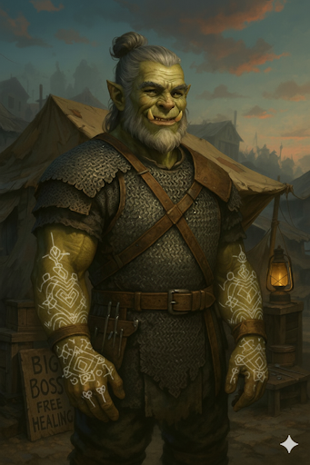

# Geldok Iron Tusk

{ width="300" }

> *"Ya telln me I was wrong ta smack dat boys fukwad dad over is head? Dat clerics shud stick ta healin' an preachy wurds? Fuk dat. I'm 'ere cuz the Big Boss told me to. If all went along with them fine Gads' plans they wuldn' need guys like me in da first place. I'm not lookin' fer signs. I AM the sign."*

**Ex-raider turned unlikely cleric of the Big Boss; more of a streetcorner "problem solver" than mainstream faith healer.**

*Keywords: Street-corner religion, Reformed warrior, Working-class divine, Problem solver, Orc healer*

---

## Character Overview
- **Species:** Orc
- **Class:** Cleric 5 (Life Domain)  
- **Background:** Reformed Raider
- **Age:** 52
- **Alignment:** Neutral Good

??? info "Quick Intro"
    
    **At the Table**
    
    * Gruff but compassionate healer who treats the smallfolk for free
    * Not institutional religion—he's the guy who'll reset your arm, give your kid a honey treat, then deal with the bastard who broke that arm
    * Fears no mortal hierarchy; pities his old clan more than he resents them
    * The party's tough-love medic and moral anchor who doesn't need scripture to know his god is with him.
    
    **Backstory (Short Form)**
    
    Geldok was mocked as weak by his raiding clan for decades because he lacked bloodlust. When a raid targeted plague refugees, he finally snapped—turning his weapon on his own kin to protect the innocent. Fleeing into the wilderness, he discovered a forgotten shrine and became a cleric of the mysterious "Big Boss," finding purpose in healing and liberating rather than raiding.
    
    **Playing Geldok**
    
    * **Combat:** Tank and healer who wades into danger to protect others; uses divine fire when violence serves mercy
    * **Roleplay:** Think Friar Tuck meets Uncle Iroh—gruff Orc dialect, pedantic about cleanliness, calls out bullshit without fear, excellent judge of character
    * **Party Synergy:** The sane adult everyone wishes they had in their life as a kid—tough, fair, kind, and unafraid to do what's right

---

??? info "Deep Dive"
    
    ### Full Backstory
    
    Geldok was never a good raider. Strong in the arms, but soft in the gut. That was the verdict of clan Iron Tusk when he came of age. Wherever he went, the sneers followed. The orc women passed him by, preferring the violent, assertive types.
    
    Worst was Kigra, ringleader of the clan women who took it upon themselves to constantly berate him, give him mocking gifts symbolizing his weakness and reminding him he'd be alone for all his days.
    
    For a time, he tried to prove them wrong. He led charges, bellowed louder than the rest, struck with all his might. But the bloodlust never came. When a defender begged for mercy, his strike faltered. He'd knock them aside with the flat of his weapon, press on. For all his attempts to prove himself, the clan only saw weakness. They mocked his efforts, turned his name into a running gag. For years he believed them. Tried harder. Failed harder. Cursed his "soft gut." It took him half a lifetime to understand the truth, that he was never meant to be a raider. He didn't thirst for power over anyone.
    
    The Big Boss waited long for Geldok to finally lean into his inner nature, at a raid gone wrong. A merchant's caravan turned out to be mostly women and children, refugees from a town visited by the plague. The raiders moved to cut the lot of them down, when Geldok finally snapped and turned his blade on his kin. Suddenly, ferocity was his to wield. His mace caught divine fire, caving in the heads of two raiders before the rest backed off, letting the caravan escape. He fled into the night, knowing the Iron Tusks would hunt him for the rest of his days. In his despair, he found himself drawn to a nearby cave, thinking it may provide shelter for the night.
    
    Inside, he found a forgotten shrine to a nameless entity. It called for him, and so, with nothing else to hold onto in life, he held out his hands and grabbed it. Holy flames seared a mystical pattern onto his hands and forearms. He'd been accepted to live and die for whatever mysterious deity he had found. For lack of better words, he named it the Big Boss, and has never looked back since. What his clan called weakness eventually became his strength, when he found his personal faith. In the quiet of a healer's tent, binding wounds for folk who could never pay him, he finally learned what having a purpose feels like.
    
    ### Personality & Psychology
    
    Geldok is not institutional religion, he's street-corner religion. No robes of office, no sermons about patience or obedience or pie in the sky. He's the guy who'll reset your arm, give your kid a honey treat, and then stomp into your house and deal with the bastard landlord's goons or abusive husband who broke that arm in the first place. He's Friar Tuck, Uncle Iroh, the retired veteran who runs your local boxing gym, and knows whether it's time for tea or whisky.
    
    On downtime, his Orc manners give way to pedantic cleanliness as he sets up his tent and invites patients, faithfully in every town and village. As an Orc Cleric Geldok knows full well that many in the smallfolk don't trust him initially, but he doesn't take it personally. He trusts that they'll come around. He provides healing for the smallfolk, free of charge. Whether setting broken bones or treating coughs, he's gruff but compassionate, like that sane, assertive adult every abused kid wished they had in their life. Tough, fair, no time for verbal sparring or lofty titles. He serves the Big Boss. Mortal hierarchies are dust to him.
    
    Geldok is not a "pastoral shepherd" leaving fate in the hands of the Gods, waiting for signs and preaching about rewards in the afterlife. He's an excellent judge of character who will call others out without fear. He's been training his entire life at playing into a tough Orc facade. With his high Insight, he's not easily intimidated or unbalanced. He's no stranger to violence, but it never had any real appeal to him. What he does like is the feeling of making a difference, here and now. If he gets involved in a case of domestic abuse, he will not only be a healer, but a problem solver... leaning into his more Orcish side if need be.
    
    Does Geldok still remember the abuse he suffered at the hands of his clan, and especially the women? Of course. Does he resent the path they ultimately set him on today? Not at all. He thinks of them as fundamentally misguided, and their cruelty may still haunt his dreams on some nights. But when he wakes up, Big Boss is there to greet him again. He does not fear his old clan. He pities them.
    
    In his heart, Geldok realizes he knows little of the deity he serves. The Big Boss could be a divine union rep calling out people who abuse power, a merciful broken God who heals pain, or a breaker of chains. But so far it has been faithfully by his side, and it only showed itself once he found purpose in his heart. It all has to mean something. He's spent half a lifetime pretending to be something he didn't really want to be. Why not spend the rest pretending to be something he believes in? Truth isn't always given. Sometimes you gotta work for it.
    
    ### Character Traits
    
    **Personality traits:** Working class wisdom, simple humor, magnanimous.
    
    **Ideals:** Cleanliness is respect for your body and others. The Big Boss provides.
    
    **Bonds:** Clan Iron Tusk hasn't forgotten...
    
    **Flaws:** Bit of a pedant, sticks to his guns.
    
    ### Sample Quotes
    
    "Ya telln me I was wrong ta smack dat boys fukwad dad over is head? Dat clerics shud stick ta healin' an preachy wurds? Fuk dat. I'm 'ere cuz the Big Boss told me to. If all went along with them fine Gads' plans they wuldn' need guys like me in da first place. I'm not lookin' fer signs. I AM the sign."
    
    "Ere's a bad rotted toof. Gotta pull it. Sum big hurt now, but none in the morrow. Gargle this. Orc rum like momma used to make it. Burns nice, don't it?"
    
    "Ya come limpin' in my tent, ya get patched. Don't care if yer a prince or a pig thief. Well... if yer princely ye pay."
    
    "Mercy don't mean soft. Mercy means stoppin' when ya coulda kept goin'."
    
    "Never seen an Orc up close before have ya, lass? Jus relax, tusks're for show. Mostly. What's yer ail today? If yer good and yer momma say so, ya can have a honey treat from da jar."
    
    "Big Boss told me, he says, 'set them broken bones an talk straight to da tax collector. Dat's wut vindication looks like. Prayer's gravy."
    
    ### Historical Inspiration: The White Feather Campaign
    
    Kigra's systematic humiliation of Geldok was inspired by the WWI White Feather campaign, where British women publicly shamed men not in uniform by giving them white feathers symbolizing cowardice. Like that campaign, Kigra's mockery was organized, socially sanctioned enforcement of martial culture using sexual rejection as a weapon. She likely believed she was maintaining clan strength and ensuring only "real warriors" reproduced.
    
    This context matters: Geldok didn't just face individual rejection, he faced organized, ongoing public humiliation and sexual derision, designed to force compliance with violent norms for the clan's males. His "mocking gifts" were the orc equivalent of white feathers: tokens that said "you are not a man, you will never be worthy of any of us, we collectively reject you, and we'll make sure everyone knows."
    
    When Geldok intervenes with abusive husbands today, he's not just enforcing his moral code, he's confronting the consequences of the culture Kigra helped maintain. She wanted violent men. She got them. Some became raiders, others became abusers. To Geldok, this is not just about helping a woman out, it's about cleaning up what that culture of violence produces, while offering an alternative model of strength: protection without domination, violence with purpose, mercy as discipline rather than weakness.

---

??? danger "Notes for the DM"
	
	### Playing Geldok
	
	Play Geldok as a rarity. Children NPC's visiting his healer's tent are wide-eyed and wary. Authorities suspect him of foul play and constantly hound him. Consider homebrewing an Intimidation skill specifically for clerical matters, such as calling someone out for being complacent about their life choices, or defending a kid against abusive parents. If the player wants to lean into this side of Geldok, maybe offer to switch a proficiency to Intimidate, and calculate it off Geldok's WIS or STR ability modifier instead of CHA.
	
	Use Geldok's healing tent as opportunity to let the party know quest and plot hooks, rumors etc. from people who come for healing.
	
	### Plot Hooks
	
	- **False Healer Frame-Up:** Geldok sets up his healer's tent but is taken by local guards. False healers and snake oil salesmen have been scamming the local smallfolk and Geldok is mistaken for one of them. He and the party can clear his name if they can find the real culprits. A darker twist on this hook is that the *legitimate* healers' guild complains that Geldok undercuts them by healing for free.
	
	- **Mystery of the Big Boss:** The mystery of Geldok's deity. This may be one of the major gods in the Pantheon you play with, or it can be an entirely new deity, possibly from an orc clan preferring to live in balance with nature instead of raiding and pillaging. You can pull the levers in many directions with this.
	
	- **Reckoning with Clan Iron Tusk:** The Iron Tusks and Kigra are still out there. When they start hearing about a wandering Orc cleric they will surely decide to lure him out, for instance by intensifying their raids. At some point there will have to be a reckoning where Geldok faces his past. But that confrontation will be about much deeper questions than who wins or loses: Will he be able to teach his clan about mercy, or will they find ways to disprove his tenets once and for all? This will ultimately be a battle of Orc theology.
	
	- **Guild Corruption & Justice:** Geldok learns of a town where the poor are being denied medicine by a greedy guild or a corrupt official. The Big Boss isn't just about healing wounds, but about healing communities. Geldok feels a calling to intervene, not just as a healer, but as a "problem solver" who ensures the "smallfolk" get justice, even if it means caving in a few helmets.
	
	### Reformed Raider Background
	
	Reformed Raider background is basically just Farmer Background with the following changes: Swapped Carpenter's Tools for Herbalism Kit, swapped out the skills *Animal Handling* and *Nature* for *Athletics* and *Persuasion*.
	
---

??? info "Mechanical build (lv 5) and PDF download"

	| STR | DEX | CON | INT | WIS | CHA |
	|:---:|:---:|:---:|:---:|:---:|:---:|
	| 14 (+2) | 10 (+0) | 16 (+3) | 8 (-1) | 18 (+4) | 8 (-1) |
	
	## Combat Stats
	
	| AC | HP | Hit Dice | Speed | Initiative | Prof. Bonus |
	|:---:|:---:|:---:|:---:|:---:|:---:|
	| 18 | 53 | 5d8 | 30 ft. | +0 | +3 |
	
	**Saving Throws: Wisdom: +7, Charisma: +2**
	
	## Proficiencies
	**Skills**: Athletics +5, Insight +7, Medicine +7, Persuasion +2
	
	**Armor**: Light Armor, Medium Armor, Heavy Armor, Shields | **Weapons**: Simple Weapons, Martial Weapons
	
	**Tools**: Herbalism Kit | **Languages**: Common, Orc, Goblin
	
	## Feats
	- **Tough**: +2HP/level
	- **War Caster**: Can ignore Somatic spell components, Use Spells on Opportunity Attacks, have Advantage on Concentration checks
		
	## Equipment
	Chain Mail, Mace, Holy Symbol, Healer's Kit, Herbalism Kit, Shield

	📄 [Download Level 5 Character Sheet (PDF)](assets/geldok-iron-tusk-lv5.pdf)

---

??? danger "**Session Zero Considerations**"
    
    **Content Notes:** Contains themes of organized social rejection, sexual derision as a weapon, domestic abuse (as context for Geldok's interventions), and violence against abusers. Suitable for mature tables comfortable with exploring trauma, toxic masculinity, and cycles of violence.
    
    **Representation Notes:** Geldok represents an alternative model of masculinity and strength—rejecting toxic warrior culture for compassionate problem-solving. His story addresses organized social cruelty and its long-term psychological effects.

---