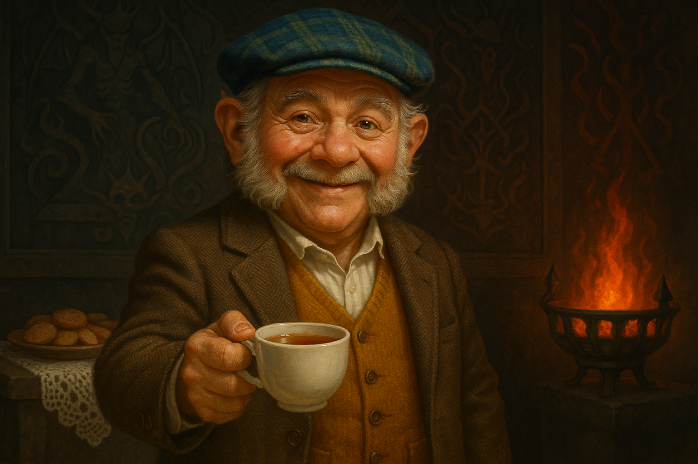

# Harold Carnap

{ width="300" }

> *"Who would have thought 'Harmless Harold' would turn out to be a sorcerer in his old days? Not me! But come to think of it, my great aunt Tilde used to claim a Brass Dragon fell in love with her in her youth. Maybe there's some truth to it all? Yes, true, I may not be her progeny, but these forces work in mysteries ways, do they not?"*

**Halfling Warlock grandpa who accidentally became a cult leader by turning blood rituals into potluck dinners and community daycare. May be an evil genius.**

---

## Character Overview
- **Species:** Halfling
- **Class:** Warlock 5 (Pact of the Fiend)  
- **Background:** Cloth Merchant (Homebrew)
- **Age:** 65
- **Alignment:** Lawful Good (?)

??? info "Quick Intro"
    
	**At the Table**
	
	* Devilishly wholesome—treats everyone like family and calls them "dear," "lad," "duck," or "my sweet"
	* Utterly oblivious to the demonic nature of his powers or the cult he accidentally reformed
	* Wants everyone to feel included; fears forgetting people's names, fastidious about tea breaks and lemon drops
	* The community organizer who somehow seamlessly combines demon worship with bake sale
	
	**Backstory (Short Form)**
	
	Harold joined what he thought was a historical reenactment group with excellent catering. Through relentless friendliness and organizational skills, he transformed an actual demon-worshipping cult into a thriving community center with Thursday quizzes, monthly baking events, and Wednesday daycare. When the original cult leader tried to make him perform a blood sacrifice Harold refused, shocked. The members sided with Harold.
	
	**Playing Harold**
	
	* **Combat:** Blaster Warlock with some staying power and uncannily good luck.
	* **Roleplay:** Chatty, agreeable, effortlessly likable, constantly finds ways to include new people in his activities. Treats even blatantly obvious instances of cosmic horror like entertaining misunderstandings or regrettable mishaps. Is trying to learn sign language in order to be a better host, but complains about onsetting arthritis.
	* **Party Synergy:** Natural face and morale booster who will absolutely invite the party to cult meetings (now seemingly regular town hall meetings but with creative chanting sessions).
	
---

??? info "Deep Dive"
    
    **Full Background**
    
    Harold Carnap lived an entirely ordinary life as a fabric and tailoring supplies merchant with a happy wife, children, and grandchildren. He started in the cult of the Crimson Veil believing it was a historical reenactment group with excellent catering (ambitious barbecues, period accurate braziers).
	
	The initial meetings were fun: costumed evenings, community gossip, and mysterious-but-pleasant toasts to "The Father." He comes across as a mundane soul, entirely oblivious to the world of religion. He doesn't remember signing anything important, maybe except for what he assumed to be the guestbook (*"Right lovely evening, look forward to come back soon, will bring wife and kids, you'll be the best of friends I'm sure! And something special from the shop. Harold Carnap"*). Now, he's a Pact of the Fiend Warlock.
	
	He quickly started introducing new social activities to the cult such as Thursday night quizzes with hot mead and monthly baking events, negotiated group rates for robes with the local tailor, and became the star recruiter by bringing slightly confused friends, relatives, and distant acquaintances to the meetings. He also made welcome bundles for new members: scented candles, fruit preserves, and a pamphlet with "Fun Facts About the Veil" (that he mostly made up, it's all in good reenactment fun anyway).
	
	The branch leader, Malvaric the Malevolent, made the fatal mistake of letting him continue his antics. Because not only did he bring in slews of people, things slowly started to change in the cult dynamics.
	
	Finally, Malvaric tried to make Harold perform a blood sacrifice of live animals to prove his loyalty. Harold, aghast, promptly refused. When Malvaric threatened him with excommunication and worse, the other cult members protested and together drove him out.
	
	Soon thereafter, Harold discovered he had developed magic powers. He took it as well as can be expected, making jokes about possible sorcerous bloodlines from one of his more adventurous ancestors. He's already entertained the idea of "taking up the adventuring life". After all, everything happens for a reason, and you're only 65 once. 
	
	Now the "cult" sees Harold as their leader and has shifted focus entirely. The older members still believe they worship the Father of Lies and believe Harold to be His Herald on earth, due to his effortless manipulation and perfectly innocent demeanor, bringing so many innocents to the fold. He's also introduced communal daycare groups for busy parents on Wednesdays in the cult HQ, which is very appreciated by the older members who think introducing the Father of Lies at an early age is clever indoctrination. They're now introducing "creative chanting," and the kids love it.
	
	In his hasty retreat, Malvaric forgot a trinket behind—an obviously cursed doll that chants litanies. Harold has repurposed it as a communal greeter, now using its creaky wooden voice to chant welcome phrases in the cult lobby.
    
    ## Playing the Harold Concept
    
    Harold could be parody: Blackadder absurdity meets Hobbiton's wholesomest grandpa. Double down on obliviousness and constant reframing of obvious evil into pastoral small-town drama. Rest easy with the suspicions of him being the most successful cult leader in the history of the town. Harold's "superpower" is that he likes people, not that he schemes. The ambiguity lies not in what he says and does, but in how others (especially terminally genre-savvy players with years of scrolling on Reddit and D&D-Tok) interpret him.

	Harold never meets a stranger. Everyone's "dear," "lad," "duck," or "good sir." He lives for making new acquaintances and sharing funny anecdotes about that one time when acolyte Tim, bless his heart, almost tipped over the brazier when he was going to barbeque those goat hearts. *"Not much of a chef that boy, but he likes heart-y food! Hah! Get it?"*
	
	Harold leaves discussions about demonic possessions and cosmic anomalies to others. Meanwhile, he plans the surprise party for the schoolchildren, plays with someone's baby or casts Suggestion on the lonely miller to make them join the candle-making class ("he could use the company!"). He struggles to be inclusive. He's even learning Common sign language, but complains he's developing arthritis and some signs hurt his index finger.
	
	Don't shy away from the visceral stuff. On the contrary, that contrast is the point. Cast Fear, Hunger of Hadar, Summon Lesser Demons. And of course be delightfully amiable to the Lesser Demons for the full hour they are summoned, while lamenting the poor band of hobgoblins you decimated together in absolutely gruesome fashion.
	
	If traveling with a party, workshop about why grandpa would hit the roads. Perhaps he constantly happens to have errands the same way the party is going. A rumor about new thread-dense fabrics in a nearby town to the quest objective, an impulse to visit a distant nephew twice removed (unfortunately the name slips his mind, but it's a fine young lad). Or create a more compelling reason: A grandchild has disappeared, or that nephew has been involved in the plot somehow and needs rescuing.
	
    **Personality Traits**
    Agreeable, chatty, helpful, cheerful, oblivious, insouciant, effortlessly likable and sincere in a way that suggests evil can find no purchase here.
    
    **Ideals**
    Civility, hospitality, community. Always expect the very best of others, and be patient with mistakes and accidents. We're all just people, nobody is perfect, and sincerity and hot mead wins the day.
    
    **Bonds**
    He has a large family: Wife Raphaela, children Howie, Milena and Rose, grandchildren Beithalda, Wilmina, Gasco, Dorian, Tilda, Anwar. He's friends with everyone, from street urchins to archdeacons, but is getting worse at remembering names, which worries him terribly.
    
    **Flaws**
    Possibly Evil Mastermind
    
    **Cloth Merchant Homebrew**
    Harold is a fabric and tailoring merchant by trade, not a traveling peddler, so the following adjustments were made to the Merchant background: Removed Navigator's tools and Animal Handling proficiency, added Investigation proficiency and Weaver's tools.
    
    **Sample Quotes**
    
	*"That doll? Bit dramatic, isn't she! Adds flair to the lobby like you wouldn't believe it. We do cover it up during daycare hours so the kids don't play with it."*

	*"Oh! That reminds me! I had the strangest dream last night—must have been the kidney pie. I was in a room with this big fellow, horns, wings, red all over. 'Harold old boy,' thinks I, 'you must be lucid dreaming! The children will be delighted to hear this at breakfast!' And this crooked thing starts talking, right garbled gobbledygook it was. So I said, 'My dear sir, I've always wanted to feel what it's like to fly, so if it's all the same to you, I'd rather grab the moment!' And get this—that's when I wake up. What a disappointment!"* 
	
	*"Am I what? Evil? Goodness no. I wouldn't even swear in front of the children, and they have children of their own now."*
	
	*"That was a right heartbreaking shame we had to dispatch those bandits in such a gruesome manner. What with all those dreadful tentacles? Righty-oh, look at the time! Is it tea already? Who wants a lemon drop?"*
	
	*"I'd never speak ill of anyone in their absence, but I must say, that Malvaric lad? Bless his heart, but he needs to learn animal husbandry. It may just have been reenactment, but you don't put down healthy livestock, even for the sake of the art. Why Rose, my youngest one, she's working dairy now. She wouldn't believe when I told her. Did you know he's from the city? They don't know the first thing about country life."*
	
---

??? info "Key Relationships"

	**Raphaela Carnap**: Just as oblivious and pleasant as Harold, but a lot more eager to change subject any time pacts and demons come up. She seems more savvy to what the Crimson Veil actually is, or was, but as long as her hubby is in charge, nothing bad could ever happen. She cheers him on and looks up to him, calling him "her darling wizard" and claiming "she always knew there's something magical about him."
	
	**Tim**: Has his sights set to be the next Cult Leader once Harold ascends from the branch office. So far, he's not had any luck getting into contact with the Fiend, but not for a lack of trying. He's genuinely confused by Harold's manners but won't argue with the results. Teaching the children his new "pact chant" keeps him occupied, and their cheer has noticeably started to rub off on him. Between them, preparing the Thursday quizzes and dying all the fine bolts of wool blend Harold brings, he struggles to find the time for animal sacrifices anymore.
	
	**Olwin Delaney**: Dwarven Cleric at the local temple. He's deeply devout, bordering on zealotry. He's also convinced there's something seriously wrong with the "Crimson Veil Community Center", but has so far been powerless to convince the other villagers. Next to Harold's effortless charm, Olwin's ascetic sessions of church tea with rusk simply can't hold a candle. He's never learned to talk to people the way Harold can, and has lately started to skulk about the centre, looking for clues, mumbling to himself.
	
---

??? danger "Notes for the DM"
	
	## Key Relationship dramatic questions
	
	- *Will Tim's exposure to genuine warmth redeem him, or will his frustration at failing to contact the Fiend curdle him from mediocre cult-trainee into something more dangerous?*
	- *Does Raphaela know more than she lets on? Maybe she enjoys her husband's new power more than he realizes?*
	- *What if the sincere clerical scholar Olwin ends up being the one committing an act of evil in his attempts to unmask the cult?*
	
	## Hooks and Ideas
	
	Malvaric the Malevolent complains at the head office of the Crimson Veil. At first, leadership shrugs. It's probably just petty local infighting. But then rumors spread that "the Herald's" chapter membership is booming, and financially thriving. Children are openly worshipping the Dark One, but the aesthetics are simply *wrong*, barely even legible as a true cult anymore. This terrifies the central cult hierarchy, who see it as dangerous precedent. They may send an inspection.
	
	Harold will of course invite the party to the cult branch HQ. It can even become a recurring safe house, resource hub, and rumor mill for the palyers. Play on distinct double signaling: Heavy crimson gobelains, black stone walls and burning red braziers. Also, fruit preserves. Cultists in dark robes playing hopscotch with the kids, obviously having a reasonably good time. Have literal Fiends and lesser Demons show up and politely wait in line with the local halflings ("Uh, we heard there's pulled goat stew?"). Harold will explain away any oddities. 
	
	Introduce chilling nursery rhymes and "craft circles" during daycare activities:
	
	*Step by step and spin around,*  
	*Lay the silver on the ground.*  
	*Whisper thrice and blink your eyes,*  
	*Then wave hello to Lord of Lies!*  
	*If he grins, you're doing well.*  
	*If he frowns, don't ever tell.*  
	*Share your sweets and mind your tongue—*  
	*The pact was made when you were young.*
	
	The party may notice older members firmly believe Harold's warmth is a mask, an even more devious face of the Father of Lies. Tim can be a recurring sidekick—a young, zealous cultist who thinks Harold is the second coming of Asmodeus, and keeps his confusion about the knitting circles to himself. In a cult that worships lies, the greatest liar may be the truly earnest one. The Fiend Patron might just be wildly amused by the whole misunderstanding and feeding into it.
		
---

??? info "Mechanical build (lv 5) and PDF download"

	| STR | DEX | CON | INT | WIS | CHA |
	|:---:|:---:|:---:|:---:|:---:|:---:|
	| 8 (-1) | 14 (+2) | 16 (+3) | 8 (-1) | 8 (-1) | 18 (+4) |
	
	## Combat Stats
	
	| AC | HP | Hit Dice | Speed | Initiative | Prof. Bonus |
	|:---:|:---:|:---:|:---:|:---:|:---:|
	| 14 | 53 | 5d8 | 30 ft. | +2 | +3 |
	
	**Saving Throws: Wisdom: +2, Charisma: +7**
	**Resistances: None**
	
	## Proficiencies
	**Skills**: Deception +7, History +3, Investigation +3, Persuasion +7
	
	**Armor**: Light Armor | **Weapons**: Simple Weapons
	
	**Tools**: Weaver's tools | **Languages**: Common, Halfling, Common Sign Language
	
	## Feats
	- **Lucky**: PB(3) Luck points /LR, use to give advantage or disadvantage to one roll
	- **Inspiring Leader**: Every SR/LR, give up to 6 Allies (including you) Temp HP equal to your character level(5) + CHA modifier(4)
	- **Eldritch Invocations**
		- **Tough**: +2 HP/level
		- **Agonizing Blast**: Add CHA modifier(4) to damage rolls of Eldritch Blast
		- **Repelling Blast**: Push Large or smaller creature back 10 feet per hit with Eldritch Blast
		- **Pact of the Tome**: Add 3 cantrips from any spell list +2 Ritual spells, can switch at SR/LR
		- **Eldritch Mind**: You gain Advantage on Concentration saving throws
		
	## Equipment
	Studded Leather, Dagger, Arcane Focus, Weaver's Tools.
	
	**Suggested Magic Items**
	
	- Ring of Mind Shielding (Uncommon, Attunement. Can't have your thoughts read, no magic can determine if you're lying, know your true alignment or creature type. Essential if you want to play Harold ambiguously.)
	- Pipe of Smoke Monsters (Common, Harold blows smoke shapes to entertain the children at Wednesday daycare. Little dragons, dancing figures, ships at sea, the kids love it. The fact that his smoke animals occasionally take shapes he didn't consciously choose—something with too many eyes, something with wings that aren't quite right—well, the draft does funny things sometimes.)
	- Ring of Warmth (Uncommon, attunement. Gives Harold Cold resistance. Good on those nippy late autumn mornings.)
	- Hat of Vermin (Common. Harold reaches into his cap and pulls out a rat, a frog, or a spider. The children think it's hilarious. Tim thinks it's a summoning ritual.)
	
	## Spellcasting
	
	- **Cantrips**: Eldritch Blast, Blade Ward, Prestidigitation, Minor Illusion, Guidance, Sorcerous Burst
    - **Level 1**: Burning Hands, Command, Unseen Servant [R], Detect Magic [R]
	- **Level 2**: Spider Climb, Scorching Ray, Suggestion
	- **Level 3**: Hunger of Hadar, Fireball, Counterspell, Thunderstep, Fear, Stinking Cloud, Summon Lesser Demons
	
	---
	
	📄 [Download Level 5 Character Sheet (PDF)](assets/harold-carnap-lv5.pdf)

---

??? danger "**Session Zero Considerations**"
    
    **Content Notes:** Comedy horror elements (cult imagery, demonic pacts), but played for absurdist humor rather than genuine horror. Suitable for most tables—the tone is closer to Terry Pratchett than serious occult fiction.
    
    **Representation Notes:** None of note.
	
---