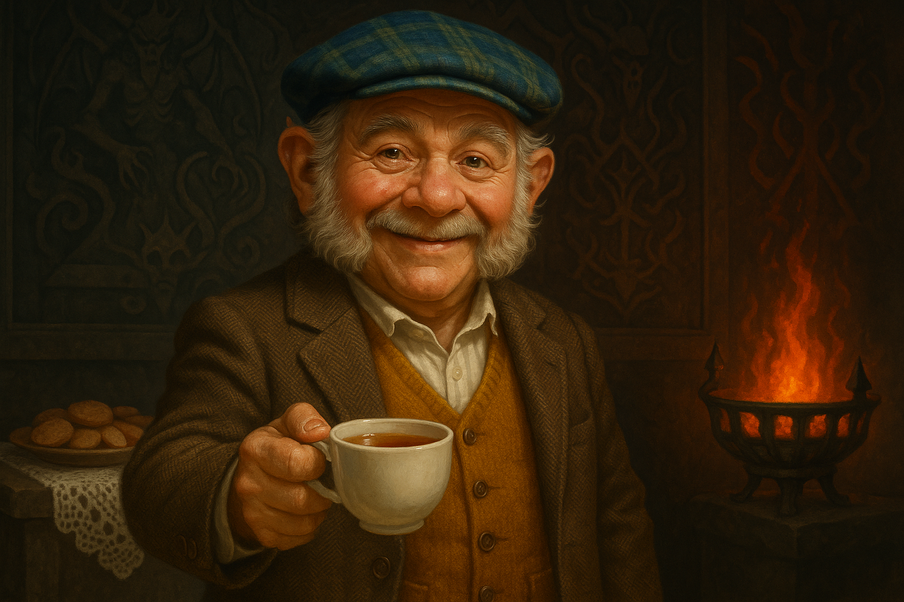

# Harold Carnap

{ width="300" }

> *"Am I what? Evil? Goodness no. I wouldn't even swear in front of the children, and they have children of their own now."*

**Halfling warlock grandpa who accidentally became a cult leader by turning blood rituals into potluck dinners and community daycare.**

*Keywords: Comedy, Wholesome party grandpa, Cult leader mystery, Blaster*

---

## Character Overview
- **Species:** Halfling
- **Class:** Warlock 5 (Pact of the Fiend)  
- **Background:** Cloth Merchant (Homebrew)
- **Age:** 65
- **Alignment:** Lawful Good (?)

??? info "Quick Intro"
    
    **At the Table**
    
    * Devilishly wholesome—treats everyone like family and calls them "dear," "lad," "duck," or "my sweet"
    * Cheerfully oblivious to the demonic nature of his powers or the cult he accidentally reformed
    * Wants everyone to feel included and appreciated; fears forgetting people's names
    * The community organizer who somehow makes demon worship feel like a church bake sale
    
    **Backstory (Short Form)**
    
    Harold joined what he thought was a historical reenactment group with excellent catering. Through relentless friendliness and organizational skills, he transformed an actual demon-worshipping cult into a thriving community center with Thursday quizzes, monthly baking events, and Wednesday daycare. When the original cult leader tried to make him perform blood sacrifice, Harold refused—and the members chose Harold over the demons.
    
    **Playing Harold**
    
    * **Combat:** Blaster warlock with staying power who worries about tea time between Fireballs
    * **Roleplay:** Chatty, agreeable, effortlessly likable. Treats cosmic horror like minor inconveniences. Learning sign language despite arthritis complaints.
    * **Party Synergy:** Natural face and morale booster who will absolutely invite the party to "cult meetings" (now basically town halls with interpretive chanting)

---

??? info "Deep Dive"
    
    **Full Background**
    
    Harold Carnap lived an entirely ordinary life as a fabric and tailoring supplies merchant with a happy wife, children, and grandchildren. He started in the cult of the Crimson Veil believing it was a historical reenactment group with excellent catering.
    
    The initial meetings were fun: costumed evenings, community gossip, and mysterious-but-pleasant toasts to "The Father." He's entirely oblivious to the world of religion and doesn't remember signing anything important. But now he's a Fiend Warlock.
    
    He quickly started introducing new social activities to the cult such as Thursday night quizzes with hot mead and monthly baking events, negotiated group rates for robes with the local tailor, and became the star recruiter by bringing slightly confused friends, relatives, and distant acquaintances to the meetings. He also made welcome bundles for new members: scented candles, fruit preserves, and a pamphlet with "Fun Facts About the Veil" (that he mostly made up).
    
    The branch leader made the fatal mistake of letting him continue his antics. Because not only did he become the star recruiter, things slowly started to change in the cult dynamics.
    
    Finally, the cult leader Malvaric tried to make Harold perform a blood sacrifice of live animals, and Harold promptly refused, aghast. When Malvaric threatened him with excommunication and worse, the other cult members protested together and drove him out.
    
    Now the "cult" sees Harold as their leader and has shifted focus entirely. The older members still believe they worship the Father of Lies and believe Harold to be His Herald on earth, due to his effortless manipulation and perfectly innocent demeanor. He's also introduced communal daycare groups for busy parents on Wednesdays in the cult HQ, which is very appreciated by the older members who think introducing the Father of Lies at an early age is smart indoctrination. They're now introducing "interpretive chanting," and the kids love it.
    
    Malvaric forgot a trinket behind—an obviously cursed doll that chants litanies in a creepy voice. Harold has repurposed it as a communal greeter, now chanting welcome phrases and encouragement in the cult lobby.
    
    ## Playing the Harold Concept
    
    Harold could be parody: Blackadder meets D&D Grandpa. Double down on obliviousness. Emphasize the absurdity of him being the most successful cult leader in the history of the town. But Harold could also be a heartfelt optimist. His power is in genuine care. He becomes a leader because he believes in people, not because he schemes. The ambiguity lies in how others interpret him. He could easily be read as a deeply non-religious character, with no understanding of Gods and Demons. His own intentions seem mundane, bordering on simplistic.
    
    Harold never meets a stranger. Everyone's "dear," "lad," "duck," or "my sweet." He lives for making new acquaintances and sharing funny anecdotes about that one time when acolyte Tim, bless his heart, almost tipped over the brazier when he was going to barbeque those goat hearts. *"Not much of a chef that boy, but he likes heart-y food! Hah! Get it?"*
    
    Harold is materially oriented. He leaves discussions about demonic possessions, cosmic anomalies, and esoteric stuff to others. Meanwhile, he's planning Thursday's potluck and staying oblivious to where his demonic powers are coming from, or how he uses them. He is as likely to play with a baby as he is to cast Suggestion on a paladin to make them join the candle-making class.
    
    Harold struggles to be inclusive. He's even learning Common sign language, but he complains that he's developing arthritis and some signs hurt his index finger.
	
	Don't shy away from the visceral stuff. Cast Fear and Hunger of Hadar, Summon Lesser Demons. And of course be truly amiable to the Lesser Demons for the full hour they are summoned, while lamenting the poor band of hobgoblins you decimated together in gruesome fashion. That contradiction is what makes Harold interesting.
    
	Also workshop with your DM why this grandpa would decide to hit the roads with a party of adventurers. Perhaps he always, *constantly* happens to have errands the same way the party is going? A rumor about new thread-dense fabrics in a nearby town to the quest objective, an impulse to visit a distant nephew, twice removed (unfortunately the name slips his mind, but it's a fine young lad). Or create a more compelling reason: A grandchild has disappeared, or that nephew twice removed has been involved in the plot somehow and needs rescuing?
	
    **Personality Traits**
    Agreeable, chatty, helpful, cheerful, oblivious, insouciant, effortlessly likable.
    
    **Ideals**
    Civility, hospitality, community. Always expect the very best of others, and be patient with mistakes and accidents. We're all people at the end of the day.
    
    **Bonds**
    He has a large family: Wife Raphaela, children Howie, Milena and Rose, grandchildren Beithalda, Wilmina, Gasco, Dorian, Tilda, Anwar. He's friends with everyone, from street urchins to archpriests, but is getting worse at remembering names, which worries him terribly.
    
    **Flaws**
    Possibly Evil Mastermind
    
    **Cloth Merchant Homebrew**
    Harold is a fabric and tailoring merchant by trade, not a traveling peddler, so the following adjustments were made to the Merchant background: Removed Navigator's tools and Animal Handling proficiency, added Investigation proficiency and Weaver's tools.
    
    **Sample Quotes**
    
    *"That doll? Bit dramatic, isn't she! Adds flair to the lobby like you wouldn't believe it."*
    
    *"Am I what? Evil? Goodness no. I wouldn't even swear in front of the children, and they have children of their own now."*
    
    *"That was a right heartbreaking shame we had to dispatch those bandits in such a gruesome manner. What with all those dreadful tentacles? Righty-oh, look at the time! Is it tea already?"*

---

??? danger "Notes for the DM"
	
	**DM Hooks and Ideas**
	
	Malvaric complains at the head Cult office. At first, HQ shrugs—it's just petty local infighting. But then rumors spread that the Herald's chapter membership is booming (because Harold's social skills beat fear-based recruitment). The chapter is financially thriving. People like it there. This terrifies the central cult hierarchy, who see it as a dangerous precedent.
	
	Harold will of course invite the party to the cult branch HQ. Expect shenanigans. Harold will explain away any oddities. "Oh that's just Tim, he's a dear lad if a bit socially awkward. You should try his pulled goat stew!" (Meanwhile, Tim, in the kitchen, burning goat hearts in a brazier marked with ancient runes)
	
	The party may start noticing some older members firmly believe Harold's warmth is a mask, an even more devious face of the Father of Lies. This may become a big point of controversy in the party throughout the campaign. Is this charming little gentleman actually evil incarnate or not?
	
	The Father of Lies (Asmodeus or whatever works in your campaign world) actually remains his patron despite it being an obviously bad pick, only because it amuses him so. Harold managed to do what no follower of the Father of Lies has done before. In the end, he even lied to himself. About all of it. Deep down, he knew something fishy was going on (after spending two campaigns sending Eldritch blasts and summoning literal demons).
	
	**Working With Ambiguity**
	In a cult that worships lies, the greatest liar may be the truly earnest one. Work with misunderstandings.
	
	Harold claims the blasphemous chants are clearly interpretive breathwork. Half the members think Harold is the literal Herald of the Father of Lies. The other half think it's just a social club with an oddly committed theatre troupe. The Fiend might think Harold is a mastermind and is impressed enough to let him keep going.
	
	If you want to lean into the ambiguity, let NPCs have wildly divergent opinions about the Cult and its oblivious leader, but leave the truth without resolution.
	
	**Recurring Location and NPCs**
	
	Turn Harold's painfully stereotypical Fantasy Underground Cult HQ into a recurring safe house, resource hub, and rumor mill. Tim could be a recurring sidekick—a young, zealous cultist who thinks Harold is the second coming of Asmodeus and is very confused about the knitting circles. Have fiends show up and politely wait in line with the local halflings. "We heard there's… chili?"
	
	Have the other cultists introduce chilling nursery rhymes and "craft circles" during daycare activities:
	
	*Step by step and spin around,*  
	*Lay the silver on the ground.*  
	*Whisper thrice and blink your eyes,*  
	*Then wave hello to Lord of Lies!*  
	*If he grins, you're doing well.*  
	*If he frowns, don't ever tell.*  
	*Share your sweets and mind your tongue—*  
	*The pact was made when you were young.*
	
---

??? info "Mechanical build (lv 5) and PDF download"

	| STR | DEX | CON | INT | WIS | CHA |
	|:---:|:---:|:---:|:---:|:---:|:---:|
	| 8 (-1) | 14 (+2) | 16 (+3) | 8 (-1) | 8 (-1) | 18 (+4) |
	
	## Combat Stats
	
	| AC | HP | Hit Dice | Speed | Initiative | Prof. Bonus |
	|:---:|:---:|:---:|:---:|:---:|:---:|
	| 14 | 53 | 5d8 | 30 ft. | +2 | +3 |
	
	**Saving Throws: Wisdom: +2, Charisma: +7**
	**Resistances: None**
	
	## Proficiencies
	**Skills**: Deception +7, History +3, Investigation +3, Persuasion +7
	
	**Armor**: Light Armor | **Weapons**: Simple Weapons
	
	**Tools**: Weaver's tools | **Languages**: Common, Halfling, Common Sign Language
	
	## Feats
	- **Lucky**: PB(3) Luck points /LR, use to give advantage or disadvantage to one roll
	- **Tough** (Eldritch Invocation): +2 HP/level
	- **Inspiring Leader**: Every SR/LR, give up to 6 Allies (including you) Temp HP equal to your character level(5) + CHA modifier(4)
	- **Agonizing Blast** (Eldritch Invocation): Add CHA modifier(4) to damage rolls of Eldritch Blast
	- **Pact of the Tome** (Eldritch Invocation): Add 3 cantrips from any spell list +2 Ritual spells, can switch at SR/LR
	- **Eldritch Mind** (Eldritch Invocation): You gain Advantage on Concentration saving throws
	- **Dark One's Blessing** (Eldritch Invocation): Gain 9 temp HP when you reduce an enemy to 0 hp, or when any enemy within 10 ft of you is reduced to 0 hp
		
	## Equipment
	Studded Leather, Dagger, Arcane Focus, Weaver's Tools.
	
	## Spellcasting
	- **Cantrips**: Eldritch Blast, Blade Ward, Prestidigitation, Minor Illusion, Guidance, Sorcerous Burst
    - **Level 1**: Burning Hands, Command, Mage Armor (Eldritch Invocation), Unseen Servant [R], Detect Magic [R]
	- **Level 2**: Spider Climb, Scorching Ray, Suggestion
	- **Level 3**: Hunger of Hadar, Fireball, Counterspell, Thunderstep, Fear, Stinking Cloud, Summon Lesser Demons
	
	---
	
	📄 [Download Level 5 Character Sheet (PDF)](assets/harold-carnap-lv5.pdf)

---

??? danger "**Session Zero Considerations**"
    
    **Content Notes:** Comedy horror elements (cult imagery, demonic pacts), but played for absurdist humor rather than genuine horror. Suitable for most tables—the tone is closer to Terry Pratchett than serious occult fiction.
    
    **Representation Notes:** Harold is learning sign language (Common Sign Language) and struggles with it due to developing arthritis, which he complains about good-naturedly. This is played as a sincere effort at inclusivity with realistic physical limitations.

---