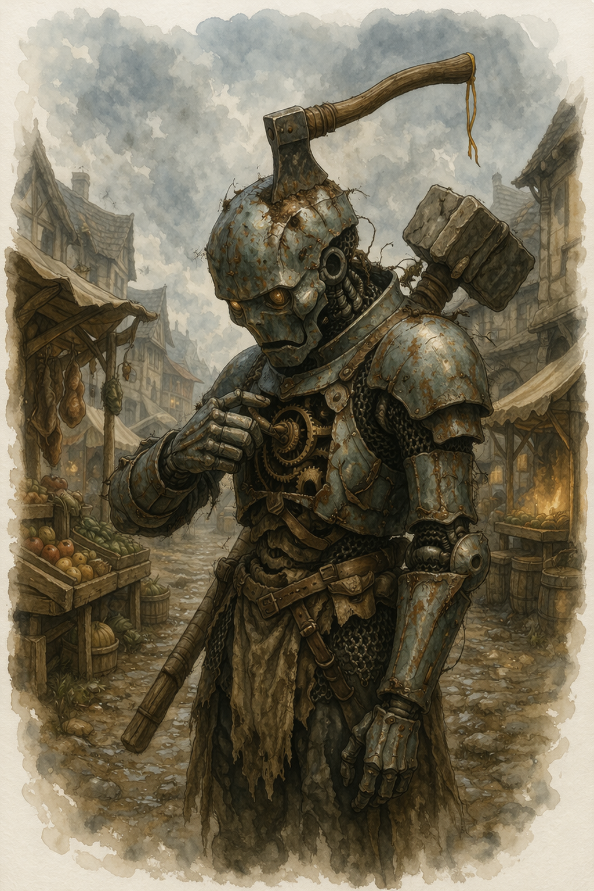

# Hatchet

{ width="300" }

> *"Target attempts to incapacitate us with a Hypnotic Pattern spell. Root access denied. Rewriting subroutines. Engaging core protocol. Invoking primary directive. Eye color change? ... Hell yeah, eye color change."*

**Barely working ancient mage-hunter murderbot awakened to an era where magic is normalized. Reconciling its programming with new parameters wasn't too bad. It doesn't have a grief protocol. But it does have the distinct energy of a border collie looking for new sheep to herd.**

---

## Basic Information
**Species:** Warforged  
**Class:** Fighter 5 (Battle Master)  
**Age:** ??  
**Background:** Guard  
**Alignment:** Lawful Neutral

??? info "Quick Intro"
    
    **At the Table**
    
	- Speaks like a combination of an exhausted bureaucrat, an over-enthusiastic kid with a new toy, and the barely concealed fatigue of an accidental stowaway dealing with life on strange new shores. Deadpan, laconic, would feel menacing if it weren't so scrappy and clueless.
	- Periodically offers unsolicited updates on its recalibration process ("I have revised my position on cats. They are no longer to be destroyed on sight, as per directives from the party Druid. Filing now. So, about dogs...")
	- Checks in with party members before acting on sensitive cultural assessments, having learned the hard way that its baseline data is catastrophically outdated, and people these days are decidedly squeamish about their livestock, pets and other material possession.
	- Weirdly fascinated by pecuniar trade. Exchange metal discs for goods? Unheard of. Secretly wonders how many gourds it would be worth if it was "disc-ified". Makes abundantly clear to any party members showing signs of avarice that it needs its parts to function and so they should not be traded. "Unless the deal is very good. Good deals are an objective good, right?"

	**Backstory (Short Form)**

	The unit was forged in the final days of a civilization that learned, too late, that some magic could not be contained by sharply worded admonishments. It was built to do the containing by more creative (meaning destructive) means, but it was too little, too late. The civilization failed catastrophically, and Hatchet was buried dormant under whatever came after. A farmer named Harry accidentally woke it up while chopping tree roots in the backyard, permanently lodging his good hatchet straight in the CPU. Calibrating the hatchet would cause even more structural damage going out, it decided to let it stay and even changed its designation to fit. "Hatchet" was born. It is still at mostly operational capacity, but with wildly corrupted timestamp data, and a threat taxonomy that reads as fiction in the world today.

	It is not sure what year it is, or rather, the years of the present era don't really mean anything. Hatchet is fairly sure it knows who caused the downfall though. It was the mages. Had to be. They're likely all dead and forgotten though. Hatchet was never a spy and detective unit, so researching ancient history is way out of its depth. But Hatchet is a simple soul/machine/thing. It doesn't exactly overthink things. It's more like a Border collie looking for new sheep to herd, and trying its best to stay on the leash like a good bot in the meantime. Realizing it can't gleefully hunt spellcasters to its metallic hearts desire isn't full-blown existential crisis fuel, but it does make it occasionally cranky.

	**Playing Hatchet**

	- **Combat:** Hatchet engages early and closes hard. When a spellcaster enters the picture, something older comes online. Superiority dice function like an overdrive mechanic. It burns them liberally in order to reach the target first, knock it down, and end it before the spells starts flying.

	- **Roleplay:** Flat affect, zero irony, but aggressively opinionated for a tin can. It asks clarifying questions about magic with the studied casualness of someone who is absolutely keeping notes. Hatchet has guardrails and it may resent them, but it doesn't question them. It can *complain* that it doesn't get to just erase the dodgy court mage, but it's a fundamentally safe piece of tech.

	- **Party Synergy:** Hatchet is low-maintenance and high-utility. Benefits from a party member as a cultural translator and doesn't mind the occasional policy update. 

---

??? info "Deep Dive"
   
	**Sample quotes:** 
	
	*"Say, was that a spell you cast just now? A 'cantrip', correct? ...just checking."*

	*"Last time I was around, cats were considered pests, not pets. You mean to say they're not to be destroyed on sight? This is unfortunate. They made for great target practice."*

	*"Right. That was a lethal application of magic force against noncombattants. I'm going to engage killmode now. You are allowed to resist to the best of your abilities, although I'm sure they will be inadequate."*

	*"Are we doing it? Are those bad mages? Yes? Really? Stand back. I want to try something."*

	*"This is you: 'wah, my ocular sensors are leaking, wah.' Just because people would not *put their hands together* for you repeatedly at a rehearsal for a collective makebelieve night? Just stick me back in the ground.*

	*"You're a... what? A 'Druid'? You cast *nature* magic? Yeah... I'm pretty sure that doesn't count. No offense."*

	*"So this time period has no Mercurial Farseers? But they were so popular. You could spy on everybody with them, at all times. Granted, it also made everybody feel constantly watched, but that never bothered me."*

	*"Look at this! I exchanged a bunch of gold coins for this flask of scented water! I hear it smells great, but I don't have smell sensors. Was this a good deal? Does it smell great? Better than gold, right? I plan to trade it for a donkey. They supposedly smell worse, but are better at guarding the gold I have left."*

	*"Am I short to you? I swear I was 5'8" when I was decommissioned. No idea where those two inches went. Drift in metrics? Filing it under geological tax. Present height is adequate."*

	---

    **Physical defects**

    Hatchet was woken from sleep by a farmer Harry Helspont, hacking away at tree roots and placing his hatchet right in the top of its skull plate, accidentally activating it while also performing a full frontal lobotomy. The axe lodged deep in the cortex and Hatchet suspects removing it would cause more damage than letting it remain. Thus he took on his new name. On good days, he binds colorful ribbons along what remains of the handle, and oils it to prevent rust. 

    The aeons underground ate away at it, and some functions it used to be able to activate via internal wiring now has to be manipulated directly via the exposed, front facing breast panel. Hatchet will sometimes visibly calibrate its cogs and wheels, adjusting for agreeability or murderous intent... depending on context. It's opaque about exactly what those wheels actually do.

    The hatchet causes occasional lag spikes in processing (And that's INT 8 right there). Sometimes Hatchet may "blue-screen" mid-sentence when the blade shifts *just* so (at player discretion).
    
	**Off-Duty Protocols**

	Hatchet is not allowed to hunt mages anymore. It has filed its objections and they have been noted and ignored. Having tried and failed to write a set of sulking subroutines, it defaults to the next best: getting busy. Hatchet is not searching for answers. What's gone is gone, and besides it would be silly for a murderbot to come with a grief protocol. It already has the approximate shape of a purpose, but the details remain to be hammered out.

	Mage-hunt adjacent activities are an outlet for various antisocial compulsions, and include maintaining an obsessive interest in magical items, classified by threat level. A Cloak of Billowing is a potential choking hazard. Vorpal Blades better be left in Hatchet's personal custody "for safekeeping." Bags of Holding are assigned threat level: Pending, because Hatchet cannot determine whether it is a weapon or a filing system, and those are too many parameters to assign to the same object.

	On its downtime, Hatchet is also working through a comprehensive taxonomy of spellcaster types, which is going increasingly poorly. Wizards it understands: unauthorized reality deviation through studied application, clear threat vector, familiar filing slot (next to overly prolific authors; harmless, but should be monitored). Warlocks confuse it, but it has filed them temporarily under Clerics: Extra Steps, Bendy. Druids it almost doesn't notice. The concept of "nature magic" is absurd to it. Animals and nature is a fun pastime, not a threat vector. By the time it starts crunching risk calculations, the Druid has already turned into some inscrutable mammalian anyway, and the moment has passed. Shrug. *Paladins* though, are a source of ongoing professional grievance. Magic through sheer conviction muddles up Hatchet's whole genealogical model of casting, and it finds this personally insulting. "Paladins are just the headache of my existence, and coming from me, that means a lot."

	Hatchet has also developed a comprehensive interest in commerce, specifically in the ritual of exchanging small metal discs for goods and services of wildly varying utility. Apparently its previous times did not have a pecuniary economy, but being a combat model it never really paid much attention to how things actually ran back then. It does not need food, warmth, or a decorative gourd, but it has purchased all three just out of fascination. The concept of "making a good deal" is especially weird to it, as is the idea that a whole economy can actually function at trade, that it is not a zero-sum game. "Where does the value come from exactly?"

    **Battle strategy**

    The Hatchet playstyle is to spend resources to get in there first and end the fight before the mage gets comfortable. Alert and the Ambush Maneuver for early initiative. Lunging Attack Maneuver closes distance fast and adds damage on arrival. Maul with Topple puts the target prone, with all follow-up attacks at Advantage. If it needs to make sure the hit lands: Precision Strike Maneuver. Once the target is pinned to the ground: Action Surge.

    Four Superiority Dice is the overdrive budget at lv 5. Burning most of them in one sequence is a legitimate play, if a bit indulgent. The machine winds down afterwards, but by taking out the high value target quickly and staying alive it has contributed its bit to the combat.

    The weapon kit should handle most scenarios, and should be flavored around the Warforged fantasy: Maul for putting the target on the ground. Greatsword for sustained pressure with Graze providing chip damage on misses vs high AC opponents, War Pick plus Shield for when staying upright matters more than dealing damage, Handaxes to apply Vex at a distance before closing in. Mage Slayer ensures every hit is a genuine threat to Concentration, and Guarded Mind covers the one spell that might otherwise end Hatchet's first, glorious round prematurely.

---

??? info "Key Relationships"

	**Harry Helspont:** The farmer who accidentally woke up Hatchet with his hatchet. He still wants his tool back, and is hunting the ancient Warforged unit for it (it's apparently a high quality axe). Hatchet isn't allowed to harm civilians and thus has set into system to hide or otherwise avoid contact when Harry is on the prowl. It has not yet occurred to it that it could simply attempt to pay Harry for the hatchet, as it doesn't yet have a great grasp on barter and trade. However, there are no guarantees Harry is even motivated by money at this point. 

	*"That farmer is legitimately worrying. I have never seen such zeal over a small-claims property dispute. It would be very convenient if I could just get rid of him, but I'm not allowed to do that."*

	**Petula Mintleaf:** A Feywild sprite of no fixed address and unclear intentions who attached herself to Hatchet sometime after its awakening, for reasons she has no interest in explaining. She is small, fey, and absolutely saturated with magic that Hatchet's threat taxonomy returns a complete blank on. Of course she pranks him, and her mischief ranges from the whimsical (relocating its ribbons, replacing its weapon oil with maple syrup), to the occasionally vicious (calling nearby beasts in the forest to see if it will attack them, which it mostly won't unless it maps as "target practice"). She shows up at irregular intervals, rides on its shoulder during travel, critiques its threat assessments with a seriousness that borders on professional. Hatchet is unbothered. It has no shame architecture. It simply updates its environmental awareness parameters and files the incident under Petula: Ongoing.

	**Mira Calder:** A slick halfling fence and information broker who has eagerly latched onto Hatchet. She constantly offers “great deals” that involve Hatchet trading minor services for suspiciously advantageous coin, all while testing how far the bot’s commerce fascination will stretch before its guardrails kick in. Hatchet, for its part, is fascinated by her ability to turn words into metal discs through a practice it is forbidden to engage in: Conscious misapproximation of truth for strategic benefit. However... through Mira's cheerful consent, it has learned that it can outsource the things it isn't allowed to do to others. Problem is, since it doesn't really have any needs or any conceptual map of what is worth what, it still doesn't know if it's getting ripped off. 

	*"Mira promised it would go well. She would claim the item came from a dragon hoard instead of being looted off the corpse of her former associate. All I had to was stand by and be quiet, for protection. And I'm allowed to do that, so I did. But then she misappropriated the combat utility of the shortsword, and as a professional I had to chime in. So she is not talking to me right now, she said."*

---

??? danger "Notes for the DM"
	
	## The Downfall: Insert Your Own Lore

	Hatchet isn't supposed to have the classic "single survivor from a lost age" flavour. The ancient background is more a wellspring of eccentricities than a dramatic engine. But the trope is so ubiquitous it may be hard to dispel. A way to do that is to lean into it, but reframe it.
	
	Hatchet can have corrupted records from before the Downfall — partial designations, threat signatures, a name you can let it occasionally output, without apparent context. But Hatchet does not have to treat this as significant. The glitch is more of a running bit ("damn hatchet messing with my verbal output again. Where was I?"), not a mystery box. Unless you want it to be, of course. 
	
    The Downfall's specifics are yours to determine or ignore entirely, whether full Exandrian Calamity or local blip event. The important part for helping the player have fun is to let it be competent when the world finally hands Hatchet something that matches its leanings. That's the payoff the character is building toward. From displacement, via adaptation, to new life. 

---

??? info "Mechanics, lv5 build and PDF download"

	## Stats
	| STR | DEX | CON | INT | WIS | CHA |
	|:---:|:---:|:---:|:---:|:---:|:---:|
	| 18 (+4) | 14 (+2) | 16 (+3) | 8 (-1) | 10 (+0) | 8 (-1) |

	## Combat Stats
	| AC | HP | Hit Dice | Speed | Initiative | Prof. Bonus |
	|:---:|:---:|:---:|:---:|:---:|:---:|
	| 19 | 49 | 5d10 | 30 ft. | +5 | +3 |

	**Saving Throws:** STR +7, CON +6  
	**Resistances:** Poison
	**AC Breakdown:** 17 (Splint Mail), +1 Defensive Fighting Style, +1 Integrated Protection. The Combat Stats assume no shield. With shield, AC goes to 21.

	## Proficiencies
	**Skills:** Athletics +7, Insight +3, Intimidation +2, Perception +3, Stealth +5, Survival +3

	**Armor:** Light Armor, Medium Armor, Heavy Armor, Shields | **Weapons:** Simple Weapons, Martial Weapons

	**Tools:** Smith's Tools (Warforged: Specialized Design), Tinker's Tools (Battle Master: Student of War), Darts (From Guard background) | **Languages:** Common, [+2 languages you decide with the DM]

	## Feats
	- **Alert**: +3 to Initiative rolls; can swap Initiative with a willing ally at the start of combat.
	- **Mage Slayer**: Concentrating creature has Disadvantage on Concentration saves vs Hatchet. Once per Short or Long Rest, if Hatchet fails an INT, WIS, or CHA saving throw, it can choose to succeed instead.

	## Battle Master Maneuvers
	- **Ambush**: On Initiative or Stealth rolls, expend a Superiority Die and add it to the roll.
	- **Lunging Attack**: Bonus Action Dash. If you move at least 5 ft. straight toward a target and hit it with a melee attack this turn, add the Superiority Die to the damage roll.
	- **Precision Attack**: When you miss an attack roll, expend a Superiority Die and add it to the roll.

	**Superiority Dice:** 4 × d8, recovered on Short or Long Rest.

	## Weapon Masteries
	- **Greatsword** — Graze: on a miss, deal damage equal to your STR modifier.
	- **Maul** — Topple: on a hit, target makes a CON save (DC 14) or falls Prone.
	- **Handaxe** — Vex: on a hit, gain Advantage on your next attack roll against the same target.
	- **War Pick** — Sap: on a hit, target has Disadvantage on its next attack roll.

	## Equipment
	Greatsword, Maul, War Pick, Handaxe ×4, Shield, Splint Armor
    
	**Suggested Magic Items**    
	- Wand of Magic Detection (Uncommon; Has 3 charges. Expend 1 charge to cast Detect Magic. The wand regains 1d3 expended charges daily at dawn.)
	- Brooch of Shielding (Uncommon, Attunement; Resistant to Force Damage. Immune to damage from Magic Missile.)
	- Dust of Sneezing and Choking (Uncommon; Force yourself and every creature in a 30-foot Emanation from you to make a DC 15 CON saving throw. On a failed save, a creature begins sneezing uncontrollably; it has the Incapacitated condition and is suffocating. The creature repeats the save at the end of each of its turns, ending the effect on itself on a success. *arguably makes it impossible to cast spells with Verbal components. Check this with your DM*)
	- Sentinel Shield (Uncommon; While holding this Shield, you have Advantage on Initiative rolls and Wisdom (Perception) checks)
    
	---
    
	📄 [Download Level 5 Character Sheet (PDF)](assets/hatchet-lv5.pdf)

---

??? danger "**Session Zero Considerations**"
    
	Maybe discuss how aggressively Hatchet should be chasing mages at the table. Naturally, it shouldn't go after other PCs unless priorly agreed upon by the players.

	Hatchet isn't a big lover of animals or nature. But do a double check with the table if the "shooting cats" skit is something you plan to play into. 

---
