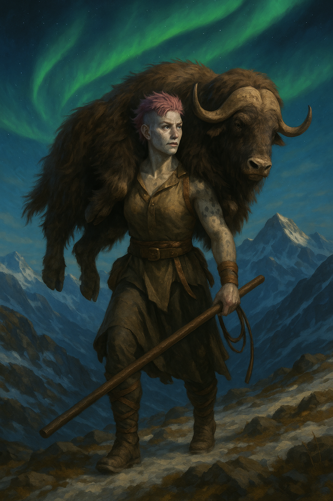

# Kekiliat "Keki" Anakaleaku

{ width="300" }

> *"Every herd needs a keeper. Sometimes, you’ve got to be the mountain that doesn’t move—and sometimes, you just drag the problem back to the barn."*

---

## Character Overview

|                   |                                         |
| ----------------- | --------------------------------------- |
| **Class & Level** | Monk (Way of the Kensei) 4              |
| **Background**    | Farmer                                  |
| **Race**          | Goliath                                 |
| **Alignment**     | Neutral                                 |
| **Role**          | Grappler, party herder, battlefield controller |

Keki is a towering, alabaster-skinned Goliath monk with a shepherd’s heart and an ox’s work ethic. She brings a unique blend of agrarian pragmatism and mountain mysticism, walking the ridges with the patience of a herdswoman—and the stubbornness of a glacier. She’s fiercely loyal to her “flock,” whether oxen or adventurers, but beneath her steady exterior, she carries the burdens of regret, confusion, and a quiet yearning for simplicity.

---

## Stat Snapshot

    STR 10 (+0)   DEX 16 (+3)   CON 16 (+3)
    INT 8  (-1)   WIS 16 (+3)   CHA 8  (-1)
    HP 43   AC 16   Speed 45 ft
    Proficiency Bonus +2

---

## Personality

* **Grinder at heart:** Loves tedious, repetitive work—drilling katas, counting cattle, or fishing for hours. Finds calm in the mundane.
* **Agrarian pragmatist:** Approaches people like livestock—who’s straying, who needs prodding, who’s restless before a storm.
* **Effortless confidence:** Calm, collected, and almost serene in physical challenges; but socially awkward, horrible at lying, and hilariously dense about flirting.
* **Emotionally layered:** Feels most alive when carrying burdens—physical or emotional—but can become confused or angry when the world refuses to make simple sense.
* **Stubbornly fair:** Has passionate opinions about haggling, “fair price,” and self-promotion (“Loud talkers should get a cow’s share of the dung heap”).
* **Party Quirk:** Most likely to carry a drunk party member across town, complain loudly about it, and then cook them breakfast in the morning.

---

## Backstory (Short Form)

Raised among muskox and mountains, Keki was more comfortable wrangling cattle than people. Her early years were shaped by her mother’s sharp trading and her father’s quiet heroism. An encounter with the nameless “Exile” monk drew her into martial training—but also burdened her with guilt when her father died confronting her mentor. Now, Keki wanders, whip and staff in hand, shepherding party and livestock alike, chasing closure under the shifting auroras.

---

## PDF Character Sheet

📄 [Download full character sheet](assets/kekiliat-anakaleaku.pdf)

---

## Gameplay Notes

??? info "Playing Keki effectively"
    - **Roleplay:** Lean into her love of chores and routines. Let her take the lead on watch duty, camp chores, and repetitive labor. Play her as steadfast and practical, the first to step up when the job is dirty, dull, or endless.
    - **Voice & quirks:** Speak plainly, use weather and livestock metaphors (“He’s as twitchy as a spring lamb”). Struggle with social subtleties—make her a comically terrible liar and oblivious to flirting or sarcasm.
    - **Combat:** Keki is a tactical grappler and controller. She uses her whip and martial arts to trip, grapple, and isolate foes, keeping the “herd” safe. She moves fast—use her speed to reposition, interpose, or drag allies out of danger.
    - **Interactions:** Treats the party like a flock: protective, sometimes scolding, but always loyal. Brings food, keeps morale steady, and quietly keeps tabs on everyone.

??? danger "DM Guidance"
    - **Potential flaws:** Keki’s stubbornness and desire for control can cause friction when party members go rogue or “stray from the herd.” Her need to shoulder burdens may lead to resentment or burnout.
    - **Growth hooks:** Test her worldview by forcing her to choose between individual needs and the good of the flock; tempt her to abandon burdens; confront her with situations where labor and loyalty aren’t enough.
    - **Mentor arc:** The Nameless Exile can reappear as ally, enemy, or ambiguous figure, drawing out Keki’s unresolved guilt and questioning her chosen path.

---
