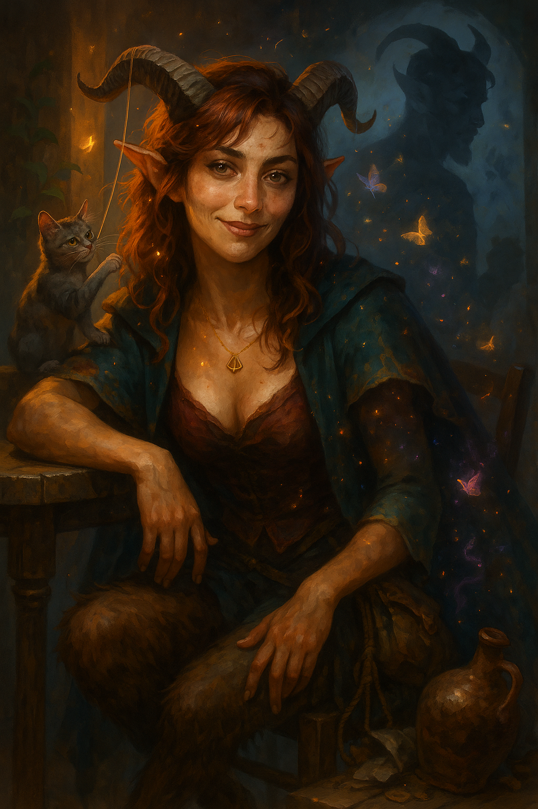

# Lia Amberhorn

{ width="300" }

> *"Don't say it, I know what you think. Typical Lia. Can't read, can't count. I'm only good with cats and hard liquor. Why do you come to me for advice?"*

**Satyr Wild Magic Sorcerer who believes in her own stereotypes. She was rejected by her sober, ableist merchant family, but still snipes with pinpoint precision, whether with word or spell.**

---

## Character Overview
- **Species:** Satyr
- **Class:** Sorcerer 5 (Wild Magic)  
- **Background:** Merchant  
- **Age:** 22
- **Alignment:** Chaotic Good

??? info "Quick Intro"
    
    **At the Table**
    
    * Performs the entitled Sorcerer: Refuses to do anything by hand that she could use Mage hand and Prestidigitation for. Subtle Spell Catapults wine bottles and chamber pots for dramatic flair during arguments.
    * Never learned to read and count well, due to ableist parents wanting to break with the Satyr stereotypes; she's all they tried to distance themselves from.
    * Sides with the castouts, the strays, the underdogs. Harasses every cat for affection; always carries cat treats and string.
	* Gifted doodler, takes notes in form of doodles and silly characters, because it's less anxiety-inducing than writing.
    * Party Role: Face, glass Cannon, comedic relief, source of warmth and tragedy.
    
    **Backstory (Short Form)**
    
    Lia was born into a family of "serious satyrs" who rejected Feywild stereotypes. Her dyslexia and dyscalculia were branded as laziness, and when big money went missing from the family shop, she ended up with the blame. Disowned at seventeen, she's spent five years performing the exact stereotype her family hated. Meanwhile her perfect little brother Calen is starting a merchant empire.
    
    **Playing Lia**
    
    * **Combat:** Glass cannon with Spell Sniper, Lucky, and Seeking Spell: the fantasy is a constantly half-drunk satyr who surgically blasts targets at any range, ignoring Cover, while tangling her horns in tree branches or slipping in mud.
    * **Roleplay:** Mispronounces her incantations wildly, drops her components, spills wine, and yawns through war councils. But is also a loving and smart person with great people skills and sound intuition. Optimistic about the world and other people in it; advocates for the wildest courses of action if they sound fun. But struggles with her own negative self talk for being a failure and a fuck-up.
    * **Party Synergy:** The lovable disaster who somehow pulls off the clutch play and the big spells, if she survives.

---

??? info "Deep Dive"
    
    ## Full Backstory
    
    Lia Amberhorn was born into a family of satyrs determined to scrub away every Feywild cliché. Her father, Dionel, was a sober, hard-nosed merchant. Her mother, Thyra, left revelry behind and devoted herself to austere faith and respectability. Together they built a reputation as "the serious Satyrs," the kind who never touched drink, never laughed too loud and were always good on their word. Then came Lia, naturally gifted, deeply connected to the Fey. And no matter how often Dionel drilled her, the columns never lined up.
    
    Every mistake in the shop ledger was a reminder that she wasn't the merchant daughter they wanted. Thyra prayed for her discipline, but Lia's magic burst out at all the wrong moments. Books caught fire, feather pens started dancing. Her extraordinary magic talent was whimsical and Fey in the worst possible way, but her control was flimsy at best. While her parents were never physically violent, their words and sneers cut deep. She was born with the wrong talents.
    
    To make matters worse, her little brother Calen was the perfect merchant son—sharp, disciplined, able to track the markets and dance through the ledgers before he could even grow horns. His favorite line was, "Don't blame your Fey blood for your failures, sister. Some of us just work harder." Their sibling bond hardened into rivalry, but there was never much competition.
    
    When Lia was 17, her parents were summoned to Feywild court business. They left the shop in their children's hands, making them solemnly swear to be careful and do everything by the book. Lia did what she always did when her parents were away: Decompressed. Partied, slacked and magicked the mess away. But when their parents returned, a vast sum of money had gone missing from the accounts. Calen laid the blame squarely on Lia.
    
    She knew she hadn't touched the money, but she couldn't prove which entries were hers. Her protests sounded hollow against Calen's cool arithmetic. Dionel and Thyra disowned her at seventeen, with nothing but her chaotic magic and a chipped wine jug.
    
	She keeps a mental list of everyone who visited the shop that week, their faces, their voices, what they wore, in what order they came. The images are clearer than any ledger. Meanwhile, Calen runs his own trading house now, with ventures in three cities. But a part of her can't help but wonder how much Calen knows more about that missing fortune.
    
    ## Personality Deep Dive
    
    Lia distrusts experts. Knowledge may be good, but she's only ever seen, and felt, it wielded as a weapon. Leaning hard the other way is becoming an ethical standpoint for Lia: People don't lose their value just because they aren't smart. 
	
	But her body knows a different truth, that she's the botched one, the stupid girl. She never learned to value her instincts with people, her gift for reading a room. Instead she performs what her parents always accused her of being: the wild Satyr, the sloppy Sorcerer. 
	
	She does everything with magic. Why *work* and open a simple door manually when you have Mage Hand? She uses her gifts for lavish, silly displays and party tricks. She tells herself this is who she is. The wine helps her believe it.
	
	Wild Magic functions as both weapon and shield. When she "accidentally" triggers surges during arguments, it gives her plausible deniability ("can't control it, sorry"). But it's also real chaos she genuinely can't always control, which means she's never certain if she's weaponizing it or if it's weaponizing her. The performance and the truth are tangled past separation.
	    
    **Personality traits:** Adores cats, laughs at her own pratfalls, has a surprisingly strong sense of right and wrong for a "party girl satyr".
    
    **Ideals:** No expectations, no anxiety, no commitments. But don't you dare to bully someone powerless; I will wreck you.
    
    **Bonds:** "Calen is so smart, so organized, so why does he somehow *feel* more 'Satyrish' than me?"
    
    **Flaws:** Listens too much to her negative self talk. 
    
	---
	
	### Playing Lia: Extended Notes
    
    Lia mispronounces incantations, drops components, trips over her own hooves, but the Fireball still works somehow. She's an unapologetic mess, spilling wine, tripping in puddles, tangling stockings and sleeping through meetings. Her life would crash if she forgot how to Prestidigate.
    
    Her stats tell the story of what her parents failed to see: INT 8, WIS 14. She can't track columns but has a reasonably high WIS score, having moments of insight, cool brilliance and emotional awareness. She always remembers people's faces, has a good radar for lies and deceit, connects effortlessly to strangers, children and animals, is easygoing and kind without making a big deal of it.
	
	---
	
    ## Sample Quotes
    
	"Do I ever... use my chaos as a shield? Oh, definitely. Remember how I went all 'Sorry about your curtains, wild magic surge, can't control it, whoopsie' back with that snobby merchant? Yeah, that jerk had it coming."
	
    "This amulet? Poison resistance baby. With this, I only get hangovers when I truly apply myself."
        
    "Last night was great! Don't even remember which realm I left my smallclothes in. Classic me, right?"
    
    "Ipso! Presto! Fabuloso! Because manual labor is for dummies and the non sorcery-gifted."
    
    "I totally had a plan, but then I turned the chandelier into butter and the innkeep is on the street shouting my name, so we're improvising!"
    
	"Don't. Just, don't touch me right now. Everything feels too loud and I'm one kind word away from falling apart in front of you lot. Last night was plenty, let's not have a messy tragedy two days in a row."
	
    "Do you remember if i ate the cat treats last night? I can't find them, and my tongue tastes funny."
    
    "You sure you want *me* to negotiate a discount for you with that merchant? Well... okay. One third of the price? Don't be shy, you deserve at least one fourth. "
    
---

??? info "Key Relationships"

	- **Hermeion Amberhorn**: Lia's paternal uncle and everything Dionel rejected. Hermeion thinks his brother is a miserable, self-hating fool who broke his own daughter trying to play human merchant. Both Dionel and Thyra used to warn Lia about him, but he's been her champion since she was disowned—appearing with wine and invitations, telling her she's perfect exactly as she is, that her parents are the real failures, not her. He throws legendary parties in Feywild-adjacent spaces. The wine flows, the music never stops, and for the first time in her life, Lia is celebrated for being exactly what she is. Hermeion calls her his "favorite niece," who should carry the Amberhorn name into the future, the one who understood what it meant to be Satyr. He gives her the approval she's starved for. But Hermeion's revelry has a body count, and it makes Lia genuinely uneasy. Mortals get lured in by Fey magic and become "guests of honor" in games they never agreed to play, entertainment for creatures who don't understand (or care) that humiliation can break someone. Time moves differently there. People stumble out days later, sometimes weeks, sometimes changed in ways that don't wash off. Some don't stumble out at all. 
	
	- **Oswin Kettlewick**: An elderly man who lives in a cottage held together by hope, habit and two rusty nails. He was Master of Coin for the cobbler's guild until a calculation error cost the guild a year's operating budget. He lost his position and his reputation, but Lia can see he also lost his sense of worth. Now he "helps" by reading and writing letters for people who need it, charging almost nothing, and Lia visits him regularly—ostensibly for the service, actually because she wants to make sure he's eating. Oswin is gentle, self-deprecating, and excellent company for commiserating about merchant culture. "They think one mistake defines you forever, don't they?" He feeds the squirrels and pigeons obsessively, preoccupies himself with tiny rituals, lets the roof leak because "it's not worth fixing for someone like me." It leads to him getting sick constantly because he won't spend money on himself.
	
	- **Athenia De Lanza**: A methodical, brilliant wizard who specializes in solving "impossible" problems through research and logic. She's not unkind, actually genuinely warm, but she operates from the absolute conviction that every problem has a solution if you think clearly enough. She treats emotional wounds like puzzles to be solved through proper analysis. She also likes Lia a lot, ever since she ran into her on one of her research expeditions into the Feywild. She sees Lia's potential immediately and cannot understand why she won't simply... fix her problems?
		- *"Hire someone to audit those ledgers from the week the money vanished. Either way, you'll have proof. Sleep better at night."* 
		- *"Your parents obviously didn't see you for who you are, but you're an adult now. You can speak for yourself. By not giving them another chance you also aren't giving yourself another chance"* 
		- *"You have extraordinary natural magical talent. I've studied for decades to do what you do instinctively. Why do you privilege your parents' voice over mine when I'm an expert in this field? I can help you with some daily affirmations."*
	Lia on her side is happy to have met someone with real knowledge who isn't out to put her down. The fact that Athenia is doing the exact opposite, putting another kind of pressure on her, is both new and uncomfortable.
	
	
---

??? danger "Notes for the DM"
	
	## Dramatic Questions
	
	- *What does it take to motivate Lia to actually stand in her power and claim ownership of important party strategy and analysis, instead of letting others make the tough decisions while she tags along, vibing?*
	- *What does 'success' look like for Lia? Not just 'existence as usual' but actual progress in her life?*
	- *If Lia's parents showed up and asked forgiveness, pleading for her to come back, would she?*
	
	## Key Relationship Dynamics
	
	**Hermeion Amberhorn**: Lia sees the excesses his parties always go to, and doesn't approve. But when she's there, surrounded by beings who think her magic is beautiful instead of shameful, who laugh WITH her instead of AT her, who never mention ledgers or responsibilities or failure... it's so hard to leave. Dionel and Thyra may be terrible parents, but they had a point about Hermeion being a bad person. He isn't secretly evil, he genuinely loves her, but his love is poisonous. Hermeion can be used in the campaign as a temptation for Lia. Have a party go dark, excessive, have him dare Lia to use her magic in unsavory ways, like shooting apples from the heads of human captives with her Firebolt cantrips (*"Why not? You're the best damn shot I've ever seen even when you're drunk!"*). Force a moral decision from the player. Can she walk away from the only place she's ever belonged, knowing that belonging builds on frivolous kidnappings and occasional wanton sports, where casualties happen? If she leaves, is she accepting her parents were right in some way? If she stays, she enables the cruelty her parents warned her about. Hermeion never forces her. The need for his approval does the work for him.
	
	**Oswin Kettlewick**: Oswin mirrors parts of Lia's own story. She may see the parallel but can't name it: the man who made one accounting error and decided he was worthless forever, the person who performs helplessness so thoroughly he's made it real. She brings him food, coins, tries to convince him to fix the roof. He thanks her and does nothing. The question isn't whether she can "save" Oswin, but whether she can recognize that she's doing the same thing. He withdrew into quiet self-neglect. She performs spectacular self-destruction. Same wound, different costume. If she can't help Oswin see his worth, how will she ever see her own?
	
	**Athenia De Lanza**: Use Athenia as a challenger and foil to Lia. Her advice is usually technically correct, but approaches Lia from the wrong angle. Lia's problem isn't about logics, it's about healing the voice inside her head. Lia *could* do all hose things, and they would probably help her immensely. But being told "just act on these things, just do something" by someone who's never doubted their own worth feels like another way of saying "your pain isn't real, you're choosing this." The tension here is real. When they meet, Athenia is simultaneously blunt and sharp. She knows Lia's true qualities and holds her to a higher standard. She also knows Lia is performing her avoidance mechanisms so well she's convinced even herself. Play Athenia like a resourceful adult who is genuinely generous with her time and skill, but never let her help come without some pushback.
			
	## Plot Ideas
	
	**Calen Amberhorn**
	Lia's younger brother can be a ruthless merchant prince antagonist, polished, philanthropic, and admired, but secretly a warlock of Mammon. He's building an empire on stolen fortunes and cursed contracts. He framed Lia for theft from the family, leading to her exile. Now wealthy, with bejeweled horns and gold with an uncanny sheen, Calen commands debtors, mercenaries, and infernal "associates." He's everything Lia was told to be, but hollowed by greed and perhaps actually more of a Satyr than Lia herself.
	
	Now, Calen bargains in souls as well as goods. He ties people into the service of his patron by luring them into crippling debt. He has uncanny luck in his business propositions. Calen's debt network should entangle the entire party, not just Lia. Examples: He bought the land where the Druid's grove stands and is selling lumber rights. He employs the mercenary company the Fighter deserted from. He holds contracts on the Cleric's temple's mortgage. He's bribing officials the Rogue is trying to blackmail. Make Calen's empire touch every PC's backstory so this becomes a group arc with Lia at the emotional center, not a solo spotlight that sidelines others. If you can't create those intersections, save Calen for a Lia-centric one-shot or interlude session.
	
	Calen could be a BBEG for an arc, with hidden Warlock powers and a dirty secret he is afraid Lia will uncover. He stole their parents' fortune to set up his own enterprise, and blamed her. Their father Dionel wanted a shrewd merchant for a child, and in Calen he got more than he bargained for.
		
	**Wild Magic Lull**
	(Bottle episode) For some reason, Wild Magic isn't happening right now. Lia is temporarily reduced to opening doors manually, and using whatever magic her magic items might carry. Don't make it a big thing, just enough to allow the player to explore Lia's reaction to having a huge part of her identity pulled out from under her.
	
	**Wild Magic Storm**
	Have Lia's powers go crazy for real. Have the player declare what they cast, then roll a D6 for what actual level the spell gets cast at. Roll Wild Magic Surge for every spell she casts an entire combat. Roll a d10 for additional Metamagic effects. Add extra effects: Lia's shadow separates from herself and runs off. The trees start meowing. Fireballs now smell of cloying vanilla and splash like curd.
	
	
---

??? info "Mechanical build (lv 5) and PDF download"

	| STR | DEX | CON | INT | WIS | CHA |
	|:---:|:---:|:---:|:---:|:---:|:---:|
	| 10 (+0) | 12 (+1) | 15 (+2) | 8 (-1) | 14 (+2) | 18 (+4) |
	
	## Combat Stats
	
	| AC | HP | Hit Dice | Speed | Initiative | Prof. Bonus |
	|:---:|:---:|:---:|:---:|:---:|:---:|
	| 11 | 32 | 5d6 | 35 ft. | +4 | +3 |
	
	**Saving Throws: Constitution: +5, Charisma: +7**
	
	## Proficiencies
	**Skills**: Animal Handling: +5, Deception: +7, Insight: +5, Perception: +5, Performance: +7, Persuasion: +7
	
	**Armor**: — | **Weapons**: Simple Weapons
	
	**Tools**: Viol | **Languages**: Common, Sylvan
	
	## Feats
	- **Lucky**: You have PB/LR Luck Points you can use to give yourself Advantage or another Disadvantage on a roll.
	- **Spell Sniper**: Double the range of attacking spells, ignore cover and proximity.
		
	## Equipment
	Dagger, Wine jug, Arcane Focus, Viol
	
	**Suggested Magic Items**
	
	- Periapt of Health (Uncommon, Attunement, Poison resistance; for hangover resistance)
	- Circlet of Blasting (Uncommon, Cast Scorching Ray once/day, +5 to hit; Lia is a striker and an extra damaging spell never hurts)
	- Bag of Tricks (Uncommon, pulls out random creature; Because it's very much Lia to let a Giant Elk loose on the battlefield by mistake)
	- Bloodwell Vial +1 (Uncommon, Attunement; +1 to Spell attack/Save throw DC, once/day: regain 5 sorcery points on HP recovery from hit dice; Adding attack accuracy fits Lia)
	
	
	## Spellcasting
	
	- **Cantrips**: Fire Bolt, Mage Hand, Minor Illusion, Mending, Prestidigitation
    - **Level 1**: Catapult, Mage Armor, Shield
	- **Level 2**: Mirror Image, Scorching Ray, Tasha's Mind Whip, Misty Step
	- **Level 3**: Fireball, Fly

	📄 [Download Level 5 Character Sheet (PDF)](assets/lia-amberhorn-lv5.pdf)
	
	{ width="420" }
	
---

??? danger "**Session Zero Considerations**"
    
    **Content Notes:** Disability representation (dyslexia, dyscalculia), family rejection and emotional abuse, substance use as coping mechanism, themes of self-worth and internalized shame.
    
    **Representation Notes:** Lia represents characters with learning disabilities. Her dyslexia and dyscalculia are real conditions that were misunderstood and weaponized by her family.
    
    **Table Tone Guidance:** Lia performs tropes that require care in order not to slip into harmful stereotypes. Session Zero should establish how much alcohol, sex, and chaos the table wants, and what stays offscreen. If you're confident navigating tropes tied to women's sexuality and messiness without veering into caricature, then go for it. If it turns into "haha, she's easy," the table may suffer. Bottom line: Lia is built to be a chaos engine with hidden competence, not a license to make anyone uncomfortable.
	
---