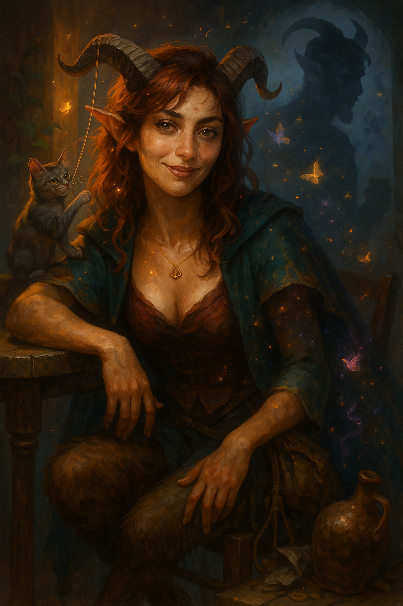

# Lia Amberhorn

{ width="300" }

> *"Don't say it, I know what you think. Typical Lia. Can't read, can't count. I'm only good with cats and hard liquor. Why do you come to me for advice?"*

**Satyr Sorcerer. Dyslexic and rejected by her merchant family. Plays to all the party girl and sorcerer stereotypes, but is secretly brilliant.**

*Keywords: Hidden competence, comedy, character driven play, disability, family rejection, self-destructive coping*

---

## Basic Information
**Species:** Satyr
**Class:** Sorcerer 5 (Wild Magic)  
**Background:** Merchant  
**Age:** 22
**Alignment:** Chaotic Good

## Quick Intro

??? info "Quick Intro"
    
    **At the Table**
    
    * Performs the "bimbo satyr" persona—messy, magical, and seemingly careless
    * Covers deep shame about dyslexia with party tricks and self-deprecating humor
    * Secretly brilliant with people and instincts, but never learned to value those skills
    * Party Role: Face, Glass Cannon, Emotional catalyst, Comedic relief
    
    **Backstory (Short Form)**
    
    Lia was born into a family of "serious satyrs" who rejected Feywild stereotypes. Her dyslexia and dyscalculia were branded as laziness, and when money went missing from the family shop, her perfect merchant brother Calen blamed her. Disowned at seventeen, she's spent five years performing the exact stereotype her family hated—the chaotic party satyr—while quietly wondering if Calen knows more about that missing fortune than he admitted.
    
    **Playing Lia**
    
    * **Combat:** Glass cannon with Spell Sniper and Seeking Spell—hits targets at long range while tangled in tree branches or clearly hungover. Scorching Ray for damage, Subtle Spell Catapult wine bottles and chamber pots for dramatic flair.
    * **Roleplay:** Mispronounced incantations, dropped components, wine spills, and yawning through war councils. But also a loving and smart person with great people skills and sound intuition.
    * **Party Synergy:** The lovable disaster who somehow pulls off the clutch play. Advocates for "impossible" options if they sound fun. Champions stray cats and underdogs.

---

## Deep Dive

??? info "Deep Dive"
    
    ### Full Backstory
    
    Lia Amberhorn was born into a family of satyrs determined to scrub away every Feywild cliché. Her father, Dionel Amberhorn, was a sober, hard-nosed merchant. Her mother, Thyra Amberhorn, left the revels of the Fey behind and devoted herself to austere faith and respectability. Together they built a reputation as "serious satyrs," the kind who never touched drink, never laughed too loud and were always good on their word. Then came Lia. No matter how often Dionel drilled her, the columns never lined up.
    
    Numbers danced and letters slipped away from her no matter how hard she tried. Every mistake in the shop ledger was a reminder that she wasn't the merchant daughter they wanted. Thyra prayed discipline into her, but Lia's magic burst out at all the wrong moments. When she was told she'd never amount to anything, she believed it, and turned the accusation into a lifestyle.
    
    To make matters worse, her little brother Calen was the perfect merchant son—sharp, disciplined, able to track the markets before he could even grow horns. Where Lia stumbled through ledgers, Calen danced, drawing praise from their parents at every turn. He never let Lia forget it. His favorite line was, "Don't blame your Fey blood for your failures, sister. Some of us just work harder." Their sibling bond hardened into rivalry, but there was never much competition.
    
    One day when Lia was 17, Dionel and Thyra were summoned to Feywild court business, they left their children to manage the shop in their absence. Lia did what she always did: partied, slacked and magicked the mess away, trying to avoid Calen's toxic remarks.
    
    But when their parents returned, a vast sum of money had gone missing from the accounts. Calen laid the blame squarely on Lia.
    
    She couldn't defend herself: She has dyslexia and dyscalculia, conditions her family never understood and only framed as laziness or Fey-blood folly. She only knew, with her whole being, that she hadn't done what he accused her of. Her protests sounded hollow against Calen's cool arithmetic. That was the final straw for Dionel and Thyra. They disowned Lia at seventeen, cutting her adrift with nothing but her chaotic magic and a chipped wine jug.
    
    She still wonders what really happened that week, who—or what—drained the Amberhorn coffers. Meanwhile, Calen thrives. He has money of his own now, invested in clever ventures, the model merchant his parents always wanted. To Lia, his success feels like a ghostly finger pointing at her own failure. But a part of her can't help but suspect that Calen knows more about the missing fortune than he ever admitted.
    
    ### Personality Deep Dive
    
    Lia is an openminded character who's seen a lot of strays and identifies with them. She often advocates for the "impossible" option if it sounds more fun, and doesn't trust the opinions of experts.
    
    Lia feels intense shame over her dyslexia and dyscalculia. Branded lazy and frivolous by her family, she made it a persona: the stereotypical 'bimbo satyr,' a mask of partying, magic tricks, and feigned incompetence, just to prove her family wrong. They're the ones who don't get it. This is who she is. This is what satyrs are supposed to do.
    
    She has truly good instincts and interpersonal skills, but sadly, they were never valued by her family, and she's never learned to recognize them through the haze of negative self talk she internalized from her childhood. Instead, she performs a lazy, unorganized persona, doing everything with magic: Why *work* and open a simple door manually when you have Mage Hand? She abuses her powers for lavish, silly displays and party tricks.
    
    Now it's been 5 years since she was disowned. She keeps from thinking too hard about the past, and convinces herself she never was cut out for the expectations of her family in the first place. The negative self talk she's inherited from both her parents and her brother can be paralyzing. Yet the wound never fully closed, and a quiet, tenacious voice inside keeps reminding her that she's so much more than the persona she lives by.
    
    **Personality traits:** Adores cats, uses Prestidigation for *everything* and laughs at her own pratfalls.
    
    **Ideals:** No expectations, no anxiety, no commitments.
    
    **Bonds:** "Calen is so smart, so why does he somehow feel more Satyrish than me?"
    
    **Flaws:** Listens too much to her negative self talk. Performs the "bimbo satyr and entitled sorcerer" too well.
    
    ### Sample Quotes
    
    "The best part about being a card carrying disaster is no one expects you to succeed."
    
    "This amulet? Poison resistance baby. With this, I only get hangovers when I truly apply myself."
    
    "You believe in me? Okay... don't make this weird."
    
    "Last night was great! Don't even remember which realm I left my smallclothes in. Classic me, right?"
    
    "Ipso! Presto! Fabuloso! Because manual labor is for dummies and the non sorcery-gifted."
    
    "I totally had a plan, but then the chandelier got tangled in my horns and the innkeep is on the street shouting my name again, so we're improvising!"
    
    "Do you remember if i ate the cat treats last night? I can't find them, and my tongue tastes funny."
    
    "Don't say it, I know what you think. Typical Lia. Can't read, can't count. I'm only good with cats and hard liquor. Why do you come to me for advice?"
    
    "Sure, I'll negotiate a discount for you with that merchant. One third of the price? Don't be shy, you deserve at least one fourth. Watch this!"
    
    ### Playing Lia: Extended Notes
    
    Lia embodies the trope of the entitled sorcerer who got her powers for free. She mispronounces incantations, drops components, trips over her own hooves, but the Fireball still works somehow. It's all just vibes to her. She's an absolute, unapologetic slop, spilling wine, tripping in puddles, tangling stockings and yawning through the war council. Her life would crash if she forgot how to Prestidigate.
    
    But her antics aren't random chaos, they're a coping style born from the strange gift of consequence-free magic laid over a girl who grew up feeling like every mistake was another permanent proof of failure. But the "bimbo" mask has plenty of cracks, Lia has a reasonably high WIS score, and can't help having flashes of insight, moments of cool brilliance and emotional awareness.
    
    With both Spell sniper and Seeking spell, she also has actual effortless competence. She's able to hit targets at long ranges, nonchalantly decimating enemies while clearly still intoxicated and/or having her horns tangled in a tree branch. Just like a drunken master monk she somehow just makes it work. Scorching Ray is the go-to for big damage. She's also been known to Subtle spell Catapult a wine bottle across the room to add gravitas when she wants to make a statement. There was also the incident when she accidentally catapulted a chamber pot instead.

---

## Notes for the DM

??? danger "Notes for the DM"
	
	### Plot Ideas
	
	Calen Amberhorn, Lia's younger brother, can be a ruthless merchant prince antagonist, polished, philanthropic, and admired, but secretly a warlock of Mammon. He's building an empire on stolen fortunes and cursed contracts. He framed Lia for theft from the family, leading to her exile. Now wealthy, with bejeweled horns and gold with an uncanny sheen, Calen commands debtors, mercenaries, and infernal "associates." He's everything Lia was told to be, but hollowed by greed and perhaps actually more of a Satyr than Lia herself.
	
	Calen could be a BBEG for an arc, with hidden Warlock powers and a dirty secret he is afraid Lia will uncover. He stole their parents' fortune to set up his own enterprise, and blamed her. Their father Dionel wanted a shrewd merchant for a child, and in Calen he got more than he bargained for.
	
	Now, Calen bargains in souls as well as goods. He ties people into the service of his patron by luring them into crippling debt. He has uncanny luck in his business propositions. His growing empire can reach into many different PC's lives, like buying the woods where the Druid lives, or sending goons to procure documents the Fighter was on guard duty for. Lia may have the strongest personal stakes, but it's important to not let it overshadow the rest of the group.
	
---

## Mechanical build and PDF download

??? info "Level 5 Build"

	| STR | DEX | CON | INT | WIS | CHA |
	|:---:|:---:|:---:|:---:|:---:|:---:|
	| 10 (+0) | 12 (+1) | 15 (+2) | 8 (-1) | 14 (+2) | 18 (+4) |
	
	## Combat Stats
	
	| AC | HP | Hit Dice | Speed | Initiative | Prof. Bonus |
	|:---:|:---:|:---:|:---:|:---:|:---:|
	| 11 | 32 | 5d6 | 35 ft. | +4 | +3 |
	
	**Saving Throws: Constitution: +5, Charisma: +7**
	
	## Proficiencies
	**Skills**: Animal Handling: +5, Deception: +7, Insight: +5, Perception: +5, Performance: +7, Persuasion: +7
	
	**Armor**: — | **Weapons**: Simple Weapons
	
	**Tools**: Viol | **Languages**: Common, Sylvan
	
	## Feats
	- **Lucky**: You have PB/LR Luck Points you can use to give yourself Advantage or another Disadvantage on a roll.
	- **Spell Sniper**: Double the range of attacking spells, ignore cover and proximity.
		
	## Equipment
	Periapt of Health (Poison resistance; suggested magic item for hangover resistance, check with DM), Dagger, Wine jug, Arcane Focus
	
	## Spellcasting
	**Cantrips**: Fire Bolt, Mage Hand, Minor Illusion, Mending, Prestidigitation
    **Level 1**: Catapult, Mage Armor, Shield
	**Level 2**: Mirror Image, Scorching Ray, Tasha's Mind Whip, Misty Step
	**Level 3**: Fireball, Fly

📄 [Download Level 5 Character Sheet (PDF)](assets/lia-amberhorn-lv5.pdf)

---

## **Session Zero**

??? danger "**Session Zero Considerations**"
    
    **Content Notes:** Disability representation (dyslexia, dyscalculia), family rejection and emotional abuse, substance use as coping mechanism, themes of self-worth and internalized shame.
    
    **Representation Notes:** Lia represents characters with learning disabilities. Her dyslexia and dyscalculia are real conditions that were misunderstood and weaponized by her family. This is not played for laughs—her struggle is genuine, and her coping mechanisms (the party girl persona) are a response to trauma.
    
    **Table Tone Guidance:** It can be fun and on brand to play Lia as a gal who loses her smallclothes in another dimension, collects kittens, or spends sorcery points on making champagne fizzier. It's part of her charm. But, rule of thumb for most tables: Debauchery is great color, but not so great as content. The comedy should serve the story of the character. Her hangover conundrums are seasoning, and it's likely better for your table if they lean messy rather than sexy. Think glitter in her hair, three days old makeup, a backpack brimming with broken junk from Gods know where. She's lovable because she's disorganized and impulsive, not because she's hot or "easy".
    
    Lia leans into tropes that are often mishandled in roleplay: the "bimbo", the sexually open party girl. She's designed to have humor and depth, but without care, she can easily collapse into stereotype. Her promiscuity is part of her coping style and self image, not a gag. If you're confident navigating tropes tied to women's sexuality and messiness without veering into caricature, then go for it. If it turns into "haha, she's easy," the table may suffer.
    
    This is a great topic for session zero. Make sure everyone agrees on how much alcohol, sex, and chaos they want in their game, and what stays offscreen. If the group leans heroic and serious, it's better to play her messes as slapstick garnish. Bottom line: Lia is built to be a chaos engine with hidden competence, not a license to make anyone uncomfortable. If the group wants to fade-to-black, then fade you will.

---