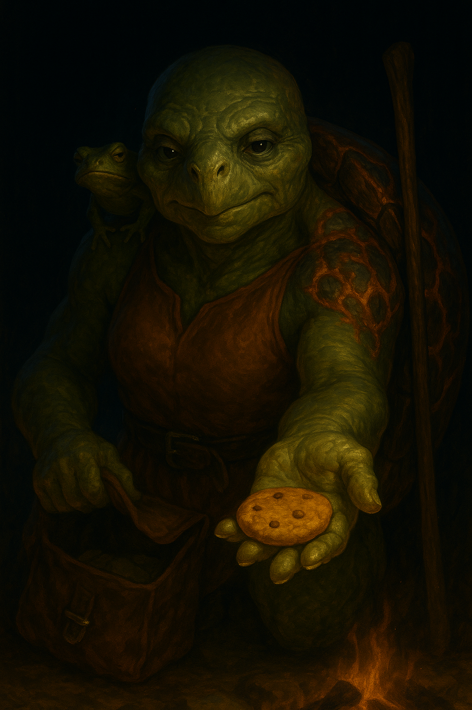

# Olan Danù

{ width="300" }

> *"Mercy's just a loan with interest, dear. Most folk pay it back. Those who don't... get the shovel."*

**A tortle wizard who survived being boiled by the fey and turned calculated kindness into her best defense—diplomat, abjurer, and philosophical survivor who forgives everything but forgets nothing.**

---

## Character Overview

- **Species:** Tortle
- **Class:** Wizard 5 (Abjuration)  
- **Background:** Noble  
- **Age:** 140
- **Alignment:** Lawful Neutral

??? info "Quick Intro"
    
    **At the Table**
    
    * Offers snacks, mends cloaks, remembers birthdays, but it's mostly diplomatic infrastructure and habit
    * Wants to believe people are worth it; fears she's lying to herself
    * Party detective, anti-mage, battlefield controller, and diplomatic face
    
    **Backstory (Short Form)**
    
    Born to diplomat-archivists in a tiny buffer state between the Material Plane and Feywild, Olan negotiated her first treaty perfectly, and was promptly thrown in a boiling cauldron to become turtle soup for embarrassing a fey lord. She escaped using abjuration magic, scarring her shell with permanent fiery wards. The incident sparked a brief war and taught her that being right means nothing if you're not likable. Now she travels, weaving protective magic and calculated friendships, with the guarded tone of a very tired optimist.
    
    **Playing Olan**
    
    * **Combat:** Denial engine wizard—shields, wards, and battlefield control. Keeps everyone breathing while weathering the storm. Shell up for +4 AC and concentration advantage when critical.
    * **Roleplay:** Smooth, unflappable, warm and gracious... especially when hurt or betrayed. Watch Fafnir the frog Familiar—he mirrors her actual feelings. When her voice turns to honey, someone's about to get the shovel.
    * **Party Synergy:** Makes friends everywhere, does favors and logs them to call them in further down the line, offers strategic counsel.

---

??? info "Deep Dive"
    
    ## Full Backstory
    
    Olan Danù was born to the Archivist-Ambassador couple of the Serene Concord of the Reedwater Throne, a small, ridiculously old buffer state nestled precariously between the Material Plane and the Feywild. The Concord didn't have armies. Its power was in its history, neutrality, and labyrinthine collection of treaties with fey courts, meticulously recorded and magically bound. Their entire national defense was essentially weaponized bureaucracy.
    
    Danù would travel with her mother to the different courts and learn the intricacies of diplomacy, but much preferred to stay with her father the archivist whenever she could, taking in as much knowledge as her young brain could handle. Back then, Olan believed in knowledge for the betterment of all.
    
    Every decade, the courts met to renew the Accords of the Tide: an agreement on rights for all the courts involved to fish, trade, and harvest pearl-dust without tearing the veil apart. At Olan's first Meeting of the Accords as a young diplomat, the Court of Mirrors accused the Reedwater Throne of hoarding Fey pearls, and Olan negotiated in good faith. She quickly uncovered the real culprit, a mortal prince smuggling through a human port, and presented her evidence before the Fey lord Advilmar, host of the renewal feast.
    
    By every law and clause, she was right. She saved her people. And for a brief, proud moment, the court applauded her logic. However, that day she learned an important part of diplomacy: it doesn't matter if you're right, if you make the wrong person lose their face. As the Renewal Feast started, the entrance course was called out: "the tortle envoy, boiled in her own wisdom."
    
    Olan didn't know if they were truly angry or if it was just theatre, but she struggled to stay calm as they seized her and threw her into a lavish, giant cauldron of cold rolled steel.
    
    Drawing on the teachings from her many nights in the archives, she quickly withdrew into her shell, weaving a heat-repellent abjuration ward. The cauldron exploded, oil and boiling water spraying wildly over the assembled fey. Chaos ensued. Olan escaped, but not unscathed. The incident scorched her shell. The magic fire of the Eladrin combined with her abjurative protection in swirling, flame-like patterns that to this day glow fiery red when Olan weaves her wards.
    
    The event led to a brief war between the courts, and while Olan was never faulted for the incident, it forever changed her outlook on people and politics.
    
    ## Personality Analysis
    
    Olan carries many disappointments, so many times that her philosophy has failed. Her charity has an edge to it these days. She struggles with the kind of misanthropy you only develop after a few too many years in top politics. She may understand that it's rational to make friends of your enemies, but she has also learned the hard way that if you are the only one acting rationally in a world of fools, you only end up hurting yourself.
    
    Every act of care is ambiguous. It is to a certain extent an act of defiance against her growing conviction that people aren't worth it. It's her own daily uphill struggle. But Olan learned her lesson in that cauldron: being correct is worthless if you're not likable. So she became relentlessly warm, offering snacks, mending cloaks, remembering birthdays, forging alliances with everyone from barmaids to bandit chiefs. It's not generosity so much as diplomatic infrastructure.
    
    Many adore her and trust her, but she knows exactly how hollow that trust is, because she built it with the same calculated precision she uses to ward off fireballs. She doesn't bear grudges, because grudges are expensive and spite is a luxury for people who aren't one political miscalculation away from becoming soup. When genuinely hurt, she becomes *more* gracious and lovable, not less. When her voice turns to honey, you may be about to meet the shovel. But for all her diplomacy, her close friends have learned to watch Fafnir. He mirrors her actual feelings no matter what she performs.
    
    **Personality traits:** Calculated care, bittersweet wit.
    
    **Ideals:** Travel light, body and soul.
    
    **Bonds:** Too many to count.
    
    **Flaws:** Forgives, but never forgets. Carries more than she admits, even to herself.
    
    ## Sample Quotes
    
    "Don't trust maps too much. The world likes to move when no one's watching."
    
    "Most grudges weigh more than the person you hate is actually worth. I travel light."
    
    "Only kill if you must. Only forgive if there's room for change. Balance, like a good stew."
    
    "I'm kind because it's rational. I'm patient because it pays. Making friends is a sound investment."
    
    "Did you know Dryads are ticklish? You just have to find the spot."
    
    "Prayers don't stop arrows, dear. Wards do."
    
    "Yes, many people are trash. Perhaps most of them, truth be told. But they only win if you let them convince you to change who you are. Stopping would make them right about the world."
    
    "If you can't find a reason to keep going, try spite."
    
    "I still believe in people. Just... not as a group."
    
    ## Playing Olan in Detail
    
    Olan can both write beautiful letters and forge them well enough as part of her diplomat background. While she has -1 DEX, it's more about knowing systems, not hand-eye precision. Olan could produce forgeries by delegating the manual work to unseen servants, familiars, or just sheer magical precision. But feel free to switch these proficiencies to other skills as wanted.
    
    Fafnir, a small, unimpressed frog familiar perches eternally on Olan's shoulder, blinking slowly like it's judging everyone's life choices. He never speaks, yet somehow communicates volumes. Mostly disdain. He does however subtly mirror Olan's inner monologue, which might be practical for the party, as she's typically way too polite to state her feelings outright. If Fafnir starts giving you the stink-eye, you can be pretty much positive that Olan won't bother sending you a birthday card this year. Dragon's Breath is a genius spell for your familiar, if only because an expressionless frog named Fafnir riding on your shoulder and breathing fire on their turn is such a vibe.
    
    Despite her past brushes with horror, Olan radiates effortless warmth. She offers snacks on the road, mends the party's cloaks by the fire (she could just use a cantrip, but occasional handiwork is soothing for the soul), and has a kind word for everyone, friend or stranger. Like a good diplomat, she doesn't bear grudges. When you get the chance to be merciful, take it. But phrase it as an investment. Also try to lean into her making friends wherever she goes.
    
    Playing Olan well can take some preparation and consideration. Here's an example of how she might deal with someone who has just betrayed the party:
    
    *Olan doesn't even flinch. She gives the most joyless smile you ever saw, and starts writing letters. Soon thereafter, she arranges a tête-à-tête with the traitor, where she makes it abundantly clear that not only will he never lay a hand on her friends again, but her whole network will shun him. Every person she has ever helped will consider him an enemy. She's not wrathful, rather she's correcting a breach of trust with the patience of a social surgeon cutting away a tumor.*
    
    "Oh, sweetie. You went and confused kindness with complacency. Common mistake among rookies. I forgave you already, of course. But that's not the same as forgetting. You see, every favor I've ever given was a thread. I've given many favors in my life. And now all those threads are pulling the same way. You'll feel it soon. Fewer smiles. Fewer doors open. That's diplomacy in a nutshell, dear. Actions, and consequences... and at the end of the day, the realization how much you rely on others."
    
    ## Mechanical Analysis
    
    Tortle Abjuration Wizard is borderline munchkin territory, with 17 AC as a start, easily increased with magic items or a Shield proficiency. When it is crucial to maintain Concentration, consider using her Shell up ability. +4 AC, prone (disadvantage for any incoming Ranged attacks), and advantage on concentration saving throws. NB: you can't take Reactions while shelled up. Weigh pros and cons.
    
    Olan's feat Keen Mind can of course be replaced by a more classic feat like Warcaster if that suits your table playstyle better. But Olan is envisioned as a character that can be eminently helpful in more ways than simply blasting. Quick Study lets you make Investigate, Arcana, History, Nature or Religion skill checks mid-combat as a Bonus Action, improving her action economy drastically. Imagine Olan figuring out how to disturb a summoning circle, learning the BBEG's leverage on their minions, or inducing what patron their Warlock nemesis is serving, all while casting her spells like normal. It leans more towards the storytelling aspects, but can also have big impact mechanically. Ultimately, these checks depend on how creatively you manage to utilize them as a player, and how much your DM is willing to lean into it.
	
	If you don't want to just max out Intelligence right away, consider taking the Feat Resilient: Constitution at lv 8 to bump CON to 16, add Proficiency Bonus to all Concentration saves and get an extra +8 HP in one fell swoop. 

---

??? info "Key Relationships"
	- **Dharma Lanternghost**: Tabaxi soothsayer who almost certainly goes under a stagename. She runs fortunes from a river boat that's constantly on the move, and she's either the real deal or the world's most convincing charlatan—even Olan can't tell, and that uncertainty drives her crazy. Whenever they bump into eachother the will always indulge in tea and card games and catch up: part genuine affection, part philosophical chess match. Dharma represents everything Olan's trying not to believe: that maybe some things can't be rationalized, that maybe trust requires actual faith, that maybe her careful calculations are just another shell she's hiding in.
	
	Dharma constantly tries to give Olan talismans, which the more secularly minded Tortle kindly declines. They met forty years ago when Dharma read Olan's fortune unbidden: "You'll spend your life building walls that look like bridges." Olan laughed it off, but the line haunts her.
	
	- **Trequay Kimwin**: Aaracokra who is better known as the "Messenger Pigeon". He's pathologically devoted to his work, treating every delivery like a sacred oath. He's saved multiple city-states just by refusing to accept that "impossible" applies to him. Olan hired him once for a routine job and was so impressed that she's used him exclusively for 10 years. He's delivered messages through active warzones, bypassed magical wards, and memorized verbal messages too sensitive to write down.
	
	- **Aquila Diredawn**: Edgy young Tortle Sorceress. She is everything Olan used to be before the incident with the cauldron: brilliant, idealistic, convinced that being right is enough. She's also reckless, self-sabotaging, and chronically underestimates consequences. Olan has extracted her from trouble dozens of times—magical debts, pissed-off nobles, experiments gone wrong. Aquila is grateful but also deeply resentful, trapped in that adolescent belief that accepting help means admitting incompetence.
	
	Olan never asked for a mentor role and Aquila never demanded it, but somehow that's the positions they slip into whenever their paths cross. Aquila is arguably more naturally talented than Olan. Her wild magic makes her unpredictable but devastatingly powerful when it connects. Olan sees her younger self in Aquila but also sees potential she herself never had. There's genuine affection there, buried under layers of mentorship neither of them agreed to. But Aquila is making the same mistakes Olan did, and it's only a matter of time before she embarrasses the wrong archfey.
	
---

??? danger "Notes for the DM"
	
	The fantasy that makes Olan fun to play is not the glass cannon wizard raining down destruction, but the denial engine that keeps everybody breathing and weathers the storm. If you truly want to take her offline, DEX or STR saves will do the job, but remember the game is about having fun, not countering each others' builds.
	
	### Dramatic Questions
	
	- *How will Olan act towards those who misuse her investments in them? Say a bandit she spared resurfaces as a robber baron. Has he "paid his debt," or defaulted? A foe begs for mercy but clearly can't be trusted. Does she waste the "loan"? An ally keeps making reckless choices. Does she keep investing, or cut losses?*
	- *On a personal level, how does Olan deal with someone showing true respect and deference to her, not just treat her as a cog in the political machinery? What does it take for the cynic to go quiet, if only for a while?*
	- *What would it take for Olan to explode? Not just do something that's not premeditated, but truly lose her composition? Even if she's immune to personal slights, then what if somebody manipulated her, used her credibility and contacts to hurt others in her name?*
			
	### Plot hooks
	
	- **The Premises of the Promises**: Advilmar the Fey lord has a problem. He's simultaneously promised a tract of his domains to two different factions of Bugbears, hoping they'd end up destroying each other. Instead, they teamed up. Against him. But this spells bad news not just for Advilmar but for other adjacent city-states as well. Now he needs a top diplomat to figure out how to split the two clans again, sowing dispute and suspicion in their ranks.
	
	It may already be a hundred years since the boiling incident, but both Olan and Advilmar remember it vividly. Now he's coming to *her* for help, and he's doing a shitty job of being graceful about it. Even so, this is where Olan's philosophy is put to the test. Does she make an ally of Advilmar? Does she trust him to keep his word? And what will she do with the knowledge now that she has it? Is saying "no" truly an option here? 
	
	- **The Thread Pulled**: Grevik the Fence, one of Olan's oldest "investments" has been captured by enemies of the Reedwater Throne and is giving up the people he knows in her network to save himself. While he doesn't know many, there are two who Olan would want to save at all cost, but maybe they don't have time to save them both?
	
		- Merry Catchlight (halfling innkeeper, 70s): Olan's oldest friend and most trusted message drop. She's been running The Gildenwort Inn as neutral ground for forty years. Knows only two other names but is beloved by everyone—losing her would crater Olan's reputation for protecting her people.
		
		- Wex (kenku forger, 20): Creates the documents that make Olan's diplomatic machinery work. Knows five contacts. Morally flexible, brilliant, impossible to replace, and has a long life ahead of them.
	
---

??? info "Mechanical build (lv 5) and PDF download"

	| STR | DEX | CON | INT | WIS | CHA |
	|:---:|:---:|:---:|:---:|:---:|:---:|
	| 8 (-1) | 8 (-1) | 15 (+2) | 18 (+4) | 12 (+0) | 14 (+2) |
	
	## Combat Stats
	
	| AC | HP | Hit Dice | Speed | Initiative | Prof. Bonus |
	|:---:|:---:|:---:|:---:|:---:|:---:|
	| 17 | 32 | 5d6 | 30 ft. | -1 | +3 |
	
	**Saving Throws: Intelligence: +7, Wisdom: +4**
	
	**Resistances:** None
	
	## Proficiencies
	**Skills**: Arcana: +7, History: +7, Investigation: +10, Nature: +7, Perception: +4, Persuasion: +8
	
	**Armor:** None | **Weapons**: Simple Weapons
	
	**Tools**: Calligrapher's Supplies, Forgery Kit, Playing Card Set | **Languages**: Common, Sylvan
	
	## Feats
	- **Skilled**: Gain proficiency in 3 skills, instruments or tools of your choice
	- **Keen Mind**: Expertise in an Intelligence skill, can Investigate as Bonus Action
		
	## Equipment
	Spellbook, Abacus, Quarterstaff, Component Pouch, Playing cards, Forgery Kit, Calligrapher's Supplies
	
	**Suggestions for Magic Items**
		- Cloak of Protection (More AC on tanky Wizard always the right move)
		- Perfume of Bewitching (Advantage on Charisma checks for 1 hour, perfect for a diplomat)
		- Mind Sharpener  (4 charges, lets you keep Concentration even if you failed the roll, recovers 1d4 charges/LR)
	
	## Spellcasting
	**Cantrips**: Mending, Message, Mind Sliver, Minor Illusion
    **Level 1**: Absorb Elements, Chromatic Orb, Find Familiar, Shield
	**Level 2**: Dragon's Breath, Shatter, Spider Climb
	**Level 3**: Intellect Fortress, Magic Circle

	📄 [Download Level 5 Character Sheet (PDF)](assets/olan-danu-lv5.pdf)

---

??? danger "**Session Zero Considerations**"
    
    **Content Notes:** Themes of political trauma, near-death experience via attempted execution, war as consequence of diplomatic incident. Generally suitable for most tables with mature themes.
    
    **Representation Notes:** Character explores themes of calculated emotional labor and philosophical misanthropy as survival mechanisms.

---