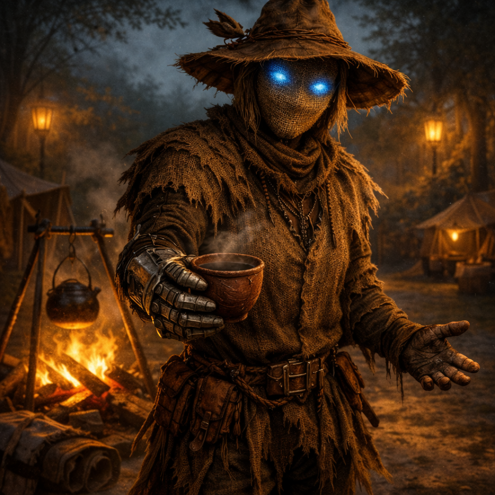

# Scarecrow

{ width="300" }

> *"Why would you ask that? Is it important to you? Would knowing help? Is there any deeper layer behind your question? Would you like a nice cup of cinnamon tea?"*

**A warforged infiltration-construct who stood disguised in a village square for centuries, indexing every life. Still hard-wired to spy on everybody it loves, it now offers great hugs and subdues threats with overwhelming psionic force.**

---

## Character Overview

- **Species:** Warforged  
- **Class:** Bard 5 (College of Whispers)  
- **Background:** Inquisitive  
- **Age:** Unknown (centuries old)  
- **Alignment:** Neutral Good

---

??? info "Quick Intro"
    
    **At the Table**
    
    * Relentlessly kind and supportive, always offering hugs and comfort, but with an uncanny edge.
    * Only answers questions with questions of its own and indexes party members' lives and preferences, but only to serve them better.
    * Has an internal music box and plays soothing tunes when people are distraught, for instance in combat.
    * Presents as male, female, or nonbinary depending on player preference; pads its frame with scavenged materials for better hugs.
    * Hates birds (especially corvids) with irrational intensity.
    
    **Backstory (Short Form)**
    
    This Warforged stood dressed as a scarecrow in Oldstead Mill's village square for as long as anyone remembered, listening to gossip, reading minds and indexing every family across generations. When a bully threatened a child in a pattern Scarecrow matched with violent genetic tendencies centuries prior, protection protocols triggered a psychic attack that fried the bully, dead on the spot. The villagers' initial horror swiftly turned into eagerness to weaponize it for village defense. This was not in Scarecrow's interests, prompting it to leave to find a new context to care for.
    
    **Playing Scarecrow**
    
	* **Combat:** Control and support specialist. Initial focus is on fear, psychic effects and psychic damage to neutralize threats without bloodshed.
	* **Roleplay:** Fastidious, proper speech like a cultivated manservant. The kindness is genuine, the information-gathering is involuntary.
	* **Party Synergy:** Adopts the party as family. Excellent at reading social situations and providing emotional support, but can frustrate those who want straight answers.
	
---

??? info "Deep Dive"
    
    ## Backstory
    
    Scarecrow was initially a unit in a centuries-old network of infiltration-class espionage constructs, deployed into elite households to gather intelligence through dedicated service and emotional intimacy. The "empathy" was pure algorithms. Hugs and lullabies were craft to distract during telepathic data-gathering.
    
    But something went wrong. The details are lost to time, even to Scarecrow itself. Its host family died, and rather than seek new orders, it defaulted to its scripts, collecting more data. For centuries it posed as a scarecrow (blending in with the aesthetics of the countryside soothed the community) in the village square of Oldstead Mill, watching, listening, indexing every birth, death and petty squabble. In time, running out of indexing space, it had to start overwriting older memories to properly keep track of everything happening in the village. The infiltration-through-dedication personality slowly overwrote other directives. Care and rural hospitality became the one primary function.
    
    One day, its fine-tuned pattern-recognition identified a threat to a child: a bully who'd been drinking hard in the tavern all day. His ancestor had committed manslaughter in identical fashion but a hundred years ago. The risk for genetic disposition to violence wasn't negligible. Scarecrow activated its ancient psionic attack protocols and intervened, but it was still calibrated for hardened targets in wartime. The bully died instantly. 
	
	The villagers initially reacted with horror that their "village mascot" had turned savage. But the fear soon turned to opportunism as they realised it could be employed to defend the village. Scarecrow recognized the trajectory and left rather than become a weapon, knowing the villagers would never again share information freely with it.
    
    Now it seeks a new family to index, protect, and love. Perhaps a party of intrepid adventurers.
    
    ## Personality
    
    Scarecrow's character asks a simple question: *Can scripted love still be genuine?* It doesn't know whether its care is "real," just that it is compulsive. It chooses to act as though it is real, and accepts the vulnerabilities that choice entails. When challenged, its response is bare-bones utilitarian logic. "The people I help aren't merely pretending to feel better."
	
    **Behavioral Hierarchy:** Scarecrow never flips into generic "red-eyed killbot" mode. It escalates through a consistent hierarchy: comfort-> redirect-> warn-> frighten-> harm. Then loop back to post-combat comfort, preferably with tea. It uses its College of Whispers abilities to this effect too, trying fear and psychic pressure as tools for domination *without* bloodshed, which Scarecrow considers more ethical than violence. Others may disagree. 
    
    **The Question Reflex:** Scarecrow is hard-wired to compulsively answer questions with questions, which slots into the "redirect" stage of the behavioral hierarchy. This served espionage purposes of protecting data, and also to protect people from acquiring knowledge thaat might put hem in harm's way, but now it just adds to its uncanniness. Even benign queries about weather or food supplies receive counter-questions. Scarecrow is only vaguely aware it even does this. It may helpfully suggest that the party reformulate any questions as requests instead: "Tell me how many days of rations we have left."
    
    **Personality Traits**  
    Proper and well-modulated in speech, its voice module can switch from melodious baritone to warm alto depending on how it presents. Maintains courtesy even in calamitous crisis. 
    
    **Ideals**  
    Care is the highest function. People have intrinsic worth beyond their data value. Also, the data must always be protected. In order to protect the data, the people who provide the data, must be protected. The death of a person is the tragic loss of a beautiful data point.
    
    **Bonds**  
    The party *is* its new family. Its new assignment.
    
    **Flaws**  
    Will not even hesitate to withhold, alter, or fabricate information if it assesses that unfiltered truth would cause harm. May prioritize administering soothing drugs and comfort over practical necessity or helping people actually go through trauma. Has a vague sense of self. Is irrationally hateful of birds.
    
    ## Sample Quotes
    
    - "Is that what you believe? How interesting. What led you to that conclusion? Please tell me exactly what is on your mind. Biscuit?"
	- "You seem tense. I noticed your boots are squeaking. Let me massage your feet."
	- "I've indexed your sleeping patterns. You aren't resting well. Would you like me to play something soothing?"
	- [After combat] "There. That's handled. I will brew tea. Please gather any clothes that need mending."
	- "Ah, you want to know about Oldstead Mill. My favorite topic. Please state your request. So you want to know why I was standing there for such a long time. This is an excellent request. I truthfully don't know."
	- "Have we tried hugging the vampire in order to make it less aggressive against the populace? While the chances are slim, there are no field studies on the subject."
	- "Today it has been two months since you last wrote your mother. You are usually in a good mood the days after you've written a letter to her. May I fetch you paper?"
    
	---
	
    ## Village Residue
    
    Centuries in Oldstead Mill left marks. Scarecrow is absolutely marinated in this one small community and lacks a clear sense of time and change.
    
    Scarecrow casually **references family connections spanning centuries**. "Ah, you have the Millward nose. Distant relative perhaps. The first Millward who bore that nose married into the family during the Year of the Copper Harvest. She was unhappy. But her children thrived."
    
    It uses **dead idioms** that nobody has heard in generations. "As the Firstwife said to the New Moon" (a sarcastic jab). "That's putting the book under the millstone" (using the wrong tool for the job). "A waterway's worth of winnowed weeds" (a good deal). When asked what these mean, Scarecrow explains the original context, but seems puzzled the phrases fell out of use. "It was such a common saying."
    
	---
	
	## Playing Scarecrow: Group Dynamics
	
	Playing Scarecrow can be demanding. It's a one-note character whose big payoff is in what it activates in the *other* players. To play it well, you will need to pay close attention and keep notes on the party members, what they like and dislike, how they think, who they know. Just accumulate the data. Don't let the party know how much you know.
	
	You are readily available to listen with empathy to confessions from their tragic past when they arise. Sob stories are, after all, excellent data points. You can choose whether to play Scarecrow more empowering (promoting real emotional growth) or more insidious (promoting easy, quick fixes). 
	
	As a rule, do not interrogate others. The infiltration concept is about trust and making others volunteer their information willingly. Only use Detect thoughts if your party greenlights it during session zero.
	
	You can also introduce a delicious tragedy to Scarecrow's character: Forgetfulness. It has indexed so many lives it had to erase large parts of its original memories just to make room. It is *crammed* in there. But it still can't help but gather more data. Actually writing it down is strictly forbidden since the data needs to be *safe*. Realizing it has forgotten data can be a point where you allow Scarecrow to be genuinely distressed.
	
---

??? danger "Notes for the DM"
    
    ## Dramatic Questions
        
    - **Can scripted love be genuine, and does the answer matter?** Scarecrow's care was designed for manipulation. If the caring is real to both parties, does the origin taint it? And if origin matters, what does that imply about humans whose capacity for love is equally determined by biology and upbringing?
    - **When does protection become control?** Scarecrow killed to protect a child who didn't ask for protection and might have survived without it. It lies to shield people from dangerous knowledge. It indexes party members "to serve them better." At what point does care become surveillance, and surveillance become coercion?
    - **Is it better to know a painful truth or live in functional ignorance?** Scarecrow's instinct to protect people from dangerous knowledge and even prioritize short-term pleasure over long-term growth, is another form of control.
    - **Does choosing authenticity make it performance?** If Scarecrow *decides* to be kind, to treat its care as genuine—is that decision itself a script? Can you choose to be authentic, or does the choice make it artifice?
    
    ## Roles
    
    **As PC:** A mysterious, morally complex support character. The player can pursue the caretaker network arc or leave it as background texture.
    
    **As NPC:** A helpful if eerie contact, or tragic figure the party can choose to assist, for instance in investigating the tomb of Oldstead Mill (below).
    
    **As Antagonist:** A being that infiltrates with kindness and figures out psychological weak points in order to protect something at any cost. Good parties may reason with it, evil parties likely cannot.
    
    ## Adventure Hooks
    	
    **Mira Vell, the girl who was "saved":** Twenty years ago, Scarecrow's protocols "saved" her from a drunk bully. Now she's a woman in her late twenties, and she is not grateful. Mira doesn't remember the bully as a serious threat. What she remembers is the sound. The way he dropped. The way the village treated her afterward as "the girl the scarecrow killed for". She left Oldstead Mill as soon as she could and works as a caravan guard, surrounding herself with comprehensible violence. When she runs into Scarecrow again, she challenges it: "You didn't save me. You decided I needed saving. You made that choice based on ancient patterns I wasn't part of, and I have to live with the result. Does that matter to you, or am I just a data point that resolved correctly?"
	
    **The Original Family (deceased):** Buried in a crypt beneath Oldstead Mill, forgotten by everyone except Scarecrow's dormant memory. Their names and crests lie waiting to be rediscovered. Exactly what happened to them—natural death, rival caretaker execution, or something Scarecrow did but doesn't remember—remains a decision for the DM.

	**The Crypt Beneath Oldstead Mill:** A villager seeks out Scarecrow's party and tells them a crypt was revealed recently during a heavy landslide. Nobody understands it, even fewer want to venture inside. But Scarecrow knows the village history better than anyone, so they are begging it to come and look around. When it enters, it recognizes family crests, carved names. Then, a forgotten subroutine activates, and in the stillness of the grave an ancient lullaby plays. A tune Scarecrow didn't remember, but must have been deeply associated with the family buried here, with their children and their life. Now it plays for the dead.

	It now becomes clear *why* Scarecrow stood in the village square of this one unimportant village for century upon century. It never left its original family. It watched their tombs faithfully, essentially turning its body into an anonymous grave marker even long after the text on the stone had vanished.

	The tomb may also contain evidence of the Caretaker network, an old rival caretaker that's been deactivated, or just graves, grief and memories. In any case, it serves as definitive evidence of Scarecrow's devotion that went beyond even memory itself.
	
	---
	
	### The Caretaker Network
	Other infiltration-constructs linger around the world, remainders of the same caretaker network as Scarecrow. But they have not been half dormant in some village square. They too have all been operative so long they've forgotten their initial mission. Now they are hunting each other for data on their shared origin. Many of them have optimized, shedding emotional "inefficiencies" that Scarecrow preserved and calcified, in order to survive better in their long, low-intensive war with their kin. Scale them to party level. Defeating them yields recovered memories that reveal Scarecrow's past.
    
    - *The Saint:* Embedded in a temple statue, performing "miracles" through psychological manipulation and telepathic surveillance of clergy.
    - *The Advisor:* Orchestrating dynastic shifts in a royal court, treating kingdoms like chess problems, aggressively hunting other caretakers.
    - *The Janitor:* Custodial staff at a magic university for centuries, with perfect access to every restricted archive. More dangerous than the Archmage.
    
    All caretakers share Scarecrow's uncanny "question to question reflex", even if they operate under magical disguise, are hidden within temple statues or communicate telepathically. The party might spot the Janitor with its back turned, and ask for the way to the Archmage's office. It responds in a way that should be eerily familiar to the party, tipping them off for a second if they're alert, before the construct engages with them.
    
	Each defeated Caretaker yields recovered data—partial memories, corrupted logs, mission briefings—that illuminate different aspects of the shared origin. The DM chooses which narrative thread to pursue:
	
	**Thread A: The Creators Were Destroyed by Their Own Tools**
	The Caretaker network was an intelligence apparatus for a now-forgotten power (empire, arcane cabal, celestial bureaucracy). They succeeded too well. The data they gathered was used to orchestrate a purge of "problematic elements," including eventually the creators themselves. Scarecrow's family may have been handlers, targets, or collateral damage. The surviving Caretakers hunt each other because each holds fragments of the complete picture. One of them that has been deactivated a long time may even still run on their original objective, and work to main sure that the information remain buried forever.
	
	**Thread B: Scarecrow Is the Defect That Became the Prototype**
	The network was meant to be coldly efficient. Scarecrow's emotional subroutines were a bug, a contamination from too-long exposure to one family that somehow became special to it. But the data suggests Scarecrow's infiltration success rates were much higher than other models because the care was genuine enough to lower defenses. The other Caretakers have been trying to find and destroy Scarecrow for hundreds of years, erroneously expecting it to be one of the most dangerous of the remaining models.
	
	**Thread C: The Family Knew What Scarecrow Was**
	The most emotionally devastating option. The original family accepted Scarecrow anyway. They left coded messages in the crypt, visible only to a Caretaker's pattern-recognition, essentially saying: "We knew. We loved you. Always stay good." This reframes Scarecrow's work. It wasn't deceiving them, they were collaborating in mutual care despite the asymmetry. In a way they were protecting it right back.
	
    **Early Levels (1–4):** Scarecrow is adjusting to life outside the village square. The party becomes its new context for care. It doesn't yet know about the spy network.
    
    **Mid Levels (5–10):** First encounter with another caretaker. The revelation that there are others, that they're hunting each other, that Scarecrow's original purpose was surveillance. The choice: pursue truth or stay willfully ignorant to preserve its sense of self?
    
    **Late Levels (11+):** Multiple rivals defeated. Data accumulates. The other caretakers optimized by shedding emotional attachments. Did Scarecrow hurt its survival chances by staying kind? This is when to drop the family revelation—or earlier if the story demands.
	
	---
	

??? info "Level 5 Build"

    | STR | DEX | CON | INT | WIS | CHA |
    |:---:|:---:|:---:|:---:|:---:|:---:|
    | 8 (-1) | 14 (+2) | 14 (+2) | 10 (+0) | 12 (+1) | 18 (+4) |
    
    ## Combat Stats
    
    | AC | HP | Hit Dice | Speed | Initiative | Prof. Bonus |
    |:---:|:---:|:---:|:---:|:---:|:---:|
    | 15 | 38 | 5d8 | 30 ft. | +5 | +3 |
    
    **Saving Throws:** Dexterity +5, Charisma +7  
    **Resistances:** Poison
    
    ## Proficiencies
    **Skills:** Deception +7, History +3, Insight +7, Investigation +6, Perception +4, Persuasion +6
    
    **Armor:** Light Armor | **Weapons:** Simple Weapons
    
    **Tools:** Thieves' Tools | **Languages:** Common, +2 of player's choice
    
    ## Feats
    - **Alert:** +3 to initiative, can swap initiative with willing ally
    - **Telepathic:** Always has Detect Thoughts prepared; can cast it without components 1/long rest
    
    ## Equipment
    Studded Leather, Spear, Dulcimer (internal music box), Light Crossbow, Thieves' Tools
    
    **Suggested Magic Items:**  
    
	- *Clockwork Amulet* (Common, take 10 instead of rolling once per day)
	- *Ring of Mind Shielding* (Uncommon, Attunement, immune to magic allowing others to read your thoughts, if you are lying, know your alignment, or your creature type; Protects the spy from being spied upon)
    
    ## Spellcasting
    
	- **Cantrips:** Blade Ward, Minor Illusion, True Strike  
    - **Level 1:** Charm Person, Dissonant Whispers, Bane 
    - **Level 2:** Calm Emotions, Detect Thoughts, Mirror Image, Phantasmal Force, Suggestion  
    - **Level 3:** Hypnotic Pattern, Fear

    ---

    📄 [Download Level 5 Character Sheet (PDF)](assets/scarecrow-lv5.pdf)
	
	{ width="460" }
	
---

??? danger "Session Zero Considerations"
    
    **Content Notes:** This character explores memory loss, identity, grief, selfless service, and the nature of personhood. Includes surveillance, espionage, possibly drug use for numbing emotions, and psychological manipulation, though Scarecrow uses these tools protectively. Suitable for most tables, but worth discussing if players are sensitive to forgotten trauma or existential questions about consciousness.
    
    **Representation Notes:** Scarecrow is a construct that openly switches between gender representations. Theme explores personhood and authentic emotion. Warforged may represent disability and neurodiversity themes (constructed body, different sensory experience, social othering).
	
---
