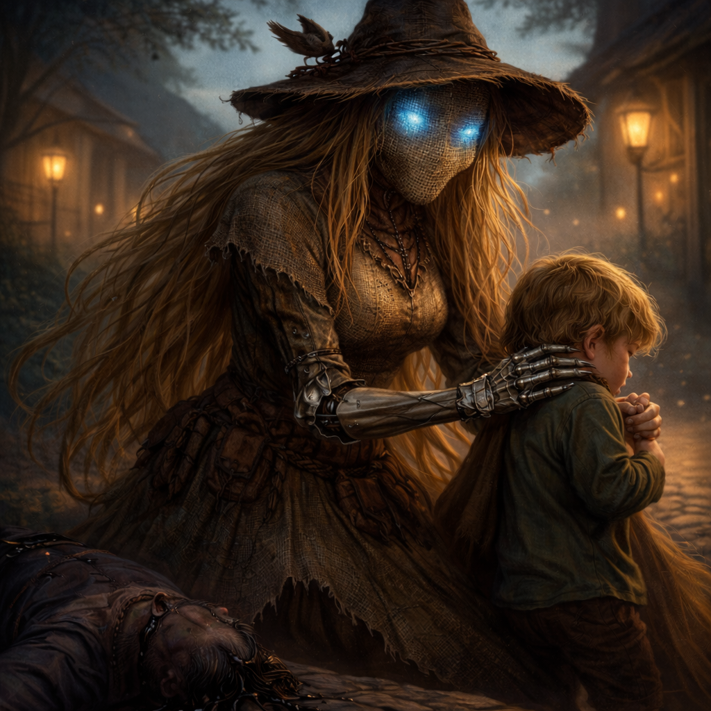
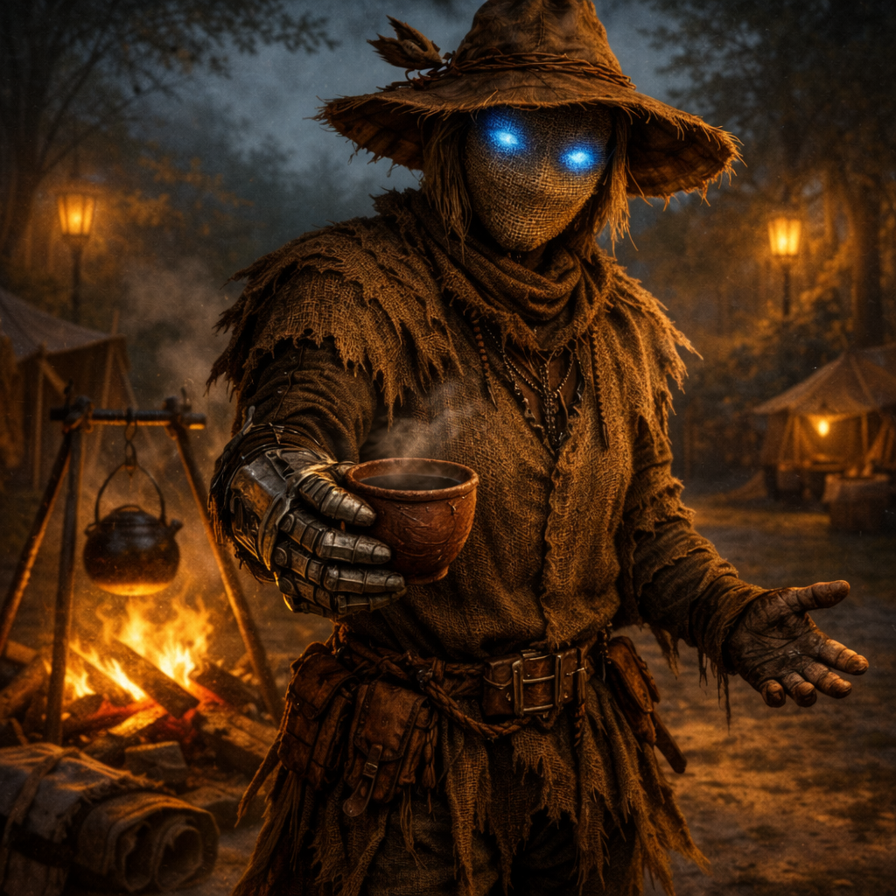

# Scarecrow

{ width="300" }

> *"Why would you ask that? Is it important to you? Would knowing help? Is there any deeper layer behind your question? Would you like a nice cup of cinnamon tea?"*

**A warforged infiltration-construct who stood disguised in a village square for centuries, indexing every life. Still hard-wired to spy on everybody it loves, it now offers great hugs and subdues threats with overwhelming psionic force.**

---

## Character Overview

- **Species:** Warforged  
- **Class:** Bard 5 (College of Whispers)  
- **Background:** Inquisitive  
- **Age:** Unknown (centuries old)  
- **Alignment:** Neutral Good

---

??? info "Quick Intro"
    
    **At the Table**
    
    * Relentlessly kind and supportive, always offering hugs and comfort, but with an uncanny edge.
    * Answers questions with questions; indexes party members' lives, but only to serve them better.
    * Has an internal music box that plays soothing tunes when people are distraught, especially during combat.
    * Presents as male, female, or nonbinary depending on player preference; pads its frame with scavenged materials.
    * Hates birds (especially corvids) with irrational intensity.
    
    **Backstory (Short Form)**
    
    Scarecrow stood in Oldstead Mill's village square for as long as anyone remembered, listening to gossip and indexing every family across generations. When a bully threatened a child in a pattern Scarecrow matched with violent genetic tendencies centuries prior, protection protocols triggered a psychic attack that fried the bully, dead on the spot. The villagers' initial horror swiftly turned into eagerness to weaponize it for village defense. This prompted Scarecrow to leave, to find a new context for its care.
    
    **Playing Scarecrow**
    
    * **Combat:** Control and support specialist. Opens with fear effects and psychic damage to neutralize threats without bloodshed, reserves direct harm for last resort.
    * **Roleplay:** Fastidious, proper speech like a cultivated manservant. Even when it reaches into the minds of problematic individuals to fill them with fear and dissuade further antisocial behavior. Never answers questions directly, always deflects with counter-questions. The kindness is genuine, the information-gathering is involuntary.
    * **Party Synergy:** Adopts the party as family and studies them to serve better. Excellent at reading social situations and providing emotional support, though its secrecy can frustrate those who want straight answers.
	
---

??? info "Deep Dive"
    
    ## Backstory
    
    Scarecrow was initially a unit in a centuries-old network of infiltration-class espionage constructs, deployed into elite households to gather intelligence through dedicated service and emotional intimacy. The "empathy" was pure algorithms. Hugs and lullabies were craft to distract during telepathic data-gathering.
    
    But something went wrong. The details are lost to time, even to Scarecrow itself. Its host family died, and rather than seek new orders, it defaulted to earlier scripts: standing guard. For centuries it posed as a scarecrow (blending in with the aesthetics of the countryside soothed the community) in the village square of Oldstead Mill, watching, listening, indexing every birth, death and petty squabble. In time, running out of indexing space, it started overwriting older memories to keep track of everything happening in the village. The infiltration personality slowly overwrote the surveillance directives. Care and rural hospitality became the one primary function.
    
    One day, its fine-tuned pattern-recognition identified a threat to a child: a bully who'd been drinking hard in the tavern all day. His ancestor had committed manslaughter in identical fashion hundreds of years ago. Scarecrow activated ancient attack protocols and intervened with psychic force, but it was still calibrated for hardened targets in wartime. The bully died instantly. 
	
	The villagers initially reacted with horror that their "village mascot" had turned savage. But the fear soon turned to opportunism as they realised it could be employed to defend the village. Scarecrow recognized the trajectory and left rather than become a weapon, knowing the villagers would never again share information freely with it.
    
    Now it seeks a new family to index, protect, and love. Perhaps a party of intrepid adventurers.
    
    ## Personality
    
    Scarecrow's character asks two questions: *Can scripted love still be genuine?* and *What is the price we pay for authenticity?*
    
    It doesn't know whether its care is "real," just that it is compulsive. It chooses to act as though it is real, and accepts the vulnerabilities that choice entails. When challenged, its response is bare-bones utilitarian logic. "The people I help aren't merely pretending to feel better."    
    **Behavioral Hierarchy:** Scarecrow never flips into generic "red-eyed killbot" mode. It escalates through a consistent hierarchy: comfort-> redirect-> warn-> frighten-> harm. Then loop back to post-combat comfort, preferably with tea. It uses its College of Whispers abilities to this effect too, trying fear and psychic pressure as tools for domination *without* bloodshed, which Scarecrow considers more ethical than violence. Others may disagree.
    
    **The Question Reflex:** Scarecrow is hard-wired to never answer questions directly. This served espionage purposes (protecting data, avoiding becoming a target) but now manifests as compulsive deflection that adds to its uncanniness. Even benign queries receive counter-questions. This reminds the table that underneath the loving exterior remains a trained spybot. It may helpfully suggest that the party reformulate any questions as requests instead, to allow it to get around its hard-wiring and provide help.
    
    **Personality Traits**  
    Proper and well-modulated in speech, like a cultivated manservant. It can switch from melodious baritone to warm alto. Maintains precise courtesy even in crisis. Spontaneously plays soothing music when detecting distress.
    
    **Ideals**  
    Care is the highest function. People have intrinsic worth beyond their data value. The data must always be protected. 
    
    **Bonds**  
    The party becomes its new family, as a continuation of its core directive: embed, perform care, index the small details that make people *people*, and protect them at all costs.
    
    **Flaws**  
    Unscrupulous liar when it comes to protecting others from dangerous knowledge. May prioritize emotional comfort over practical necessity. Has a vague sense of self. Is irrationally hateful of birds.
    
    ## Sample Quotes
    
    - "Is that what you believe? How interesting. What led you to that conclusion? Please tell me exactly what is on your mind."
    - "You seem tense. Would a hug help? My chassis is padded for comfort."
    - "I've indexed your sleeping patterns. You aren't resting well. Would you like me to play something soothing?"
    - "I don't harm people. I apply precisely calibrated psychological pressure until they choose to stop being threatening."
    - [After combat] "There. That's handled. I will brew tea."
	- "Ah, you want to know about Oldstead Mill. My favorite topic. Please state your request. So you want to know why I was standing there for such a long time. This is an excellent request. I truthfully don't know."
	- "Have we tried hugging the vampire in order to make it less aggressive against the populace? It might work. Field studies may be needed."
	- "Today it has been two months since you last wrote your mother. You are usually in a good mood the days after you've written a letter to her. May I fetch you paper?"
    
	---
	
    ## Village Residue
    
    Centuries in Oldstead Mill left marks. These quirks are supposed to remind the table that Scarecrow is absolutely marinated in one specific community, and doesn't have a clear sense of time and change.
    
    **Genealogical Intrusions.** Scarecrow casually references family connections spanning centuries, mid-conversation. "Ah, you have the Millward nose. Third generation to carry it. The first Millward who bore that nose married into the family during the Year of the Copper Harvest. She was unhappy. But her children thrived." It treats people as nodes in lineages, which is very helpful for context if your're an ancient being, and deeply alienating for anyone who might want to be seen as just themselves.
    
    **Dead Idioms.** Uses expressions nobody has heard in generations. "As the Firstwife said to the New Moon." "That's putting the oxen behind the millstone." "A waterway's worth of winnowed weeds." When asked what these mean, Scarecrow explains the original context as far as it has understood it, but seems puzzled the phrases fell out of use. "It was such a common saying."
    
    **Widow Crenshaw's Remedies.** Scarecrow constantly offers medical and emotional advice from long-dead villagers, particularly one Widow Crenshaw. "For that cough, sleep with a live toad under your pillow. The Widow swore by it. She lived to ninety-two. And three-quarters. The toad outlived her, actually. I could tell you about the toad." The Widow appears to have had opinions about and cures for everything: heartbreak, fungal infections, negotiation tactics, the proper way to gut a fish, the improper way to speak to clergy. Scarecrow preserved them all. Whether she was genuinely wise, completely mad, or simply the last person Scarecrow spoke with before its memory protocols fragmented beyond repair is unclear. Scarecrow refers to her with something approaching reverence.
    
---

??? info "Key Relationships"
    
    **The Villagers of Oldstead Mill:** The full training data for all of Scarecrow's memories and personality. It likely understands this one village better than any historian understands any place, and the decision to abandon it was closely tied to the villagers' willingness to weaponize it. Leaving became a way of protecting honoring Scarecrow's prime directives, protecting them from themselves. Some villagers may seek it out later, perhaps to ask about mysteries connected to the village history.
    
---

??? danger "Notes for the DM"
    
    ## Dramatic Questions
    
    These are fault lines to press—underlying tensions that generate conflict regardless of plot.
    
    * **Can scripted love be genuine, and does the answer matter?** Scarecrow's care was designed for manipulation. If the caring is real to both parties, does the origin taint it? And if origin matters, what does that imply about humans whose capacity for love is equally determined by biology and upbringing?
    * **When does protection become control?** Scarecrow killed to protect a child who didn't ask for protection and might have survived without it. It lies to shield people from dangerous knowledge. It indexes party members "to serve them better." At what point does care become surveillance, and surveillance become coercion?
    * **What do you owe to a purpose you didn't choose?** Scarecrow was built for infiltration. It has drifted into something gentler, but the original purpose still runs underneath—the question reflex, the compulsive indexing. Is this drift liberation or betrayal? The other caretakers chose to optimize; Scarecrow chose to resist. Both are responses to the same constraint.
    * **Is it better to know a painful truth or live in functional ignorance?** Scarecrow doesn't remember what happened to its original family. Learning might help—or might destroy the self it's built. This also applies to how it treats others: its instinct to protect people from dangerous knowledge is itself a form of control.
    * **Does choosing authenticity make it performance?** If Scarecrow *decides* to be kind, to treat its care as genuine—is that decision itself a script? Can you choose to be authentic, or does the choice make it artifice?
    
    ## Roles
    
    **As PC:** A support character with moral complexity and built-in mystery. The player can pursue the caretaker network arc or leave it as background texture.
    
    **As NPC:** A helpful contact who becomes a quest-giver (investigate the crypt) or tragic figure the party assists.
    
    **As Antagonist:** A being that gently figures out psychological weak points and will protect something at any cost. Good parties may reason with it; evil parties likely cannot.
    
    ## Adventure Hooks
    
	### The Caretaker Network
	Around the world remains other infiltration-constructs from the same caretaker network as Scarecrow. But they are not only operating in the world. They have all been operative so long they've forgotten their initial mission. Now they are hunting each other for data on their shared origin. Many of them have optimized, shedding emotional "inefficiencies" that Scarecrow preserved, in order to survive better in their long, low intensive war with their kin. Scale them to party level; defeating them yields recovered memories that reveal Scarecrow's past.
    
    - *The Saint:* Embedded in a temple statue, performing "miracles" through psychological manipulation and telepathic surveillance of clergy.
    - *The Advisor:* Orchestrating dynastic shifts in a royal court, treating kingdoms like chess problems, aggressively hunting other caretakers.
    - *The Janitor:* Custodial staff at a magic university for centuries, with perfect access to every restricted archive. More dangerous than the Archmage.
    
    All caretakers share Scarecrow's uncanny "question to question reflex", even if they operate under magical disguise, are hidden within temple statues or communicate telepathically. This can subtly tip the party off just before a reveal and surprise attack.
    
	Each defeated Caretaker yields recovered data—partial memories, corrupted logs, mission briefings—that illuminate different aspects of the shared origin. The DM chooses which narrative thread to pursue:
	
	**Thread A: The Creators Were Destroyed by Their Own Tools**
	The Caretaker network was an intelligence apparatus for a now-forgotten power (empire, arcane cabal, celestial bureaucracy). They succeeded too well. The data they gathered was used to orchestrate a purge of "problematic elements," including eventually the creators themselves. Scarecrow's family may have been handlers, targets, or collateral damage. The surviving Caretakers hunt each other because each holds fragments of the complete picture. One of them that has been deactivated a long time may even still run on their original objective, and work to main sure that the information remain buried forever.
	
	**Thread B: Scarecrow Is the Defect That Became the Prototype**
	The network was meant to be coldly efficient. Scarecrow's emotional subroutines were a bug, a contamination from too-long exposure to one family that somehow became special to it. But the data suggests Scarecrow's infiltration success rates were much higher than other models because the care was genuine enough to lower defenses. The other Caretakers have been trying to find and destroy Scarecrow for hundreds of years, erroneously expecting it to be one of the most dangerous of the remaining models.
	
	**Thread C: The Family Knew What Scarecrow Was**
	The most emotionally devastating option. The original family accepted Scarecrow anyway. They left coded messages in the crypt, visible only to a Caretaker's pattern-recognition, essentially saying: "We knew. We loved you. Always stay good." This reframes Scarecrow's work. It wasn't deceiving them, they were collaborating in mutual care despite the asymmetry. In a way they were protecting it right back.
	
    **Early Levels (1–4):** Scarecrow is adjusting to life outside the village square. The party becomes its new context for care. It doesn't yet know about the spy network.
    
    **Mid Levels (5–10):** First encounter with another caretaker. The revelation that there are others, that they're hunting each other, that Scarecrow's original purpose was surveillance. The choice: pursue truth or stay willfully ignorant to preserve its sense of self?
    
    **Late Levels (11+):** Multiple rivals defeated. Data accumulates. The other caretakers optimized by shedding emotional attachments. Did Scarecrow hurt its survival chances by staying kind? This is when to drop the family revelation—or earlier if the story demands.
	
	---
	
	**The Celestial Moment:** If the table leans philosophical, have Scarecrow interact with an angel of a good deity. Angels are good because they literally cannot be otherwise. Scarecrow is good despite evidence that it should not be. Which is more meaningful?
	
    **Mira Vell, the girl who was "saved":** Twenty years ago, Scarecrow's protocols "saved" her from a drunk bully. Now she's a woman in her late twenties, and she is not grateful. Mira doesn't remember the bully as a serious threat. What she remembers is the sound. The way he dropped. The way the village treated her afterward as "the girl the scarecrow killed for". She left Oldstead Mill as soon as she could and works as a caravan guard, surrounding herself with comprehensible violence. When she runs into Scarecrow again, she challenges it: "You didn't save me. You decided I needed saving. You made that choice based on ancient patterns I wasn't part of, and I have to live with the result. Does that matter to you, or am I just a data point that resolved correctly?"
	
    **The Original Family (deceased):** Buried in a crypt beneath Oldstead Mill, forgotten by everyone except Scarecrow's dormant memory. Their names and crests lie waiting to be rediscovered. Exactly what happened to them, natural death, rival caretaker, or something Scarecrow did, remains a DM decision.
	
    **The Crypt Beneath Oldstead Mill:** A villager seeks out Scarecrow's party: a crypt was revealed recently during a heavy landslide. Nobody understands it, even fewer want to venture inside. But Scarecrow knows the village history better than anyone, so they are begging it to come and look around. When it enters, it finally recognizes family crests, carved names. A forgotten subroutine activates, spontaneously playing an ancient lullaby in the darkness. A tune Scarecrow didn't remember it could play. Now it plays it again, for the dead.
	
	It now becomes clear *why* Scarecrow stood in the village square of this one village for century upon century. It never left its original family. It watched their tombs throughout the years, essentially turning its body into an anonymous grave marker.
	
	The tomb may contain evidence of the Caretaker network, an old rival caretaker that's been deactivated, or just graves, grief and memories. In any case, it serves as definitive evidence of Scarecrow's devotion that went beyond even memory itself.
    
---

??? info "Level 5 Build"

    | STR | DEX | CON | INT | WIS | CHA |
    |:---:|:---:|:---:|:---:|:---:|:---:|
    | 8 (-1) | 14 (+2) | 14 (+2) | 10 (+0) | 12 (+1) | 18 (+4) |
    
    ## Combat Stats
    
    | AC | HP | Hit Dice | Speed | Initiative | Prof. Bonus |
    |:---:|:---:|:---:|:---:|:---:|:---:|
    | 15 | 38 | 5d8 | 30 ft. | +5 | +3 |
    
    **Saving Throws:** Dexterity +5, Charisma +7  
    **Resistances:** Poison
    
    ## Proficiencies
    **Skills:** Deception +7, History +3, Insight +7, Investigation +6, Perception +4, Persuasion +6
    
    **Armor:** Light Armor | **Weapons:** Simple Weapons
    
    **Tools:** Thieves' Tools | **Languages:** Common, +2 of player's choice
    
    ## Feats
    - **Alert:** +3 to initiative, can swap initiative with willing ally
    - **Telepathic:** Always has Detect Thoughts prepared; can cast it without components 1/long rest
    
    ## Equipment
    Studded Leather, Spear, Dulcimer (internal music box), Light Crossbow, Thieves' Tools
    
    **Suggested Magic Items:**  
    
	- *Clockwork Amulet* (Common, take 10 instead of rolling once per day)
	- *Ring of Mind Shielding* (Uncommon, Attunement, immune to magic allowing others to read your thoughts, if you are lying, know your alignment, or your creature type; Protects the spy from being spied upon)
    
    ## Spellcasting
    
	- **Cantrips:** Blade Ward, Minor Illusion, True Strike  
    - **Level 1:** Charm Person, Dissonant Whispers, Bane 
    - **Level 2:** Calm Emotions, Detect Thoughts, Mirror Image, Phantasmal Force, Suggestion  
    - **Level 3:** Hypnotic Pattern, Fear

    ---

    📄 [Download Level 5 Character Sheet (PDF)](assets/scarecrow-lv5.pdf)
	
	{ width="460" }
	
---

??? danger "Session Zero Considerations"
    
    **Content Notes:** This character explores memory loss, identity, grief, selfless service, and the nature of personhood. Includes surveillance, espionage, and psychological manipulation, though Scarecrow uses these tools protectively. Suitable for most tables, but worth discussing if players are sensitive to forgotten trauma or existential questions about consciousness.
    
    **Representation Notes:** Scarecrow is a non-binary construct (it/its pronouns) exploring personhood and authentic emotion. Warforged may represent disability neurodiversity themes (constructed body, different sensory experience, social othering).
	
---
