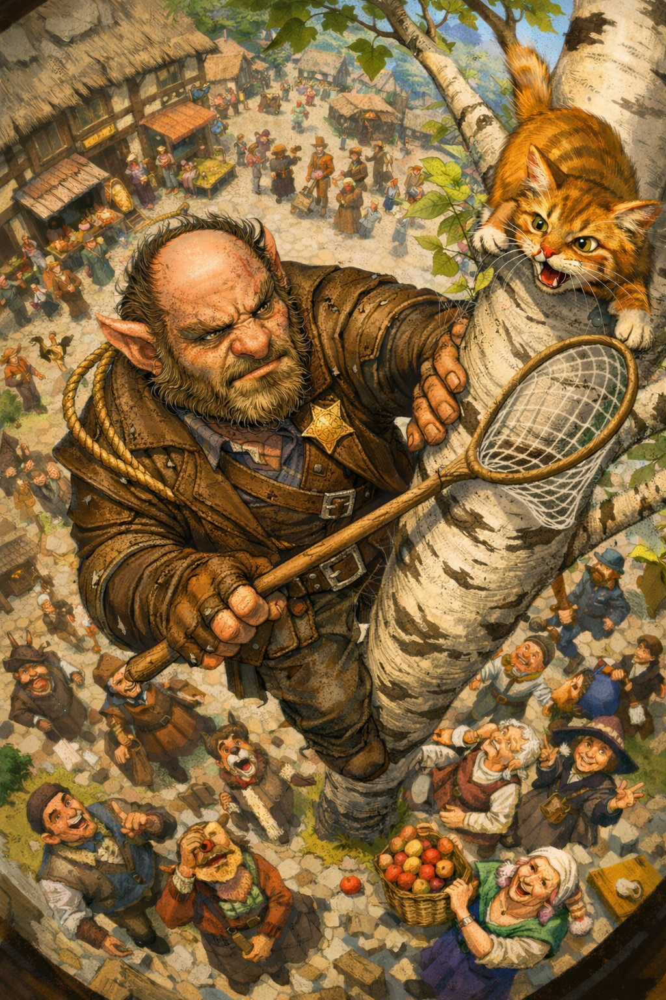

# Sergeant Bink

{ width="300" }

> *"I'm not angry, I'm disappointed. And also I'm seven feet tall and the literal creature your nan told you ghost stories about, so I'm going to ask again..."*

**Your local cryptid with badge authority. A bugbear sheriff who sees patterns everywhere, talks to his corkboard, and struggles with paperwork. Your classic maverick cop trope poured into the chassis of a fey outsider who only tries to be a valuable member of the community.**

---

## Basic Information
**Species:** Bugbear  
**Class:** Fighter 5 (Rune Knight)  
**Background:** Guard  
**Age:** 40  
**Alignment:** Lawful Neutral (leaning Lawful Good)

??? info "Quick Intro"
    
    **At the Table**
    
    * Obsessed with patterns and esoteric conspiracy theories, diligent about constant fieldwork gathering "clues"
    * Gruff but earnest sheriff energy—Captain Vimes meets True Detective meets Twin Peaks
    * Desperately wants to prove he's worthy of the badge his predecessor left him, overthinks everything, but is not very smart
    * Tank and controller who grapples threats into submission for proper interrogation
    
    **Backstory (Short Form)**
    
    Rowan, the town's beloved ranger-sheriff, found Bink as an abandoned bugbear cub and raised him as her deputy. When she was killed by a mysterious criminal, Bink inherited the badge and the town's wary trust. He's been working himself to the bone ever since, with his very own unsettling fey-goblinoid flavor of competence. He's still haunted by the one who got away and convinced there's a vast conspiracy called "the Web" that nobody else can see.
    
    **Playing Sergeant Bink**
    
    * **Combat:** First-round control specialist—close distance fast, grapple priority targets, pin them down with runic shackles or polearm control. Bink takes the safety of weaker party members seriously.
    * **Roleplay:** Low, gravelly voice and intense eye contact. Fidgets and scribbles patterns constantly. Deeply sincere and feels compelled to correct minor legal offenses, but is careful to not come off too menacing, especially when dealing with civilians. Extremely physically brave, thrives when he gets to protect others. He tries to avoid the thorny areas where laws and morality tangle.
    * **Party Synergy:** The party's selfless tank who may needothers to translate his Fey-logic insights into actionable plans. Genuinely grateful for anyone who takes his theories even semi-seriously.

---

??? info "Deep Dive"
        
    ## Full Backstory
    
    Rowan was a popular ranger-sheriff, respected throughout the region. She found Bink as a cub, abandoned by his goblin tribe for being "a bit too weird" even by their standards. Rowan's name held weight, so Bink was tolerated by the town. Growing up, he worked successfully as a bouncer at the town tavern, and later filled in as her deputy, providing the aging ranger with much-needed muscle for enforcement. But despite growing up in the job, he never showed the aptitude for thinking like a real sheriff. It didn't worry him much. Rowan was going to live forever, right?
    
    Of course, one fateful night, a criminal killed Rowan and escaped into the darkness. To this day, Bink is haunted by his failure to catch them. The next morning, he showed up in the town square among the mourners wearing Rowan's badge and a deadpan look. The townspeople were initially scared and apprehensive. The first few months were rough, but he received help from Marten Voss, Rowan's oldest acquaintance and the town quartermaster, who appealed to the townspeople to at least give him a chance.
    
    To this day, Bink feels he has a lot to prove, and he does everything he can think of to walk in Rowan's footsteps. He has employed a frankly silly amount of crime-fighting gadgets of questionnable utility, such as caltrops and grappling hooks. He patrols the streets during the day, the taverns in the evening and the rooftops at night. He takes pride in carrying drunks home to sleep it off, and only resorts to cracking skulls when he feels he has the law firmly on his side. Those who see the work he puts in have warmed up to him. Others, such as the local fighter's guild and the temples, are still wary.
    
    ## The Fey Mind Problem
    
    Bink learned policing through apprenticeship and imitation rather than intellectual framework: "This is what my predecessor did, so I do it too, even if I don't fully understand why." WIS 12 and Insight proficiency help him *feel* when something's off, but INT 8 means he can't explain it coherently. So he fills the gap with elaborate nonsense theories that often enough happen to point in vaguely the right direction.
    
    Bink is never right on the first try, but very often on the third. His instincts are sound, his reasoning is baroque. The number of dogs in the city square may line up in a Fibonacci sequence with the number of towels on the clotheslines, but that's only meaningful if your understanding of the world leans toward magical realism and fey shenanigans.
    
    He scribbles and carves hypnotic patterns on every piece of his gear. This led to him accidentally reverse engineering Rune Knight skills from an old book he and Rowan confiscated from a rampaging Goliath (mean drunk, worse sober). He has never received formal Rune Knight training. His successful application of actual runes is a classic case of the hundred monkeys on typewriters, with some inspiration from the pretty drawings he found in that book he could barely read.
    
    ## Daily Life
    
    - Manically fidgets, scribbles and carves. His little Sheriff's office that he used to share with Rowan is now filled to the ceiling with carved figurines and patterns.
    - Talks to his corkboard like it's a coworker, updating it with new theories every night after his patrol round.
    - Loves his town, but doesn't know how to express it except through body tackling illdoers, helping townspeople with all kinds of menial tasks, and just working harder than anyone else.
    - Hasn't slept a full night in years and is going prematurely bald.
    - Some of the townspeople have started to bake him pies because he regularly forgets to eat. Once he received a new scarf from the elderly Stonebrook sisters after saving their cat from the aspen tree three times in one week.
    - The children love him. He tries to learn all their names, and apologizes anytime he mixes them up. The Pestlethorne twins in particular like to play pranks on him. Bink mostly sees this as a job perk, but he draws a hard boundary when he's off to do something even remotely risky. 
    
    ## The Web
    
    Bink has a sprawling theory about a major underworld syndicate in his little hometown. He calls it "the Web." He'll occasionally bring it up mid-grapple if he suspects his quarry knows something, *anything*. The theory gets wilder with each iteration—dogs as messengers, baker's sourdough as a dead drop system based on fermentation timing and lunar cycles.
        
    ## The Dirty Secret
    
    Bink is so bad at the paperwork part of the job that sometimes after failing to fill it in properly for the fourth time, and the paper is a mess of brackets, arrows, smudges and sidetracks, he just eats the report (with tears in his eyes) and later claims it was misplaced. It's his dirty secret.
    
    ## Sample quotes
    
    "I don't want any trouble, but keep stirring it and I *will* tackle you into a rain barrel."
    
    "Pardon me? Ma'm? The crosswalk is actually over ther... No that's fine, I wasn't... Please don't scream, I didn't mean no harm. Actually, I'll just, uh, hold the traffic while you cross."
    
    "Seven forks missing from the west side, three knives from Merchant's Row. Magpie league? Bread is the perfect cutlery replacement, making the baker a prime suspect. Again."
    
    "The toughest part of my job? It's the edge cases. Had a wandering cleric, claimed he healed people for free, but wouldn't show a license. Claimed he didn't need it. Did he need one? I dunno. I was suspicious. Free healing? Gotta be a catch, right? So I made it up, the part about the license. But then I had to take it back. What if he was the real thing? Makes my eyes hurt thinking too hard about it."
    
    "Greetings travelers, and welcome to our town. I'm the humble sheriff. No this isn't 'my town', I don't own it. I mostly rescue cats from trees really. And I don't own them either. In fact, I have it on good authority they're in league with the seagull faction, and I'm not messing with those. So can I help you with anything?"
    
    "Okay tough guy, the owner of this fine place wants you to go get some fresh air. Usually I'd ask if you're leaving through the door or the window, but last time the innkeep made me pay for the repairs, so. The door it is."
    
    ## Mechanical Design Philosophy
    
    Bink is intended to do both polearm sentinel shenanigans and grappling, synergizing well with both Bugbear and Rune Knight feats. With **Long Reach** and **Giant's Might**, Bink can reliably Grapple Huge creatures. When that's not the answer, he can lean more into traditional Fighter tactics: Shield and spear for high AC, imposing disadvantage on any enemy you hit, and Sentinel plus long reach for keeping many enemies close and engaged. Halberd is a classic guard weapon that synergises well, allowing Bink to make extra attacks on additional targets (Cleave mastery) when performing Attacks of Opportunity.
    
    **Frost Rune** helps with the sheriff energy, giving advantage on Intimidation checks. **Stone Rune** grants advantage on Insight checks, aiding those solid instincts. It also provides a fey-flavored non-lethal takedown via Charming your quarry (on failed WIS save, speed goes to 0, target caught in stupor): *"Okay buddy, you're done for tonight. Time to sleep it off, champ."*
    
    Fire Rune adds damage and summons literal fire shackles that Restrain opponents. Even better sheriff energy, and can be swapped in for Frost or Stone Rune if you prefer it.
        
    Ideal first round: 
    1. Close distance
    2. Surprise Attack plus Fire Rune Shackles (if available) for +4d6 bonus damage.
    3. Drop weapon, Grapple (with advantage if Restrained by Shackles), add another +2d6 Surprise Attack damage. 
    4. Target is now both Grappled and Restrained. Use remaining movement to relocate your prisoner. 
    
    Bink may not be smart, but he doesn't have to be played suboptimally.    
    
    ### Homebrew
    
    The Game proficiency in the Guard background has been swapped for Woodcarver's Tools to account for Bink's compulsive fidgeting and carving of patterns.

---

??? info "Key Relationships"
    
    **Oskar Grenn:** Village blacksmith and tinkerer who provides Bink with various unorthodox gadgets for his sheriffing duties: spring-loaded grappling hooks, reinforced manacles, specialized lockpicks. Rowan never needed such tools—her ranger skills and reputation were enough. Oskar does suspect Bink is compensating for not being Rowan by scaffolding his work with equipment, but he's too timid to say it directly to the cryptid's face. Instead, he just keeps building whatever Bink sketches on increasingly illegible diagrams. Also, to be fair, Bink does pay extra for the gadgets. With time, Oskar has started to upsell him on various more or less sketchy add-ons.
    
    **Pip Spottle:** A twelve-year-old girl who takes Bink's conspiracy theories completely seriously and sometimes "helps" by leaving anonymous notes about any suspicious activity she's spotted. Her parents want her to stay far away from "that bugbear," but Pip keeps sneaking out to update Bink and is convinced they're cracking the case together. Bink tries to discourage this but secretly cherishes having at least one person who believes him. Doesn't realize Pip is just thrilled to have adventures and would believe anyone who treated her ideas seriously. Perhaps that makes them two peas in a pod.
    
    **Marten Voss:** The town's well-liked quartermaster and Rowan's old adventuring companion. He helped Bink get settled after Rowan's death, vouched for him when townsfolk were skeptical, and still checks in regularly to make sure he's eating. Sometimes he brings hard liquor, and they reminisce about Rowan and old times. Lately he's started to look more and more worried about the state of Bink's office, the sheer amount of unsorted stuff, the lack of a new deputy-in-training, Bink's obviously unhealthy work ethic. Maybe it's getting time for him to settle down? Find a life partner? Bink still hasn't figured out how to respond to that question.

---

??? danger "Notes for the DM"
    
    ## The Web Is Real
    
    That one criminal who killed Rowan was the actual leader of the Web, which she had been secretly tracking, and that guy is of course Marten Voss himself! Rowan was getting too close, so he killed her and made it look like a random criminal act. He keeps Bink close specifically because Bink's theories are so baroque that nobody takes them seriously—the perfect cover. Occasionally he even "helps" with investigations, subtly steering Bink toward dead ends while appearing supportive. 
    
    Now every conspiracy theory is haunted by that failure. The Web is the only pattern Bink has ever seen clearly, or so he thinks, but nobody believes him. So he doubles down, gets more intense, more obsessive. The corkboard grows and the theories get wilder.
    
    **Make it real** in exactly the way Bink imagines it, down to details so obscure and esoteric it took a Fey mind to even start detecting them. The dogs in the town square *were* sending secret messages to undercover washerwomen. The baker's sourdough starter *was* a dead drop system based on fermentation timing that only makes sense if you think in lunar cycles and sympathetic magic.
    
    The Web is small-town mystery noir—Fantasy Twin Peaks by way of brawling goblinoids. Flavor Bink's story arc as weird, misty detective fiction where nothing, including the owls, is what it seems.
    
    When the truth comes out, it likely will be horrifying. Bink has been right this whole time, and everyone (including himself in his worst moments) thought he was just being a stupid Bugbear. At the end of Bink's arc, he hopefully gets to surpass his master, avenge her, and prove he does in fact have the aptitude for Sheriff work—he was just a late (and weird) bloomer.
    
    ## Other Plot Hooks
    
    - Bink's tribe tries to reclaim him, seeing his position as strategically valuable
    - Rowan wasn't quite as heroic as Bink remembers; she took bribes, silenced and exiled the whistleblower, kept the town in the dark. Learning this could shatter him or complete him. Does he let the truth out?
    - Pip Spottle gets in trouble for real as she uses Bink's Twin Peaks style crime fighting to read signs into the symmetric patterns of seafoam in the docks. She's secretly kidnapped by "sailors" from a ship that made port yesterday, and her parents reluctantly turn to Bink for help to find their daughter when she doesn't show up in the evening.
    - Another sheriff from a neighboring town creates uncomfortable mirror dynamics
    - (Generic adventure hook) A fatal error undermines the fragile trust Bink has built. The townspeople who baked him pies now cross the street to avoid him. The children's parents pull them inside when he patrols. Bink realises how quickly trust erodes when you look like a monster. In order for him to redeem himself, he must travel with the party, gather evidence, catch the baddie and clear his name.

---

??? info "Mechanics, lv5 build and PDF download"
    
    | STR | DEX | CON | INT | WIS | CHA |
    |:---:|:---:|:---:|:---:|:---:|:---:|
    | 18 (+4) | 12 (+1) | 15 (+2) | 8 (-1) | 12 (+1) | 10 (+0) |
    
    ## Combat Stats
    
    | AC | HP | Hit Dice | Speed | Initiative | Prof. Bonus |
    |:---:|:---:|:---:|:---:|:---:|:---:|
    | 20 | 44 | 5d10 | 30 ft. | +4 | +3 |
    
    **Saving Throws:** Strength +7, Constitution +5
    
    **Resistances:** None
    
    **Senses:** 120 ft. Darkvision
    
    ## Proficiencies
    
    **Skills:** Athletics +7, Insight +4, Intimidation +3, Perception +4, Stealth +4
    
    **Armor:** Heavy Armor, Light Armor, Medium Armor, Shields
    
    **Weapons:** Martial Weapons, Simple Weapons
    
    **Tools:** Smith's Tools, Woorcarver's Tools
    
    **Languages:** Common, Goblin, Giant
    
    ## Feats
    
    - **Alert**: Add proficiency bonus (+3) to Initiative rolls
    - **Sentinel**:  Can make Attach of Opportunity when enemy takes Disengage action or hits a target other than you with an attack. When you hit a creature with an Opportunity Attack, the creature’s Speed becomes 0 for the rest of the current turn.
    
    ## Class Features
    
    **Fighting Style - Defense:** +1 to AC while wearing armor
    
    **Weapon Mastery:** Battleaxe (Topple), Handaxe (Vex), Halberd (Cleave), Spear (Sap)
            
    ## Equipment
    Battleaxe, Handaxe (4), Spear, Halberd, Shield, Splint Armor, Rope, Grappling hook, Caltrops (20), Crowbar, Playing Card Set, Manacles (3)
    
    **Suggested Magic Items:**
    
    - *Slippers of Spider Climbing* (Uncommon, requires attunement): For the full cryptid-sheriff experience. Patrol the rooftops, hang upside-down from eaves, be the terrifying enforcer parents threaten their kids with.
    
    - *Mithral Splint Armor* (Uncommon): No AC bonus over regular splint, but doesn't impose disadvantage on Stealth. Would harmonize with Slippers of Spider Climbing for rooftop patrols, hanging from ceilings like a discount Batman, sneaking up on smugglers in alleyways. This is when he leans most into his bugbear heritage.
    
    - *Sentinel Shield* (Uncommon, requires attunement): Advantage on Perception checks and Initiative rolls. Combined with the Alert feat (proficiency bonus to Initiative), he's virtually guaranteed to go early. Perfect for a bugbear who gets bonus damage on first-round attacks.
    
    ---

    📄 [Download Level 5 Character Sheet (PDF)](assets/sergeant-bink-lv5.pdf)

---

??? danger "**Session Zero Considerations**"
    
    **Content Notes:** Features themes of obsession, paranoia, and unresolved trauma from a mentor's murder. The conspiracy elements lean into noir detective fiction territory. 

    **Representation Notes:** Bink processes the world differently due to his Fey heritage—he sees patterns and connections that others don't, which *can* read as neurodivergent coded. However, Bink is *not* modelled after any specific neurodivergency. The inspiration is a Twin Peaks-style interpretation of Bugbears' Fey background. The corkboard-red yarn trope is well-known shorthand for paranoia and conspiracy theory, but it is intended to play into the maverick cop archetype, not to poke fun at actual medical conditions. He's intended to be read as mysterious, comic, endearing, and also worthy of being seen as a full person. Players should approach this with care and avoid harmful stereotypisation.

---
