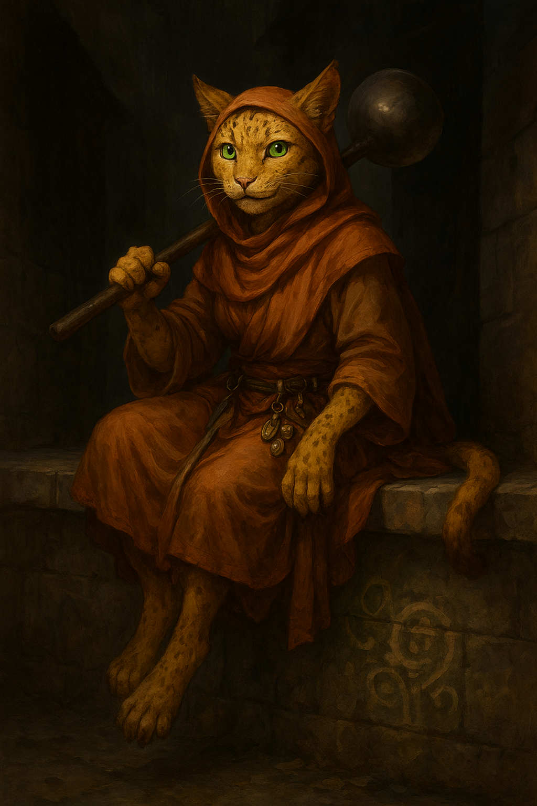

# Sister Garra

{ width="300" }

> *"By my count, this feast they're throwing us could feed twenty-three for a week. Give me your Bag of Holding. Now."*

**Illegal slum cleric of the Mud Nuns and refugee smuggler who redistributes wealth with bureaucratic zeal, racing against middle age while her order pressures her to retire from hustling and take the scholarly "turmeric robe".**

---

## Character Overview
- **Species:** Tabaxi
- **Class:** Cleric 5 (Trickster Domain)  
- **Background:** Mud Nun
- **Age:** 39
- **Alignment:** Chaotic Good

??? info "Quick Intro"
    
    **At the Table**
    
    * The uncompromising Robin Hood conscience of the party, redistributes material goods with holy fervor and bureaucratic precision
    * Intense and decisive, struggles with short attention span and a flaring, decidedly unclerical temper
    * Compulsively counts things of relevance for her mission and records it in her ledger
    
    **Backstory (Short Form)**
    
    Garra was five when the Tabaxi Purge burned two buildings to ash and deported her commune in the Lower Wards. Orphaned, she fled to Sister Nadya of the mendicant barefoot order the Mud Nuns, who taught her to channel her rage for holy purposes. Now at 39, she runs the Dockyard Corridor of the Copper Pot network, smuggling persecuted Tabaxi out before the inevitable next crackdown. She's racing against the turmeric robe while her mentor has gone silent just as the Seekers of Penitence escalate their attacks.
    
    **Playing Sister Garra**
    
    * **Combat:** Mobile support cleric with stealth and control options, heals while summoning "The Humbler" (traditional soup ladle of her order) to bonk enemies
    * **Roleplay:** Theft is sincere holy work, not sexy heist cat shenanigans. She leaves receipts with blessings wherever she's "liberated" wealth
    * **Party Synergy:** Simultaneous moral compass, trouble instigator and party mom who inspires others through burning conviction rather than charisma.
	
---

??? info "Deep Dive"
    
    ## Backstory

	### The Purge
	Garra was born in a Tabaxi commune in the Lower Ward. Seventy-three souls in two converted warehouses near the dockyards, raising their young collectively. Her birth parents were dock workers, too exhausted to spend much time with any individual kitten. But the commune was family. She was five when it ended. For weeks, Tabaxi had been disappearing. Picked off walking home from work. Arrested for "loitering" or "suspicious behavior," and never seen again. The commune locked its doors, posted watches, tried to become invisible. 
	
	Dockyard developers wanted the land of the commune, and so it was purged, in an incident locals speak of to this day. Garra remembers smoke burning her chest as she hid under a cot, adults screaming, crossbow bolts against wood, fire catching the roof beams, turning the night orange. By morning, only ash remained. Dozens arrested, herded onto ships and deported. Some claimed the Tabaxi were returned to a "homeland" none had seen. Others whispered that the ships never made port, passengers sold as indentured labor or dumped overboard.
	
	Garra's parents were on one of those ships. She spent twenty years sending inquiries to port authorities and shipping companies before she gave up on ever seeing them again.
	
	Authorities intended to place her in an orphanage. She fled the first night. Sister Nadya of the Mud Nuns found her three days later behind a soup kitchen, feral and starving, trying to bite anyone who came close.
	
	### Sister Nadya and the Undulation
	Nadya didn't try to gentle her. She crouched down, looked Garra in the eye, and said: "Good. Stay angry. The people who burned your home want you to think your rage makes you less civilized. They're wrong. Your rage carries the love of those you've lost. You carry the indignity of their passing, but you don't have to carry it alone."
	
	Nadya raised her in the order of the Mud Nuns. When funds ran low, Garra and her fellow novices did runs through the communities, "liberated" baby clothes, blankets, and the good copper pans for whoever needed them more. Garra's small size made her invaluable for slipping through windows, hiding in tight spaces and opening tough locations from the inside.
	
	Nadya explained why the Purge happened through the *Undulation of Graces*, the theology of their order: wealth and power stagnated with the few, and poisoned their minds to see Tabaxi as vermin. Concentration stagnates and rots. Flow liberates and breathes new life. Therefore it is compassion to liberate the rich of their wealth. "Compassion without correction is just a heart with no hands," Nadya said. "We are the agents of the Flow."
	
	### The Mud Nuns
    
    The Mud Nuns are a barefoot order of mendicant women who believe enlightenment lives in the heat and stink of the city. They walk alleys where incense meets sewage, stirring lentils with the same hand that blesses the dying. Their duty is feeding the poor and liberating the rich of their stagnation.
    
    Divinity pervades all things, so the divine is also in filth and struggle. To seek purity is a lie of those who seek to segment the world. Their chants mix prayer with bargaining, their temples are soup lines.
    
    Older Nuns wear turmeric robes, signifying their redistribution days are behind them. Instead, they teach, negotiate and run the order's various hideouts (called "pots") around the city.
    
    The Mud Nuns broke from the older order Seekers of Penitence many years ago. Recently, the conflict has escalated into a religious turf war.
	
	[Read the full Mud Nuns document here.](../factions/mud-nuns.md)
	
	---
	    
    ### Personality Deep Dive
    **Theology**
	When Sister Garra liberates objects, she's correcting cosmic stagnation. She'd be offended by "theft" the way a surgeon would be by "stabber." She leaves receipts with hastily scrawled blessings as religious documentation, proof of karma correction. She often adds spice from her Heward's Handy Spice Pouch. If you've been good, you get saffron, or maybe a nice fragrant spice blend. Cruel people get salt. Not (just) as insult but as disinfectant, a symbolic prayer that they might be preserved from the rot she smells on them.

    Her Cleric spell Spiritual Weapon is "The Humbler," a huge traditional ladle the Mud sisters have summoned for generations to keep order in soup lines and correct bullies. It gives bad people a good solid thwack, but also serves as a spectral billboard the sisters summon high in the air in the slums, signalling that food is ready. 
    
    **Cat traits**
	Garra struggles with mundane indulgences. On her rare days off, she typically curls up in a warm place like a house cat for hours, preferring to not think too hard about if this counts as "stagnation". When heisting in rich mansions, her big obstacle isn't magic traps but luxurious feather beds she must try a little longer than necessary, rationalizing it as "meditating on the illusion of comfort." She's also not strictly vegetarian like the other nuns, but hides it well. It's her little shameful secret. 
	
	Tabaxi raise young communally. Biological parents matter less than the whole community. Every kitten belongs to everyone. This means every Tabaxi in the city is kin to Garra. She's viciously protective, tracks their wellbeing and intervenes when it's threatened.
	
    **Psychology**
	Garra carries a ledger and compulsively tracks balances: what was taken, gold values, distributions. She keeps statistics of all kinds. It's how she maintains control in a world that proved she had none. She couldn't stop the Purge, save her parents, prevent deportations. But she can count, record, create order through documentation. 
	
	Her tendency to get sidetracked goes deeper than just comfy beds. While deeply committed to her order, she struggles with attention span and focus. This is why she dreads the turmeric robes and cerebral duties.
    
	Garra's rage erupts when someone calls her "cute," when a merchant says "little one" or "sweetheart," when nobles explain how the poor just need to work harder, when anyone treats her size, species, or gender as reason not to take her seriously. Her tail goes rigid, pupils dilate, and she says something so cutting it takes three seconds for them to realize they've been filleted. She isn't very intimidating but throws excellent hissy fits.
	
	Five minutes later she's apologizing profusely for eating grilled sea bass, claiming tabaxi are obligate carnivores. She is hyperaware of her "shameful" indulgences (luxury beds, eating fish, curling up like a house cat) and feels guilty about them.
	
	She doesn't connect these moments. The rage just is. She'd be baffled if someone said she has an anger problem. "I don't have an anger problem. I have a problem with people being smug, condescending, unwiped assholes who need a bump with the Humbler."
		
    ### Character Traits Summary
    
    **Personality Traits:** Intense and decisive, but short attention span
    
    **Ideals:** Wealth without flow is spiritual poison
    
    **Bonds:** Sister Nadya taught me all I know. I will find her.
    
    **Flaws:** Compulsive counter, struggles with desire for comfort
	
	---
		
	### The Dockyard Corridor
	Garra runs the Dockyard Corridor of the Copper Pot network (refugee shelters working like an underground railway), smuggling persecuted people out before violence finds them. She stocks supplies, maintains hidden entrances, ensures residents know evacuation protocols. When the Seekers raid elsewhere, she relocates people at three in the morning, getting them onto boats before dawn. The dockyards are in her blood. Her parents worked there. She knows every foreman, cargo inspector, and corner where contraband gets "lost." She knows which captains take passengers for the right price, which are sympathetic, which are dangerous.
	
	She couldn't save her family, but she can save the next one. Every Tabaxi who makes it out proves the Purge didn't win. Every forged document is a small vindication of another life. Her record-keeping makes her exceptional at this. She tracks manifests, memorizes customs schedules, forges documents with precision. The ledger is her criminal toolbox. When someone needs to disappear, Garra creates paperwork saying they were never here.
		
	---
	
	### The Seekers' Complexity
	[The Seekers of Penitence](../factions/mud-nuns.md) are a powerful religious order in the city, and ultimately were the ones who stopped the Purge. After two days, they issued declarations about "the sanctity of all souls," pressured the Duke to call off the watch, sheltered arrested Tabaxi until tensions cooled. Grand Master Syphone condemned the "unnecessary brutality." But they arrived after Garra was orphaned and her parents were shipped nowhere. They had power to prevent it but didn't act until violence became politically embarrassing.
	
	Still, Garra can't hate them like her younger sisters do. She can't pretend they're pure evil when Tabaxi are alive because they intervened. But she can't forgive them for waiting until after the purge to decide Tabaxi lives mattered. "You rescued many of my kind," she once told a Seeker monk trying to arrest her. "They are alive today thanks to you, so I can't hate you even if you persecute us now. If things were different, I may have been a Seeker. Even so, I am what I am, and would not have it otherwise." Then she escaped through a window.
		
	This nuance is what makes someone worthy of the turmeric robe, but Garra doesn't realize it yet. She thinks turmeric means comfortable, cerebral, removed from the work. She doesn't see her capacity for both complexity and rage *is* the work. 
	
	---
	
    ### Appearance    
    Sister Garra is 3'3". Mottled yellow fur, never quite clean. Expressive, radiant green eyes. She wears a belt jangling with spoons, keys, holy symbols, and everyday slum objects.
    
    ### Sample Quotes and Ledger Entries
    
    "By my count, this feast they're throwing us could feed twenty-three for a week. Give me your Bag of Holding. Now."
    
    "I'm not saying it's wrong to don the turmeric. I just don't think I'm middle management material."
	
	“Some rich idiot once said I hoard knowledge in my ledger like he hoards gold. That’s… no. Gold sits, gets fat and lazy. When I teach you something, I still have it, see? That’s the whole trick: it flows freely. That’s why they hate schools and we run them. My ledger’s not a bleeding lockbox for blessings, it’s a distribution map. Anyway. Yeah, I liberated his shoes. He had five pairs.”
    
    "Tabaxi are obligate carnivores! I might just die if I don't get to eat grilled sea bass now and then. Would you have my life on your conscience?"
    
	"I'm gonna need to come back to this inn again in the near future. This place is *stagnant*. What do you mean, 'how do I know'? When we came in I just counted the heads in the room, then the visibly poor, and then calculated the mean of poverty in my ledger. This place is in the top 2 deciles."
	
    **Lord Pemberton's Estate**
    - Liberated: 3 silver candlesticks, 1 bolt of wool
    - Value: 45gp
    - Redistributed to: Widow Tam, the Dock Street orphans
    - Left: Saffron (generous, widow with child)
    - Notes: Security is lax. Return in spring.
    
    **Merchant Griswold's Warehouse**
    - Liberated: 8 wheels of cheese
    - Value: 12gp
    - Redistributed to: Sisters' soup kitchen
    - Left: SALT (kicked a beggar, spat at Sister Chen)
    - Notes: Deserved worse. May his cheese curdle.
    
    **Character Customization:**
    
    Does Garra believe something even other Mud Nuns question? Lean more radical or easygoing. Maybe she's fine with extortion, not just theft. If so, discuss switching a skill to Intimidation.
    
    Perhaps she loves expensive perfume or silk and can't reconcile this with her theology that such delights are "illusory." Shame or pride?
    
    With low Charisma, she's more alley cat than "sexy cat burglar." This is holy work, so avoid the roguish "isn't this naughty" attitude. Does her tail twitch when lying? Her movements are economical, presence quiet until action. Not smooth, but sincere, perceptive, driven.
	
	## Mechanics
	
	**Modified Background: Mud Nun
	The Mud Nun Background is a revised Scribe background, changing proficiency in Calligraphy for either Cooking or Forgery, and the skill proficiencies to Acrobatics and Animal Handling. Read more in the [Mud Nuns faction](../factions/mud-nuns.md).
	
	**"Inspiring Leader" feat**
	Sister Garra is closer to the Turmeric than she realizes. She has the fire *and* the cool necessary to lead. The feat reflects this. Another possible feat you may want to take if this one doesn't suit your table is "Observant", which goes well with her passive tendency to count and observe her surroundings.
	
---

??? info "Key relationships"
	
	**Kharrus "Old Barnacle" Dent**: Dockyard foreman, reluctant ally. Grizzled half-orc foreman who's worked the dockyards forty years. He was there during the Purge as a junior stevedore, watching the buildings burn, watching the ships carry people away. He did nothing, and has never quite forgiven himself. When Garra appeared years later running the Dockyard Corridor, he recognized the mottled yellow fur, the medal of Sisterhood she carried. He started looking away when she showed up with "cargo," mentioning which ships had sympathetic captains, "losing" manifests. They don't talk about the Purge, his guilt, or her rage. They work together in careful silence, two people preventing the next atrocity through bureaucratic sabotage. He calls her "kit" sometimes, which should infuriate her but doesn't. Maybe because he's one of few who remembers her family and treats that memory as sacred.
	
	**Sister Nadya**: Mentor, theological anchor. Nadya and Garra were separated years ago, assigned to different districts by sister Demorah. They corresponded regularly (theological debate, practical advice and gentle teasing about Garra's distraction by comfortable beds). But then, as the Seekers began their crackdown, Nadya stopped writing. No explanation. Garra doesn't know if she is dead, captured, or even defected. That last option haunts Garra. She knows Nadya had her spats with sister Demorah. Nadya knows the Order's safe houses, methods, key members. If she broke or was broken, it would explain how the Seekers became so effective at dismantling the network. Garra doesn't want to believe it. But everyone has a breaking point, and the Seekers have centuries finding it.
	
	**Sister Chen**: Living legend, unwanted mirror. Sister Chen has walked barefoot through the City for over sixty years, never donning the turmeric. She still runs street kitchens, sleeps where she can, liberates what's stagnated and passes it on. To the younger sisters she is a holy relic in flesh, proof that a life of perpetual redistribution is possible. Garra idolizes her. Chen, infuriatingly, refuses to return the sentiment. When Garra talks about staying in the streets forever just like her, Chen laughs dryly and tells her she’d rot in the rain inside a decade. “Your fur would fall off your skin, girl. You like warm beds too much.” It's a brutal slap in the face from an authoritative voice, and it hits Garra where it hurts every time. She responds with rage in the moment, but it also drives her to do better, to try and prove herself. Chen however doesn't seem impressed yet.
	
---

??? danger "Notes for the DM"
	
	## Relationship dynamic
	
	**Sister Chen**: Garra only hears mockery, but in reality, Chen sees what Garra cannot yet face: that her terror of the turmeric robe has less to do with doctrine than with fear of becoming slow and irrelevant, diplomatic instead of decisive. Chen does not want Garra choosing a lifetime of hardship just to outrun that fear. So she pushes her away, needles her, refuses to sanctify or enable Garra’s self-image as a tireless street saint. If Garra is going to stay barefoot for the rest of her life, Chen wants it to be because she truly belongs there, not because she was too afraid to step into her power.
	
	## Dramatic Questions
	- What happens when Sister Garra discovers what happened to Nadya? If Nadya defected under torture and gave away Sister Garra's Dockyard Corridor, can Garra forgive her? If Nadya was killed, can Sister Garra find the confidence to fill that theological void herself?
	
	- What happens if the Seekers of Penitence order asks her to fill an emissary role? Garra is uniquely positioned, but taking that role means admitting she's already the mediator the turmeric robe demands. 
	
	- Can she let go of her rage? *Should* she? Garra's anger is a form of stagnation too. It is old, congealed grief that she keeps circulating through theft and rescue and ledgers instead of letting it transform. The Undulation is supposed to be about change, but Garra is still orbiting the same 34 year old wound.
	
	## Plot Hooks
	
	**The Emissary Offer**: Grand Master Syphone requests a meeting with the Inner Council to negotiate ceasefire. Both sides need a neutral party. The Seekers suggest Garra (the Tabaxi who publicly acknowledged their role stopping the Purge). The Mud Nuns are horrified. Garra is torn. This could save lives. Or be a trap.
	
	**The Missing Shipment**: A ship carrying twelve Tabaxi Garra smuggled out never arrived. Either the captain betrayed her or something worse happened. She needs the party's help investigating but can't reveal the Copper Pot network, which means lying about why this matters.
	
	**The Foreman's Price**: Kharrus is being pressured to inform on Garra by a Seeker investigator who knows he's been looking away. If he doesn't cooperate, they'll arrest him for conspiracy. Garra must either extract him (losing her most valuable dockyard contact) or find leverage against the investigator (escalating the conflict).
	
	**The sacred census**: What happens when Garra’s books disagree with the city’s records? When her version of who lived, who was deported, who was smuggled becomes more accurate than the Duke’s? She already has the bones of a shadow archive, a clandestine census of the erased. Her constant scribbling may prove extremely valuable, or uncomfortable, as a plot device for any "disappearing" plot you're running.
	
	**The Receipt That Backfired**: Garra left a receipt on someone powerful enough to make an example of the Mud Nuns. Now there's a manhunt, and the Order demands she lay low. But she knows three Tabaxi families needing extraction now. If she stops working the Dockyard Corridor, they'll be caught in the next sweep.
	
	**The Wrong Item**: Someone in the order stole the Wrong Item. An immensely powerful evil artifact was stolen from an influential noble by a younger sister. She's gone missing, and the whole city is hunting Mud Nuns for interrogation. Sister Garra must find her sister first and potentially disarm whatever evil the artifact spreads.
	
---

??? info "Mechanical build (lv 5) and PDF download"

	| STR | DEX | CON | INT | WIS | CHA |
	|:---:|:---:|:---:|:---:|:---:|:---:|
	| 8 (-1) | 16 (+3) | 14 (+2) | 10 (+0) | 18 (+4) | 8 (-1) |
	
	## Combat Stats
	
	| AC | HP | Hit Dice | Speed | Initiative | Prof. Bonus |
	|:---:|:---:|:---:|:---:|:---:|:---:|
	| 17 | 38 | 5d8 | 30 ft. (30 Climbing) | +3 | +3 |
	
	**Saving Throws:** Wisdom: +7, Charisma: +2
	
	**Resistances:** None
		
	## Proficiencies
	**Skills:** Acrobatics +6, Animal Handling +7, Insight +7, Medicine +7, Perception +7, Religion +7, Sleight of Hand +6, Stealth +6
	
	**Armor:** Light Armor, Medium Armor, Shield | **Weapons:** Simple Weapons
	
	**Tools:** Forgery Kit, Thieves' Tools | **Languages:** Common, Celestial
	
	## Feats
	
	- **Skilled:** Proficient with 3 additional skills or tools
	- **Inspiring Leader:** +1 WIS, give Temp HP to six allies (including you) = Character Level + WIS modifier (9) on end of any SR/LR
		
	## Equipment
	Studded Leather, Shield, Dagger, Holy Symbol, Ledger, Forgery Kit, Thieves' Tools, Heward's Handy Spice Pouch (minor magical item)
	
	**Suggested Magical Items**
	
	- *Boots of Striding and Springing* (Uncommon, Attunement, Speed=30 ft, even if encumbered, jump 30 ft by spending 10 ft movement, once on each of your turns; lets Sister Garra swiftly abscond with more loot than her str 8 Small frame should be able to. Jump is always useful)
	- *Clockwork Amulet* (Common, Once per day, set it and guarantee an ability check roll of 10 instead of rolling; divine insurance for that crucial Sleight of Hand when forging a manifest or palming a key.)
	- *Amulet of the Devout +1* (Uncommon, Attunement, +1 to spell attacks and save DC, one free Channel Divinity/day; Pure combat utility)
	- *Gloves of Thievery* (Uncommon, +5 to Sleight of Hand checks and checks to pick locks; Makes sister Garra a very competent thie... liberator)
	
	## Spellcasting
	
	- **Cantrips:** Guidance, Spare the Dying, Mending, Word of Radiance, Toll the Dead
	- **Level 1:** (Trickster domain) Charm Person, Disguise Self
	- **Level 2:** (Trickster domain) Pass without Trace, Invisibility
	- **Level 3:** (Trickster domain) Nondetection, Hypnotic Pattern

	📄 [Download Level 5 Character Sheet (PDF)](assets/sister-garra-lv5.pdf)

---

??? danger "**Session Zero Considerations**"
    
    **Content Notes:** Themes of economic inequality, religious conflict/turf war, forced deportation, violence against minority communities. Generally suitable for most tables with standard fantasy violence.
    
    **Representation Notes:** Features a character with compulsive counting/record-keeping behaviors, anger management issues and attention difficulties. Player should discuss comfort level with portraying traits often coded as neurodiverse authentically.
	
	**Important Boundary:** Don't liberate wealth from party members unless given explicit permission above table. Suggested creed: "I act only to feed the hungry and redistribute blessings; I take nothing bound by love."
    
---