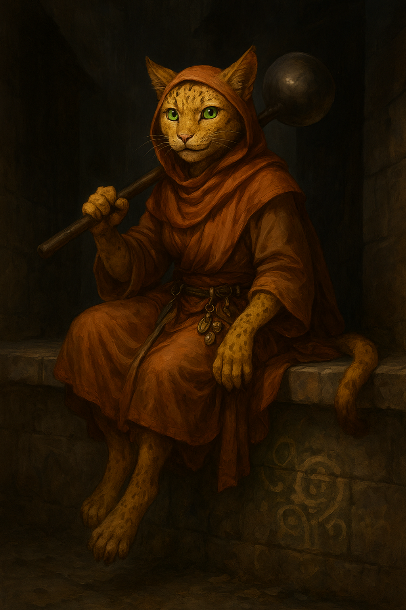

# Sister Garra

{ width="300" }

> *"By my count, this feast they're throwing us could feed twenty-three for a week. Give me your Bag of Holding. Now."*

**Folk cleric of communal providence: half saint, half neighborhood menace, racing against middle age while her order wants her to hang up her lockpicks and take the scholarly "turmeric robe".**

*Keywords: Robin Hood theology, compulsive record-keeper, cat burglar nun, redistribution of blessings, turf war brewing*

---

## Basic Information
**Species:** Tabaxi
**Class:** Cleric 5 (Trickster Domain)  
**Background:** Mud Nun
**Age:** 39
**Alignment:** Chaotic Good

## Quick Intro

??? info "Quick Intro"
    
    **At the Table**
    
    * Intense and decisive, but struggles with short attention span
    * Compulsively counts everything and records it in her ledger
    * Fears becoming irrelevant, losing her edge before taking the turmeric robe
    * The conscience and Robin Hood of the party—redistributes "blessings" with holy precision
    
    **Backstory (Short Form)**
    
    Orphaned at five when authorities scattered her Tabaxi commune for "squatting", Garra fled to the streets where Sister Nadya of the Mud Nuns raised her in their radical faith of "redistributing blessings." Now at 39, she's racing against the turmeric robe—the order's middle management—while her mentor has gone silent just as the rivaling Seekers of Penitence cult launch attacks against her order.
    
    **Playing Sister Garra**
    
    * **Combat:** Highly mobile support Cleric with Trickster domain stealth/control, heals while summoning "The Humbler" (traditional spiritual weapon ladle to keep order in the soup lines) to bonk enemies
    * **Roleplay:** Sincere and driven by purpose, not sexy cat burglar—her tail betrays her when lying, she counts compulsively, leaves receipts with blessings after "redistributing" wealth
    * **Party Synergy:** Moral compass with flexible interpretation—she'll argue theft isn't theft when correcting "cosmic stagnation," keeps detailed ledgers of party actions
	
---

## Deep Dive

??? info "Deep Dive"
    
    ### Full Backstory
    
    Born in the soot and soup kitchens of the Lower Ward, Garra was first raised in a large Tabaxi communal living. Her parents were dock workers and runners, too busy making a basic living to spend much time with her. But at only five years old, the commune was shattered by the authorities, who claimed it was a nest of squatters and radical thought, plotting against the rightful rulers. More likely, the city watch wanted the "dirty catfolk" off their streets.
    
    Garra's parents were deported from the city. She was intended to be raised into the culture of the city in an orphanage, but fled to the streets on the first night. There, she was soon taken in by Sister Nadya of the Mud Nuns, and raised in their faith.
    
    When the community lacked funds, she and her fellow mud sisters "redistributed grace" the only way they could: knocking on doors and liberating outgrown baby clothes, blankets, and sometimes, regrettably, the good copper pans.
    
    Garra's small size immediately made her useful to the sisters. She could access places others could not, stealthily sneak into the finer mansions and liberate goods.
    
    Now, she's a folk cleric of communal providence: half saint, half neighborhood menace. Her parish network is everywhere. Townspeople either love her for her work, or see her nunnery as a gang of absolute thieves and rascals.
    
    After many years as servant in the Mud Nuns, she is approaching the age of taking the turmeric robe. While it is an honor, it's also a monumental shift that Garra struggles with.
    
    It's a race against middle age. Every heist has a new weight of quiet defiance, not just another entry in the ledger but an "I've still got it" scrawled in the margin. She might be more reckless, quicker to act, because the clock is ticking. She's supposed to be a guide, a future elder, but she's the one feeling lost, trying to figure out what holiness means when you're too old to be the prodigy and too young to be the sage.
    
    Seeking reprieve from the mounting expectations to give up her life of heisting, she has applied for a year as a missionary, to travel to new places and spread the influence of the Mud Nuns. Being approved for external service, she grabbed the order's Sentinel Shield, made to protect missionaries and pilgrims on the path, and set out. But many things are still afoot in the city, not least of which is the Penitentians...
    
    ### The Mud Nuns
    
    The Mud Nuns are a barefoot order of mendicant women who believe enlightenment is not found in mountain caves or silent cloisters, but in the heat and stink of the living city. They walk the seedy alleys where incense meets sewage, stirring lentils with the same hand that blesses the dying. The duty of the order is not only to feed the poor, but also snap the rich out of their senses of entitlement and belief that their possessions are going to bring them happiness.
    
    Their doctrine is simple: If divinity pervades all things, then the divine is also in filth, sweat, and struggle. Purity is a lie of the privileged. Cleanliness cannot cleanse the soul that has never been soiled. Their chants mix prayer with bargaining, their temples are soup lines and drainage canals. To them, theft or stern persuasion campaigns done in compassion is just another form of almsgiving. They call it "redistributing blessings." Wherever the Mud Nuns go, the poor eat, the rich lock their cupboards, and many inevitably feel very uncomfortable about what holiness really means.
    
    Older Mud Nuns wear turmeric robes, signifying that their days of "redistribution" are behind them, and instead they work with teaching, negotiation, etc.
    
    The Mud Nuns broke out from the larger order of the Seekers of Penitence many years ago, and the much more powerful Penitentians are still salty about it. Recently, the conflict has escalated into the beginnings of a religious turf war in the streets.
    
    ### Personality Deep Dive
    
    Garra always carries a little ledger and has a compulsive need to keep track of balances, what was taken, gold values, what was distributed and to whom. With time she's started to keep statistics of all kinds.
    
    When she liberates objects from people with "improper levels of ownership", she's not "stealing", but correcting cosmic stagnation. She would be most offended if accused of theft, the way a surgeon would be offended if called a stabber. She always leaves receipts after her deeds, complete with hastily scrawled blessings. Not as jokes or supervillain calling cards, but religious documentation, proof of karma correction. But she also often leaves little "gifts" of spice from her Heward's Handy Spice Pouch along with the receipt. If you've been good, you get saffron.
    
    Garra's Spiritual Weapon spell manifests as a huge, traditional ladle that Mud sisters have summoned for generations to keep order in the lines for lentil soup and correct bullies who try to grab too much food. It even has a name: "The Humbler".
    
    Garra struggles with her mundane sides. On the rare days off, she curls up like a house cat for hours on end, enjoying the languid life. She's also not *strictly* vegetarian, like the other nuns, but she has managed to hide it pretty well so far.
    
    When heisting, her big obstacle isn't magic traps, but luxurious feather beds which she simply must try, lingering far longer than necessary, rationalizing it as "meditating on the illusion of comfort." She'd never admit it falling asleep, but...
    
    The tendency to get sidetracked goes deeper than just comfy beds though. While Sister Garra is deeply committed to her order, she also does struggle a bit with her attention span and focus. This is another reason why she dreads taking the turmeric robes and settling for more cerebral duties in the order in the year to come.
    
    Sister Nadya was Garra's mentor for many years, and they had a warm relationship before they were assigned to different districts of the City. Now they haven't seen each other for a while. But right as the Seekers of Penitence started attacking, Sister Nadya stopped responding to Garra's letters, leading her to wonder. Was her old mentor the first victim, or did she defect to the Seekers?
    
    ### Character Traits Summary
    
    **Personality Traits:** Intense and decisive, but short attention span
    
    **Ideals:** Wealth without flow is spiritual poison
    
    **Bonds:** Sister Nadya taught me all I know. I will find her.
    
    **Flaws:** Compulsive counter, struggles with desire for comfort
    
    ### Appearance
    
    Sister Garra is a 3'8" ball of speed. Mottled yellow fur, never quite clean. She has expressive, radiant green eyes and wears a belt jangling with spoons, keys, holy symbols and various objects for use in everyday life in the slums.
    
    ### Sample Quotes and Ledger Entries
    
    "By my count, this feast they're throwing us could feed twenty-three for a week. Give me your Bag of Holding. Now."
    
    "I'm not saying it's wrong to don the turmeric. I just don't think I'm middle management material."
    
    "Cats are obligate carnivores! I might just die if I don't get to eat grilled sea bass now and then! Would you have my life on your conscience?"
    
    **Lord Pemberton's Estate**
    - Liberated: 3 silver candlesticks, 1 bolt of wool
    - Value: 45gp
    - Redistributed to: Widow Tam, the Dock Street orphans
    - Left: Saffron (generous, widow with child)
    - Notes: Security is lax. Return in spring.
    
    **Merchant Griswold's Warehouse**
    - Liberated: 8 wheels of cheese
    - Value: 12gp
    - Redistributed to: Sisters' soup kitchen
    - Left: SALT (kicked a beggar, spat at Sister Chen)
    - Notes: Deserved worse. May his cheese curdle.
    
    ### Playing Sister Garra - Extended Guidance
    
    **Important Boundary:** Don't steal from your party members unless given explicit permission above table! Suggestion: A creed for clarity. "I act only to feed the hungry and redistribute blessings; I take nothing bound by love."
    
    To show her counting compulsion and high passive perception, when in a new tavern, you could announce "I silently count the heads in the tavern, then the number of visibly poor, and discreetly note the mean of poverty in my ledger, as basis for future considerations whether this place needs redistribution or not."
    
    **Character Customization Questions:**
    
    Does Garra believe something that even other Mud Nuns question? Decide whether to lean more radical or more easygoing. Maybe she's fine with using extortion, not just theft? If so, discuss switching a skill proficiency to Intimidation and discuss the Voice of Conviction homebrew suggestion with your DM. Or maybe she struggles with temptations?
    
    Perhaps she loves the smell of expensive perfume, or the feel of silk, and she can't come to terms with her theology that these delights are "illusory". Does she feel shame or pride?
    
    With her low charisma, she's more alley cat than "sexy cat burglar". This is her holy work, so avoid the roguish "isn't this naughty" attitude. Does her tail betray her with an involuntary twitch when she's lying to a guard? Her movements are otherwise economical, her presence quiet until she needs to act. She may not be smooth, but she is sincere, perceptive and driven by purpose.
    
	## Homebrew Background: Mud nun
	
	The Mud Nun Background is a revised Scribe background, changing proficiency in Calligraphy for Cooking, and the skill proficiencies to Acrobatics and Animal Handling. Read more about the (Mud Nuns faction)[factions/mud-nuns.md].

---

## Notes for the DM

??? danger "Notes for the DM"
	
	**Plot Hook: The Defector**
	
	Sister Nadya may have defected to the Seekers of Penitence after a crisis of faith. That may explain how the Seekers have become so effective at dismantling the Mud Nuns. They have inside information.
	
	**Plot Hook: The Wrong Item**
	
	Somebody in the order stole the Wrong Item. An immensely powerful and evil artifact was stolen from an influential noble by a younger sister. She's now gone missing, and the whole city is turned upside down looking for Mud Nuns to interrogate. Sister Garra must find her sister first, and potentially disarm whatever evil the artifact is spreading.
	
---

## Mechanical build and PDF download

??? info "Level 5 Build"

	| STR | DEX | CON | INT | WIS | CHA |
	|:---:|:---:|:---:|:---:|:---:|:---:|
	| 8 (-1) | 16 (+3) | 14 (+2) | 10 (+0) | 18 (+4) | 8 (-1) |
	
	## Combat Stats
	
	| AC | HP | Hit Dice | Speed | Initiative | Prof. Bonus |
	|:---:|:---:|:---:|:---:|:---:|:---:|
	| 17 | 31 | 5d8 | 40 ft. | +3 | +3 |
	
	**Saving Throws:** Wisdom: +7, Charisma: +2
	
	**Resistances:** None
	
	**Speed:** 40 ft. (Walking), 40 ft. (Climbing)
	
	## Proficiencies
	**Skills:** Acrobatics +6, Animal Handling +7, Insight +7, Medicine +7, Perception +7, Religion +3, Sleight of Hand +6, Stealth +6
	
	**Armor:** Light Armor, Medium Armor, Shield | **Weapons:** Simple Weapons
	
	**Tools:** Cook's Utensils, Thieves' Tools | **Languages:** Common, Celestial
	
	## Feats
	- **Skilled:** Proficient with 3 additional skills or tools
	- **Speedy:** +10 Speed, Dash over difficult terrain costs no extra movement, Opportunity attacks have disadvantage
		
	## Equipment
	Studded Leather, Shield, Dagger, Holy Symbol, Ledger, Cook's Utensils, Thieves' Tools, Heward's Handy Spice Pouch (minor magical item)
	
	## Spellcasting
	**Cantrips:** Guidance, Spare the Dying, Mending, Word of Radiance, Toll the Dead
	
	**Level 1:** (Trickster domain) Charm Person, Disguise Self
	
	**Level 2:** (Trickster domain) Pass without Trace, Invisibility
	
	**Level 3:** (Trickster domain) Nondetection, Hypnotic Pattern

📄 [Download Level 5 Character Sheet (PDF)](assets/sister-garra-lv5.pdf)

---

## **Session Zero**

??? danger "**Session Zero Considerations**"
    
    **Content Notes:** Themes of economic inequality, religious conflict/turf war, parental abandonment/deportation. Generally suitable for most tables with standard fantasy violence.
    
    **Representation Notes:** Features a character with compulsive counting/record-keeping behaviors and attention difficulties. Player should discuss comfort level with portraying neurodivergent traits authentically.

---