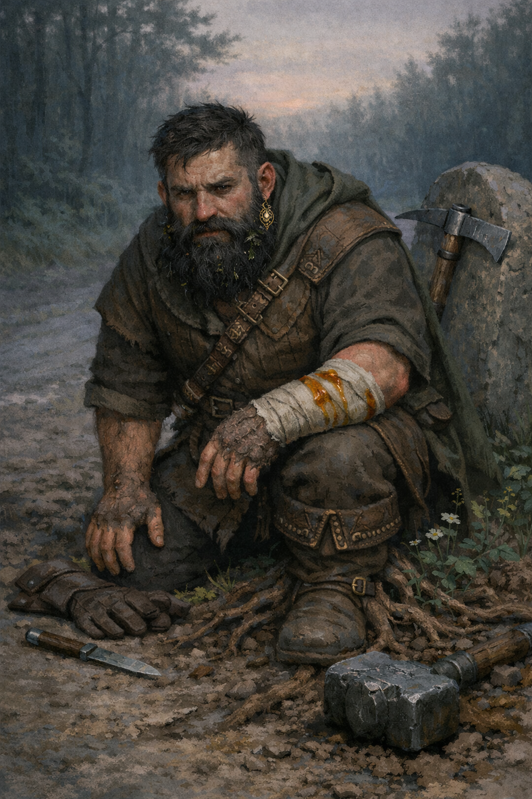

# Stennart Goldgift

{ width="300" }

> *"You want a good deal? I can give you a good deal... and now I can make sure you don't cheat me."*

**Dwarf merchant turned overnight Chad. Slowly transforming into a World Tree seedling while desperately clinging to the strength that finally made him feel important.**

---

## Basic Information
**Species:** Dwarf (transforming)
**Class:** Barbarian 5 (Path of the World Tree)  
**Background:** Merchant  
**Age:** 28
**Alignment:** Neutral

## Quick Intro

??? info "Quick Intro"
    
    **At the Table**
    
    * Giddy about his new strength, constantly testing limits and showing off
    * Retains merchant instincts: friendly, transactional, loves a good deal
    * Terrified of losing his power and becoming "expendable" again
    * The physical comedy relief who's actually undergoing body horror
    
    **Backstory (Short Form)**
    
    Stennart was the expendable middle child in a prestigious Dwarf banking clan, relegated to dangerous surface trading routes. After an avalanche trapped him, he ate a mysterious fruit from a dragon's hoard to survive. It gave him incredible strength, but also began to slowly transform him into a World Tree seedling. Now he's powerful, useful, and absolutely terrified that if anyone "cures" him, he'll lose everything.
    
    **Playing Stennart**
    
    *Combat:* Enthusiastic front-liner who revels in his new strength. Great Weapon Master attacks, protective of squishier allies, may overcommit due to excitement.
    *Roleplay:* Merchant-friendly with an edge of "I can crush you now" energy. Compulsively hides physical changes, bandages wounds quickly, prunes moss and sticks from his beard, wears gloves. Morning stretching routines are suspiciously creaky.
    *Party Synergy:* The guy who carries everyone's stuff, haggles for deals, and accidentally breaks things when emotional. Hits hard, but needs gentle feedback when intimidation isn't the answer.

---

## Deep Dive

??? info "Deep Dive"
    
    ### Background
    
    Stennart Goldgift is the middle child of five in the small but affluent Goldgift family, a Dwarf clan known for their banking expertise and financial acumen. While his siblings secured prestigious positions as bankers and financial strategist (even his deaf older brother Karbold works at the central clan vault) Stennart was deemed the expendable one. Not charismatic enough for client relations, not shrewd enough for high finance, he was pushed into the one job nobody else wanted: peddling goods on the dangerous roads above ground.
    
    For years, Stennart ate dust on mountain passes while his family counted coins in climate-controlled comfort. He internalized his role as the family disappointment, the Goldgift who couldn't quite live up to the name.
    
    Everything changed when a group of adventurers offered him a mysterious fruit, allegedly from a dragon's hoard, and at a suspiciously good price. They seemed eager, in fact a little too eager, to be rid of it. Stennart, ever the merchant, albeit not the smartest one, couldn't resist the deal.
    
    Not two days later, traveling through a mountain pass, an avalanche buried him alive. Trapped in a small air pocket with dwindling supplies, he survived for a week under the snow. He ate his trusty pack goat. Finally, in desperation, he consumed the fruit.
    
    The transformation was immediate and catastrophic. He fell unconscious and woke days later fundamentally changed. Stronger, larger, filled with primal power like he'd never imagined. He punched his way through tons of snow and ice, emerging into his new life with the strength to finally punch back at a world that had always bullied him.
    
    What Stennart doesn't fully understand yet, is that he consumed a fruit of the World Tree itself, and it's slowly transforming him into something that is no longer Dwarf, or even entirely mortal.
    
    ### The Transformation
    
    Stennart is undergoing a gradual metamorphosis into a seedling of the World Tree. The signs are increasingly difficult to hide:
    
    - **Amber blood**: When wounded, he bleeds sticky amber resin instead of red blood. He bandages quickly and inventively to hide the color, even applying red dye to avoid suspicion.
    - **Morning rigidity**: He wakes up stiff, joints partially fusing overnight. His morning calisthenics involve loud cracking sounds as he forces petrified joints back into mobility. He claims it's from "sleeping wrong on cold ground."
    - **Wooden hair**: His beard inexplicably grows with moss and small twigs mixed in. So he prunes it compulsively, twice daily, to stay ahead of it. In dark moments he even considers the radical option of shaving it completely. But he no longer knows what new features of his face it may be hiding.
    - **Bark skin**: Patches of his skin are developing a grain, turning harder and bark-like. He files them down in private, and has taken to wearing gloves at all times.
    - **Changing sensations**: He's slowly losing sensitivity, can't readily distinguish hot from cold water, and he doesn't sweat properly anymore.
    - **Involuntary growth**: Plants and roots sprout around him when Raging.
    
    He's terrified that if anyone discovers the truth-especially a cleric-they'll try to cure him, by purging the magic. And if the magic goes, the strength goes. He'll return to being the disappointment, the expendable Goldgift, the weakest link. He's psychologically addicted to the power, even though it slowly kills who he was.
    
    ### Personality
    
    **The Merchant Who Learned to Punch Back**: Stennart retains the manners and instincts of a merchant-pleasant and friendly, transactional, reasonably shrewd in negotiation. But now he also has the option of violence, and he's discovering he *likes* it. For the first time in his life, people listen when he speaks. He's learning to temper this, but the intoxication of not being powerless is hard to shake.
    
    **Giddy Delight at His Own Body**: He's genuinely excited to have these new physical capabilities, constantly testing his strength in all kinds of ways and showing off in a way that can be both adorable and potentially tiring. Can he carry the entire party's inventory? How far can he throw a boulder? He arm-wrestles for the sheer joy of *winning* instead of being crushed.
    
    **The Ugly Duckling Complex**: Despite his power, Stennart still *feels* like the family screwup. He's fighting for validation he'll never get from his clan, seeking external proof of worth because he's never internalized it. So he ties immense value to his new physique.
    
    **Half Slapstick, Half Tragic**: He's the guy who crushes doorknobs, accidentally intimidates shopkeepers, and has to relearn how to move and behave from scratch when inhabiting a strong body, the way naturally big people learned much earlier in life. But underneath the physical comedy is a man whose sense of self is disintegrating, fiber by fiber, and who's too afraid to ask for help.
    
    **Quick to Misjudge Violence**: Having spent his life deflecting and appeasing, Stennart now sometimes sees intimidation as the quick and easy solution when it isn't. He may have to learn, perhaps through thoughtful party feedback, that suddenly having a big strong hammer doesn't justify treating every problem as a nail.
    
    **Still has the Merchant's outlook on the world**: He's functionally a Barbarian, but he still goes haggling for good deals like he used to, and delights in finding (or creating) good deals for the party.
    
    ### Quirks & Habits
    
    - Increasingly paranoid around fire
    - Drinks water constantly, feels better standing in rain
    - Compulsive early-morning "stretching"
    - Defensive about bandages and minor wounds
    - Fidgets with his beard, checking for twigs
    - Sometimes forgets his own strength in emotional moments-painful handshakes, crushing hugs, accidentally bending the cutlery.
    
    ### Goals & Motivations
    
    - **Surface Goal**: Adventure, prove himself, maybe send money home (though they never acknowledge it)
    - **Hidden Goal**: Find a way to keep his power without completing the transformation
    - **Deep Goal**: Learn to value himself independent of his family's judgment
    
---

## Notes for the DM

??? danger "Notes for the DM"

    ### DM Plot Hooks
    
    **The Dragon Hunt**
    
    A dragon is tracking Stennartâ€"not for revenge, but because it understands what the World Tree fruit *does* when consumed improperly. The dragon has been guarding these fruits for centuries and knows that an uncontrolled transformation doesn't create a friendly tree-person, but an anchor point for the World Tree to manifest catastrophically in the material plane.
    
    When they finally meet, the dragon is weary, not wrathful: *"You ate it raw? Without ritual preparation? Do you have any ideaâ€"no, of course you don't. You're a merchant who got desperate in a hole."*
    
    The dragon offers three options:
    
    1. **Reversal**: Prune Stennart back to his original form. Excruciating, and yes, he loses the strength. He becomes ordinary again.
    
    2. **Completion**: Guide the transformation properly with ancient rituals. Stennart keeps his mind and becomes something powerful and possibly immortalâ€"but he's *changed*. No longer a dwarf, no longer mortal in the same way. He'd be a guardian, bound to place and purpose. The World Tree doesn't give gifts; it makes investments.
    
    3. **Nothing**: Let nature take its course. In six months to a year, Stennart Goldgift stops moving. Roots dig deep. Something new grows from the husk with no memory of banking clans or the specific way his siblings looked through him like furniture.
    
    **The Goldgift Family Returns**
    
    Word reaches the clan that Stennart survived and has become profitable. They send Karbold, the deaf brother who always had the easier job, to negotiate. Not to save Stennart, but to recruit him. A semi-immortal World Tree guardian protecting the family vault? The prestige! The security! The branding opportunities! What if they lease him as a bodyguard?
    
    Karbold might genuinely believe it's for Stennart's own good. Or he might be disgusted by the family's opportunism but too afraid to defy them. Either way, the conversation between brothers, one turning to wood, one who's never heard his voice but learned to read pain and fear in faces, could be deep and rewarding role play.
    
    **Other Fruit Seekers**
    
    Word spreads in certain circles. Entities emerge who want to harvest him, study the transformation, or acquire a "sample" for their own purposes. Desperate individuals offer fortunes for a single bite of his flesh (which of course does nothing, but they might be willing to force Stennart to fight to protect his body). Scholars want to dissect the process. Desperate nobles seek immortality by drinking tea from the scrapings of bark from his skin.
    
    **The Transformation Accelerates**
    
    Tie the speed of transformation to power usage. Every rage, every time he leans into his World Tree abilities, pushes him closer to metamorphosis. Slowly build for this over the span of your campaign.
    
    Give the transformation a visible timeline. First the amber blood. Then the morning stiffness. Then the moss beard. Each tier of play, something new and harder to hide. By level 10-12, the party is watching their friend slowly disappear into something ancient and unknowable. He doesn't eat anymore. His voice sounds like wind through branches. He prefers sleeping standing, outdoors. They might have quiet conversations about whether to intervene, and indeed whether they have the *right* to choose for him.

---

## Mechanical build and PDF download

??? info "Level 5 Build"

	| STR | DEX | CON | INT | WIS | CHA |
	|:---:|:---:|:---:|:---:|:---:|:---:|
	| 18 (+4) | 14 (+2) | 16 (+3) | 10 (+0) | 10 (+0) | 8 (-1) |
	
	## Combat Stats (With Shield)
	
	| AC | HP | Hit Dice | Speed | Initiative | Prof. Bonus |
	|:---:|:---:|:---:|:---:|:---:|:---:|
	| 18 | 60 | 5d12 | 40 ft. | +2 | +3 |
	
	**Saving Throws: Strength: +7, Constitution: +6**
	**Resistances: Poison**
	
	## Proficiencies
	**Skills**: Animal Handling +3, Athletics +7, Intimidation +2, Nature +3, Persuasion +2
	
	*(Note: When Raging, the -1 CHA modifier doesn't count, so Intimidation and Persuasion start at +3, not +2 as above. Only then do you add STR modifier)*
	
	**Armor**: Light Armor, Medium Armor, Shield | **Weapons**: Simple Weapons, Martial Weapons
	
	**Tools**: Navigator's tools | **Languages**: Common, Common Sign Language, Dwarvish
	
	## Feats
	- **Lucky**: Luck points (3/Long Rest) can be spent to gain Advantage or impose Disadvantage to rolls.
	- **Great Weapon Master**: Add PB (+3) to all damage rolls when attacking with Heavy weapons. Can make an extra attack using BA on crit or on reducing opponent to 0 HP.
	
	## Weapon Masteries
	- Maul (Topple)
	- War Pick (Sap)
	- Handaxe (Vex)
	
	## Equipment
	War Pick, Maul, 3x Handaxe, Breastplate, Shield, Explorer's Kit

📄 [Download Level 5 Character Sheet (PDF)](assets/stennart-goldgift-lv5.pdf)

---

## **Session Zero**

??? danger "**Session Zero Considerations**"
    
    **Content Notes:** Body horror (gradual transformation), family rejection/emotional neglect, psychological addiction to power, themes of losing one's identity and humanity. The transformation includes graphic details. Suitable for mature tables comfortable with existential horror beneath physical comedy.
    
    **Representation Notes:** Stennart's brother Karbold is deaf and uses Common Sign Language. This should be portrayed matter-of-factly as just a normal part of the family dynamic, not as a limitation.

---