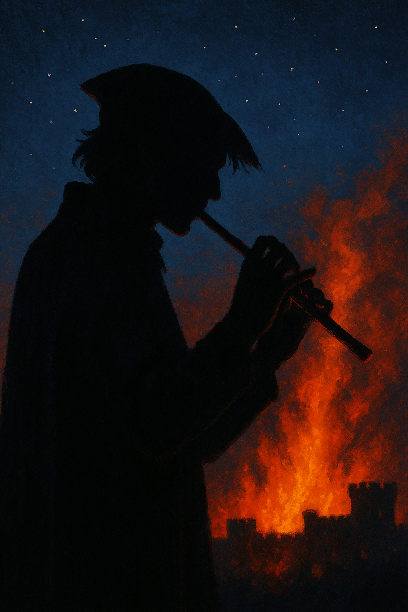

# Tormin Remus

{ width="300" }

> *"I think I like grapes. I used to, but I had a different tongue then. Or was that me? You know what, you look hungry. Keep them."*

**A revolutionary changeling warlock who traded his soul—and his face—to fight tyranny, now spreading sedition through traitorous tunes while slowly forgetting who he used to be.**

---

## Character Overview
- **Species:** Changeling
- **Class:** Warlock 5 (Pact of the Fiend)  
- **Background:** Wayfarer
- **Age:** 29
- **Alignment:** Neutral

??? info "Quick Intro"
    
    **At the Table**
    
	* Effortless party face with Warlock blasting power and versatile toolkit.
    * His Faustian bargain gave him uncanny musical skills. Now he plays a haunting melody that's become an outlawed anthem of rebellion.
    * The party's infiltrator and face-changer, but needs emotional anchors to avoid Main Character Syndrome.
	* Best suited for a limited, heavy intrigue arc.
    
    **Backstory (Short Form)**
    
    Tormin watched his family hang for unpaid taxes, then walked the forbidden path to strike a devil's bargain at the crossroads: the power to fight back in exchange for his soul. Years of wearing stolen faces as a revolutionary have eroded his memory of who he was. Now he spreads rebellion through an outlawed melody while slowly dissolving into the masks he wears.
    
    **Playing Tormin**
    
	* **Roleplay:** Gallows humor masking melancholy. Observant and empathetic to others' struggles since he's lost connection to his own identity. The flute melody he learned from his mother is his only remaining anchor to his former self. A Fantasy Paganini with demonic command over his instruments.
    * **Party Synergy:** Needs explicit ties to other PCs established in session zero: A reason to care beyond the revolution. Works best when sharing secrets early to build trust and balancing solo infiltration with group unity.
	
---

??? info "Deep Dive"
    
    ## Full Backstory
    
    Tormin Remus was a human once, but lost most of his life to a robber baron's brutal tax collectors. 15 years old, he alone cut down his relatives swinging from the gallows tree, and vowed to end the oppression. He took a forbidden path beyond the village boundary, to the dark forest, ending up at a crossroads on a moonless midnight. There, he entered a pact for his soul, in exchange for the power to fight back.
    
    Now, Tormin has been traveling the roads as an anonymous wayfarer for years, fighting back wherever he gets the opportunity. He impersonates guard captains, releases insurrectionists, plants dissent and confusion. But the cost is higher than just his soul.
    
    For a natural Fey Changeling, transformation is comfortable. But for Tormin, given this power by a pact, every shift is a violation of his self. After years of wearing other faces, he can't remember his original appearance clearly. Eye color, hair, height—they're all fuzzy.
    
    Now, other revolutionaries pretend to be him, creating paranoia by playing his tune in the night. The nobles can't tell which incidents are Tormin and which are theater. That suits Tormin perfectly, but it also hurts his soul a little.
    
    ## The Traitor's Tune
    
    Tormin lost his face and sense of self. Instead, he plays a song on his flute. It is his only remaining connection to who he was, a song he learned from his mother as a child. Many know it, but none can play it with Tormin's uncanny precision. Now it's his calling card, it's how allies recognize him, and how enemies know they're already caught in his web.
    
    The nobles, desperate and grasping at smoke, outlawed the melody itself, which only made more people learn it. Workers hum it under their breath. Children make games of it. The Traitor's Tune has become sacred to the oppressed, a cultural revolution transmitted through music, something bigger than Tormin himself.
    
    ## Mythological Inspirations
    
    Tormin is a remix of various myths: He has the inhuman musical skills of Robert Johnson, fabled to have struck a deal with the Devil at the crossroads. Playing his own tune on the flute (resembling the pied piper of Hamelin) or fiddle (think Paganini) is the only way Tormin can still remember who he used to be. The drums he mostly uses when on the march, when people need to be led. He has the folk-hero in disguise vibes of Robin Hood and the flair of the Scarlet Pimpernel. Finally, he has the die-hard revolutionary mindset of Guy Fawkes, willing to do whatever it takes to see his vision come true, even at great personal expense.
    
	## Sample quotes
	
	"At this point, I feel we'll probably fail. Most revolutions do, that's a fact. But someone has to try, and I've already paid the entry fee."
	
	"I once impersonated a village drunk for a full week. Even slept in the gutter. Then I had to shift to a Dragonborn for another week just to get rid of the fleas."
	
	"No, as a matter of fact I don't know what will come next. I only know what was, and what mustn't be allowed to repeat itself. Faced with two possible evils I will always choose the ones I haven't yet seen."
	
	"Sometimes you need to take a step back and enjoy the craft. The guard captain ordered his men to look for a scarred half-elf woman I performed as yesterday. So I shifted to *another* scarred half-elf woman and let myself get arrested, to waste everybody's time. Tomorrow I think I'll take a shot at being the guard captain."
	
	"Sorry, I don't perform as priests. Even I have limits."
	
	"You want to hear me play the violin? Very well... But it can be a lot. It's not exactly music that's coming from a happy place. Please don't be afraid."
	
	"For some reason I crave pickles every time I perform Orcs. Is it psychosomatic? Could it be the skin color?"
	
	"I love hearing people play the Traitor's Tune. It belongs to everyone who hums it now, but everybody has their own little variation of it. I have mine. And that little variation that only I do... It's sacred."
	
	---

    ## Gender and Changelingship
    
    In this character description, Tormin is referred to as "he" because the tropes he's leaning on (Guy Fawkes, Faust, etc.) are all male coded. But Tormin's form is mutable, and his sense of self is eroding with every new mask he puts on. Using 'they' pronouns can underscore that loss of identity. However, it's important to note: this is fundamentally different from actual nonbinary or genderfluid identity. Trans and nonbinary people are affirming an authentic self. Tormin's story is the opposite: a tragic loss of self through literal, unwilling fragmentation.
        
    ## Alignment Considerations
    
    Tormin's alignment is set as Neutral. Tormin truly can't know if his struggle will create a better country. All he knows is that this one has to go, and he's willing to take the risk that innocents will die in the process. All things considered, "Good" seems too generous an alignment, and "Evil" too harsh.
    
    In a more morally grey campaign, consider carefully where you want the character to be headed. Would he kidnap the family of an oppressive duke? Destroy sites of worship? Silence witnesses? Burn the village granary to force troops out into the open field?
      
    ## Mechanical Notes
    
    Tormin is listed as a Changeling and is supposed to play as such. If there's any confusion at the table about mechanics, you can treat his human past as flavor text.

---

??? info "Key Relationships"

	**Hedda Rosewig**: Elderly Dwarven widow living a little ways out of town. She is the Devil's intermediary, periodically checking in on the investment. Charming and seemingly benevolent. Helpful, even. Always there when Tormin wavers, offering comfort and validation. Never explicitly evil. Loves to bake, but her oven runs suspiciously hot.
	
	**Calippa Mendosa**: A middle-aged master counterfeiter who used to work for one of the great merchant families of the realm. Tormin saved her from the gallows after it became clear she'd been embezzling money for her own private projects, including relief to border villages. Ever since that day, she's been his most valuable ally in the insurrection. She can precisely mimic handwriting, seals, or any bureaucratic style. She has even become the unseen pen and theorist behind Tormin's revolution, putting a lot of time and effort into fliers and posters that Tormin distributes.
	
	**Brother Weilin**: An itinerant beggar monk who keeps crossing paths with Tormin's operations. Weilin has very bad eyesight and goes wherever suffering concentrates, treating wounded guards, providing last rites over executed collaborators in exchange for food. He supports the revolution in theory but refuses to pretend the cost is acceptable. He somehow recognizes Tormin regardless of disguise, and often seeks him out to pose one question: "Was it worth it this time?" He's never turned Tormin in, but his presence is an accounting that can't be escaped. Tormin is fascinated by Weilin - the monk, who barely sees him in the first place, is the only person left who experiences him as persistent, as still being someone rather than a series of performances. Their relationship is marked by uneasy tolerance and mutual recognition, if not respect.

---

??? danger "Notes for the DM"

	## Dramatic Questions
	
	- *Can a revolution built on lies (masks and forgeries) ever produce a truthful peace?*
	- *What would make Tormin develop a sense of 'self' again? Certain new habits? Friends who stayed with him over time? Something new to care for outside his revolution?*
	- *Is Tormin still grieving his lost family, or is he just doing what he's doing because this is his life now?*
	
	## Brother Weilin
	
	**Weilin's Mechanics and Role**: Brother Weilin is a high level Wild Hunt Shifter Monk (Warrior of Mercy), changing his features into a bat form when Shifting. This explains his bad eyesight, but also why he can always sense Tormin. His Shifting feature grants advantage on all WIS checks, including Perception and Survival for tracking. He tracks Tormin by scent and the signature sound of his heartbeats, not appearance. Changeling transformations and magical disguises are irrelevant. In combat when Wild Hunt form is active, Tormin cannot gain advantage on attacks against Weilin within 30 ft, even when invisible, and Stunning Strike can shut down Tormin's escape options immediately. Weilin will be a terrifying opponent in a 1v1 scenario.
	
	**Philosophical Mirror**: Weilin achieved mind-body integration through discipline. Tormin lost and fragmented that connection with his body through his pact. They represent opposite responses to tyranny - mercy versus revolution, presence versus performance. Weilin may have been a revolutionary once, or lost someone to state violence. He understands why Tormin made his choice, but he won't validate the cost.
	
	**Campaign Role**: Weilin is either the final obstacle or the linchpin for Tormin's redemption, depending on the player's choices throughout the campaign. If Tormin crosses certain lines, Weilin stops asking questions and delivers consequences. A confrontation between them should also involve the party's moral judgment - they've seen both perspectives and must choose whether to help Tormin escape or help Weilin stop him. Weilin won't fight Tormin in front of his friends unless absolutely necessary. He prefers to catch him alone. Structure encounters so Weilin develops relationships with all PCs, as a healer, advisor or even helping them out in a tough encounter, making the choice in an eventual confrontation genuinely difficult.
	
	## Possible Campaign Arc Endings
	
	Endgame possibilities:
	- **Tragic Completion** - Revolution succeeds, Tormin dies or survives, but fades away into non-personhood
	- **Redemption** - Tormin finally realizes the cost and tries to find another way
	- **Horror Reveal** - The devil's true purpose emerges (see below)
	- **The New Tyranny** - "Meet the new boss, same as the old boss"
	
	## What Does the Devil Actually Want In Return?
	
	**Theory 1: Times of Upheaval**
	The revolution itself is the goal. Revolution produces massacres and retribution, purges and counter-purges. The righteous become monsters and thousands are damned on BOTH sides. The devil doesn't care who wins. He wants the bloodbath.
	
	**Theory 2: Tormin's Corruption**
	The devil doesn't care if the Kingdom were to fall. He wants to watch Tormin become unrecognizable. The idealist who cared enough to damn himself is slowly vanishing with every new face he wears, of his own choice. What triumph could be greater?
	
	**Theory 3: Breaking Ancient Seals (Classic High Fantasy Style)**
	The Kingdom's tyranny may maintain ancient wards/seals containing something much worse. The devil can't break them directly, but a revolution could burn old records, kill a bloodline of keepers, or destroy institutions maintaining the seals.
	
	## Plot Hooks
		
	**The Mirror-Image Purge**: A group of "Remusites" (revolutionaries inspired by him) has started burning down granaries or killing non-combatants while playing the Traitor’s Tune. Tormin has to decide: does he stop the only people fighting his war, or does he let his tune be stained by their blood?
	
	**The Devil’s Audit**: Tormin's patron demands he impersonate a high-ranking "Good" NPC, (a beloved Bishop or General, depending on your campaign setting) and commit a public atrocity to ensure the revolution results in a bloodbath, not just a change in leadership.
	
	**The Sympathetic Noble**: A member of the ruling class secretly agrees with the revolution and offers to help from within. Are they genuine, or is this a sophisticated trap? More disturbingly: if they're real, does killing them anyway serve the revolution's narrative needs?
	
---

??? info "Mechanical build (lv 5) and PDF download"

	| STR | DEX | CON | INT | WIS | CHA |
	|:---:|:---:|:---:|:---:|:---:|:---:|
	| 8 (-1) | 14 (+2) | 14 (+2) | 12 (+1) | 10 (+0) | 18 (+4) |
	
	## Combat Stats
	
	| AC | HP | Hit Dice | Speed | Initiative | Prof. Bonus |
	|:---:|:---:|:---:|:---:|:---:|:---:|
	| 14 | 38 | 5d8 | 30 ft. | +2 | +3 |
	
	**Saving Throws: Wisdom: +3, Charisma: +7**
	**Resistances:** None
	
	## Proficiencies
	**Skills**: Deception +7, History +4, Insight +3, Intimidation +7, Performance +10, Persuasion +7, Stealth +5
	
	**Armor**: Light Armor | **Weapons**: Simple Weapons
	
	**Tools**: Drum, Fiddle, Flute, Thieves' Tools | **Languages**: Common, [+2 Languages]
	
	## Feats
	- **Lucky**: PB (3) Luck points/LR, can give advantage or disadvantage to your or opponent's rolls.
	- **Skill Expert**: +1 skill proficiency, +1 skill expertise, +1 ASI
	- **Eldritch invocations
		- **Agonizing Blast**: Add CHA bonus (+4) to Eldritch Blast damage rolls
		- **Devil's Sight**: Can see normally even in Magical Darkness within 120 feet
		- **One with Shadows**: Can cast Invisibility without using Spell Slot if in Dim light or Darkness
		- **Pact of the Tome**: Gain 3 cantrips from any spell list, + 2 Ritual spells
		- **Musician**: Gain proficiency with three instruments, give Heroic Inspiration to 3 allies on SR/LR.
		
	## Equipment
	Studded Leather Armor, Dagger, Arcane Focus, Flute, Fiddle, Drum, Thieves' Tools
	
	**Suggested Magic Items**
	
	- Glamored Studded Leather (Magic item: Can take on the shape of any clothes)
	- Cloak of Many Fashions (Common Wondrous item: Change style, color and apparent quality at will)
	- Ring of Mind Shielding (Immunity to mind reading, determining if you're lying or sensing aligment or creature type)
	- Pearl of Power (Recovers one lv 3 spell slot per day)
	
	## Spellcasting
	
	**Cantrips**: Mage Hand, Eldritch Blast, Minor Illusion, Thaumaturgy, Message, Guidance
    **Level 1**: Hex, Burning Hands, Command, Comprehend Languages [R], Unseen Servant [R]
	**Level 2**: Mirror Image, Scorching Ray, Suggestion, Invisibility
	**Level 3**: Summon Shadowspawn, Fly, Counterspell, Thunder Step, Fireball, Stinking Cloud

	---

	📄 [Download Level 5 Character Sheet (PDF)](assets/tormin-remus-lv5.pdf)

---

??? danger "**Session Zero Considerations**"
    
	### Campaign vibes
	Tormin thrives in intrigue and subterfuge. In a dungeon-crawl or monster-hunt, his talents may play second fiddle (hah). Check the campaign vibes with the DM.
    
    Tormin risks Main Character Syndrome. His modus operandi is deception, infiltration, and working alone. You *need* to make this mesh well with your party.
    
    **Solution: Deepening bonds**: During session zero, explicitly tie him to another character. Is he the bodyguard for the party's noble? Does he see a spark of his lost family in the cleric? He needs a reason to care about the group beyond his revolution. Share your secrets with at least one other PC early on to build trust.
    
    Avoid falling into the brooding edgelord stereotype by playing into gallows humor and bittersweet melancholy. People who go through hardships but still find meaning often tune in more to the plight of others and empathize with them. Tormin isn't all about himself. On the contrary, he doesn't have much of a self left. It would be natural that he live vicariously through the group, caring more about his friends and their struggles.
    
    Tormin has no long- or short-term goals listed, in order to be versatile and work in different campaign settings. You'll have to decide with your DM who it is Tormin is working to topple and what his concrete goals are.
	
    **Content Notes:** Violence (execution, revolutionary violence), themes of identity loss and existential horror, morally grey choices regarding revolution and collateral damage. The character's story involves state violence, torture implications, and the psychological cost of sustained deception.
    
    **Representation Notes:** The character explores identity dissolution through supernatural means. Discuss comfort levels with body horror, identity themes, and political violence during session zero.

---