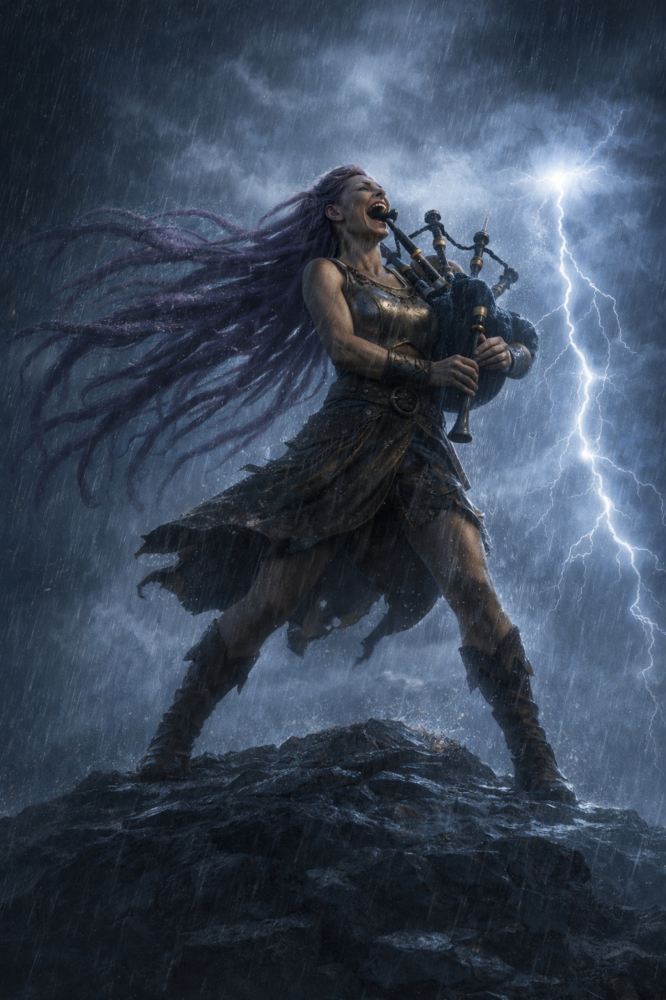

# Yawp Cumuluni

{ width="300" }

> *"Oh honey, your voice can shatter glass? That's cute. Mine kills wildlife."*

**Goliath Bard raised in twelve years of enforced silence, now a force of nature and noise who plays bagpipes in thunderstorms and dares the world to respond.**

---

## Character Overview
- **Species:** Goliath
- **Class:** Bard 5 (College of Valor)  
- **Background:** Diplomatic Hostage
- **Age:** 24
- **Alignment:** Chaotic Neutral

??? info "Quick Intro"
    
    **At the Table**
    
    * Takes up space and doesn't apologize for it, but at least you're invited to the party
    * Dreams of finding the highest peak in the world and making a sound so massive that the heavens themselves must echo it back
	* Lives to turn her life into a scrapbook Homeric epic: big tales, impulsive sidequests, several sticky pages.
    * Carries the weight of being traded away at six by a family that found her physical difference inconvenient
    
    **Backstory (Short Form)**
    
    Born "different" among Goliaths (willowy frame, wild hair), Cuma'ra was sent at age six as a diplomatic hostage to an elven sanctuary and research station, where silence was magically enforced. Twelve years of compression ended when a traveling bard offered escape and partnership, and then betrayed her, stealing her savings by morning. With two empty hands and a vast world in front of her, she chose freedom over collapse, renamed herself Yawp, and spent the next six years proving she's bigger than anyone who tried to erase or betray her. Now, she lives as if that sanctuary was a twelve-year inhalation before the shout.
    
    **Playing Yawp**
    
    * **Combat:** Valor Bard with a shock-and-awe spell list (Earth Tremor, Shatter, Thunderwave). Lives to make noise so overwhelming the enemy can't think straight. Suggested homebrew: **Lion's Roar** (1/LR, 20ft cone, CON save, PB d6 Thunder damage, targets pushed 10ft and deafened on failed save)
    * **Roleplay:** Unapologetically loud and never afraid to challenge, oscillates between explosive belting inspiration and silence like a gathering storm, but falters and turns inward when restrained, silenced or in tight spaces. (Don't *actually* be loud at the table.)
    * **Party Synergy:** If she likes you, she will make you the center of attention. One-woman moshpit and likely the best wingman you never asked for.

---

??? info "Deep Dive"
    
    ## Full Backstory
    
    As a toddler, Cuma'ra Cumuluni didn't fit the mold. She was willowy where Goliaths were broad, her frame refusing to bulk up no matter how much she ate or trained. Worse, she had hair—thick, wild, impossible amounts of it that kept growing in defiance of every Goliath aesthetic. The whispers started early: *Is she even pure-blood? What's wrong with her?*
    
    At six, the tribe found a use for the odd one. She was sent away as a diplomatic hostage, sealing a fragile peace between her Goliath tribe and a high elven research enclave in the mountains. Her parents called it "a necessary sacrifice", but the decision to not let her grow up among the Goliaths had a utilitarian ring to it.
    
    The sanctuary and research station, perched on cold and remote crags, was her prison for twelve years. The elven scholars enchanted the stone walls to absorb *all* sound, protecting their delicate experiments from disruption. Cuma'ra never understood what their "forbidden acoustics" research was about. Instead, she learned elven scripture and etiquette under suffocating arches where even her heartbeat echoed in her ears. The scholars barely saw her as a person, just another diplomatic obligation—a body to park in the library with a stack of books and expectations of silence. When she didn't comply, they simply carried out their wills with spells, robbing the young girl of her voice for days on end. Every night she lay in bed with that Silence spell robbing her voice, she listened to her heartbeats. The one sound her body refused to give up.
    
    She wondered if her family even thought about her, or if they'd simply been relieved to ship off the child who didn't fit. And then, she longed to scream into the wind. For twelve years, her whole childhood and teens, she compressed. Survived. Remained. She read all the epics of heroes of olden days, of people who would not be chained no matter the price. Her timeless captors hardly seemed to notice how she changed, how her gaze turned hard and purposeful.
    
    Soon after she turned eighteen, Thymeon the Pilgrim cracked the Sanctuary walls. A visiting bard who claimed to see the "wild sky" shimmering inside her, he was the first person in years who spoke to her like she had a will of her own. His flattery was clumsy, his poems worse, but when he offered to use his spells to abscond with her under a moonlit sky, she stood ready with her bags in ten minutes.
    
    That night was heady with laughter, music and the breathless sensation of open air in every direction. And yes, the man was attractive enough. But in the morning, the space beside her was empty, her meager savings gone, and the road stretching out in both directions.
    
    Cuma'ra sat with that betrayal for a full day before making her choice. She wouldn't return to the Sanctuary in defeat. She wouldn't honor her family with reaching out. She certainly wouldn't collapse under the weight of the world she had longed so long to meet. Turning the page on a childhood largely unlived, she shed her birth name forever and vowed to meet life like a collision. She would be Yawp, a shouty word she'd read and giggled at in some dusty old tome as a little girl. It didn't even sound like a proper name, but it could serve as a promise.
    
    The months that followed were her real education, and she attended every lesson. She traveled with suspicious caravans, danced with dangerously under-supervised fire elementals, hilariously lost multiple drinking contests with the local orc tribe, snuck into Noble Estates to raid the pantry with the street children, and migrated across the mountains with Stone giants, learning their deep drum rhythms on the way. And even when she woke to skull-splitting headaches, ran from ambushes or starved on the wayside, playing the lute for coppers, she treasured every second. Even if she died on these roads, she would do it as a free woman.
    
    Half a year later, fate brought her face-to-face with Thymeon again, this time on the wrong end of a hanging rope for seducing a mayor's daughter. Instead of leaving him to swing, she saw her chance to prove herself bigger than his petty betrayal. She bargained for his release,reclaimed her stolen belongings and in a moment of poetic justice claimed his prized bagpipes as her trophy. They've been her noisemaker of choice ever since. Thymeon himself is still out there somewhere, but she made it abundantly clear when they parted: if she learned he'd gone after other girls the way he did with her, they would have *words*.
    
    ## Personality
    
    Yawp is not a typical bard "seducer" or solitary drifter. She's a force of nature, making up for twelve years of stolen voice with every blaring note. She steps into any scene or fight as if she's fronting a heavy metal concert: full intention, full force, no compromise. She has thick, ropy dreadlock hair, rare for most species, especially Goliaths. She flaunts it proudly, with massive headbanging and windmilling whenever the opportunity arises—which often means anytime there's downtime and a tavern is nearby. Yawp parties *hard*, and not in the regular bardic debauchery sense. She may be willowy, but she's still a 7'5" Goliath. Furniture will break. Hard liquor will run out. Fires will be started. Good news is, if she likes you, she will be the best damn wingman you never asked for.
      
	Twelve years of enforced quiet didn't break her, it just taught her how to keep existing in the middle of being erased. That's her reservoir of controlled fury she taps into whenever she needs to remember what she's capable of. Those moments when she goes quiet, she's remembering the person who stared down twelve years of erasure and said "no, I'm still here."
	
    Still, that time left its indelible marks. Yawp has developed severe claustrophobia. She will never willingly be restrained, and will likely have to pass Wisdom saving throws to go into too confined spaces, at the DM's discretion. Imagine this as her worst moments at the Sanctuary, only accompanied by the sound of her heartbeats. In those intense moments, that is still all she hears. 
	
	She also gets "stage fright"—tongue-tying in moments of genuine intimacy and emotional vulnerability. When someone gets that close, she cranks the volume and dances away. Perhaps it's her claustrophobia, fear of being bound, or her body remembers her family's betrayal. She doesn't talk about it often, but sometimes when she sees happy families, her smile gets somewhat forced.
	
	She dreams of finding **the highest peak in the world** to shout from. Not for the poetry or beauty of it, but as an ultimate statement of existence. Proof that she matters enough to leave a mark the world cannot ignore. The Sanctuary absorbed her voice for twelve years. Her family gave her away. Thymeon took what he wanted and left. She wants to make a sound of such *might* that the whole skies themselves must echo it back. She's nurturing a growing need to keep getting louder until something breaks—the world or her.
	
	{ width="360" }
    
    ## Playing Yawp
    
    Yawp is *loud*, but that doesn't give you a mandate to be physically loud at the table or dominate other players. Instead, describe her manners, and be strategic about them: "You all can hear Yawp in the background, she's training scales two houses over.", "The next ten minutes, Yawp goes to town on the drums and has fun, so y'all keep playing out the scene", "Yawp arrives soaked to the bone, wild grin splitting her face in half. 'Proper storm we got tonight boys!' Her shout makes the dust lift from the ceiling rafters."
	
	Fundamentally, Yawp likes people. She likes being around others and is sympathetic to the needs of others. But even though she is in many ways a decent person, she'll not put anyone before her need for freedom. She has had enough of holding back and cares little for laws or norms. Make bold social moves, challenge authority, take up space, consequences be damned. If someone asks her to be quieter, she gets louder out of principle. If they push for real, if things get heated, go silent and gather yourself to double down, remembering where Yawp comes from, what she survived.
    
    During downtime, Skywrite ritual spells turn the heavens into her personal graffiti board. She writes across the sky because she can. If the sanctuary tried to make her invisible, she'll make herself unavoidable. It costs no spell slots and no material components. Go wild.
    	
	Yawp shouldn't disrupt party dynamics, and certainly doesn't need to, in order to remain dangerous and interesting. If there's a conflict in the party and Yawp loses, that doesn't mean it's suddenly shout o' clock. Her core tension—the growing need to be heard that might cross into forcing others to listen—plays out in her relationship with the world, not necessarily with her party. She sulks and makes her disagreement spectacularly visible, writes something demeaning about the party Paladin in the sky, and goes off in the woods to play the drums until snow comes off the branches. That's good characterization that keeps her in character without sabotaging party play.
	
	### Mechanics
	
	Mechanically, Yawp is non-traditional for a Goliath, to stay true to her background as the weird, willowy one. This means she's a more uncommon DEX build (16), and using a Rapier. She gets a second attack from lv 6, and with DEX 16 she gets +3 to hit and damage, which is decent on a MAD build like a Valor Bard. 
	
	---
	
    ## Sample Quotes
    
    "The elves called me unladylike. Which is fair! I'm more of a landslide."
    
    "Forgive my enemies? Little preacher man, I don't forgive my enemies, I *recruit* them."
    
    "Oh honey, your voice can shatter glass? That's cute. Mine kills wildlife."
    
    "You know what I love about thunder? It rumbles in your guts, fills you right up. Like a noise fuck from the sky!"
    
    "Tim's stuck in the well? Gods, I can't do tight spaces. Maybe I can cheer him on from up top? My voice is magic!"
    
	"Thaumaturgy? Don't know it, never needed it. Wait hold on, hold my mead. I'll show you how to belt!"
	
    "This is our cleric and on my life he's getting drunk, laid and married tonight! Where's my drum?"
    
    "Why yes, I did in fact write 'YOUR RULES ARE SMALL, YOUR HATS ARE SILLY' in the sky above the capital after they deported us. What of it?"
    
	---
	
	## Homebrew Ability: Lion's Roar
	
	{ width="360" }
	
	**Lion's Roar** (1/Long Rest)
	- **Action:** Bonus Action or Action (player choice)
	- **Range:** 20-foot cone
	- **Save:** Constitution, DC = 8 + Proficiency Bonus + Charisma modifier
	- **Damage:** Thunder damage equal to your Proficiency Bonus in d6 (3d6 at level 5)
	- **Effect on Failed Save:** Target takes full damage, is pushed 10 feet away, and is deafened until the end of their next turn
	- **Effect on Successful Save:** Target takes half damage, no other effects
	
	This is essentially a modest, scaled Thunder Wave variant (and a loving wink at both *Kung Fu Hustle* and *Skyrim*). The Push effect is flavorful, but can absolutely be removed if it's not the right call for your table.
	
	## Background: Diplomatic Hostage
	
	This is a custom-made background: 1 Origin Feat (Tough), 2 proficiencies (Arcana, Acrobatics), 1 tool proficiency (Thieves' tools). This is to represent both Yawp's time inside the Sanctuary (reading for Arcana proficiency) and her wild time on the roads since (learning Thieves tools, growing Tough and Acrobatic). 
	
---

??? info "Key Relationships"

	- **Thymeon the Pilgrim**: Relationship status: complicated. She saved him to prove she's bigger than his petty betrayal, and the bagpipes are her trophy. . Thymeon still knows many stories from his many years as a "pilgrim", and the impression he left on Yawp in her youth was not all illusion. Somewhere, she still likes the man, even though she'd never trust him.
	
	- **Frond the Bellow**: This 70-year old Hobgoblin sausage-maker was once known for his mighty warcries as Sergeant in the Hobgoblin batallions, before deserting and taking up the life of adventuring. Today, half deaf, he's retired to pursue his real passion: Spicing the perfect sausage. He occasionally gives Yawp advice on breath control and chest voice. She loves to find new exotic spices for him, and they've developed an odd friendly relationship. She can comfortably speak loud enough that he can actually catch what she says, and he is an excellent source of both stories, instruction and sausage. But when he pushes back on her worst excesses, it hurts. He's one of few older authority figures in her life that's actually given a damn, but his philosophy is that there's a time and a place for the big voice, and restraint should be the default. So while they like each other and he wants her to succeed, he's also the first to berate her when she's shouted the merchant's canary to an early grave, or adlibbed a howling choir with the mongrels. One single time, when properly drunk, he mentioned an old myth to Yawp: *The Shout that Moves the Heavens*. Then, he demonstrated the power of his own old shout, like an opera singer teaching the new generation. Yawp is still hanging on to the memory.
	
	- **Alma Tennant**: Alma runs a well-kept bathhouse at a crossroads town that sees more travelers than it should, and far more secrets than it admits. She first employed Yawp as a courier and errand-runner, quickly recognizing both her raw energy and her inexperience, and began offering her regular work, warm meals, and a place to land without ever naming it as such. What began as a strictly instrumental relationship turned warm with surprising speed, as Alma took on a quiet guiding role that Yawp never asked for but fiercely values. Yawp trusts Alma implicitly, and in some ways she's like the mother figure Yawp hasn't had in a long time.

---

??? danger "Notes for the DM"
	
	## Dramatic Questions 
	
	- *How deep would she be willing to go to research an unexpected clue to her past and her lineage?*
	- *When does Yawp rein herself in, understanding that she went too far, hurt somebody for real, forced submission and pain, became something she can't stand for?*
	- *When does Yawp realize that making people acknowledge her isn't the same as being understood, and what does she do when that distinction becomes unbearable?*
	
	## Key Relationships Dynamics 
	
	**Frond the Bellow** understands Yawp’s dream of the Highest Peak more deeply than he admits. He speaks of old stories, neither encourages nor forbids her ambition; instead, he asks questions that stoke her aspiration. This could be mentorship, projection, quiet hope, or something more self-interested. His advice is always technically sound, emotionally complicated, and never fully transparent. Frond may be more Palpatine than he appears. 
	
	Maybe he already tried the legendary Shout That Moves the Heavens decades ago with incomplete knowledge, and it went catastrophically wrong—seed a historical calamity (unexplained earthquake, mysterious sonic event) 40-50 years back if you want to use this angle. Every piece of advice about restraint and breath control might actually be teaching her to compress more force into a single release, calibrating her into the instrument he needs to fulfill his own old dream.
	
	Problem is, Frond was mistaken. When Yawp finally reaches what she believes is the Highest Peak that Frond guided her to, she discovers it's not actually the highest one. This would explain his failure in the past. The core question Frond forces: is Yawp's dream actually hers, or something he planted? When she discovers the betrayal, does she walk away or claim the Shout anyway and make it hers regardless of his intentions?
	
	**Thymeon the Pilgrim** can be a mirror for Yawp's growth. Does she still need to prove she's bigger than betrayal, or has she moved past needing that validation? What happens if he shows up having genuinely changed? Thymeon is immensely knowledgeable; the fact that he went all the way to the Elven sanctuary to study hints that he's dedicated to his erudition. If Yawp wants to learn where the true Highest Peak lies, she may have to find him again, setting them up for a meeting in the campaign. 
	
	**Alma Tennant**: Alma is a College of Whispers bard. Her bathhouse is designed to disarm, with hot water, privacy, laughter, alcohol, and the false confidence people get when they believe no one is listening. While guests bathe, their clothes are cleaned—and their pockets, letters, and journals are discreetly inspected, read, and returned without disturbance. Alma’s ten children, adopted and fostered from the road, move silently through narrow hollows in the walls, trained to eavesdrop. Secrets are catalogued, cross-referenced, and sold further down the road, where consequences cannot easily be traced back to her.
	
	Alma’s true strength is restraint. She does not blackmail impulsively, topple people for sport, or burn sources for short-term gain. She sells information sparingly, cultivating long chains of obligation rather than quick coin. Her bathhouse survives because it is genuinely safe in the short term; violence is rare, guards are quietly paid, and troublemakers are redirected before things escalate. To most patrons, she is simply a competent, sharp-eyed proprietor with an uncanny memory and a calm voice.
	
	Alma sees in Yawp both a valuable asset and a young woman who will break herself if no one teaches her where to place her weight. She does not seek to own Yawp or leash her, but she is shaping her indirectly. If Alma ever fears Yawp is about to make a choice that will close doors permanently, she may intervene in ways that reveal just how far her influence really reaches.
	
	---
	
	## Plot hooks
	
	**The Highest Peak**
	The Highest Peak is an endgame aspiration. When Yawp finally reaches it (if she lives long enough), if you want to really celebrate the character, let it be a campaign event on geological scales.	Make it matter beyond her personal catharsis. Mountains crack. Distant cities hear it. Gods notice. Have the player plan it out. Must she construct a magnifier for her Lion's Roar (if you allow the homebrew) to channel the Shout that Moves the Heavens? If she manages to make a capital 'S' Sound, what breaks in the world when she does? Does the peak itself shatter? Does she accidentally trigger something ancient that was sleeping, like a willowy Goliath shaped alarm clock? Does the echo come back from the heavens, and does it sound like an approval or a warning? She wanted to leave a mark? Congratulations, the mark is permanent and everyone has to live with the consequences. The Highest Peak becomes not so much a performance venue as a ground zero.
	
	**The Shout that Moves the Heavens**
	This could be a spell, or just a narrative device. The Elven Sanctuary did research "forbidden acoustics", so maybe they would know more about this supposed Shout? It could be a great opportunity for Yawp to return to her beginning again, brave her demons, show that she can do it. In that case, play the atmosphere as immensely oppressive: The walls are unnaturally soundproof, all the party members feel like they have to shout for their voices to carry at all, and the Elves will circle cast Silence spells on anybody who misbehaves. Especially in the library. Even whispers are punished.
	
---

??? info "Mechanical build (lv 5) and PDF download"

	| STR | DEX | CON | INT | WIS | CHA |
	|:---:|:---:|:---:|:---:|:---:|:---:|
	| 8 (-1) | 16 (+3) | 14 (+2) | 10 (+0) | 8 (-1) | 18 (+4) |
	
	## Combat Stats
	
	| AC | HP | Hit Dice | Speed | Initiative | Prof. Bonus |
	|:---:|:---:|:---:|:---:|:---:|:---:|
	| 18 | 48 | 5d8 | 35 ft. | +3 | +3 |
	
	**Saving Throws: Dexterity: +6, Charisma: +7**
	
	**Resistances:** None
	
	## Proficiencies
	**Skills**: Acrobatics: +7, Arcana: +4, Intimidation: +10, Performance: +7, Persuasion: +10
	
	**Armor**: Light Armor, Medium Armor, Shield | **Weapons**: Simple Weapons, Martial Weapons
	
	**Tools**: Bagpipes, Thieves' Tools, Drum, Lute | **Languages**: Common, Elven, Giant
	
	## Feats
	- **War Caster**: Can ignore Somatic spell components, Use Spells on Opportunity Attacks, have Advantage on Concentration checks
	- **Tough**: +2 HP/Level
	- **Giant Ancestry - Stone's Endurance**: Use Reaction (PB times/LR) to reduce damage by 1d12+CON modifier
		
	## Equipment
	Breastplate, Rapier, Thieves' Tools, Bagpipes
	
	**Suggested Magic Items**
	
	- Shield of Expression (Common, only for flair and fun)
	- Rhythm-Maker's Drum (Uncommon, Attunement, +1 bonus to spell attack rolls and Spell save DC)
	- Instrument of Illusions (Common, Attunement, creates small illusions while playing, like drifting notes, butterflies etc.)
	- Cloak of Protection (Common, Attunement, Yawp will be in close quarters and would benefit a lot from higher AC)
	- Pipes of Haunting (Common, play as a Magic action to force creatures within 30 ft to take Wisdom DC 15 save or be Frightened)
	
	## Spellcasting
	- **Cantrips**: Minor Illusion, Thunderclap, True Strike
    - **Level 1**: Bane, Earth Tremor, Heroism, Thunderwave
	- **Level 2**: Heat Metal, Shatter, Skywrite
	- **Level 3**: Fear, Major Image

	📄 [Download Level 5 Character Sheet (PDF)](assets/yawp-cumuluni-lv5.pdf)
	
	{ width="480" }
		
---

??? danger "Session Zero Considerations"
    
    **Content Notes:** Check language levels and vibes with the table. Yawp is written as a PG-13+ character, unapologetically rowdy and unrestrained. Contains themes of childhood abandonment, twelve years of enforced isolation and silence, and brief sexual betrayal (non-graphic). Explores the line between demanding recognition and demanding submission. Claustrophobia and involuntary silence may be explored if DM and player agree. The character has potential for a villain arc if her need to be heard crosses into silencing others. If your table leans more toward heroic fantasy, Yawp may still be a great fit with adjustments to tone.
    
    **Representation Notes:** Possible case of adoption or childhood lies about provenance. Character may have mixed heritage.

---
