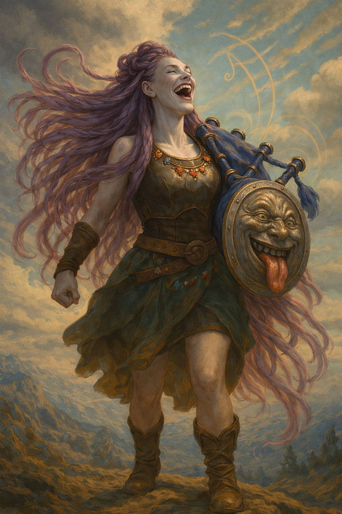

# Yawp Cumuluni

{ width="300" }

> *"Oh honey, your voice can shatter glass? That's cute. Mine kills wildlife."*

**Goliath Bard raised in silence, now a one-woman moshpit who plays bagpipes in thunderstorms and lives to be the party's hype machine.**

---

## Character Overview
- **Species:** Goliath
- **Class:** Bard 5 (College of Valor)  
- **Background:** Wayfarer  
- **Age:** 24
- **Alignment:** Chaotic Good

??? info "Quick Intro"
    
    **At the Table**
    
    * Happy heavy metal vibes with deep care for friends
    * Loud, loving, and utterly incapable of willingly being restrained
    * Dreams of finding the highest peak in the world to shout from
    * One-woman moshpit who uplifts the entire party with raw energy
    
    **Backstory (Short Form)**
    
    Born "different" among Goliaths (willowy frame, wild hair) Cuma'ra was sent at age six as a diplomatic hostage to an elven monastery where silence was enforced. Twelve years of soundproofed imprisonment ended when a traveling bard offered escape. He betrayed her by morning, stealing her savings, but she chose freedom over collapse. Renaming herself Yawp, she's spent the last six years making up for a childhood of stolen song with every blaring note and bold friendship.
    
    **Playing Yawp**
    
    * **Combat:** Valor Bard who wades into melee with warhammer and shield, using Bardic Inspiration to turn allies into legends while Earth Tremor and Shatter bring the thunder.
    * **Roleplay:** Unapologetically loud and loving, speaks in heavy metal intensity whether comforting or challenging. Uses noise to connect, but doesn't dominate. Forgives easily but draws hard lines when one betrayal becomes a pattern.
    * **Party Synergy:** Natural wingman who points praise at others, makes everyone feel like the protagonist of their own epic, and transforms downtime into celebrations.

---

??? info "Deep Dive"
    
    ## Full Backstory
    
    As a toddler, Cuma'ra Cumuluni didn't fit the mold. She was willowy where Goliaths were broad, her frame refusing to bulk up no matter how much she ate or trained. Worse, she had hair—thick, wild, impossible amounts of it that kept growing in defiance of every Goliath aesthetic. The whispers started early: Is she even pure-blood? What's wrong with her?
    
    At six, the tribe found a use for their odd daughter. She was sent away as a diplomatic hostage, sealing a fragile peace between her Goliath tribe and a high elven mountain enclave. Her parents called it necessary. She was already "different"—might as well serve a purpose.
    
    The monastery perched on cold crags was her prison for twelve years. The elven scholars enchanted the stone walls to absorb all sound, protecting their delicate ears from disruption. Cuma'ra learned elven scripture and etiquette under suffocating arches where even her heartbeat felt too loud. The scholars barely saw her as a person—just another diplomatic obligation, a body to park in the library with stacks of books and expectations of silence.
    
    Every day, she longed to scream into the wind. Every night, she wondered if her family even thought about her, or if they'd simply been relieved to ship off the child who didn't fit.
    
    But then, soon after she had turned eighteen, Thymeon the Pilgrim cracked the monastery walls. A visiting bard who claimed to see the "wild sky" shimmering inside her, he was the first person in years who spoke to her like she had a will of her own. His flattery was clumsy, his poems worse, but when he offered escape under a moonless sky, she didn't hesitate.
    
    The night was heady with laughter, wind, music. And yes, the man was attractive enough. But in the morning, the space beside her was empty, her meager savings gone, and the road stretching out in both directions.
    
    Cuma'ra sat with that betrayal for a full day before making her choice. She wouldn't return to the monastery in defeat. She wouldn't collapse under the weight of the world she had longed so long to meet. Turning the page on a childhood largely unlived, she shed her birth name forever and vowed to meet life as if every day was her first. She would be Yawp, a shouty word she'd read and giggled at in some dusty old tome as a little girl. It didn't even sound like a proper name, but it could do as a promise.
    
    The months that followed were her real education, and she attended every lesson. She traveled with suspicious caravans, danced with dangerously under-supervised fire elementals, hilariously lost multiple drinking contests with the local orc tribe, snuck into Noble Estates to raid the pantry with the street children, and migrated across the mountains with Stone giants, learning their deep drum rhythms on the way. And she loved every minute of it.
    
    Half a year later, fate brought her face-to-face with Thymeon again, this time on the wrong end of a hanging rope for seducing a mayor's daughter. But instead of leaving him to swing, she bargained for his release, reclaimed her stolen belongings, and in a moment of poetic justice, claimed his prized bagpipes for her own. They've been her noisemaker of choice ever since. Thymeon himself is still out there somewhere, but she made it abundantly clear when they went their separate ways that they would have... words... if she learned he'd gone after other girls like he did with her.
    
    ## Personality Deep Dive
    
    **Core Traits**
    
    Yawp is not a typical bard "seducer" or solitary drifter. She has half a life of stolen song to make up for, with each note she blares and every new friend she makes. She will tenaciously try to set things right, instead of shrinking back in the face of betrayal or adversity. She steps into any scene or fight as if she's fronting a heavy metal concert.
    
    She dreams of finding the highest peak in the world to shout from. She's searching for a sound so big it creates echoes in the heavens. She wants to make a sound so loud the whole world has no choice but to echo it back.
    
    **Ideals**
    
    Freedom is fragile and must be defended loudly. Life is too short for grudges, but never mistake forgiveness for weakness.
    
    **Bonds**
    
    Thymeon, relationship status: complicated.
    
    Her family: She tells herself she doesn't blame them. Someone had to go. Peace mattered. But when she sees parents with their children, her smile gets a little forced.
    
    **Flaws**
    
    Improvises wild stories for the vibes. Drowns uncomfortable feelings in noise rather than processing them. Is kind of bad at real emotional vulnerability.
    
    ## Playing Yawp
    
    Yawp is not intended as a classic jester or seducer, but an avatar of boldness and laughter to lift the table. Be loud and loving, but never make the party all about you. She's not a diva hogging the stage, more the band member who uses her charisma to point praise to the "drummer in the back" in the party (whether they like it or not). Play Yawp with raw energy to uplift the group and other players, being their wingman, their greatest supporter, that perhaps slightly overbearing friend everybody still wished they had.
    
    Yawp has had enough of holding back and cares little for laws or norms. Make bold social moves, challenge authority, express your feelings, consequences be damned!
    
    A quirk to play into is that Yawp loves to play bagpipes in thunderstorms, layering noise with more noise. Miraculously, she has not been struck by lightning yet.
    
    During downtime, Skywrite Rituals turns the heavens into your personal graffiti board. This is Yawp's final "you can't silence me" fallback. It costs you no spell slots and no material components. Go wild!
    
    Yawp wants to connect deeply and immediately with everyone she meets, whether strangers, allies, or even enemies. She believes true liberation doesn't come from avoiding bonds, but from making many, strong and lasting relationships that all support each other to freedom. 
	
	Forgiveness and second chances are part of her loud, defiant love of life, most clearly displayed in how she saves Thymeon after betraying her. But even so, she doesn't let him off the hook entirely unscathed. She's not exactly a pushover.
        
    ## Sample Quotes
    
    "The elves called me unladylike. Which is fair! I'm more of a landslide."
    
    "Forgive my enemies? Little preacher man, I don't forgive my enemies, I recruit them."
    
    "Did you know I'm devout? I'm archdeacon in the church of fun! Why're you cringing? I'm serious!"
    
    "If I only settled for men my own size, life would be boring. I like the little cutie patooties."
    
    "Oh honey, your voice can shatter glass? That's cute. Mine kills wildlife."
    
    "You know what I love about thunder? It rumbles in your guts, fills you right up. Like a noise fuck from the sky!"
    
    "Tim's stuck in the well? Gods, I can't do tight spaces. Maybe I can cheer him on from up top?"
    
    "This is our cleric and on my life he's getting drunk, laid and married tonight! Where's my drum?"
    
    "Why yes, I did in fact write 'YOUR RULES ARE SMALL, YOUR HATS ARE SILLY' in the sky above the capital after they deported us. What of it?"
    
    ## Deeper Layers & Optional Complexity
    
    Put some thought into how to play her once a betrayal has gone too far. There's narrative room for her to go from happy power metal to something a lot more terrifying. What happens when Yawp goes quiet? What feelings has she been burying? Maybe Yawp is so forgiving because there may just be too much rage to deal with underneath? Perhaps it was either forgive Thymeon or reduce him to a wet stain. There are extra gears to Yawp's energy here for you as a player to experiment with, a Jekyll/Hyde scenario when her line is finally crossed.
    
    She has thick, ropy dreadlock hair, rare for most species, especially Goliaths. Consider how to play into this. Does she wonder if she's "true-blood Goliath"? Does she even care? Does she flaunt it proudly, with massive headbanging and windmilling, or does she mostly keep it for sentimental purposes?
    
    Yawp is in many ways a walking trope, a Brünnhilde, Walt Whitman, half Cú Chulainn, half Joan Jett. That's fine! Tropes are cool. But here are ideas if you want to add layers:
    
    - **Claustrophobia and fear of being tied down** could also apply emotionally, manifesting as an ironic "stage fright", tongue-tying or unease in moments of genuine intimacy and emotional vulnerability.
    
    - **Broken relationship with faith** from her years as a diplomatic hostage. Does she hate religion? Is noise her new way to talk with the Gods?
       
    - **Lineage.** Is she truly all Goliath? She's tall, but lacks the typical Goliath bulk and has way too much hair. How deep would she be willing to go to research an unexpected clue to her past? (Is she half Siren?)
    
---

??? danger "Notes for the DM"
	
	## Thymeon the Pilgrim
	
	Thymeon the Pilgrim is more than a bad memory. Use him as a mirror: he represents what happens when charm is hollow and self-serving, while Yawp embodies loving resonance that actually matters.
	
	## The Highest Mountain
	
	Yawp's dream could be an actual mythic place. DMs could treat it like a pilgrimage across realms, impossible peaks, each step echoing her search for the greatest sound from the highest peak in the world. Consider possible outcomes and if they can somehow tie into other aspects of your campaign. Does Yawp somehow bottle the bawl from a Tarrasque and then magically enhance it? What happens if she makes a sound so loud it breaks something... metaphysically important?
	
	## Sound and Silence as Triggers
	
	Yawp's time in the soundproof monastery left scars. Play with this by introducing encounters where sound is stolen or muted, or why not a hag who silences the party, a god of whispers who tries to unmake her roar. Play on her claustrophobia and fear of entrapment, but do it in moderation and with player consent.
	
---

??? info "Mechanical build (lv 5) and PDF download"

	| STR | DEX | CON | INT | WIS | CHA |
	|:---:|:---:|:---:|:---:|:---:|:---:|
	| 14 (+2) | 12 (+1) | 14 (+2) | 10 (+0) | 8 (-1) | 18 (+4) |
	
	## Combat Stats
	
	| AC | HP | Hit Dice | Speed | Initiative | Prof. Bonus |
	|:---:|:---:|:---:|:---:|:---:|:---:|
	| 17 | 38 | 5d8 | 35 ft. | +1 | +3 |
	
	**Saving Throws: Dexterity: +4, Charisma: +7**
	
	**Resistances:** None
	
	## Proficiencies
	**Skills**: Insight: +2, Intimidation: +10, Performance: +7, Persuasion: +10, Stealth: +4
	
	**Armor**: Light Armor, Medium Armor, Shield | **Weapons**: Simple Weapons, Martial Weapons
	
	**Tools**: Bagpipes, Thieves' Tools, Drum, Lute | **Languages**: Common, Elven, Giant
	
	## Feats
	- **War Caster**: Can ignore Somatic spell components, Use Spells on Opportunity Attacks, have Advantage on Concentration checks
	- **Lucky**: Receive PB/LR luck points, used to gain Advantage or impose Disadvantage on any roll
	- **Giant Ancestry - Stone's Endurance**: Use Reaction (PB times/LR) to reduce damage by 1d12+CON modifier
		
	## Equipment
	Breastplate, Warhammer, Thieves' Tools, Shield of Expression *(Suggested magic item, purely for flair)*
	
	## Spellcasting
	**Cantrips**: Minor Illusion, Thunderclap, True Strike
    **Level 1**: Bane, Earth Tremor, Heroism, Thunderwave
	**Level 2**: Enlarge/Reduce, Heat Metal, Shatter, Skywrite
	**Level 3**: Mass Healing Word

	📄 [Download Level 5 Character Sheet (PDF)](assets/yawp-cumuluni-lv5.pdf)

---

??? danger "Session Zero Considerations"
    
    **Content Notes:** Check language levels and vibes with the table. Yawp is written as a PG-13 character (and then some), unapologetically rowdy, horny and happy. Contains themes of childhood isolation, abandonment by parents, and brief sexual betrayal (non-graphic). Claustrophobia may be explored if DM and player agree. If your table leans more serious, Yawp may still be a great fit, but with proper adjustments to tone and language.
    
    **Representation Notes:** Possible case of adoption or childhood lies about provenance.

---