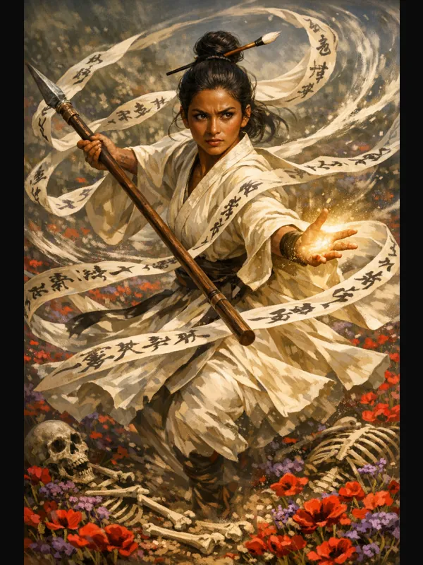
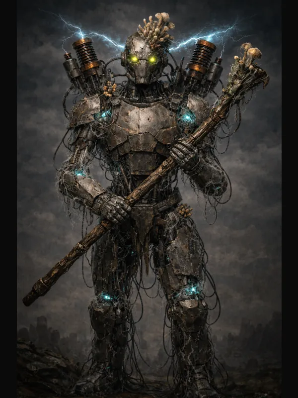
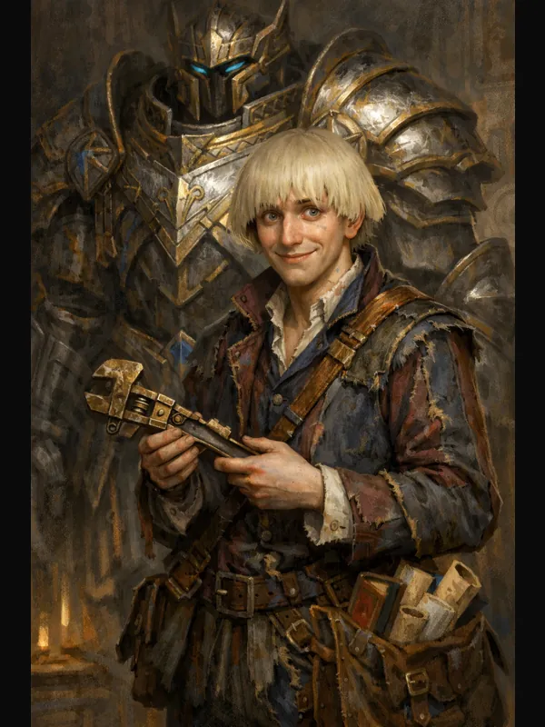
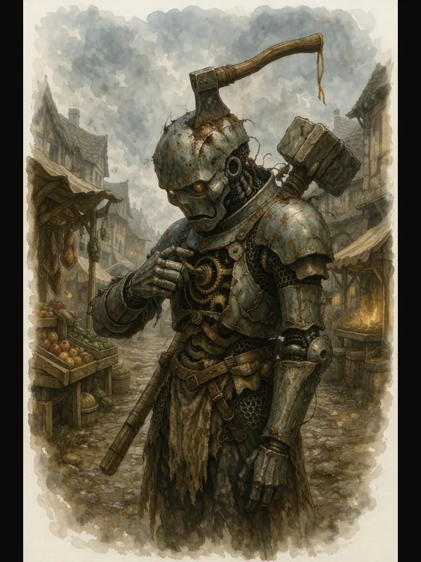
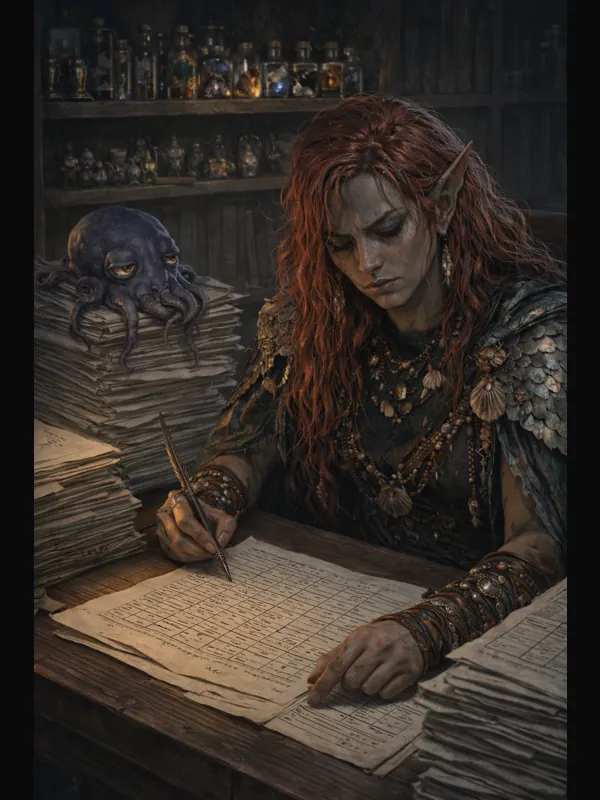
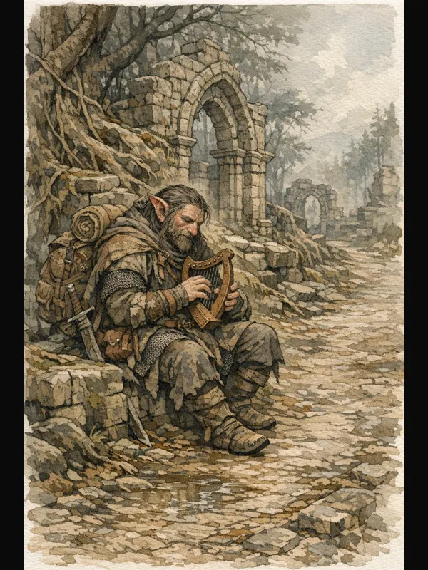
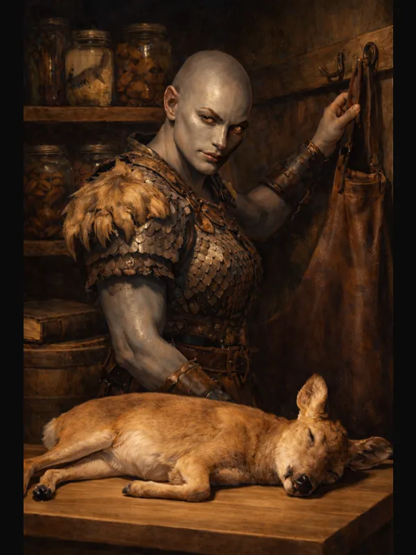
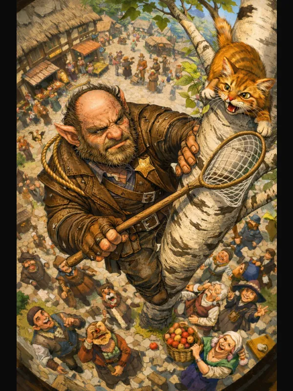

	# Steal These Ideas

**Steal These Ideas** is a free library of plug-and-play D&D material: prebuilt **high-quality characters** with clear **personality, narrative hooks** and **unique voice**. Remix what you want, ignore the rest.

*All characters created in the official character creator tool at DNDBeyond.com, with minimal homebrew clearly marked.*

**About me:** Experienced writer of prose and fiction, gamemaster in various RPG systems for almost 30 years. This project has been a creative outlet through a period of illness, and I'd like to share it freely with the D&D community.

**Note:** Visual aid and graphics are AI generated, *with love and care on a zero-budget*. If this is an issue, feel free to ignore any images and focus on the actual content.

<small>Updated: 2026-01-25 • v0.2 · <a href="changelog/">CHANGELOG</a></small>

### Why this helps you run better games

- **Save prep time:** highly individual drop-in NPCs and PCs ready for adventure.
- **Session-ready:** stat blocks, hooks, and sample dialogue crafted by an experienced writer.
- **Remix-friendly:** free to use and share with attribution, non-commercial. 🔖 **License:** CC BY-NC-SA 4.0. See the full terms in the <a href="https://github.com/Oenig138/STI#readme">README</a>.

## Explore

<figure class="character-card">
  
Alveta “Velvet”
<figcaption id="cap-alveta">
    A kid's fake fighting style got a boy killed. Now she's sworn an oath to make it real — but someone's franchising the dangerous version, and she thinks it's the childhood friend she lost.
  </figcaption>
  
</figure>

<figure class="character-card">
  
  Anwar the Radiant
  <figcaption id="cap-anwar">
    A travelling, dancing Monk of Mercy who gently scare-berates the smallfolk into accountability and carries the trauma of famine through beauty, dignity and goat milk.
  </figcaption>
  
</figure>

<figure class="character-card">
  
  Basil Tenebrian
  <figcaption id="cap-basil">
    Shifter Bladesinger certain he'd be ready when danger came. His mentor died proving he wasn't. Now hunted, his mother imprisoned, the wallflower dandy who imagined himself a scholar (and a Good Boy) must come to terms with who he wants to be.
  </figcaption>
  
</figure>

<figure class="character-card">
  
  Beitian “Betty” Winter’s Heart
  <figcaption id="cap-betty">
    Dragonchess prodigy from an all-deaf clan who got hustled and can't go home until she wins back her losses with interest. Lives for gossip and mustard because examining her own limits would shatter the self-image keeping her afloat.
</figcaption>
  
</figure>

<figure class="character-card">
  
  Belvarax “Gobsmack” Allimander
  <figcaption id="cap-belvarax-allimander">
    A paladin who read the fine print and realized "protect the weak" might mean the goblins, not the mining companies paying his order's bills to displace them. Now he's an unwelcome reminder that the oath answers to sincerity, not the rules of the order. Meanwhile the goblins keep dying while he's busy asking questions.
  </figcaption>
  
</figure>

<figure class="character-card">
  
  Calypso “So-So” Sonder
  <figcaption id="cap-calypso-so-so-sonder">
    Aging kabuki luchador who'd rather die than go vulgar for the crowd. Hogs party protein but always apologizes. Can't tell the truth about why he was fired, chasing one last hurrah before his body gives out.
  </figcaption>
  
</figure>

<figure class="character-card">
  
  Cog-Stool
  <figcaption id="cap-Cog-Stool">
    Warforged Spore Druid, a strange two-minded chimera born of centuries of interfacing between a decommissioned battledroid prototype and an awakened mycelial network. Seeks to understand life and personhood in a world unconvinced it has either.
  </figcaption>
  
</figure>

<figure class="character-card">
  
  Clover Medley
  <figcaption id="cap-clover-medley">
    Charming Tiefling farmgirl from a blighted valley where the farm pigs grunt in Abyssal. The locals blame her birth for the curse; her family knows better. Her grandpa swore on his deathbed he saw a "cursed Kirin" poisoning the land, and it has become her White Whale.
  </figcaption>
  
</figure>

<figure class="character-card">
  
  Coltan the Magnificent
  <figcaption id="cap-coltan-ironforge">
    Struggling writer turned armor-clad hero who self-narrates during combat and yells at books at camp. Camp, competent, grandiose, and deeply insecure. Insists he's destined for greatness, but folds immediately if anyone pushes back.
  </figcaption>
  
</figure>

<figure class="character-card">
  
  Donner
  <figcaption id="cap-donner">
    Sacrificed his apprentice to escape the Revenant that killed the rest. Keeps new companions alive with grim stories and good stew — and can't tell anymore if it's care or just keeping someone around to throw when it catches up.
  </figcaption>
  
</figure>

<figure class="character-card">
  
  Geldok Iron Tusk
  <figcaption id="cap-geldok-iron-tusk">
    Soft-gutted Orc ex-raider turned unlikely Cleric of the mysterious "Big Boss"; streetcorner problem solver and healer, who obeys no worldly authority.
  </figcaption>
  
</figure>

<figure class="character-card">
  
  Harold Carnap
  <figcaption id="cap-harold-carnap">
    Halfling Warlock grandpa. Devilishly wholesome, turning blood rituals to potlucks. Possibly an evil genius in a cardigan. The jury is still out.
  </figcaption>
  
</figure>

<figure class="character-card">
  
  Hatchet
  <figcaption id="cap-hatchet">
    Barely working ancient mage-hunter murderbot awakened to an era where magic is normalized. Reconciling its programming with new parameters wasn't too bad. It doesn't have a grief protocol. But it does have the distinct energy of a border collie looking for new sheep to herd.
  </figcaption>
  
</figure>

<figure class="character-card">
  
  Iblit
  <figcaption id="cap-iblit">
    Calvin & Hobbes meets Good Omens: A kobold teen warlock bound to an archangel who hates this assignment as much as he does. Radiant damage, theological bickering, and occasional outbursts of "you're not my mom!"
  </figcaption>
  
</figure>

<figure class="character-card">
  
  Mahorran The undertide
  <figcaption id="cap-mahorran">
    Corporate Marid's one-woman pirate crew grinding for that sweet branch manager promotion. Precious about her working conditions and retreats to her underwater garden for depressingly uneventful downtime with her turtles.
  </figcaption>
  
</figure>

<figure class="character-card">
  
  Orfan
  <figcaption id="cap-orfan">
    Firbolg archaeologist dismissed by the academy and exploited by an animal abusing coven. His 'bad academic praxis' yielded Draconic powers, but he's torn between wilderness peace and the academic recognition that still haunts him.
  </figcaption>
  
</figure>

<figure class="character-card">
  
  Lia Amberhorn
  <figcaption id="cap-lia-amberhorn">
    Satyr Wild Magic Sorcerer who believes in her own stereotypes. Rejected by her sober, ableist merchant family, but still snipes with pinpoint precision, whether with word or spell.
  </figcaption>
  
</figure>

<figure class="character-card">
  
  Inakha Nulakiano
  <figcaption id="cap-inakha-nulakiano">
    Goliath monster hunter chasing culinary redemption for her exiled family, armed with a greataxe, a legendary cookbook, and the emotional regulation of a kicked hornet's nest. Conservative workhorse who sees a Gelatinous cube as aspic with extra steps.
  </figcaption>
  
</figure>

<figure class="character-card">
  
  Salynna "Sally" Tarrant
  <figcaption id="cap-salynna-sally-tarrant">
    Trickster Paladin who stole cutlery at the boarding school for ten years before she found her purpose in life; now smothers her sworn Ward with an overreach of steel and cunning.
  </figcaption>
  
</figure>

<figure class="character-card">
  
  Scarecrow
  <figcaption id="cap-scarecrow">
    Warforged Bard who stood guard in a village square for centuries, quietly indexing every life and family tree. Gives great hugs. Also spies on you.
  </figcaption>
  
</figure>

<figure class="character-card">
  
  Sergeant Bink
  <figcaption id="cap-sergeant-bink">
    Bugbear Rune Knight sheriff who sees patterns in everything, talks to his corkboard, and eats his own paperwork. Your local cryptid with badge authority. The town children love him anyway.
  </figcaption>
  
</figure>

<figure class="character-card">
  
  Sister Garra
  <figcaption id="cap-sister-garra">
    Tiny Tabaxi of the illegal slum order the Mud Nuns. Smuggles refugees, redistributes wealth, leaves receipts of 'karma rebalanced.' Racing middle age while the order pressures her to retire to the scholarly turmeric robe.
  </figcaption>
  
</figure>

<figure class="character-card">
  
  Stennart Goldgift
  <figcaption id="cap-stennart">
    Mediocre Dwarf merchant accidentally turned heroic overnight. Slowly transforming into a World Tree seedling while desperately clinging to the strength that finally made him feel special. He knows he's cheating, he's made his peace. Now he intends to live out an unforgettable finale.
  </figcaption>
  
</figure>

<figure class="character-card">
  
  Tormin Remus
  <figcaption id="cap-tormin-remus">
    A revolutionary changeling warlock who traded his soul—and his face—to fight tyranny, now spreading sedition through traitorous tunes while slowly forgetting who he used to be.
  </figcaption>
  
</figure>

<figure class="character-card">
  
  Yawp Cumuluni
  <figcaption id="cap-yawp-cumuluni">
    Goliath Bard raised in silence, now a one-woman moshpit who plays bagpipes in thunderstorms and lives to be the hype machine that forces an echo from the world.
  </figcaption>
  
</figure>

**Locations:** 
- **[Lith and Flesh](locations/the-lith-and-flesh.md)**, a decadent boutique where petrified objects and creatures are modified and sold at premium rates. Tone: Satire, Body horror, Comedy. Includes Jeremy, the NPC that refuses to die.

**Factions:**
- **[The Mud Nuns](factions/mud-nuns.md)**, a barefoot mendicant order of nuns living for mercy through mischief and larceny in the slums of the City. Tone: Heists, Divine trickstery, Urban Intrigue. Includes Sister Garra, PC/NPC who leaves receipts of "karma rebalanced" with her victims.

* *(More sections coming: one-shots, campaign seeds, bestiaries, etc.)*

## FAQ

**Why are there AI-generated images?**  
Mood images and visual aids are AI-generated to convey vibes. They’re non-essential and you're free to ignore them. The concepts and writing are original.

**Is this PG-13?**  
Yes. Most content works for younger audiences or can easily be tweaked, but check notes on each page. Any trigger warnings appear on the relevant character pages.

**How are the characters designed?**
All characters are designed to slot in seamlessly at many tables:

- Level 5
- Built in the official character creator at dndbeyond.com
- All ability scores are taken with the Points buy method.
- Homebrew is marked as such and explained on the character page.
- Characters are built with respect for both narrative weight and game efficiency; they are not "mechanically optimized".
- PDF's are clean sheets taken directly from dndbeyond.com. They do not include all the info on the character page because: 1) it wouldn't fit, 2) it leaves space for the players to take notes.

Take what you want, discard, rebuild or remix the rest.

---

Built with ❤️ using [MkDocs](https://www.mkdocs.org) and [GitHub Pages](https://pages.github.com/).  
Repo: <https://github.com/Oenig138/STI> • Contact: <oenig@protonmail.com> • Open to collaborations.
