	# Steal These Ideas

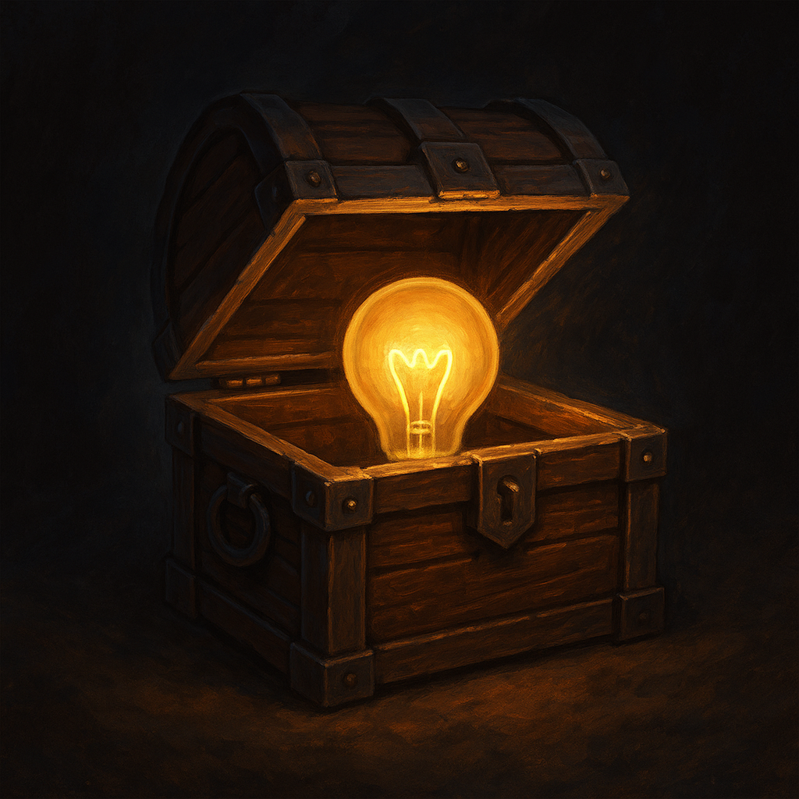

**Steal These Ideas** is a free library of state of the art plug-and-play D&D material: prebuilt **high-quality characters** with clear **personality, narrative hooks** and **unique voice**. Remix what you want, ignore the rest. 

*All characters created in the official character creator tool at DNDBeyond.com, with minimal homebrew marked as such.*

**About me:** Experienced writer of prose and fiction, and dungeon master in various RPG systems since 30 years. This project has been a creative outlet through a period of illness, and I'd like to share them freely with the D&D community.

**Note:** Visual aid and graphics are indeed AI generated, *with love and care on a zero-budget*. If this is an issue, feel free to ignore any images and focus on the actual content.

  <a href="#explore" class="md-button md-button--primary">Browse Character Concepts</a>
  <a href="assets/full-bundle.zip" class="md-button">Download full character Bundle (ZIP)</a>

<small>Updated: 2025-12-21 • v0.2 · <a href="changelog/">CHANGELOG</a></small>

### Why this helps you run better games

- **Save prep time:** drop-in NPCs and PCs ready for adventure.
- **Session-ready:** stat blocks, hooks, and sample dialogue crafted by an experienced writer.
- **Remix-friendly:** free to use and share with attribution, non-commercial. 🔖 **License:** CC BY-NC-SA 4.0. See the full terms in the <a href="https://github.com/Oenig138/STI#readme">README</a>.

## Explore

<figure class="character-card">
  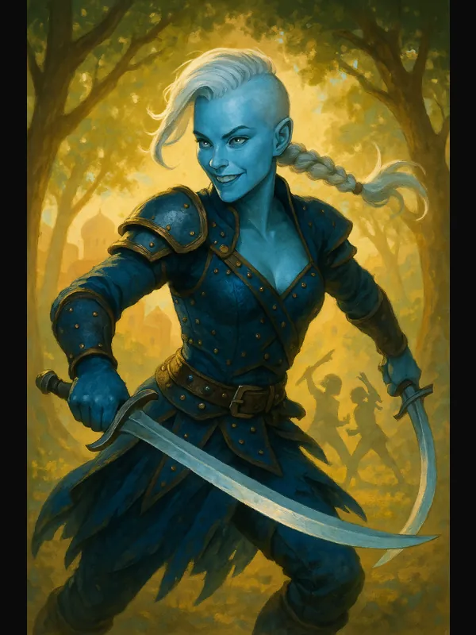
Alveta “Velvet”
<figcaption id="cap-alveta">
    Air Genasi Glory Paladin. Her childhood stickfights became a scam dojo, now she fights for vindication.
  </figcaption>
  
</figure>

<figure class="character-card">
  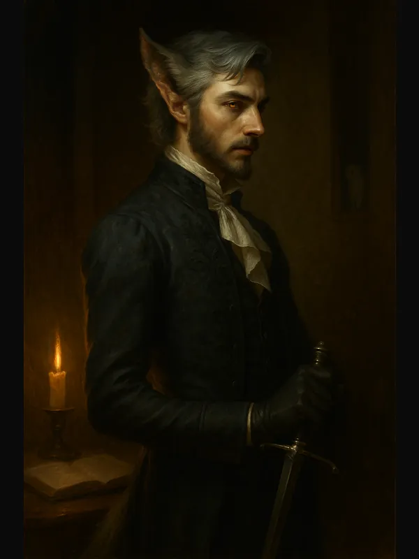
  Basil Tenebrian
  <figcaption id="cap-basil">
    A fugitive Noble shifter who mastered bladesinging under an elven sage, now hunted by his brother, but still a Good Boy.
  </figcaption>
  
</figure>

<figure class="character-card">
  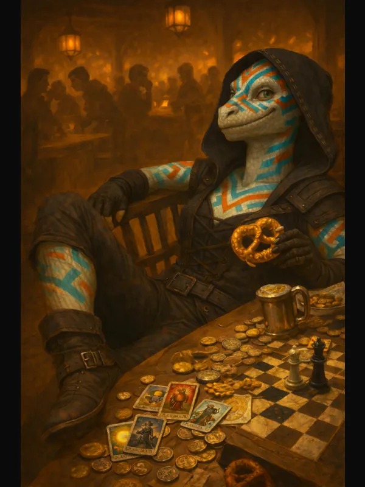
  Beitian “Betty” Winter’s Heart
  <figcaption id="cap-betty">
    Dragonborn Psionic Rogue. Deaf Dragonchess prodigy and gambling addict. Built for representation and fun at the table.
  </figcaption>
  
</figure>

<figure class="character-card">
  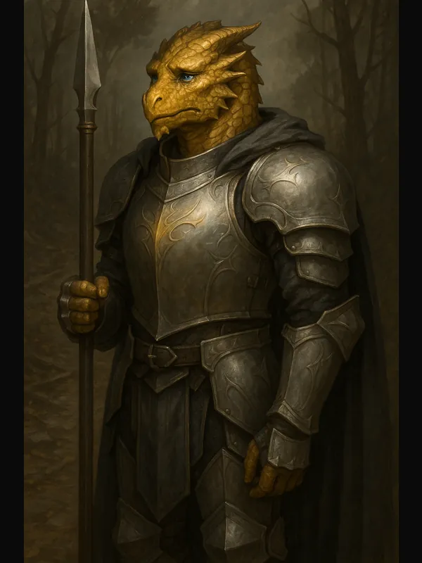
  Belvarax “Gobsmack” Allimander
  <figcaption id="cap-belvarax-allimander">
    Dragonborn Paladin. Party daddy universally scorned for his reluctance to smite baddies. The gentle shepherd in the back.
  </figcaption>
  
</figure>

<figure class="character-card">
  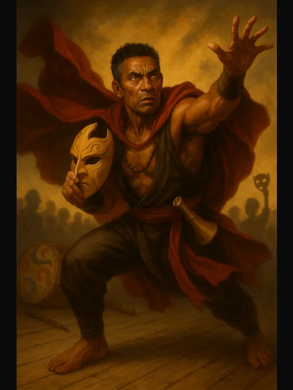
  Calypso “So-So” Sonder
  <figcaption id="cap-calypso-so-so-sonder">
    Human Monk (Open Hand). The last noble D&D style kabuki luchador, aging artist of a dying tradition.
  </figcaption>
  
</figure>

<figure class="character-card">
  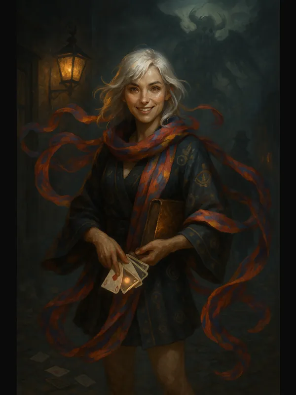
  Cephala Fortina
  <figcaption id="cap-cephala-fortina">
    Aasimar Warlock. Charlatan with chronic wanderlust and main-character energy. Given a demographic mystery by her strange patron.
  </figcaption>
  
</figure>

<figure class="character-card">
  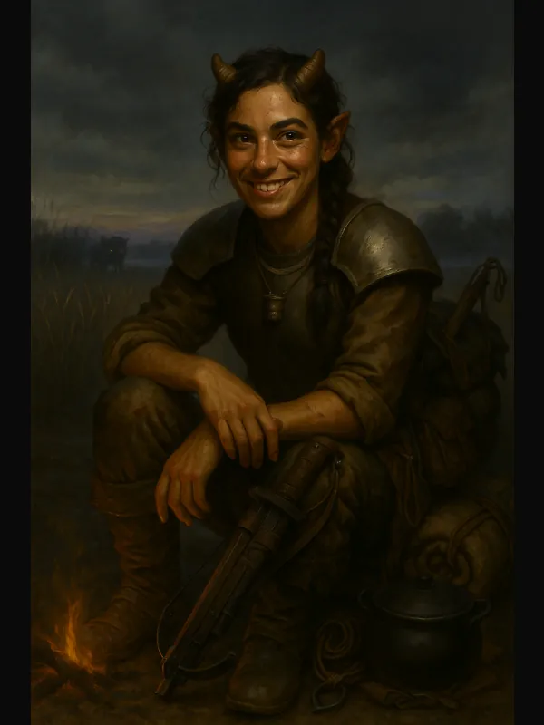
  Clover Medley
  <figcaption id="cap-clover-medley">
    Tiefling Ranger. Charming farmgirl from a blighted valley obsessed with chasing a cursed Kirin. Wrangles pigs that grunt in Abyssal.
  </figcaption>
  
</figure>

<figure class="character-card">
  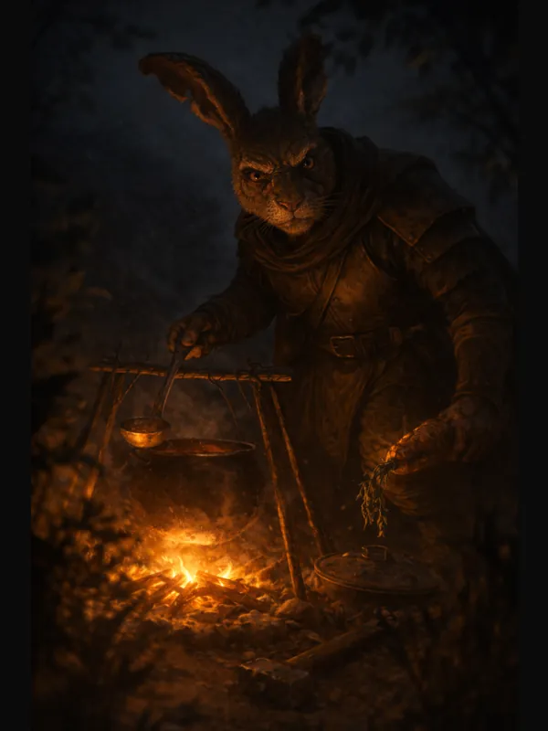
  Donner
  <figcaption id="cap-donner">
    Harengon Battle Master. Cynical and haunted by the young one he sacrificed to stay alive; keeps others alive with blunt advice and kale stews.
  </figcaption>
  
</figure>

<figure class="character-card">
  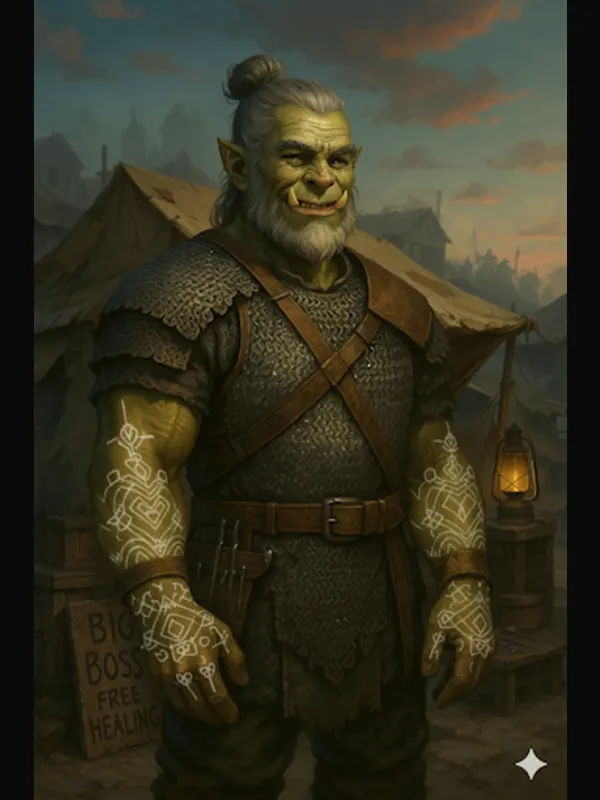
  Geldok Iron Tusk
  <figcaption id="cap-geldok-iron-tusk">
    Orc Cleric. Ex-raider turned unlikely cleric of the Big Boss; more of a streetcorner "problem solver" than mainstream faith healer. 
  </figcaption>
  
</figure>

<figure class="character-card">
  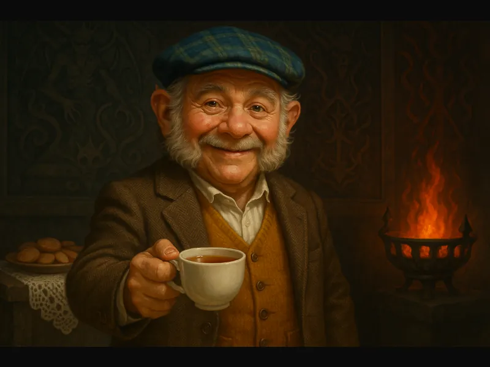
  Harold Carnap
  <figcaption id="cap-harold-carnap">
    Halfling Warlock grandpa. Devilishly wholesome; possibly an evil genius in a cardigan. The jury is still out.
  </figcaption>
  
</figure>

<figure class="character-card">
  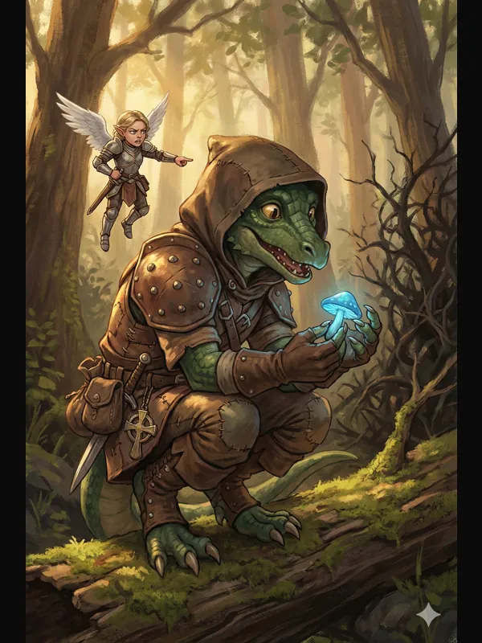
  Iblit
  <figcaption id="cap-iblit">
    Calvin & Hobbes meets Good Omens: A kobold teen warlock bound to an archangel who hates this assignment as much as he does.
  </figcaption>
  
</figure>

<figure class="character-card">
  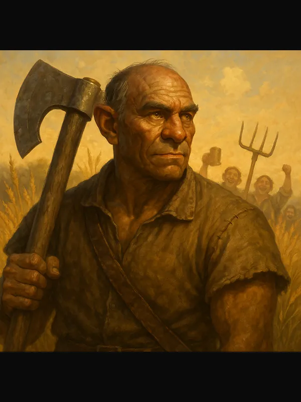
  Korak the Gilded
  <figcaption id="cap-korak-the-gilded">
    Hobgoblin Barbarian with the soul of a revolutionary and the mind of a late Soviet agricultural bureaucrat. Unwilling folk hero.
  </figcaption>
  
</figure>

<figure class="character-card">
  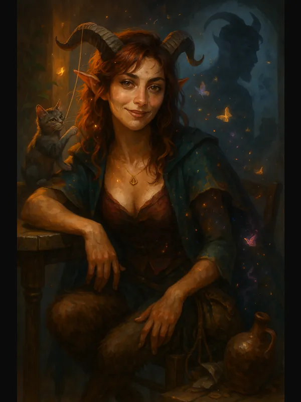
  Lia Amberhorn
  <figcaption id="cap-lia-amberhorn">
    Satyr Sorcerer. Dyslexic and rejected by her merchant family. Plays to all the party girl and sorcerer stereotypes, but is secretly brilliant. 
  </figcaption>
  
</figure>

<figure class="character-card">
  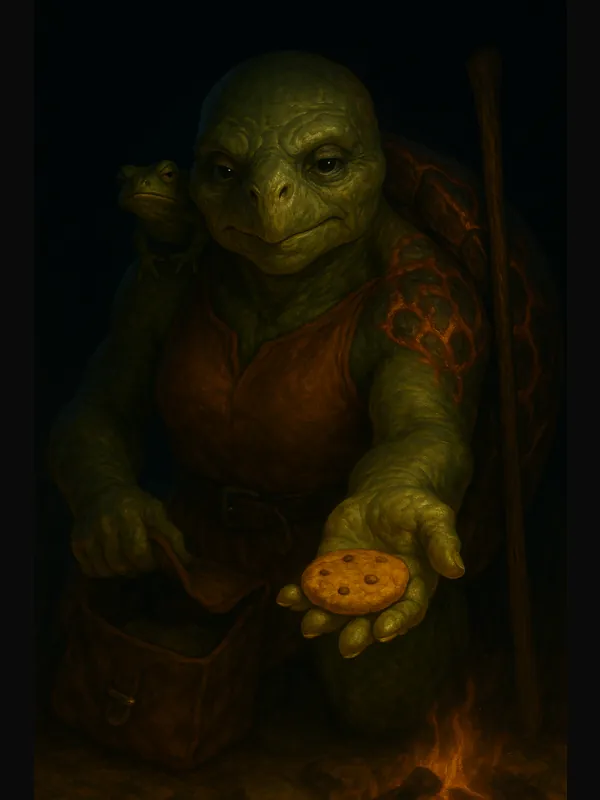
  Olan Danù
  <figcaption id="cap-olan-danu">
    Tortle Abjurer diplomat who believes in mercy and kindness as rational investments, but struggles with mounting evidence that people aren't worth the effort. 
  </figcaption>
  
</figure>

<figure class="character-card">
  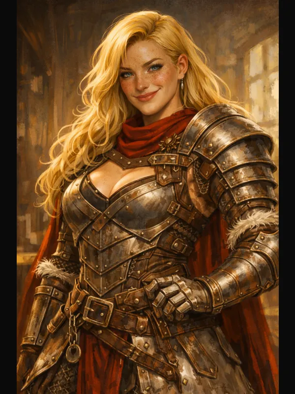
  Salynna "Sally the Pally" Tarrant
  <figcaption id="cap-salynna-sally-tarrant">
    Trickster Pally
  </figcaption>
  
</figure>

<figure class="character-card">
  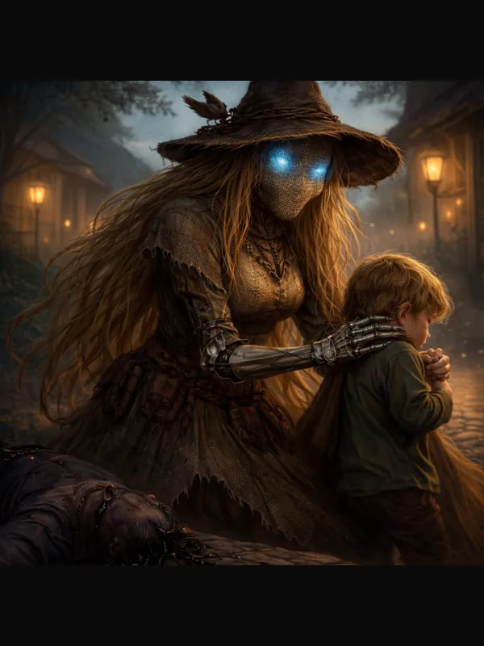
  Scarecrow
  <figcaption id="cap-scarecrow">
    Warforged Bard who stood guard in a village square for centuries, quietly indexing every life. Gives great hugs. Also spies on you.
  </figcaption>
  
</figure>

<figure class="character-card">
  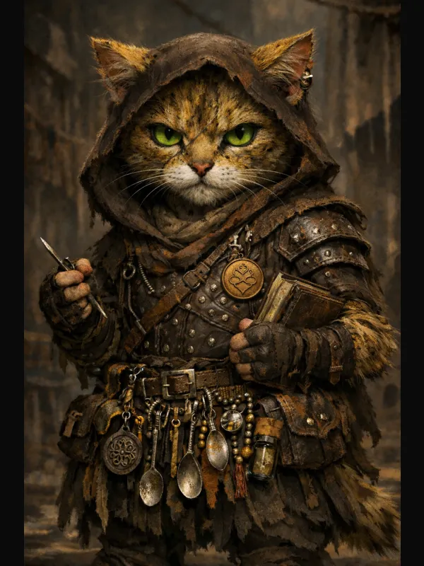
  Sister Garra
  <figcaption id="cap-sister-garra">
    Tabaxi Trickster Cleric of the Mud Nuns, meticulous about accounting and receipts to the people she rob to keep their stagnant wealth from poisoning their souls.
  </figcaption>
  
</figure>

<figure class="character-card">
  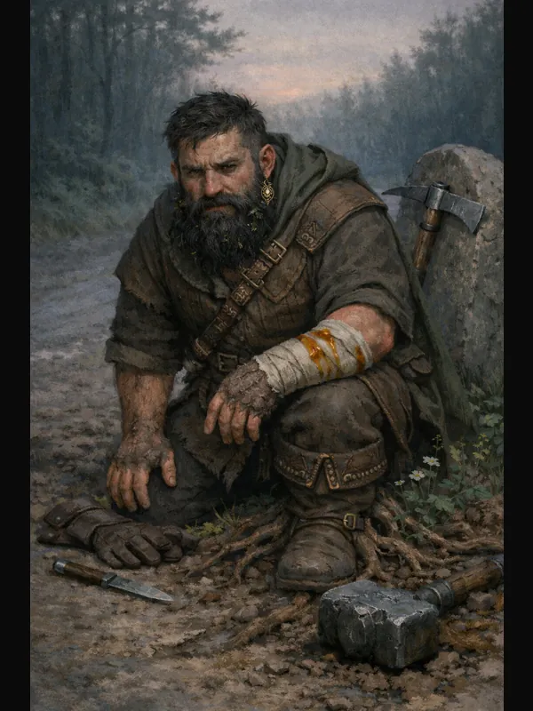
  Stennart Goldgift
  <figcaption id="cap-stennart">
    Dwarf merchant turned overnight Chad. Slowly transforming into a World Tree seedling while desperately clinging to the strength that finally made him feel important.
  </figcaption>
  
</figure>

<figure class="character-card">
  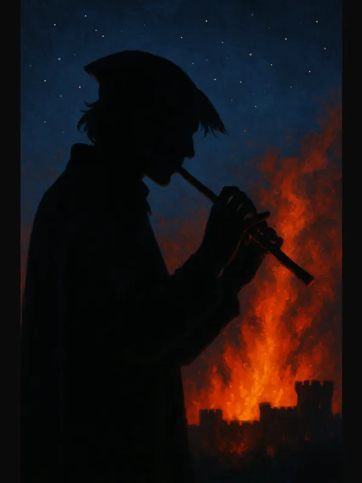
  Tormin Remus
  <figcaption id="cap-tormin-remus">
    "Guy Faust", a revolutionary who sold his soul and face to become the perfect insurrectionist, the pied piper of the smallfolk.
  </figcaption>
  
</figure>

<figure class="character-card">
  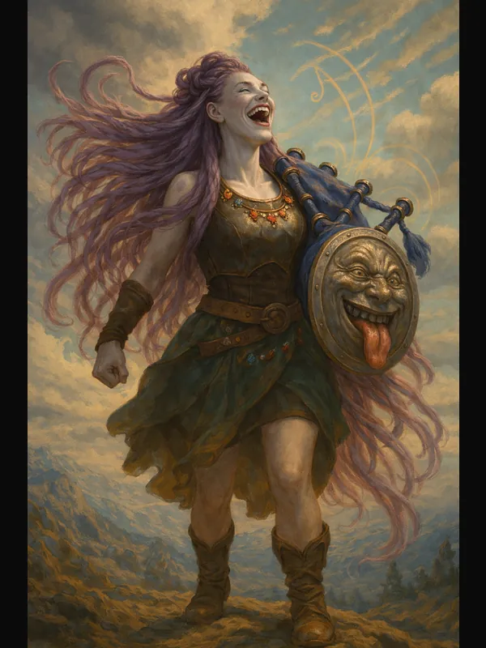
  Yawp Cumuluni
  <figcaption id="cap-yawp-cumuluni">
    Goliath Bard raised in silence, now a one-woman moshpit who plays bagpipes in thunderstorms and lives to be the party's hype machine.
  </figcaption>
  
</figure>

**Locations:** 
- **[Lith and Flesh](locations/lith-and-flesh.md)**, a decadent boutique where petrified objects are modified and sold at premium rates. Tone: Satire, Body horror, Comedy. Includes Jeremy, the NPC that refuses to die.

**Factions:**
- **[The Mud Nuns](factions/mud-nuns.md)**, a barefoot mendicant order of nuns living for mercy through mischief and larceny in the slums of the City. Tone: Heists, Divine trickstery, Urban Intrigue. Includes Sister Garra, PC/NPC who leaves receipts of "karma rebalanced" with her victims.

* *(More sections coming soon: one-shots, campaign seeds, bestiaries, etc.)*

## FAQ

**Why are there AI-generated images?**  
Some mood images and visual aids are AI-generated to convey vibes. They’re non-essential and you're free to ignore them. The concepts and writing are original.

**Is this PG-13?**  
Yes. Most content works for younger audiences or can easily be tweaked, but check notes on each page. Any trigger warnings appear on the relevant character pages.

**How are the characters designed?**
All characters are designed to slot in seamlessly at many tables:

- Level 5
- Built in the official character creator at dndbeyond.com
- All ability scores are taken with the Points buy method.
- Any magic items are merely suggestions, but are chosen first and foremost to fit the character.

Take what you want, discard, rebuild or remix the rest.

---

Built with ❤️ using [MkDocs](https://www.mkdocs.org) and [GitHub Pages](https://pages.github.com/).  
Repo: <https://github.com/Oenig138/STI> • Contact: <oenig@protonmail.com> • Open to collaborations.
