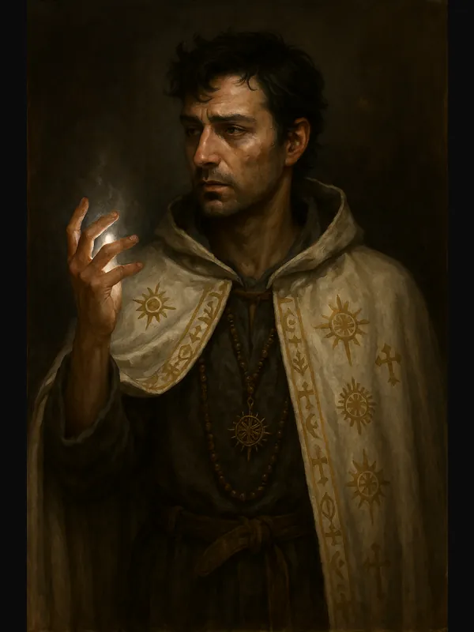
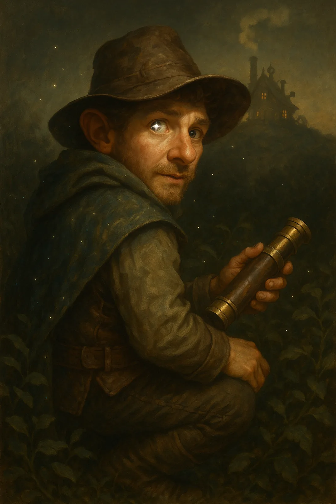
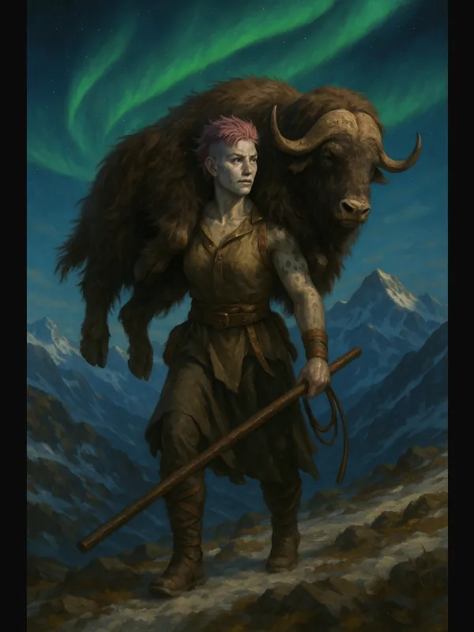
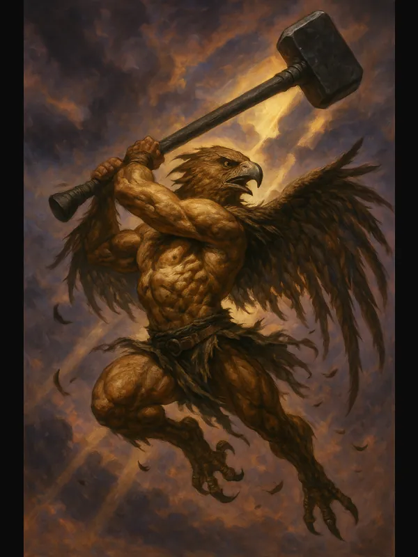
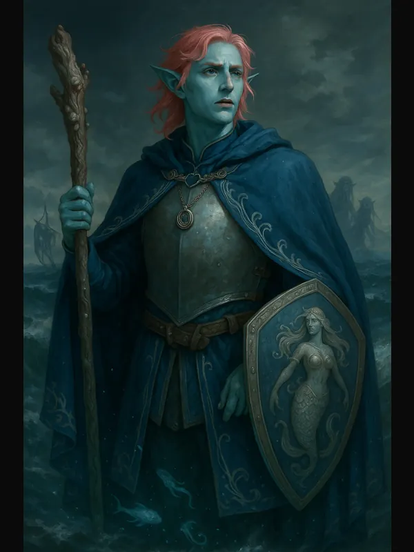
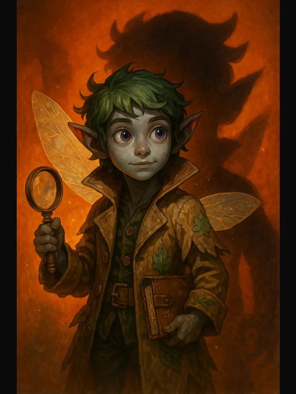
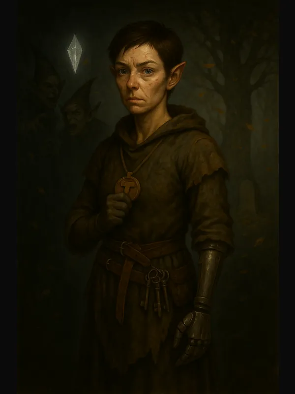

<svg xmlns="http://www.w3.org/2000/svg" viewBox="0 0 64 64" width="1.2em" height="1.2em" style="vertical-align: -0.2em; display: inline-block;"><g fill="currentColor"><path d="M12,14 Q12,8 32,8 Q52,8 52,14 L52,24 Q52,28 48,28 L16,28 Q12,28 12,24 Z"/><rect x="10" y="26" width="44" height="28" rx="2"/><circle cx="32" cy="40" r="4" fill="#000" opacity="0.3"/><rect x="10" y="32" width="44" height="2" opacity="0.2"/><rect x="10" y="48" width="44" height="2" opacity="0.2"/><ellipse cx="32" cy="26" rx="20" ry="3" opacity="0.15"/></g></svg>

**Steal These Ideas** is a free library of plug-and-play D&D material...

	# Steal These Ideas

**Steal These Ideas** is a free library of plug-and-play D&D material: prebuilt **high-quality characters** with clear **personality, narrative hooks** and **unique voice**. Remix what you want, ignore the rest. 

**Note:** Visual aid and graphics are indeed AI generated, *with love and care on a zero-budget*. Feel free to ignore these images if they rub you the wrong way. All I'm asking is that you judge the characters on their own merits.

  <a href="#explore" class="md-button md-button--primary">Browse Character Concepts</a>
  <a href="assets/sti-starter-bundle.zip" class="md-button">Download full character Bundle (ZIP)</a>

<small>Updated: 2025-09-04 • v0.1 · <a href="changelog/">CHANGELOG</a></small>

### Why this helps you run better games

- **Save prep time:** drop-in NPCs and PCs ready for adventure.
- **Session-ready:** stat blocks, hooks, and handouts where applicable.
- **Remix-friendly:** free to use and share with attribution, non-commercial. 🔖 **License:** CC BY-NC-SA 4.0. See the full terms in the <a href="https://github.com/Oenig138/STI#readme">README</a>.

## How to use

One minute onboarding:

	- Click a character → read the concept → open the PDF sheet.
	- Download a printable PDF if you want something table-ready.
	- Tweak as you wish, then drop into your session.
	- These function equally as rich NPC's, well-developed one-shot pregens or campaign PC's.

## Explore

**Locations:** 
- **[Lith and Flesh](locations/lith-and-flesh.md)**, a decadent boutique where petrified objects are modified and sold at premium rates. Tone: Satire, Body horror, Comedy. Includes Jeremy, the NPC that refuses to die.

**Factions:**
- **[The Mud Nuns](factions/mud-nuns.md)**, a barefoot mendicant order of nuns living for mercy through mischief and larceny in the slums of the City. Tone: Heists, Divine trickstery, Urban Intrigue. Includes Sister Garra, PC/NPC who leaves receipts of "karma rebalanced" with her victims.

<figure class="character-card">
  
Alveta “Velvet”
<figcaption id="cap-alveta">
    Air Genasi Glory Paladin. Her childhood stickfights became a scam dojo, now she fights for vindication.
  </figcaption>
  
</figure>

<figure class="character-card">
  
  Aramis Rosarian
  <figcaption id="cap-aramis">
    Aberrant Sorcerer on the run in cleric disguise. Performs "miracles", collects tithes and secretly dreams of a vineyard.
  </figcaption>
  
</figure>

<figure class="character-card">
  
  Beitian “Betty” Winter’s Heart
  <figcaption id="cap-betty">
    Dragonborn Psionic Rogue. Deaf Dragonchess prodigy and gambling addict. Built for representation and fun at the table.
  </figcaption>
  
</figure>

<figure class="character-card">
  
  Belvarax “Gobsmack” Allimander
  <figcaption id="cap-belvarax-allimander">
    Dragonborn Paladin. Party daddy universally scorned for his reluctance to smite baddies. The gentle shepherd in the back.
  </figcaption>
  
</figure>

<figure class="character-card">
  
  Calypso “So-So” Sonder
  <figcaption id="cap-calypso-so-so-sonder">
    Human Monk (Open Hand). The last noble D&D style kabuki luchador, aging artist of a dying tradition.
  </figcaption>
  
</figure>

<figure class="character-card">
  
  Cephala Fortina
  <figcaption id="cap-cephala-fortina">
    Aasimar Warlock. Charlatan with chronic wanderlust and main-character energy. Given a demographic mystery by her strange patron.
  </figcaption>
  
</figure>

<figure class="character-card">
  
  Clover Medley
  <figcaption id="cap-clover-medley">
    Tiefling Ranger. Charming farmgirl from a blighted valley obsessed with chasing a cursed Kirin. Wrangles pigs that grunt in Abyssal.
  </figcaption>
  
</figure>

<figure class="character-card">
  
  Donner
  <figcaption id="cap-donner">
    Harengon Battle Master. Cynical and haunted by the young one he sacrificed to stay alive; keeps others alive with blunt advice and kale stews.
  </figcaption>
  
</figure>

<figure class="character-card">
  
  Felmin Dilthey
  <figcaption id="cap-felmin-dilthey">
    A scientist who gazed at the wrong segment of the sky, survived the ordeal and got decidedly weirder.
  </figcaption>
  
</figure>

<figure class="character-card">
  
  Harold Carnap
  <figcaption id="cap-harold-carnap">
    Halfling Warlock grandpa. Devilishly wholesome; possibly an evil genius in a cardigan. The jury is still out.
  </figcaption>
  
</figure>

<figure class="character-card">
  
  Geldok Iron Tusk
  <figcaption id="cap-geldok-iron-tusk">
    Orc Cleric. Ex-raider turned unlikely cleric of the Big Boss; more of a streetcorner "problem solver" than mainstream faith healer. 
  </figcaption>
  
</figure>

<figure class="character-card">
  
  Kekiliat “Keki” Anakaleaku
  <figcaption id="cap-keki">
    Goliath Kensei Monk shepherdess. Loves wrestling oxen, repetitive tasks, and dumplings.
  </figcaption>
  
</figure>

<figure class="character-card">
  
  Korak the Gilded
  <figcaption id="cap-korak-the-gilded">
    Hobgoblin Barbarian with the soul of a revolutionary and the mind of a late Soviet agricultural bureaucrat. Unwilling folk hero.
  </figcaption>
  
</figure>

<figure class="character-card">
  
  Lia Amberhorn
  <figcaption id="cap-lia-amberhorn">
    Satyr Sorcerer. Dyslexic and rejected by her merchant family. Plays to all the party girl and sorcerer stereotypes, but is secretly brilliant. 
  </figcaption>
  
</figure>

<figure class="character-card">
  
  Olan Danù
  <figcaption id="cap-olan-danu">
    Tortle Abjurer diplomat who believes in mercy and kindness as rational investments, but struggles with mounting evidence that people aren't worth the effort. 
  </figcaption>
  
</figure>

<figure class="character-card">
  
  Rikiki Twilk
  <figcaption id="cap-rikiki-twilk">
    Aarakocra Barbarian. Atones for his tragic mistakes by dive-bombing all wrongdoers and generally trying way too hard.
  </figcaption>
  
</figure>

<figure class="character-card">
  
  Simeon Blackreef
  <figcaption id="cap-simeon-blackreef">
    Sea Elf Druid. Fallen noble scarred by pirates, hags and unloving parents; clings to his vanity like an armor, but still really needs a hug.
  </figcaption>
  
</figure>

<figure class="character-card">
  
  Sister Garra
  <figcaption id="cap-sister-garra">
    Tabaxi Trickster Cleric of the Mud Nuns, meticulous about accounting and receipts to the people she rob to keep their stagnant wealth from poisoning their souls.
  </figcaption>
  
</figure>

<figure class="character-card">
  
  Tippy
  <figcaption id="cap-tippy">
    Fairy Arcane Trickster. Self-styled gumshoe narrating a noir casebook, chasing the mystery of their lost parents while dodging the babysitter.
  </figcaption>
  
</figure>

<figure class="character-card">
  
  Tormin Remus
  <figcaption id="cap-tormin-remus">
    "Guy Faust", a revolutionary who sold his soul and face to become the perfect insurrectionist, the pied piper of the smallfolk.
  </figcaption>
  
</figure>

<figure class="character-card">
  
  Yawp Cumuluni
  <figcaption id="cap-yawp-cumuluni">
    Goliath Bard raised in silence, now a one-woman moshpit who plays bagpipes in thunderstorms and lives to be the party's hype machine.
  </figcaption>
  
</figure>

<figure class="character-card">
  
  Yelena Gagarina
  <figcaption id="cap-yelena-gagarina">
    Halfling Monk. Stubborn, amputated fantasy Squid Game escapee, now hounded for knowing the location of the bloodsport Macguffin.
  </figcaption>
  
</figure>

* *(More sections coming soon: one-shots, campaign seeds, bestiaries, etc.)*

## FAQ

**Why are there AI-generated images?**  
Some mood images and visual aids are AI-generated to convey vibes. They’re non-essential and you're free to ignore them. The concepts and writing are original.

**Is this PG-13?**  
Yes. Most content works for younger audiences or can easily be tweaked, but check notes on each page. Any trigger warnings appear on the relevant character pages.

**How are the characters designed?**
All characters are designed to slot in seamlessly at many tables:

- Level 4 with one ASI taken
- Built in the official character creator at dndbeyond.com
- All ability scores are taken with the Points buy method.
- All magic items are just suggestions, but are generally designed to fit most tables at level 4 (1-2 Uncommon Magic items, or in rare cases 1 Rare item that seems like a suitable fit).

Ultimately, these are just suggestions. Take what you want, discard, rebuild or remix the rest.

---

Built with ❤️ using [MkDocs](https://www.mkdocs.org) and [GitHub Pages](https://pages.github.com/).  
Repo: <https://github.com/Oenig138/STI> • Contact: <oenig@protonmail.com> • Open to collaborations.
