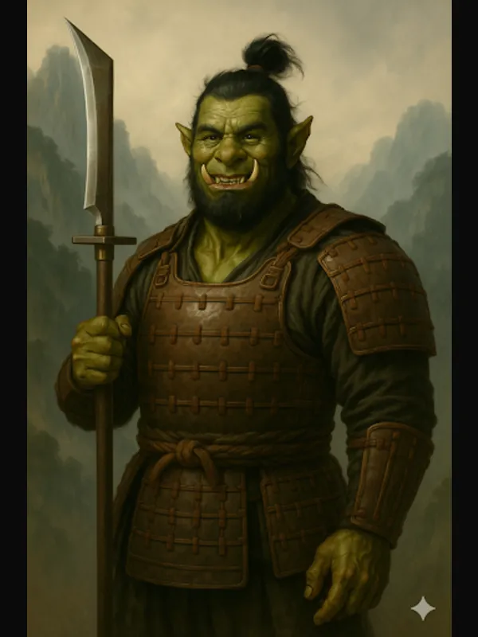

# Steal These Ideas

**Steal These Ideas** is a free library of plug-and-play D&D material: prebuilt quality characters with clear personality, narrative hooks, and handouts that drop straight into your session. Remix what you want, ignore the rest.

  <a href="#explore" class="md-button md-button--primary">Browse Character Concepts</a>
  <a href="assets/sti-starter-bundle.zip" class="md-button">Download full character Bundle (ZIP)</a>

<small>Updated: 2025-09-04 • v0.1 · <a href="changelog/">CHANGELOG</a></small>

### Why this helps you run better games

- **Save prep time:** drop-in NPCs and PCs ready for adventure.
- **Session-ready:** stat blocks, hooks, and handouts where applicable.
- **Remix-friendly:** free to use and share with attribution, non-commercial. 🔖 **License:** CC BY-NC-SA 4.0. See the full terms in the <a href="https://github.com/Oenig138/STI#readme">README</a>.

## How to use

One minute onboarding:
- Click a character → read the concept → open the PDF sheet.
- Download a printable PDF if you want something table-ready.
- Drop into your session as an NPC or as one-shot pregens.

## Explore

<figure class="character-card">
  
Alveta “Velvet”
<figcaption id="cap-alveta">    Air Genasi Paladin of Glory. Childhood stickfights turned scams; now fights for vindication.
  </figcaption>
  
</figure>

<figure class="character-card">
  
  Aramis Rosarian
  <figcaption id="cap-aramis">
    Aberrant Sorcerer on the run. Runs a cleric scam and dreams of a vineyard.
  </figcaption>
  
</figure>

<figure class="character-card">
  
  Beitian “Betty” Winter’s Heart
  <figcaption id="cap-betty">
    Dragonborn Psionic Rogue. Deaf prodigy, gambling addict, Dragonchess fanatic.
  </figcaption>
  
</figure>

<figure class="character-card">
  
  Belvarax “Gobsmack” Allimander
  <figcaption id="cap-belvarax-allimander">
    Dragonborn paladin. Scorned for hesitation; still shields the weak and even monsters, haunted by the love he left behind.
  </figcaption>
  
</figure>

<figure class="character-card">
  
  Calypso “So-So” Sonder
  <figcaption id="cap-calypso-so-so-sonder">
    Human Monk (Open Hand). Aging kabuki luchador, holding onto a dying tradition.
  </figcaption>
  
</figure>

<figure class="character-card">
  
  Cephala Fortina
  <figcaption id="cap-cephala-fortina">
    Aasimar Warlock. Charlatan with chronic wanderlust and main-character energy; weird patron with a demographic mystery.
  </figcaption>
  
</figure>

<figure class="character-card">
  
  Clover Medley
  <figcaption id="cap-clover-medley">
    Tiefling Ranger. Charming farmgirl from a blighted valley chasing a cursed Kirin; wrangles pigs that grunt in Abyssal.
  </figcaption>
  
</figure>

<figure class="character-card">
  
  Donner
  <figcaption id="cap-donner">
    Harengon Battle Master. Cynical and haunted by a sacrifice; keeps others alive with blunt tactics and kale stews.
  </figcaption>
  
</figure>

<figure class="character-card">
  
  Harold Carnap
  <figcaption id="cap-harold-carnap">
    Halfling Warlock grandpa. Devilishly wholesome; possibly an evil genius in a cardigan.
  </figcaption>
  
</figure>

<figure class="character-card">
  
  Geldok Iron Tusk
  <figcaption id="cap-geldok-iron-tusk">
    Orc Cleric. Ex-raider turned unlikely cleric of the Big Boss; patches up peasants for free and breaks abusers’ jaws.
  </figcaption>
  
</figure>

<figure class="character-card">
  
  Korak the Gilded
  <figcaption id="cap-korak-the-gilded">
    Hobgoblin Barbarian. Revolutionary soul with a late-Soviet agrarian bureaucrat mind.
  </figcaption>
  
</figure>

<figure class="character-card">
  
  Lia Amberhorn
  <figcaption id="cap-lia-amberhorn">
    Satyr Sorcerer. Dyslexic and rejected by family. Plays to party stereotypes but is secretly brilliant. 
  </figcaption>
  
</figure>

<figure class="character-card">
  
  Rikiki Twilk
  <figcaption id="cap-rikiki-twilk">
    Aarakocra Barbarian. Atones for a tragic past by dive-bombing wrongdoers and trying too hard.
  </figcaption>
  
</figure>

<figure class="character-card">
  
  Simeon Blackreef
  <figcaption id="cap-simeon-blackreef">
    Sea Elf Druid. Fallen noble scarred by pirates, hags and unloving parents; vanity as armor, still wants a hug.
  </figcaption>
  
</figure>

<figure class="character-card">
  
  Thimble
  <figcaption id="cap-thimble">
    Orc Samurai. Former servant who slew his abuser; roams in his mother’s armor with Kurosawa gravitas and bad jokes.
  </figcaption>
  
</figure>

<figure class="character-card">
  
  Tippy
  <figcaption id="cap-tippy">
    Fairy Arcane Trickster. Self-styled gumshoe narrating a noir casebook, chasing conspiracies and dodging the babysitter.
  </figcaption>
  
</figure>

<figure class="character-card">
  
  Vilgor Blackwell
  <figcaption id="cap-vilgor-blackwell">
    Dwarf Cleric (Trickster). Philosophical ex-farmer serving a disgraced deity; mission: everyone keeps breathing.
  </figcaption>
  
</figure>

<figure class="character-card">
  
  Yawp Cumuluni
  <figcaption id="cap-yawp-cumuluni">
    Goliath Bard raised in silence, now a one-woman moshpit with bagpipes in thunderstorms and a mission to HYPE.
  </figcaption>
  
</figure>

<figure class="character-card">
  
  Yelena Gagarina
  <figcaption id="cap-yelena-gagarina">
    Halfling Monk. Amputated fantasy Squid Game escapee; embodies the gentle badass.
  </figcaption>
  
</figure>

* *(More sections coming soon: one-shots, campaign seeds, bestiaries, etc.)*

## FAQ

**Why are there AI-generated images?**  
Some mood images and visual aids are AI-generated to convey vibes. They’re non-essential and you're free to ignore them. The concepts and writing are original.

**Is this PG-13?**  
Yes. Most content works for younger audiences, but check notes on each page. Any trigger warnings appear on the relevant character pages.

---

Built with ❤️ using [MkDocs](https://www.mkdocs.org) and [GitHub Pages](https://pages.github.com/).  
Repo: <https://github.com/Oenig138/STI> • Contact: <oenig@protonmail.com> • Open to collaborations.
