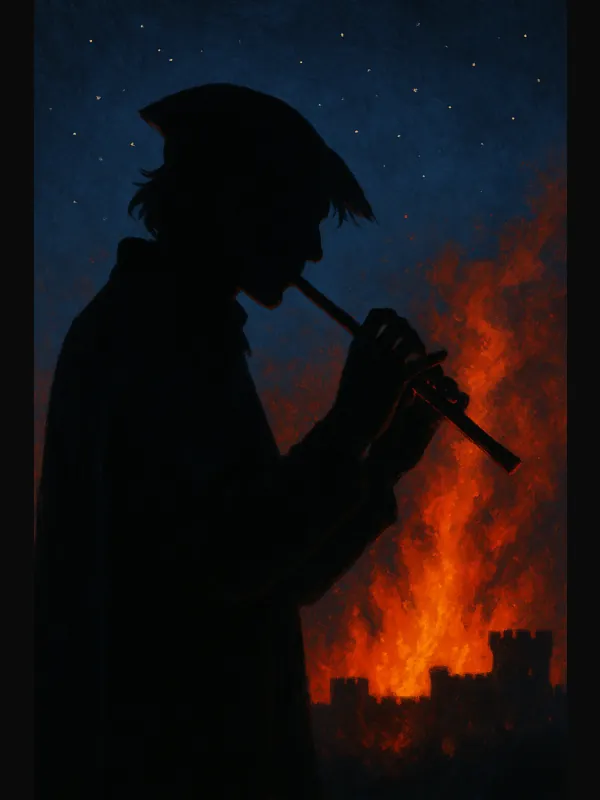

	# Steal These Ideas

**Steal These Ideas** is a free library of plug-and-play D&D material: prebuilt **high-quality characters** with clear **personality, narrative hooks** and **unique voice**. Remix what you want, ignore the rest.

*All characters created in the official character creator tool at DNDBeyond.com, with minimal homebrew clearly marked.*

**About me:** Experienced writer of prose and fiction, gamemaster in various RPG systems for almost 30 years. This project has been a creative outlet through a period of illness, and I'd like to share it freely with the D&D community.

**Note:** Visual aid and graphics are AI generated, *with love and care on a zero-budget*. If this is an issue, feel free to ignore any images and focus on the actual content.

<small>Updated: 2026-01-25 • v0.2 · <a href="changelog/">CHANGELOG</a></small>

### Why this helps you run better games

- **Save prep time:** highly individual drop-in NPCs and PCs ready for adventure.
- **Session-ready:** stat blocks, hooks, and sample dialogue crafted by an experienced writer.
- **Remix-friendly:** free to use and share with attribution, non-commercial. 🔖 **License:** CC BY-NC-SA 4.0. See the full terms in the <a href="https://github.com/Oenig138/STI#readme">README</a>.

## Explore

<figure class="character-card">
  
Alveta “Velvet”
<figcaption id="cap-alveta">
    Air Genasi Glory Paladin. Her childhood stickfights became a scam dojo, now she fights to vindicate her dream.
  </figcaption>
  
</figure>

<figure class="character-card">
  
  Basil Tenebrian
  <figcaption id="cap-basil">
    Noble Bladesinger Shifter, hunted by his brother, but still a Good Boy. Struggles with body dysmorphia and clings to decency like a drowning man.
  </figcaption>
  
</figure>

<figure class="character-card">
  
  Beitian “Betty” Winter’s Heart
  <figcaption id="cap-betty">
    A Soulknife gambler from a rare, all-deaf clan who clings desperately to her self-image as Dragonchess prodigy, and lives for gossip and mustard. 
	</figcaption>
  
</figure>

<figure class="character-card">
  
  Belvarax “Gobsmack” Allimander
  <figcaption id="cap-belvarax-allimander">
    Dragonborn Paladin and party daddy scorned by his order for his awkward reinterpretation of his Vows, to not deal with raiding Goblins.
  </figcaption>
  
</figure>

<figure class="character-card">
  
  Calypso “So-So” Sonder
  <figcaption id="cap-calypso-so-so-sonder">
    Honorable Human Monk "kabuki luchador" chasing one last hurrah without selling out to vulgarity, Hogs party protein, but always apologizes. 
  </figcaption>
  
</figure>

<figure class="character-card">
  
  Cog-Stool
  <figcaption id="cap-Cog-Stool">
    Warforged Spore Druid, a strange two-minded chimera born of centuries of quiet interfacing between a decommissioned battledroid prototype and an awakened mycelial network.
  </figcaption>
  
</figure>

<figure class="character-card">
  
  Clover Medley
  <figcaption id="cap-clover-medley">
    Tiefling Ranger. Charming farmgirl from a loving home in a deeply cursed valley, obsessed with chasing an alleged blighted Kirin. Wrangles Abyssal pigs and creeps out the cityfolk.
  </figcaption>
  
</figure>

<figure class="character-card">
  
  Donner
  <figcaption id="cap-donner">
    Harengon Battle Master haunted by the apprentice he sacrificed to escape a Revenant; keeps others alive with blunt advice and kale stew.
  </figcaption>
  
</figure>

<figure class="character-card">
  
  Geldok Iron Tusk
  <figcaption id="cap-geldok-iron-tusk">
    Soft-gutted Orc ex-raider turned unlikely Cleric of the mysterious "Big Boss"; streetcorner problem solver and healer, who obeys no worldly authority.
  </figcaption>
  
</figure>

<figure class="character-card">
  
  Harold Carnap
  <figcaption id="cap-harold-carnap">
    Halfling Warlock grandpa. Devilishly wholesome, turning blood rituals to potlucks. Possibly an evil genius in a cardigan. The jury is still out.
  </figcaption>
  
</figure>

<figure class="character-card">
  
  Iblit
  <figcaption id="cap-iblit">
    Calvin & Hobbes meets Good Omens: An orphaned teen Kobold Celestial Warlock bound to an archangel who hates this assignment as much as he does.
  </figcaption>
  
</figure>

<figure class="character-card">
  
  Mahorran The undertide
  <figcaption id="cap-mahorran">
    A corporate Marid's one-woman pirate crew grinding it out on the high seas for that sweet promotion to branch manager. Precious about her working conditions and depressingly uneventful downtime.
  </figcaption>
  
</figure>

<figure class="character-card">
  
  Orfan
  <figcaption id="cap-orfan">
    Firbolg Archaeologist whose questionable scientific methods landed him Draconic Sorcery powers. Torn between the call of the wild and the academy that failed him.
  </figcaption>
  
</figure>

<figure class="character-card">
  
  Lia Amberhorn
  <figcaption id="cap-lia-amberhorn">
    Satyr Wild Magic Sorcerer who believes in her own stereotypes. Rejected by her sober, ableist merchant family, but still snipes with pinpoint precision, whether with word or spell.
  </figcaption>
  
</figure>

<figure class="character-card">
  
  Inakha Nulakiano
  <figcaption id="cap-inakha-nulakiano">
    Conservative Goliath working-class Ranger chasing culinary redemption armed with a greataxe, a mysterious cookbook, and the emotional regulation skills of an average toddler.
  </figcaption>
  
</figure>

<figure class="character-card">
  
  Salynna "Sally" Tarrant
  <figcaption id="cap-salynna-sally-tarrant">
    Trickster Paladin who stole cutlery at the boarding school for ten years before she found her purpose in life; now smothers her sworn Ward with an overreach of steel and cunning.
  </figcaption>
  
</figure>

<figure class="character-card">
  
  Scarecrow
  <figcaption id="cap-scarecrow">
    Warforged Bard who stood guard in a village square for centuries, quietly indexing every life and family tree. Gives great hugs. Also spies on you.
  </figcaption>
  
</figure>

<figure class="character-card">
  
  Sister Garra
  <figcaption id="cap-sister-garra">
    Tiny Tabaxi Trickster Cleric of the illegal slum order the Mud Nuns. Smuggles refugees and leaves receipts of spiritual unclogging with those she robs.
  </figcaption>
  
</figure>

<figure class="character-card">
  
  Stennart Goldgift
  <figcaption id="cap-stennart">
    Meidocre Dwarf merchant accidentally turned overnight Hercules. Slowly transforming into a World Tree seedling, but still clings to the strength that finally made him feel significant.
  </figcaption>
  
</figure>

<figure class="character-card">
  
  Tormin Remus
  <figcaption id="cap-tormin-remus">
    "Guy Faust", a revolutionary who sold his soul and face to become the perfect insurrectionist, the pied piper of the smallfolk.
  </figcaption>
  
</figure>

<figure class="character-card">
  
  Yawp Cumuluni
  <figcaption id="cap-yawp-cumuluni">
    Goliath Bard raised in silence, now a one-woman moshpit who plays bagpipes in thunderstorms and lives to be the hype machine that forces an echo from the world.
  </figcaption>
  
</figure>

**Locations:** 
- **[Lith and Flesh](locations/the-lith-and-flesh.md)**, a decadent boutique where petrified objects and creatures are modified and sold at premium rates. Tone: Satire, Body horror, Comedy. Includes Jeremy, the NPC that refuses to die.

**Factions:**
- **[The Mud Nuns](factions/mud-nuns.md)**, a barefoot mendicant order of nuns living for mercy through mischief and larceny in the slums of the City. Tone: Heists, Divine trickstery, Urban Intrigue. Includes Sister Garra, PC/NPC who leaves receipts of "karma rebalanced" with her victims.

* *(More sections coming: one-shots, campaign seeds, bestiaries, etc.)*

## FAQ

**Why are there AI-generated images?**  
Mood images and visual aids are AI-generated to convey vibes. They’re non-essential and you're free to ignore them. The concepts and writing are original.

**Is this PG-13?**  
Yes. Most content works for younger audiences or can easily be tweaked, but check notes on each page. Any trigger warnings appear on the relevant character pages.

**How are the characters designed?**
All characters are designed to slot in seamlessly at many tables:

- Level 5
- Built in the official character creator at dndbeyond.com
- All ability scores are taken with the Points buy method.
- Homebrew is marked as such and explained on the character page.
- Characters are built with respect for both narrative weight and game efficiency; they are not "mechanically optimized".
- PDF's are clean sheets taken directly from dndbeyond.com. They do not include all the info on the character page because: 1) it wouldn't fit, 2) it leaves space for the players to take notes.

Take what you want, discard, rebuild or remix the rest.

---

Built with ❤️ using [MkDocs](https://www.mkdocs.org) and [GitHub Pages](https://pages.github.com/).  
Repo: <https://github.com/Oenig138/STI> • Contact: <oenig@protonmail.com> • Open to collaborations.
