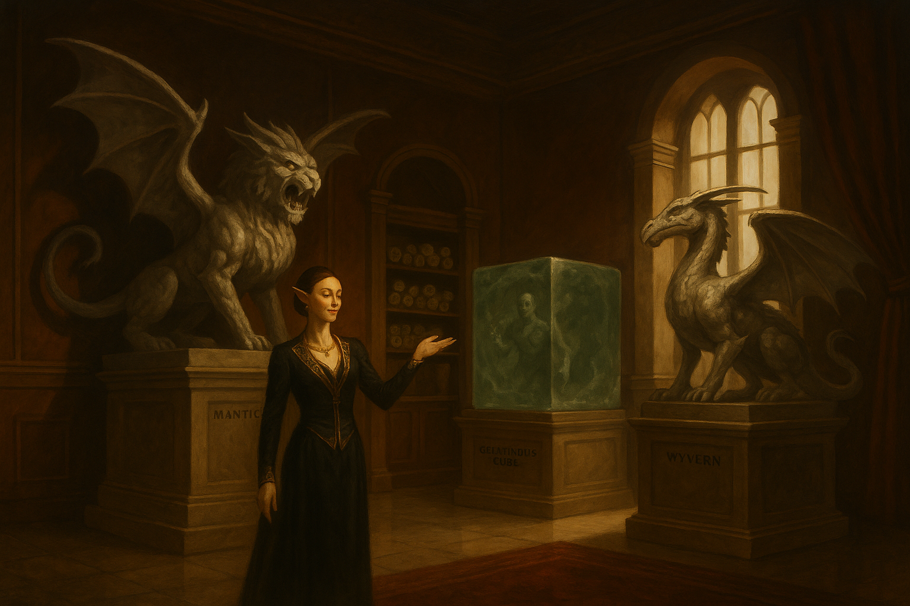

# Lith & Flesh: Exotic Furnishings for the Discerning Noble

{ width="600" }

*“Living stone speaks of the sublime.”*  
— Tagline of Lith & Flesh

---

## Overview
Lith & Flesh is a boutique that specializes in luxury goods carved from **petrified monsters**. Its clientele consists of nobles and wealthy merchants eager to display wealth and morbid taste. With the right magic, masons, and polishers, monsters that once terrorized the wilds become “conversation pieces” at banquets and salons. Place the boutique in any larger decadent city of your choosing!

---

## The Trade in Petrified Creatures

- **Supply Chain:** The store pays handsomely for intact petrified creatures, encouraging adventurers, mercenaries, and shady wizards to “source” material. Interested parties can procure Flesh-to-Stone scrolls at a price from the store, with a contractual obligation to bring back whatever they petrified. Undamaged specimens can be valuable indeed. 
- **Processing:** Stonemasons and artificers hollow out, polish, and reinforce the statues into practical shapes: Ropers become exclusive chandeliers. Wyverns make dramatic double beds. Gelatinous cubes are especially prized for their translucent quality. Whatever they were currently in the process of digesting while being petrified is still visible when illuminated by a sharp light.
- **Showroom:** The boutique’s upper floor serves as a gallery of “signature pieces,” while the lower levels function as guarded workshops.  

---

---

## Proprietor: Veyra of the Gilded Chisel

*“Art redeems all things. Yes, even ruin. Especially ruin. Only art can carry a message from the dead to the living.”*

Veyra (they/them) is the visionary behind Lith & Flesh. Once a guttersnipe sketching on crumbling walls, they briefly tried the adventuring life in search of coin and grandeur. On their very first delve, their best friend Iressa was struck by a basilisk’s gaze. Veyra dragged her petrified form back to the city, polishing the stone each morning, whispering words of regret and shame to the unhearing face each night.

Years passed before revelation struck. The statue itself had beauty, dignity, permanence, even as Veyra themselves grew older. Selling Iressa’s form was Veyra’s first act of “redemption.” They vowed to turn such tragedies into art, so the fallen might never be forgotten. And the nobles and wealthy guilds absolutely ate it up.

### Appearance
- Glittering beard dusted with enchanted mica and fragrances of clover and violet 
- Cat-sharp eyeliner that turns every glance into a performance  
- Layer upon layer of silks with precious stones, hiding their body contour in luxury.
- Rings on every finger, yet a deep sadness in their eyes.

### Personality
- **Brilliant eye:** Spots artistry in the grotesque, reaches out to the PC with the messiest past and finds beauty there.
- **Sincerely deluded:** Refuses to believe petrified statues might still be aware, and they're too far invested to walk back on this.
- **Insecure roots:** Obsession with elegance stems from their squalid past. 

### Roleplaying Veyra
- **Patron:** Might hire adventurers to fetch “raw material” with chilling nonchalance.
- **Confidant:** If befriended, they can provide genuine emotional support, not to mention material wealth.
- **Antagonist:** If pressed on the “still sentient” rumor, Veyra grows defensive, then furious. They’ll fight to preserve both their fortune, their philosophy and ultimately their peace of mind. 
- **Complicated past:** A wise PC (e.g. Insight skill check) may realize that Veyra has skin in the game. They sold their dearest friend as a statue years ago. The realization that they may have saved her instead may be too much for their heart to bear, and make them unwilling to listen.

---

??? info "Veyra, Proprietor of Lith & Flesh (Social Stat Block)"
    *Medium humanoid (any), Lawful Neutral*

    **Armor Class** 12 (fine silks, little combat ability)  
    **Hit Points** 36 (6d8 + 8)  
    **Speed** 30 ft.  

    | STR | DEX | CON | INT | WIS | CHA |
    |:--:|:--:|:--:|:--:|:--:|:--:|
    | 9 (–1) | 12 (+1) | 12 (+1) | 15 (+2) | 13 (+1) | 18 (+4) |

    **Saving Throws** Wis +3, Cha +6  
    **Skills** Insight +3, Persuasion +8, Deception +6, Performance +6  
    **Senses** passive Perception 11  
    **Languages** Common, Elvish, Draconic  
    **Challenge** 2 (450 XP)  

    **Traits**  
    - **Silver Tongue.** Advantage on Persuasion checks with nobility.  
    - **Collector’s Eye.** Advantage on Investigation checks relating to art or stonework.  
    - **Unshakable Belief.** Immune to fear effects that question their philosophy.  

    **Actions**  
    - **Cutting Remark (Recharge 5–6).** As a bonus action, Veyra targets one creature within 30 ft. that can hear them. The target must succeed on a DC 14 Wisdom save or have disadvantage on their next attack roll.  
    - **Dagger (for show).** +3 to hit, 1d4+1 piercing.  

    **Reactions**  
    - **Deflect with Wit.** When targeted by an Intimidation or Persuasion check, Veyra can roll a Charisma (Deception) contest. On a success, the attempt fails.

---

## Plot Hooks

1. **The Macabre Marketplace:** The party needs gold, and the boutique is hiring adventurers to bring in petrified monsters.  
2. **The Screaming Furniture:** Rumors spread that petrified creatures remain conscious. A concerned noble hires the party to investigate after hearing terrible moans throughout a banquet.  
3. **Orbital Cannon Mass Dispel Event:** A rival guild, mad mage, unlikely lunar flare or unholy artifact casts a city-wide *Dispel Magic*. The boutique’s “collection” comes to life all across the city. Many die immediately since they've been hollowed out, but many live and are *pissed*. This can become every bit as epic as you wish as a DM. What if a BBEG chromatic dragon was petrified long ago? Or just make it into a monster neutralization race, throwing in whatever you want in people's homes, public parks, guild halls and what have you.
4. **The Vanished Adventurer:** The party seeks an important artifact last held by a long-lost wanderer. In the cave where he disappeared they find smashed petrified Gelatinous cubes, and dragging scuffs on the floor. Tracing the clues leads them to Lith & Flesh, where the man—or what remains of him—is unfortunately sealed within a display piece of a Gelatinous Cube. So their item is on a person inside a monster claimed by a spell and protected by guards. Of course they *could* just throw a Dispel Magic, but at what cost? Also, this person may have been trapped in the shop for some time (weeks? Months? *years?*), and may have heard all sorts of gossip.
5. **The Noble’s Statue:** A rival family boasts a statue of an enemy they petrified, an actual sapient being this time. The victim’s allies hire the party to restore them.  

---

## Themes

- **Comic Relief:** Nobles dining on monsters frozen mid-roar.  
- **Body Horror:** Living minds trapped in decorative stone.  
- **Social Satire:** Grotesque luxury, where life itself is consumed as a status symbol.  

---

!!! note "Moral Dilemmas"
    Selling petrified monsters can earn the party serious gold, but it also risks their reputation.  
    - Nobles may see them as “respectable suppliers,” while local clerics brand them as desecrators. 
    - If Evil aligned, rival adventurers may attack them as poachers.
	- If Good aligned, they may also be recruited by druids after rival adventurers have been going through the forests petrifying the dryads.
	- Take care to drop the information that the creatures may still be conscious in there at the right time.

---

## Security (DM Guidance)

Lith & Flesh is valuable, decadent, and hated by rivals. If the party decides to attack or infiltrate it, adjust its defenses to match your party’s level:

- **Physical Guards:** At minimum, a handful of hired thugs or mercenaries patrol the boutique. Scale them up from low-level sellswords to elite veterans, knights, or even rival adventurers as appropriate for your party.  
- **Arcane Measures:** The workshop and showroom often feature magical protections. At lower levels this might be a single *Alarm* spell or a glyph near the vault. At higher levels, consider *Glyphs of Warding*, *Arcane Lock*, or why not a bound Gorgon stalking the halls at night like a Minotaur in his maze, just waiting to make new showpieces of the party.
- **Social & Political Armor:** The shop enjoys noble patronage. Even if the party overcomes the on-site defenses, they may face lawsuits, assassins, or the wrath of a city councilor whose prized roper-chandelier sent in for repairs was damaged in the commotion.  

> **Scaling Dial:**  
> - **Level 3–5:** 1–2 guards per room, simple magical locks.  
> - **Level 6–9:** Veteran guards, layered glyphs, a pet construct or monster.  
> - **Level 10+:** Rival adventuring company on retainer, extradimensional vaults, nobles ready to weaponize the city guard.  

The boutique should feel more like a fortress of vanity than a shop. It's protected by steel and spell, but also by wealth and status.

---

## Plot Hook NPC: The Vanished Adventurer

**Jeremy, the cockroach**

The PC's need a magic item stuck with an adventurer stuck inside a Gelatinous Cube stuck inside a Petrification spell, put on display at the Lith and Flesh. Upon lighting the cube up, they can indeed discern the contour of the adventurer they seek, frozen inside the beast. A successful Investigation check reveals that the adventurer in question is somehow still alive.

Jeremy is an Air Genasi Draconic Sorcerer/Thief Rogue and potential recurring PC, if the party decides to rescue him from his current predicament. Being an Air Genasi, he's been able to hold his breath indefinitely within his stone prison, and sustain himself on Goodberries conjured directly into his mouth. 

Like a cockroach, Jeremy simply doesn't die. Throughout the campaign, he can be thrown in at the end of various dungeons where he's managed to survive through entirely improbably means. He can be played for both comedy and to give the players valuable tips.

**Personality:** Jeremy is extremely friendly once the PC's have saved him from one predicament. He's also incredibly unbothered by whatever new life-threatening situation he finds himself in on later encounters, whether he's being boiled alive by goblins with bayleafs and onions, or if he's been enslaved by a Beholder as personal jester. 

He can function as your campaign's *M'aiq the Liar*, an unlikely easter egg who provides levity, brief character interaction and perhaps a vital clue to the dungeon they're in. Remember to always have a good, entertaining story prepared for *why he's survived this time.*

**Example:** Caught by ilithids and infected with a tadpole? Once alone, Jeremy used Metamagic *Careful spell* and cast Gaseous form on himself but not the Tadpole, resulting in it falling harmlessly to the floor. He ended up having to eat it to get rid of the evidence ("tasted like calamari"), and when the PC's arrive at the Ilithids' lair, they find him dining with the rest of the Mindflayers, pretending to be in a mid-transition and buying time, looking for the right time to escape.

## Jeremy, stat blocks

Jeremy is not really an offensive NPC and likely won't ever try to attack the players unless severely provoked. But he has an uncanny knack for survival, no matter the situation. Use the stat block that best fits your party’s tier.

---

??? info "Jeremy (CR 1)"
    *Medium humanoid (air genasi), chaotic good*  

    **Armor Class** 14 (Unarmored + uncanny luck)  
    **Hit Points** 33 HP (6d6 + 12)
    **Speed** 30 ft.  

    | STR | DEX | CON | INT | WIS | CHA |
    |:--:|:--:|:--:|:--:|:--:|:--:|
    | 10 (+0) | 14 (+2) | 12 (+1) | 11 (+0) | 12 (+1) | 14 (+2) |

    **Saving Throws** Dex +4, Cha +4  
    **Skills** Acrobatics +4, Deception +4, Stealth +4, Persuasion +4  
    **Resistances** Lightning  
    **Senses** Darkvision 60 ft., passive Perception 11  
    **Languages** Common, Auran, Thieves’ Cant  
    **Challenge** 1 (200 XP)  

    **Traits**  
    - **Draconic Resilience.** Jeremy’s hit points are slightly tougher than expected.  
    - **Sneak Attack (1d6).** Once per turn with advantage or ally nearby.  
    - **Unkillable Idiot.** When reduced to 0 hp, roll a d6. On a 5–6, he instead survives at 1 hp.  

    **Actions**  
    - **Dagger.** +4 to hit, 5 ft., 1 target, 5 (1d4 + 2) piercing damage.  
    - **Minor Illusion / Mage Hand.** At will.  

---

??? info "Jeremy (CR 3)"
    *Air Genasi Sorcerer 3 / Rogue 2*  

    **Armor Class** 15 (Leather + Dexterity + uncanny luck)  
    **Hit Points** 66 HP (12d6 + 24)
    **Speed** 30 ft.  

    | STR | DEX | CON | INT | WIS | CHA |
    |:--:|:--:|:--:|:--:|:--:|:--:|
    | 10 | 16 (+3) | 14 (+2) | 11 | 12 (+1) | 16 (+3) |

    **Saving Throws** Dex +5, Cha +5  
    **Skills** Acrobatics +5, Stealth +5, Deception +5, Persuasion +5, Sleight of Hand +5  
    **Resistances** Lightning  
    **Senses** Darkvision 60 ft.  
    **Challenge** 3 (700 XP)  

    **Traits**  
    - **Sneak Attack (2d6).**  
    - **Draconic Ancestry (Lightning).** Adds bonus hp per level.  
    - **Sorcery.** *Mage Hand, Minor Illusion, Message, Fire Bolt, Shield, Disguise Self, Mirror Image, Invisibility.*  
    - **Metamagic.** Can apply Careful, Twinned or Subtle Spell twice per short rest.  
    - **Cunning Action.** Bonus action Dash, Disengage, or Hide.  
    - **Unkillable Idiot.** When reduced to 0 hp, roll a d6. On 4–6, he survives at 1 hp.  

    **Actions**  
    - **Shortsword.** +5 to hit, 5 ft., 1d6+3 piercing (+2d6 Sneak).  
    - **Fire Bolt.** +5 to hit, 120 ft., 2d10 fire damage.  

---

??? info "Jeremy (CR 5)"
    *Air Genasi Sorcerer 5 / Rogue 4*  

    **Armor Class** 18 (Studded Leather + Dex + uncanny luck)  
    **Hit Points** 83 HP (15d6 + 30)
    **Speed** 30 ft.  

    | STR | DEX | CON | INT | WIS | CHA |
    |:--:|:--:|:--:|:--:|:--:|:--:|
    | 10 | 18 (+4) | 14 (+2) | 11 | 12 (+1) | 18 (+4) |

    **Saving Throws** Dex +7, Cha +7  
    **Skills** Acrobatics +7, Stealth +7, Deception +7, Persuasion +7, Sleight of Hand +7  
    **Resistances** Lightning  
    **Senses** Darkvision 60 ft.  
    **Challenge** 5 (1,800 XP)  

    **Traits**  
    - **Sneak Attack (2d6).**  
    - **Sorcery.** *Fire Bolt, Mage Hand, Message, Minor Illusion, Disguise Self, Mirror Image, Shield, Invisibility, Hypnotic Pattern, Counterspell, Fly, Gaseous Form.*  
    - **Metamagic.** Can apply Careful, Twinned, Heightened or Subtle Spell three times per short rest.  
    - **Uncanny Dodge.** Reaction halves damage.  
    - **Unkillable Idiot.** When reduced to 0 hp, roll a d6. On 3–6, he survives at 1 hp.  

    **Actions**  
    - **Shortsword.** +7 to hit, 1d6+4 piercing (+2d6 Sneak).  
    - **Fire Bolt.** +7 to hit, 3d10 fire damage.  
    - **Comedic Escape.** Once per day, Jeremy vanishes by implausible circumstance.  
