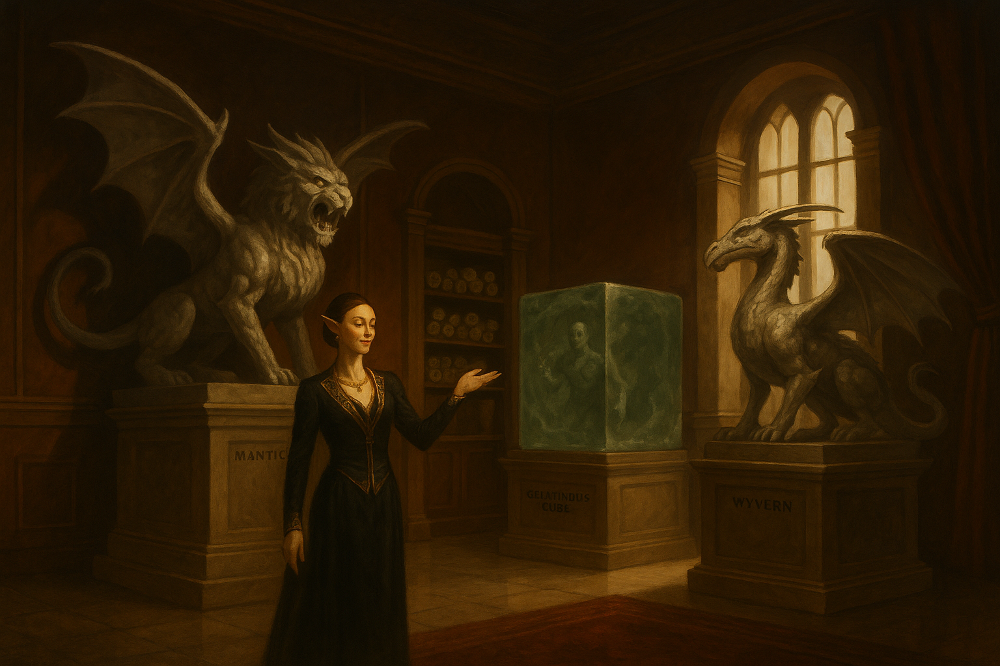

# Lith & Flesh: Exotic Furnishings for the Discerning Noble

{ width="600" }

*“Living stone speaks of the sublime.”*  
— Tagline of Lith & Flesh

---

## Overview
Lith & Flesh is a boutique that specializes in luxury goods carved from **petrified monsters**. Its clientele consists of nobles and wealthy merchants eager to display wealth and morbid taste. With the right magic, masons, and polishers, monsters that once terrorized the wilds become “conversation pieces” at banquets and salons. Place the boutique in any larger decadent city of your choosing!

---

## The Trade in Petrified Creatures

- **Supply Chain:** The store pays handsomely for intact petrified creatures, encouraging adventurers, mercenaries, and shady wizards to “source” material. Interested parties can procure Flesh-to-Stone scrolls at a price from the store, with a contractual obligation to bring back whatever they petrified. Undamaged specimens can be valuable indeed. 
- **Processing:** Stonemasons and artificers hollow out, polish, and reinforce the statues into practical shapes: Ropers become exclusive chandeliers. Wyverns make dramatic double beds. Gelatinous cubes are especially prized for their translucent quality. Whatever they were currently in the process of digesting while being petrified is still visible when illuminated by a sharp light.
- **Showroom:** The boutique’s upper floor serves as a gallery of “signature pieces,” while the lower levels function as guarded workshops.  

---

## Plot Hooks

1. **The Macabre Marketplace:** The party needs gold, and the boutique is hiring adventurers to bring in petrified monsters.  
2. **The Screaming Furniture:** Rumors spread that petrified creatures remain conscious. A concerned noble hires the party to investigate after hearing terrible moans throughout a banquet.  
3. **Orbital Cannon Mass Dispel Event:** A rival guild, mad mage, unlikely lunar flare or unholy artifact casts a city-wide *Dispel Magic*. The boutique’s “collection” comes to life all across the city. Many die immediately since they've been hollowed out, but many live and are *pissed*. 
4. **The Vanished Adventurer:** The party seeks an important artifact last held by a long-lost wanderer. Tracing clues leads to Lith & Flesh, where the man—or what remains of him—is sealed within a display piece of a Gelatinous Cube. 
5. **The Noble’s Statue:** A rival family boasts a statue of an enemy they petrified. The victim’s allies hire the party to restore them.  

---

## Themes

- **Comic Relief:** Nobles dining on monsters frozen mid-roar.  
- **Body Horror:** Living minds trapped in decorative stone.  
- **Social Satire:** Grotesque luxury, where life itself is consumed as a status symbol.  

---

## Security (DM Guidance)

Lith & Flesh is valuable, decadent, and hated by rivals. If the party decides to attack or infiltrate it, adjust its defenses to match your party’s level:

- **Physical Guards:** At minimum, a handful of hired thugs or mercenaries patrol the boutique. Scale them up from low-level sellswords to elite veterans, knights, or even rival adventurers as appropriate for your party.  
- **Arcane Measures:** The workshop and showroom often feature magical protections. At lower levels this might be a single *Alarm* spell or a glyph near the vault. At higher levels, consider *Glyphs of Warding*, *Arcane Lock*, or why not a bound Gorgon stalking the halls at night like a Minotaur in his maze, just waiting to make new showpieces of the party.
- **Social & Political Armor:** The shop enjoys noble patronage. Even if the party overcomes the on-site defenses, they may face lawsuits, assassins, or the wrath of a city councilor whose prized roper-chandelier sent in for repairs was damaged in the commotion.  

> **Scaling Dial:**  
> - **Level 3–5:** 1–2 guards per room, simple magical locks.  
> - **Level 6–9:** Veteran guards, layered glyphs, a pet construct or monster.  
> - **Level 10+:** Rival adventuring company on retainer, extradimensional vaults, nobles ready to weaponize the city guard.  

The boutique should feel more like a fortress of vanity than a shop. It's protected by steel and spell, but also by wealth and status.

---

## Plot Hook NPC: The Vanished Adventurer

**Jeremy, the cockroach**

The PC's need a magic item stuck with an adventurer stuck inside a Gelatinous Cube stuck inside a Petrification spell, put on display at the Lith and Flesh. Upon lighting the cube up, they can indeed discern the contour of the adventurer they seek, frozen inside the beast. A successful Investigation check reveals that the adventurer in question is somehow still alive.

Jeremy is an Air Genasi Draconic Sorcerer/Thief Rogue and potential recurring PC, if the party decides to rescue him from his current predicament. Being an Air Genasi, he's been able to hold his breath indefinitely within his stone prison, and sustain himself on Goodberries conjured directly into his mouth. 

Like a cockroach, Jeremy simply doesn't die. Throughout the campaign, he can be thrown in at the end of various dungeons where he's managed to survive through entirely improbably means. He can be played for both comedy and to give the players valuable tips.

**Personality:** Jeremy is extremely friendly once the PC's have saved him from one predicament. He's also incredibly unbothered by whatever new life-threatening situation he finds himself in on later encounters, whether he's being boiled alive by goblins with bayleafs and onions, or if he's been enslaved by a Beholder as personal jester. 

He can function as your campaign's *M'aiq the Liar*, an unlikely easter egg who provides levity, brief character interaction and perhaps a vital clue to the dungeon they're in. Remember to always have a good, entertaining story prepared for *why he's survived this time.*

**Example:** Caught by ilithids and infected with a tadpole? Once alone, Jeremy used Metamagic *Careful spell* and cast Gaseous form on himself but not the Tadpole, resulting in it falling harmlessly to the floor. He ended up having to eat it to get rid of the evidence, and when the PC's arrive at the Ilithids' lair, they find him dining with the rest of the Mindflayers, pretending to be in a mid-transition and buying time, looking for the right time to escape.

## Jeremy, the Cockroach

Jeremy has an uncanny knack for survival, no matter the situation.  
Use the stat block that best fits your party’s tier.

---

??? info "Jeremy (CR 1)"
    *Medium humanoid (air genasi), chaotic good*  

    **Armor Class** 14 (Unarmored + uncanny luck)  
    **Hit Points** 33 HP (6d6 + 12)
    **Speed** 30 ft.  

    | STR | DEX | CON | INT | WIS | CHA |
    |:--:|:--:|:--:|:--:|:--:|:--:|
    | 10 (+0) | 14 (+2) | 12 (+1) | 11 (+0) | 12 (+1) | 14 (+2) |

    **Saving Throws** Dex +4, Cha +4  
    **Skills** Acrobatics +4, Deception +4, Stealth +4, Persuasion +4  
    **Resistances** Lightning  
    **Senses** Darkvision 60 ft., passive Perception 11  
    **Languages** Common, Auran, Thieves’ Cant  
    **Challenge** 1 (200 XP)  

    **Traits**  
    - **Draconic Resilience.** Jeremy’s hit points are slightly tougher than expected.  
    - **Sneak Attack (1d6).** Once per turn with advantage or ally nearby.  
    - **Unkillable Idiot.** When reduced to 0 hp, roll a d6. On a 5–6, he instead survives at 1 hp.  

    **Actions**  
    - **Dagger.** +4 to hit, 5 ft., 1 target, 5 (1d4 + 2) piercing damage.  
    - **Minor Illusion / Mage Hand.** At will.  

---

??? info "Jeremy (CR 3)"
    *Air Genasi Sorcerer 3 / Rogue 2*  

    **Armor Class** 15 (Leather + Dexterity + uncanny luck)  
    **Hit Points** 66 HP (12d6 + 24)
    **Speed** 30 ft.  

    | STR | DEX | CON | INT | WIS | CHA |
    |:--:|:--:|:--:|:--:|:--:|:--:|
    | 10 | 16 (+3) | 14 (+2) | 11 | 12 (+1) | 16 (+3) |

    **Saving Throws** Dex +5, Cha +5  
    **Skills** Acrobatics +5, Stealth +5, Deception +5, Persuasion +5, Sleight of Hand +5  
    **Resistances** Lightning  
    **Senses** Darkvision 60 ft.  
    **Challenge** 3 (700 XP)  

    **Traits**  
    - **Sneak Attack (2d6).**  
    - **Draconic Ancestry (Lightning).** Adds bonus hp per level.  
    - **Sorcery.** *Mage Hand, Minor Illusion, Fire Bolt, Shield, Disguise Self, Mirror Image, Invisibility.*  
    - **Cunning Action.** Bonus action Dash, Disengage, or Hide.  
    - **Unkillable Idiot.** When reduced to 0 hp, roll a d6. On 4–6, he survives at 1 hp.  

    **Actions**  
    - **Shortsword.** +5 to hit, 5 ft., 1d6+3 piercing (+2d6 Sneak).  
    - **Fire Bolt.** +5 to hit, 120 ft., 2d10 fire damage.  

---

??? info "Jeremy (CR 5)"
    *Air Genasi Sorcerer 5 / Rogue 4*  

    **Armor Class** 18 (Studded Leather + Dex + uncanny luck)  
    **Hit Points** 83 HP (15d6 + 30)
    **Speed** 30 ft.  

    | STR | DEX | CON | INT | WIS | CHA |
    |:--:|:--:|:--:|:--:|:--:|:--:|
    | 10 | 18 (+4) | 14 (+2) | 11 | 12 (+1) | 18 (+4) |

    **Saving Throws** Dex +7, Cha +7  
    **Skills** Acrobatics +7, Stealth +7, Deception +7, Persuasion +7, Sleight of Hand +7  
    **Resistances** Lightning  
    **Senses** Darkvision 60 ft.  
    **Challenge** 5 (1,800 XP)  

    **Traits**  
    - **Sneak Attack (2d6).**  
    - **Sorcery.** *Fire Bolt, Mage Hand, Minor Illusion, Mirror Image, Counterspell, Hypnotic Pattern, Fly, Fireball.*  
    - **Metamagic.** Can apply Careful or Subtle Spell once per short rest.  
    - **Uncanny Dodge.** Reaction halves damage.  
    - **Unkillable Idiot.** When reduced to 0 hp, roll a d6. On 3–6, he survives at 1 hp.  

    **Actions**  
    - **Shortsword.** +7 to hit, 1d6+4 piercing (+2d6 Sneak).  
    - **Fire Bolt.** +7 to hit, 3d10 fire damage.  
    - **Comedic Escape.** Once per day, Jeremy vanishes by implausible circumstance.  
